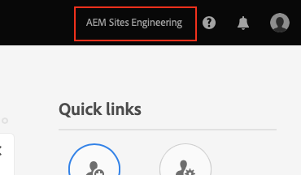

# 授予前端開發人員存取權 {#grant-fed-access}

讓前端開發人員加入 Cloud Manager，以便能存取您的 AEM 網站 Git 存放庫和管道。

## 到目前為止 {#story-so-far}

在AEM快速網站建立歷程的上一個檔案中， [設定您的管道，](pipeline-setup.md) 您已瞭解如何建立前端管道來管理網站主題的自訂，現在應：

* 瞭解什麼是前端管道。
* 瞭解如何在Cloud Manager中設定前端管道。

您現在需要透過上線流程授予前端開發人員對Cloud Manager的存取權，以便前端開發人員可以存取AEM Git存放庫和您建立的管道。

## 目標 {#objective}

授予Cloud Manager存取權並將使用者角色指派給使用者的程式稱為上線。 本檔案將概述入門前端開發人員的最重要步驟，閱讀後您將瞭解：

* 如何將前端開發人員新增為使用者。
* 如何將所需的角色授與前端開發人員。

>[!TIP]
>
>提供了將團隊加入AEM as a Cloud Service的專屬完整檔案歷程，連結至 [其他資源區段](#additional-resources) 如果您需要此流程的更多詳細資訊，請參閱本檔案說明。

## 負責角色 {#responsible-role}

此歷程的這一部分適用於Cloud Manager管理員。

## 要求 {#requirements}

* 您必須成為以下群組成員： **企業所有者** Cloud Manager中的角色。
* 您需要成為 **系統管理員** 在Cloud Manager中。
* 您需要此Admin Console的存取權。

## 將前端開發人員新增為使用者 {#add-fed-user}

首先，您需要使用Admin Console將前端開發人員新增為使用者。

1. 於登入Admin Console [https://adminconsole.adobe.com/](https://adminconsole.adobe.com/).

1. 登入後，畫面會顯示類似下列影像的概觀頁面。

   

1. 透過檢視畫面右上角的組織名稱，確保您在適當的組織中。

   

1. 選取 **Adobe Experience Manager as a Cloud Service** 從 **產品和服務** 卡片。

   

1. 您會看到預先設定的Cloud Manager產品設定檔清單。 如果您沒有看到這些設定檔，請聯絡您的Cloud Manager管理員，因為您的組織中可能沒有正確的許可權。

   

1. 若要將前端開發人員指派給正確的設定檔，請點選或按一下 **使用者** 標籤然後按一下 **新增使用者** 按鈕。

   

1. 在 **將使用者新增至團隊** 對話方塊中，輸入您要新增之使用者的電子郵件識別碼。 在ID型別中，如果尚未設定團隊成員的Federated ID，請選取Adobe ID 。

   

1. 在 **產品** 選取、點選或按一下加號，然後選取 **Adobe Experience Manager as a Cloud Service** 並指派 **部署管理員** 和 **開發人員** 給使用者的產品設定檔。

   

1. 點選或按一下 **儲存** 並且會傳送一封歡迎電子郵件給您新增為使用者的前端開發人員。

受邀的前端開發人員可以按一下歡迎電子郵件中的連結，並使用其Adobe ID登入來存取Cloud Manager。

## 移交給前端開發人員 {#handover}

在前往前端開發人員的途中，透過向Cloud Manager發出的電子郵件邀請，您和AEM管理員現在可以向前端開發人員提供開始自訂所需的剩餘資訊。

* A [典型內容的路徑](#example-page)
* 主題來源， [您已下載](#download-theme)
* 此 [proxy使用者認證](#proxy-user)
* 方案的名稱或URL [從Cloud Manager複製](pipeline-setup.md#login)
* 前端設計需求

## 下一步 {#what-is-next}

現在您已完成AEM快速網站建立歷程的這一部分，您應瞭解：

* 如何將前端開發人員新增為使用者。
* 如何將所需的角色授與前端開發人員。

在此基礎上繼續您的AEM快速網站建立歷程，接下來檢閱檔案 [擷取Git存放庫存取資訊，](retrieve-access.md) 這會將視角專門切換到前端開發人員，並說明前端開發人員如何使用Cloud Manager存取Git存放庫資訊。

## 其他資源 {#additional-resources}

我們建議您檢閱檔案，繼續快速網站建立歷程的下一部分 [擷取前端開發人員憑證，](retrieve-access.md) 以下是一些其他可選資源，這些資源對本文中提到的一些概念進行了更深入的探究，但並非繼續此歷程所必需的。

* [入門歷程](/help/journey-onboarding/overview.md)  — 本指南可作為您的起點，確保您的團隊已設定並可as a Cloud Service存取AEM。
