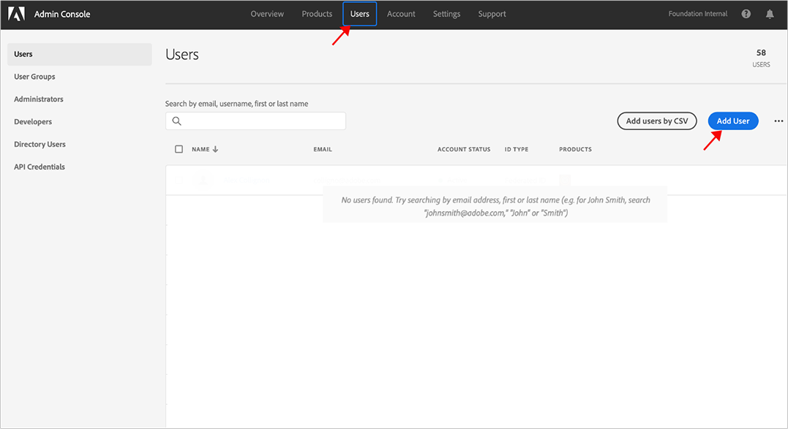
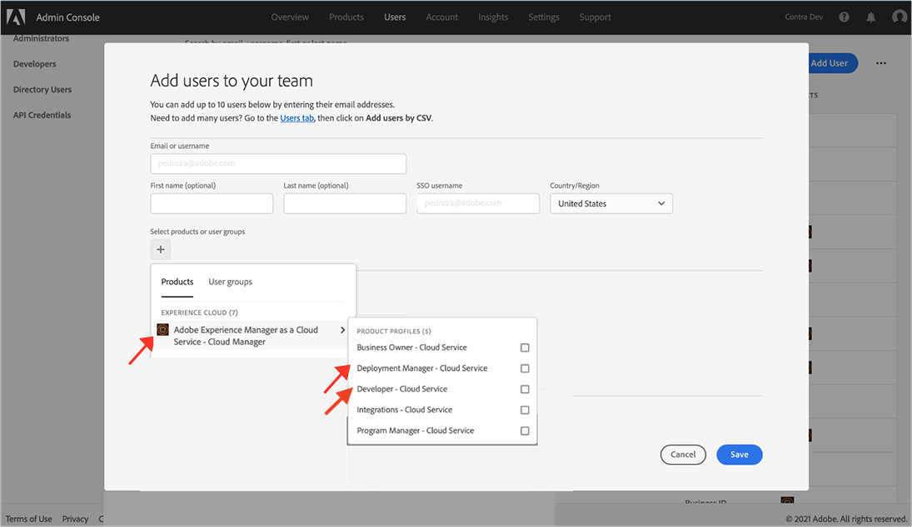

# 授予前端開發人員存取權 {#grant-fed-access}

{{traditional-aem}}

讓前端開發人員加入 Cloud Manager，以便能存取您的 AEM 網站 Git 存放庫和管道。

## 目前進度 {#story-so-far}

在 AEM 快速建立網站歷程的上一份文件「[設定您的管道](pipeline-setup.md)」中，您已了解如何建立前端管道來管理網站主題的自訂內容，現在您應該：

* 了解什麼是前端管道。
* 了解如何在 Cloud Manager 中設定前端管道。

現在，您需要透過上線流程將 Cloud Manager 的存取權限授予前端開發人員，以便前端開發人員可以存取 AEM Git 存放庫和您建立的管道。

## 目標 {#objective}

授予 Cloud Manager 存取權限並向使用者指派使用者角色的過程稱為上線。本文件將概觀前端開發人員上線的最重要步驟，閱讀後您將了解：

* 如何將前端開發人員新增為使用者。
* 如何向前端開發人員授予所需的角色。

>[!TIP]
>
>如果您需要上線流程的其他詳細資訊，我們有讓您的團隊成員上線使用 AEM as a Cloud Service 的完整文件歷程，與本文件的「[其他資源](#additional-resources)」區段連結。

## 負責角色 {#responsible-role}

歷程的這個部分適用於 Cloud Manager 管理員。

## 要求 {#requirements}

* 您必須是 Cloud Manager 中具有&#x200B;**業務負責人**&#x200B;角色的一員。
* 您在 Cloud Manager 中必須是&#x200B;**系統管理員**。
* 您必須擁有 Admin Console 的存取權。

## 新增前端開發人員作為使用者 {#add-fed-user}

首先，您必須使用 Admin Console 將前端開發人員新增為使用者。

1. 在 [https://adminconsole.adobe.com/](https://adminconsole.adobe.com/) 登入 Admin Console。

1. 登入後，您將看到類似下圖的概觀頁面。

   

1. 檢查畫面右上角的組織名稱，確認您位於適當的組織中。

   

1. 從「**產品和服務**」卡片選取「**Adobe Experience Manager as a Cloud Service**」。

   

1. 您會看到預先設定的 Cloud Manager 產品設定檔清單。如果您沒有看到這些設定檔，請聯絡您的 Cloud Manager 管理員，因為您在組織中可能沒有正確的權限。

   

1. 若要將前端開發人員指派到正確的設定檔，請選取「**使用者**」標籤，然後按一下「**新增使用者**」按鈕。

   

1. 在「**新增使用者至團隊**」對話框中，輸入要新增的使用者之電子郵件 ID。如果您的團隊成員尚未設定 Federated ID，其「ID 類型」請選取「Adobe ID」。

   

1. 在「**產品**」選取項目中，選取加號然後選取「**Adobe Experience Manager as a Cloud Service**」，並指派「**部署管理員**」和「**開發人員**」產品設定檔給使用者。

   

1. 選取「**儲存**」，並傳送一封電子郵件給您新增為使用者的前端開發人員。

受邀前端開發人員可以按一下歡迎電子郵件中的連結，並使用其 Adobe ID 登入來存取 Cloud Manager。

## 移交給前端開發人員 {#handover}

移交給前端開發人員的過程中發送使用 Cloud Manager 的邀請電子郵件，您和 AEM 管理員現在可以把開始自訂所需要的其餘資訊提供給前端開發人員。

* [典型內容的路徑](#example-page)
* [您已下載的](#download-theme)主題來源
* [Proxy 使用者認證](#proxy-user)
* [從 Cloud Manager 複製的](pipeline-setup.md#login)方案名稱或其 URL
* 前端設計要求

## 下一步 {#what-is-next}

現在您已完成 AEM 快速建立網站歷程的這個部分，您應該了解：

* 如何將前端開發人員新增為使用者。
* 如何向前端開發人員授予所需的角色。

以此知識為基礎並接著檢閱文件「[擷取 Git 存放庫存取資訊](retrieve-access.md)」，以繼續您的 AEM 快速建立網站歷程，切換至前端開發人員的獨特角度，並說明前端開發人員如何使用 Cloud Manager 來存取 Git 存放庫資訊。

## 其他資源 {#additional-resources}

雖然建議您檢閱文件「[擷取前端開發人員認證](retrieve-access.md)」以繼續快速建立網站歷程的下一部分，但下列是一些其他選用資源，深入探究了本文件提到的一些概念，不過這些資源並非繼續該歷程的必要條件。

* [上線歷程](/help/journey-onboarding/overview.md) - 本指南可作為您的起點，確保您的團隊已設定完成並可存取 AEM as a Cloud Service。
