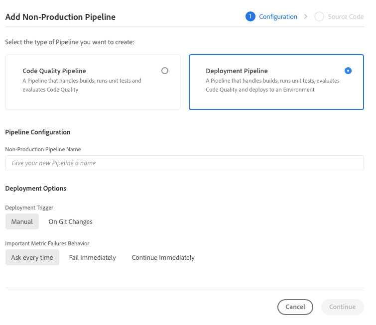

# 設定管道 {#set-up-your-pipeline}

建立前端管道以管理網站主題的自訂。

>[!CAUTION]
>
>快速網站建立工具目前是技術預覽。 除非經Adobe支援同意，否則可供測試及評估之用，且非供生產使用。

## 迄今為止的故事 {#story-so-far}

在AEM快速網站建立歷程的上一份檔案中， [從模板建立站點，](create-site.md) 您已了解如何使用網站範本來快速建立AEM網站，並可使用前端工具進一步自訂網站，現在您應該：

* 了解如何取得AEM網站範本。
* 了解如何使用範本建立新網站。
* 了解如何從您的新網站下載範本，以提供給前端開發人員。

本文以這些基本知識為基礎，因此您可以設定前端管道，前端開發人員稍後將在歷程中使用該管道來部署前端自訂。

## 目標 {#objective}

本檔案可協助您了解前端管道，以及如何建立管道以管理網站自訂主題的部署。 閱讀後，您應：

* 了解前端管道是什麼。
* 了解如何在Cloud Manager中設定前端管道。

## 負責角色 {#responsible-role}

此部分的歷程會套用至Cloud Manager管理員。

## 需求 {#requirements}

* 您必須擁有Cloud Manager的存取權。
* 您需要成為 **部署管理員** 角色。
* AEM環境的Git存放庫必須在Cloud Manager中設定。
   * 任何作用中專案通常已是如此。 但若非如此，請參閱 [其他資源](#additional-resources) 區段。

## 什麼是前端管道 {#front-end-pipeline}

前端開發涉及自訂JavaScript、CSS和靜態資源，以定義AEM網站的樣式。 前端開發人員將在自己的本機環境中工作，以進行這些自訂。 準備就緒後，變更即會提交至AEM Git存放庫。 但他們只遵守原始碼。 他們還沒有生存。

前端管道會擷取這些已提交的自訂項目，並部署至AEM環境，通常是生產或非生產環境。

這樣，前端開發可與AEM上任何具有自己部署管道的完整堆疊後端開發分開運作，並與之平行。

>[!NOTE]
>
>前端管道只能部署JavaScript、CSS和靜態資源，以設定AEM網站的樣式。 管道中無法部署頁面或資產等網站內容。

## 存取Cloud Manager {#login}

1. 登入AdobeCloud Manager，網址為 [my.cloudmanager.adobe.com](https://my.cloudmanager.adobe.com/).

1. Cloud Manager會列出各種可用的方案。 點選或按一下您要管理的項目。 如果您剛開始使用AEM as a Cloud Service，可能只有一個程式可供使用。

   

您現在會看到方案的概觀。 您的頁面看起來會有所不同，但類似於此範例。

記下您存取或複製URL的程式名稱。 您稍後需要將此資訊提供給前端開發人員。

## 建立前端管線 {#create-front-end-pipeline}

現在您已存取Cloud Manager，可以建立前端部署的管道。

1. 在 **管道** 區段，點選或按一下 **新增** 按鈕。

   

1. 在顯示於 **新增** 按鈕選擇 **新增非生產管道** 用於此歷程的目的。

1. 在 **設定** 的 **新增非生產管道** 對話框開啟：
   * 選擇 **部署管道**.
   * 在 **非生產管道名稱** 欄位。

   

1. 點選或按一下 **繼續**.

1. 在 **原始碼** 標籤：
   * 選擇 **前端代碼** 作為要部署的程式碼類型。
   * 請確定在下方選取正確的環境 **合格的部署環境**.
   * 選擇正確的 **存放庫**.
   * 定義 **Git分支** 管道應與相關聯。
   * 定義 **代碼位置** 如果前端開發位於選定儲存庫中的特定路徑下。 預設值是存放庫的根，但通常前端開發和後端會位於不同的路徑下。

   

1. 點選或按一下 **儲存**.

新管道將建立並顯示在 **管道** 區段。 點選管道名稱后面的省略號會顯示可視需要進一步編輯或檢視詳細資料的選項。

>[!TIP]
>
>如果您已熟悉AEMaaCS中的管道，且想進一步了解不同類型管道之間的差異，包括前端管道的詳細資訊，請參閱設定CI/CD管道 — 連結於 [其他資源](#additional-resources) 一節。

## 下一步 {#what-is-next}

現在您已完成AEM快速網站建立歷程的這一部分，您應：

* 了解前端管道是什麼。
* 了解如何在Cloud Manager中設定前端管道。

基於此知識，並透過接下來檢閱檔案，繼續建立AEM快速網站的歷程 [授予前端開發人員的訪問權限，](grant-access.md) 您可在此將前端開發人員上線至Cloud Manager，讓他們存取您的AEM網站git存放庫和管道。

## 其他資源 {#additional-resources}

建議您透過檢閱檔案，繼續進行快速網站建立歷程的下一個階段 [自訂網站主題、](customize-theme.md) 以下是一些額外的選用資源，可更深入探討本檔案中提及的一些概念，但您不需要這些資源即可繼續進行歷程。

* [Cloud Manager檔案](https://experienceleague.adobe.com/docs/experience-manager-cloud-service/onboarding/onboarding-concepts/cloud-manager-introduction.html)  — 如果您想要取得Cloud Manager功能的詳細資訊，可直接參閱深入的技術檔案。
* [Cloud Manager儲存庫](/help/implementing/cloud-manager/managing-code/cloud-manager-repositories.md)  — 若您需要有關如何設定及管理AEMaaCS專案的Git存放庫的詳細資訊，請參閱本檔案。
* [設定CI/CD管道 — Cloud Services](/help/implementing/cloud-manager/configuring-pipelines/introduction-ci-cd-pipelines.md)  — 在本檔案中了解有關設定管道的詳細資訊，包括完整堆棧和前端。