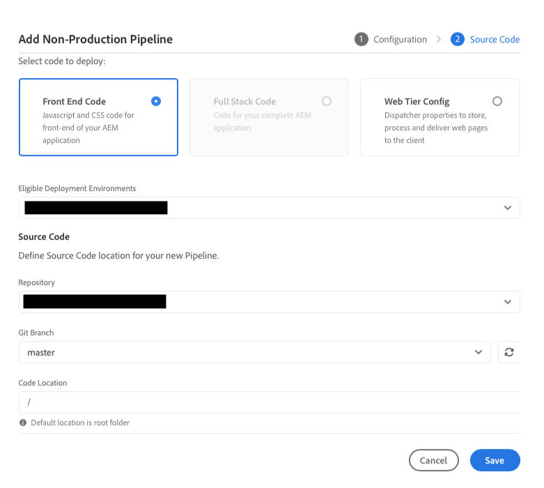
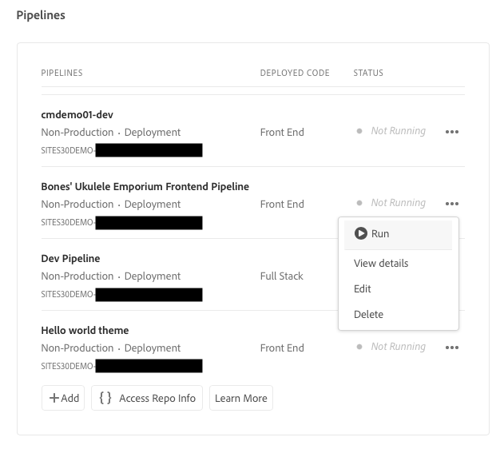

# 設定您的管道 {#set-up-your-pipeline}

{{traditional-aem}}

建立前端管道以管理網站主題的自訂。

## 目前進度 {#story-so-far}

在 AEM 快速建立網站歷程的上一份文件「[使用範本建立網站](create-site.md)」中，您已了解如何使用網站範本快速建立 AEM 網站，並可以使用前端工具進一步自訂，現在您應該：

* 了解如何取得 AEM 網站範本。
* 了解如何使用範本建立網站。
* 了解如何從新網站下載範本以提供給前端開發人員。

本文章以這些基礎知識為基礎，以便您可以設定前端管道，前端開發人員稍後將在部署前端自訂的過程中使用它。

## 目標 {#objective}

本文件協助您了解前端管道以及如何建立一個管道來管理網站自訂主題的部署。閱讀本文件後，您應該：

* 了解什麼是前端管道。
* 了解如何在 Cloud Manager 中設定前端管道。

## 負責角色 {#responsible-role}

歷程的這個部分適用於 Cloud Manager 管理員。

## 要求 {#requirements}

* 您需要擁有 Cloud Manager 存取權。
* 您必須是 Cloud Manager 中&#x200B;**部署管理員**&#x200B;角色的一員。
* 必須在 Cloud Manager 中設定 AEM 環境的 Git 存放庫。
   * 任何主要專案一般已經是這樣的情況。但是，如果不是，請參閱位在「[其他資源](#additional-resources)」區段之下的 Cloud Manager 存放庫文件。

## 什麼是前端管道？ {#front-end-pipeline}

前端開發涉及定義 AEM 網站樣式的 JavaScript、CSS 和靜態資源的自訂內容。前端開發人員將在自己的本機環境中進行這些自訂。他們準備就緒後，變更便會提交至 AEM Git 存放庫。但他們只是提交原始程式碼。內容尚未上線。

前端管道採用這些提交的自訂並將其部署到 AEM 環境，通常是生產或非生產環境。

這樣一來，前端開發的工作可以與 AEM 上的任何全堆疊後端開發分開並同時執行，因為 AEM 擁有自己的部署管道。

>[!NOTE]
>
>前端管道只能部署 JavaScript、CSS 和靜態資源來設定 AEM 網站的樣式。無法在管道中部署頁面或資產等網站內容。

## 存取 Cloud Manager {#login}

1. 在 [my.cloudmanager.adobe.com](https://my.cloudmanager.adobe.com/) 登入 Adobe Cloud Manager。

1. Cloud Manager 列出可用的各種方案。選擇您要管理的方案。如果您剛開始使用 AEM as a Cloud Service，您可能只有一個可用的方案。

   

現在您可以看到方案概觀。您的頁面與此範例會有所不同但相似。

記下您已存取的方案之名稱或複製 URL。您稍後必須將其提供給前端開發人員。

## 建立前端管道 {#create-front-end-pipeline}

現在您已經存取 Cloud Manager，便可以建立前端部署的管道。

1. 在 Cloud Manager 頁面的「**管道**」區段，選取「**新增**」按鈕。

   

1. 在出現在「**新增**」按鈕下方的快顯選單中，為了此歷程的目的，選取「**新增非生產管道**」。

1. 在開啟的「**設定**」標籤上 (在「**新增非生產管道**」對話框)：
   * 選取「**部署管道**」。
   * 在「**非生產管道名稱**」欄位中提供管道名稱。

   

1. 選取「**繼續**」。

1. 在「**原始程式碼**」標籤上：
   * 選取「**前端程式碼**」作為要部署的程式碼類型。
   * 確認在「**合格的部署環境**」之下選取正確的環境。
   * 選取正確的「**存放庫**」。
   * 定義哪個「**Git 分支**」管道應該關聯。
   * 定義「**程式碼位置**」，如果前端開發位於所選存放庫中的特定路徑下。預設值為存放庫的根目錄，但往往前端開發和後端位在不同的路徑。

   

1. 選取「**儲存**」。

在 Cloud Manager 視窗的「**管道**」區段已經建立新管道並可看見。點選管道名稱之後的省略號，會顯示在需要進一步編輯或檢視詳細資訊時的選項。

>[!TIP]
>
>如果您已經熟悉 AEMaaCS 中的管道，並且想要了解有關不同類型管道之間差異的更多資訊，包括有關前端管道的更多詳細資訊，請參閱以下「[其他資源](#additional-resources)」區段所連結的「設定 CI/CD 管道 - 雲端服務」。

## 下一步 {#what-is-next}

現在您已完成 AEM 快速建立網站歷程的這個部分，您應該：

* 了解什麼是前端管道。
* 了解如何在 Cloud Manager 中設定前端管道。

以此知識為基礎並接著檢閱文件「[授予前端開發人員存取權](grant-access.md)」，以繼續您的 AEM 快速建立網站歷程，您會讓前端開發人員上線使用 Cloud Manager，讓他們可以存取您的 AEM 網站 Git 存放庫和管道。

## 其他資源 {#additional-resources}

雖然建議您檢閱文件「[自訂網站主題](customize-theme.md)」以繼續快速建立網站歷程的下一部分，但下列是一些其他選用資源，深入探究了本文件提到的一些概念，不過這些資源並非繼續該歷程的必要條件。

* [Cloud Manager 文件](https://experienceleague.adobe.com/docs/experience-manager-cloud-service/onboarding/onboarding-concepts/cloud-manager-introduction.html) - 如果您想要 Cloud Manager 功能的更多詳細資訊，您可能想直接查閱深入的技術文件。
* [Cloud Manager 存放庫](/help/implementing/cloud-manager/managing-code/managing-repositories.md) - 如果您需要有關如何為 AEMaaCS 專案設定和管理 Git 存放庫的更多資訊，請參閱此文件。
* [設定 CI/CD 管道 - 雲端服務](/help/implementing/cloud-manager/configuring-pipelines/introduction-ci-cd-pipelines.md) - 在本文件中了解更多關於設定全堆疊管道與前端管道的詳細資訊。
