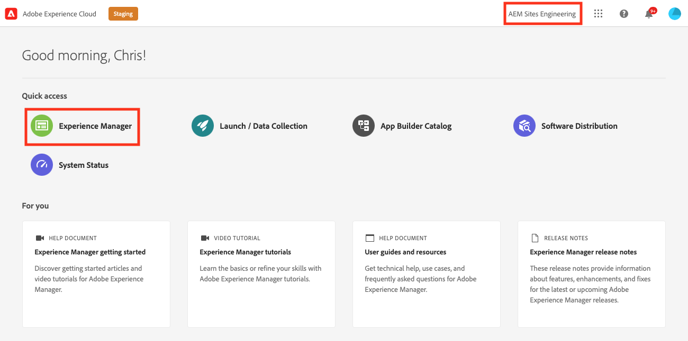
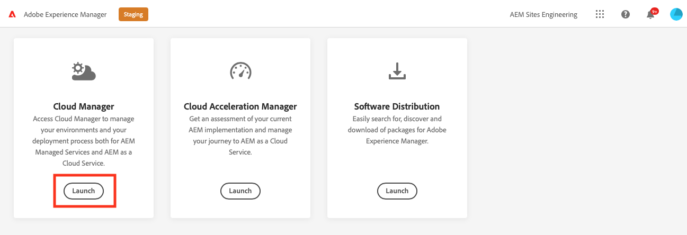

# 擷取Git存放庫存取資訊 {#retrieve-access}

了解前端開發人員如何使用Cloud Manager存取Git存放庫資訊。

>[!CAUTION]
>
>快速網站建立工具目前是技術預覽。 除非經Adobe支援同意，否則可供測試及評估之用，且非供生產使用。

## 迄今為止的故事 {#story-so-far}

如果您是前端開發人員，只負責自訂網站主題，則您不需要任何AEM設定方式的知識，可跳至 [目標](#objective) 一節。

如果您也擔任Cloud Manager或AEM管理員以及前端開發人員的角色，您在AEM快速網站建立歷程的上一份檔案中已了解： [授予前端開發人員的訪問權限，](grant-access.md) 如何將前端開發人員上線，讓他們存取git存放庫，您現在應該知道：

* 如何以使用者身分新增前端開發人員。
* 如何將所需角色授予前端開發人員。

本文將說明下一步，說明前端開發人員如何使用Cloud Manager存取權來擷取存取AEM Git存放庫的憑證。

現在有一個網站是根據模板建立的，有一個管道設定，前端開發人員已上線，並且擁有他們需要的所有資訊，因此本文將視角從管理員轉移到前端開發人員角色。

## 目標 {#objective}

本檔案說明您如何以前端開發人員的角色存取Cloud Manager，並擷取存取AEM Git存放庫的存取憑證。 閱讀後，您將：

* 從高層次了解Cloud Manager是什麼。
* 已擷取您的認證以存取AEM Git，以便您提交自訂。

## 負責角色 {#responsible-role}

此部分的歷程適用於前端開發人員。

## 需求 {#requirements}

「快速網站建立」工具可讓前端開發人員獨立工作，而不需具備AEM或其設定方式的相關知識。 不過，Cloud Manager管理員必須將前端開發人員上線到專案團隊，而AEM管理員必須提供您一些必要資訊。 繼續之前，請確定您有下列資訊。

* 從AEM管理員：
   * 要自定義的主題源檔案
   * 用作參考基礎的示例頁的路徑
   * 用來根據即時AEM內容測試您的自訂內容的Proxy使用者憑證
   * 前端設計要求
* 從Cloud Manager管理員：
   * Cloud Manager的歡迎電子郵件會通知您有權存取
   * Cloud Manager中方案的名稱或指向它的URL

如果您缺少其中任何項目，請聯絡AEM管理員或Cloud Manager管理員。

假設前端開發人員在前端開發工作流程和安裝的常用工具方面擁有豐富經驗，包括：

* git
* npm
* webpack
* 偏好的編輯器

## 了解Cloud Manager {#understanding-cloud-manager}

Cloud Manager可讓組織在雲端中自行管理AEM。 其內容包含持續整合與持續傳送 (CI/CD) 架構，可讓 IT 團隊與實作合作夥伴加快提供自訂或更新的傳送速度，而不會影響效能或安全性。

對於前端開發人員來說，它是以下目的的入口：

* 存取AEM Git存放庫資訊，以便提交前端自訂。
* 啟動部署管道以部署您的自定義項。

Cloud Manager管理員會以Cloud Manager使用者的身分將您上線。 您應該會收到類似下列的歡迎電子郵件。

如果您尚未收到此電子郵件，請聯絡Cloud Manager管理員。

## 存取Cloud Manager {#access-cloud-manager}

1. 登入Adobe Experience Cloud，網址為 [my.cloudmanager.adobe.com](https://my.cloudmanager.adobe.com/) 或按一下歡迎電子郵件中提供的連結。

1. 登入後，請在畫面右上角勾選，以確定您所在的組織正確無誤。 如果您只是一個組織的成員，則不需要執行此步驟。 然後點選或按一下 **Experience Manager**.

   

1. 在下一頁，點選或按一下 **Launch** 按鈕 **Cloud Manager** 應用程式。

   

1. 下一頁列出了各種可用的程式。 按一下或點選Cloud Manager管理員提供的存取權。 如果這是您AEMaaCS的第一個前端專案，您可能只有一個可用的方案。

   

您現在會看到Cloud Manager的概觀。 您的頁面看起來會有所不同，但類似於此範例。

## 檢索儲存庫訪問資訊 {#repo-access}

1. 在 **管道** 區段，點選或按一下 **存取存放庫資訊** 按鈕。

   

1. 此 **儲存庫資訊** 對話框開啟。

   

1. 點選或按一下 **生成密碼** 按鈕為自己建立密碼。

1. 將生成的密碼保存到安全密碼管理器中。 密碼將不再顯示。

1. 同時複製 **用戶名** 和 **Git命令列** 欄位。 您稍後將使用此資訊存取存放庫。

1. 點選或按一下 **關閉**.

## 下一步 {#what-is-next}

現在您已完成AEM快速網站建立歷程的這一部分，您應：

* 從高層次了解Cloud Manager是什麼。
* 已擷取您的認證以存取AEM Git，以便您提交自訂。

基於此知識，並透過接下來檢閱檔案，繼續建立AEM快速網站的歷程 [自訂網站主題、](customize-theme.md) 您可在何處了解網站主題的建立方式、如何自訂，以及如何使用即時AEM內容進行測試。

## 其他資源 {#additional-resources}

建議您透過檢閱檔案，繼續進行快速網站建立歷程的下一個階段 [自訂網站主題、](customize-theme.md) 以下是一些額外的選用資源，可更深入探討本檔案中提及的一些概念，但您不需要這些資源即可繼續進行歷程。

* [Adobe Experience Manager Cloud Manager檔案](https://experienceleague.adobe.com/docs/experience-manager-cloud-manager/using/introduction-to-cloud-manager.html?lang=zh-Hant)  — 探索Cloud Manager檔案，以取得其功能的完整詳細資訊。
