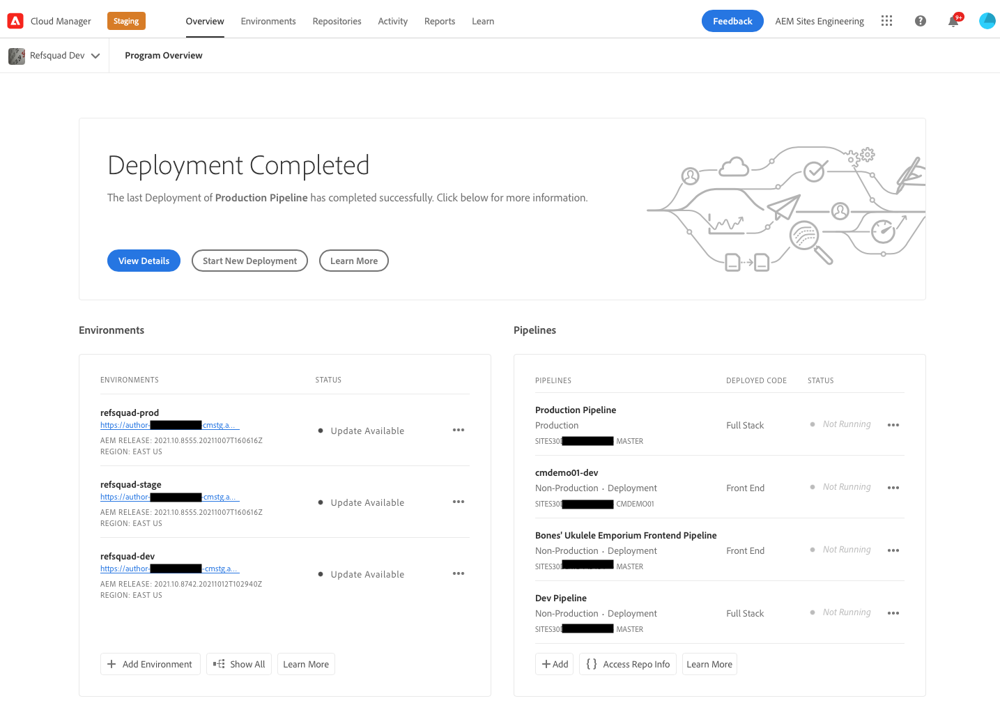

# 檢索Git儲存庫訪問資訊 {#retrieve-access}

瞭解前端開發人員如何使用Cloud Manager訪問Git儲存庫資訊。

## 到目前為止的故事 {#story-so-far}

如果您是僅負責自定義網站主題的前端開發人員，則您不需要任何有關設定的知識，AEM並可跳至 [目標](#objective) 的子菜單。

如果您還擔任Cloud Manager或AEM管理員以及前端開發人員的角色，您在快速站點建立之旅的上AEM一文檔中瞭解到： [授予對前端開發人員的訪問權限，](grant-access.md) 如何將前端開發人員裝載到GIT儲存庫中，您現在應該知道：

* 如何以用戶身份添加前端開發人員。
* 如何將所需角色授予前端開發人員。

本文接下來介紹前端開發人員如何使用Cloud Manager訪問來檢索憑據以訪問AEMGit儲存庫。

現在，有了一個基於模板建立的站點，有了一個管道設定，前端開發人員已掛接，並擁有他們所需的所有資訊，本文將視角從管理員轉移到前端開發人員角色。

## 目標 {#objective}

本文檔介紹您如何以前端開發人員的角色訪問雲管理器並檢索到Git儲存庫的訪AEM問憑據。 閱讀完後，您將：

* 高級瞭解Cloud Manager是什麼。
* 已檢索您的憑據以訪AEM問Git，以便您可以提交自定義。

## 責任角色 {#responsible-role}

這部分行程適用於前端開發商。

## 要求 {#requirements}

「快速站點建立」工具允許前端開發人員獨立工作，而AEM且不知道它的設定。 但是，Cloud Manager管理員必須將前端開發人員裝載到項目團隊中AEM，並且管理員必須向您提供一些所需資訊。 在繼續之前，請確保您具有以下資訊。

* 管理員AEM:
   * 要自定義的主題源檔案
   * 要用作引用基礎的示例頁的路徑
   * 代理用戶憑據，用於根據即時內容test自AEM定義
   * 前端設計要求
* 從Cloud Manager管理員：
   * 來自Cloud Manager的歡迎電子郵件，通知您訪問
   * Cloud Manager中程式的名稱或程式的URL

如果缺少其中任何項，請與管理員或AEMCloud Manager管理員聯繫。

假定前端開發人員在前端開發工作流程和安裝的通用工具方面擁有豐富的經驗，包括：

* 蠢
* npm
* 網路包
* 首選編輯器

## 瞭解雲管理器 {#understanding-cloud-manager}

Cloud Manager使組織能夠在雲中AEM進行自我管理。 其內容包含持續整合與持續傳送 (CI/CD) 架構，可讓 IT 團隊與實作合作夥伴加快提供自訂或更新的傳送速度，而不會影響效能或安全性。

對於前端開發人員，它是訪問：

* 訪AEM問Git儲存庫資訊，以便您可以提交前端自定義。
* 啟動部署管道以部署您的自定義項。

Cloud Manager管理員將以Cloud Manager用戶身份加入您。 您應該收到類似於以下內容的歡迎電子郵件。

如果您尚未收到此電子郵件，請與Cloud Manager管理員聯繫。

## 訪問雲管理器 {#access-cloud-manager}

1. 登錄Adobe Experience Cloud，時間： [my.cloudmanager.adobe.com](https://my.cloudmanager.adobe.com/) 或按一下歡迎電子郵件中提供的連結。

1. 雲管理器列出了各種可用程式。 點擊或按一下Cloud Manager管理員提供的需要訪問的內容。 如果這是AEMaaCS的第一個前端項目，則您可能只有一個可用的項目。

   

您現在可以看到您的程式的概述。 您的頁面看起來會有所不同，但與此示例類似。

## 檢索儲存庫訪問資訊 {#repo-access}

1. 在 **管線** 按一下或按一下 **訪問回購資訊** 按鈕

   

1. 的 **資料庫資訊** 對話框。

   

1. 點擊或按一下 **生成密碼** 按鈕為您建立密碼。

1. 將生成的密碼保存到安全密碼管理器。 密碼將不再顯示。

1. 另請複製 **用戶名** 和 **Git命令行** 的子菜單。 稍後您將使用此資訊訪問回購。

1. 點擊或按一下 **關閉**。

## 下一步是什麼 {#what-is-next}

現在，您已完成快速站點創AEM建過程的這一部分：

* 高級瞭解Cloud Manager是什麼。
* 已檢索您的憑據以訪AEM問Git，以便您可以提交自定義。

在此知識基礎上構建並繼AEM續快速建立網站的過程，方法是下次查看文檔 [自定義網站主題，](customize-theme.md) 您將在何處學習如何構建網站主題、如何自定義以及如何使用即時內容進行testAEM。

## 其他資源 {#additional-resources}

建議您通過審閱文檔進入快速站點建立過程的下一部分 [自定義網站主題，](customize-theme.md) 下面是一些附加的可選資源，這些資源對本文檔中提到的一些概念進行了更深入的瞭解，但不需要繼續旅行。

* [Adobe Experience Manager雲管理器文檔](https://experienceleague.adobe.com/docs/experience-manager-cloud-manager/using/introduction-to-cloud-manager.html?lang=zh-Hant)  — 瀏覽Cloud Manager文檔以瞭解其功能的全部詳細資訊。
