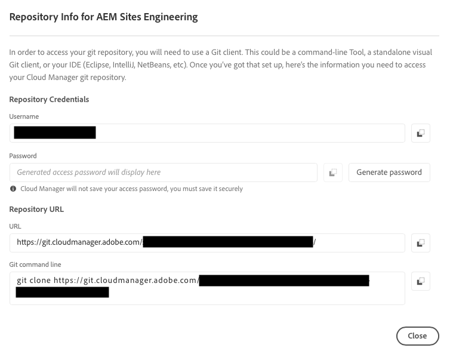

# 擷取 Git 存放庫存取資訊 {#retrieve-access}

{{traditional-aem}}

了解前端開發人員如何使用 Cloud Manager 來存取 Git 存放庫資訊。

## 目前進度 {#story-so-far}

如果您是只負責自訂網站主題的前端開發人員，則不需要了解 AEM 的設定方式，可以跳到本文件的「[目標](#objective)」區段。

如果您還擔任 Cloud Manager 或 AEM 管理員和前端開發人員的角色，您在 AEM 快速建立網站歷程的上一份文件「[授予前端開發人員存取權](grant-access.md)」中已了解如何讓前端開發人員上線，使他們能夠存取 Git 存放庫，而且您現在應該了解：

* 如何將前端開發人員新增為使用者。
* 如何向前端開發人員授予所需的角色。

本文章接著說明前端開發人員如何使用 Cloud Manager 存取權限來擷取存取 AEM Git 存放庫的認證。

現在已有根據範本建立的網站，已設定管道，前端開發人親上線並備妥需要的所有資訊，本文章將從管理員的角度轉移到專門從前端開發人員的角色出發。

## 目標 {#objective}

本文件說明您作為前端開發人員如何存取 Cloud Manager 並擷取存取 AEM Git 存放庫的認證。閱讀本文件後，您將會：

* 深入了解 Cloud Manager 是什麼。
* 已擷取您的認證來存取 AEM Git，以便您可以提交自訂。

## 負責角色 {#responsible-role}

歷程的這個部分適用於前端開發人員。

## 要求 {#requirements}

快速建立網站工具讓前端開發人員獨立運作，無需了解 AEM 或其設定方式。但是，Cloud Manager 管理員必須讓前端開發人員上線並加入專案團隊，而 AEM 管理員必須向您提供一些必要資訊。在繼續之前，請確保您擁有以下資訊。

* 來自 AEM 管理員：
   * 要自訂的主題來源文件
   * 用作參考基礎的範例頁面路徑
   * 用來測試您根據即時 AEM 內容所做的自訂內容的 Proxy 使用者認證
   * 前端設計要求
* 從 Cloud Manager 管理員：
   * 來自 Cloud Manager 的歡迎電子郵件，通知您獲得存取權限
   * 在 Cloud Manager 內方案的名稱或其 URL

如果您缺少其中任何一項，請聯絡 AEM 管理員或 Cloud Manager 管理員。

我們預設前端開發人員對於前端開發工作流程和所安裝的常用工具擁有豐富經驗，包括：

* Git
* npm
* webpack
* 偏好編輯器

## 了解 Cloud Manager {#understanding-cloud-manager}

Cloud Manager 讓組織可以在雲端中自行管理 AEM。其內容包含持續整合與持續傳遞 (CI/CD) 架構，可讓 IT 團隊與實作合作夥伴加速自訂項目或更新的傳遞，而不會影響效能或安全性。

對於前端開發人員來說，它是提供以下功能的通道：

* 存取 AEM Git 存放庫資訊，以便您可以提交前端自訂設定。
* 啟動部署管道以部署您的自訂內容。

Cloud Manager 管理員將讓您上線成為 Cloud Manager 使用者。您應該已收到類似以下內容的歡迎電子郵件。

如果您沒有收到此電子郵件，請聯絡 Cloud Manager 管理員。

## 存取 Cloud Manager {#access-cloud-manager}

1. 登入 Adobe Experience Cloud，網址為 [my.cloudmanager.adobe.com](https://my.cloudmanager.adobe.com/) 或按一下歡迎電子郵件中提供的連結。

1. Cloud Manager 列出可用的各種方案。選擇您需要存取的由 Cloud Manager 管理員提供的方案。如果這是您的第一個 AEMaaCS 前端專案，您可能只有一個方案可用。

   

現在您可以看到方案概觀。您的頁面與此範例會有所不同但相似。

## 擷取存放庫存取資訊 {#repo-access}

1. 在 Cloud Manager 頁面的「**管道**」區段，選取「**存取存放庫資訊**」按鈕。

   

1. 「**存放庫資訊**」對話框開啟。

   

1. 選取「**產生密碼**」按鈕為自己建立一個密碼。

1. 將產生的密碼儲存到安全的密碼管理器。密碼將永遠不會再次顯示。

1. 同時複製「**使用者名稱**」和&#x200B;**「Git 命令列**」欄位。您稍後將使用此資訊來存取存放庫。

1. 選取「**「關閉」**」。

## 下一步 {#what-is-next}

現在您已完成 AEM 快速建立網站歷程的這個部分，您應該：

* 深入了解 Cloud Manager 是什麼。
* 已擷取您的認證來存取 AEM Git，以便您可以提交自訂。

以此知識為基礎並繼續您的 AEM 快速建立網站歷程，接著檢閱文件「[自訂網站主題](customize-theme.md)」，您可以在此了解如何建置網站主題、如何自訂以及如何使用即時 AEM 內容進行測試。

## 其他資源 {#additional-resources}

雖然建議您檢閱文件「[自訂網站主題](customize-theme.md)」以繼續快速建立網站歷程的下一部分，但下列是一些其他選用資源，深入探究了本文件提到的一些概念，不過這些資源並非繼續該歷程的必要條件。

* [Adobe Experience Manager Cloud Manager 文件](https://experienceleague.adobe.com/docs/experience-manager-cloud-manager/using/introduction-to-cloud-manager.html) - 瀏覽 Cloud Manager 文件以了解其功能的完整詳細資訊。
