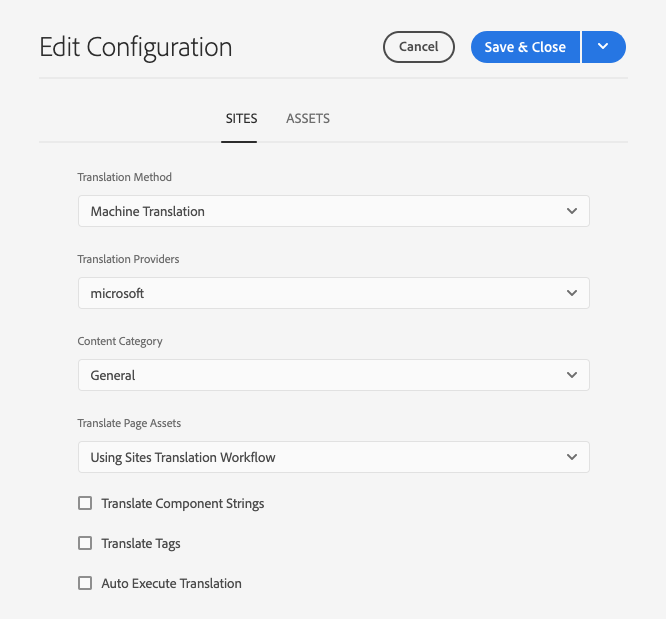

# 設定翻譯連接器 {#configure-connector}

了解如何將 AEM 連接到翻譯服務。

## 到目前為止 {#story-so-far}

在AEM Sites翻譯歷程的上一個檔案中， [開始使用AEM Sites翻譯](learn-about.md) 您已瞭解如何組織您的內容以及AEM翻譯工具如何運作，您現在應：

* 了解內容結構對翻譯的重要性。
* 瞭解AEM如何儲存內容。
* 熟悉 AEM 的翻譯工具。

本文章以這些基礎知識為基礎，因此您可以採取第一個設定步驟並設定翻譯服務，您將在稍後的歷程中使用該翻譯服務來翻譯您的內容。

## 目標 {#objective}

本文件可協助您了解如何為您選擇的翻譯服務設定 AEM 連接器。閱讀本文件後，您應該：

* 了解 AEM 中翻譯整合框架的重要參數。
* 能夠為您的翻譯服務設定您自己的連接。

## 翻譯整合框架 {#tif}

AEM 的翻譯整合框架 (TIF) 整合協力廠商翻譯服務以協調 AEM 內容的翻譯工作。它涉及三個基本步驟。

1. 連接到您的翻譯服務提供者。
1. 建立翻譯整合框架設定。
1. 將設定與您的內容相關聯。

以下章節將更詳細地描述這些步驟。

## 連接到翻譯服務提供者 {#connect-translation-provider}

第一步是選擇想要使用的翻譯服務。有多種人工和機器翻譯服務可供 AEM 使用。大部分提供者都提供要安裝的翻譯套件。請參閱[其他資源](#additional-resources)章節，了解一系列可選用的翻譯服務。

>[!NOTE]
>
>翻譯專家通常負責選擇要使用的翻譯服務，但管理員通常負責安裝所需的翻譯連接器套件。

基於此歷程的目的，我們使用 AEM 有提供試用版授權的 Microsoft Translator，立即可用。如需更多此提供者的資訊，請參閱[其他資源](#additional-resources)章節。

如果您選擇其他提供者，您的管理員必須按照該翻譯服務提供的說明安裝連接器套件。

>[!NOTE]
>
>在 AEM 中使用立即可用的 Microsoft Translator 不需要額外的設定，也無需額外的連接器設定即可按原狀工作。
>
>如果您選擇使用 Microsoft Translator 連接器進行測試，則無需執行接下來兩章節中的步驟：[建立翻譯整合設定](#create-config)和[將設定與您的內容相關聯。](#associate)但是，建議您閱讀這兩個章節，以便熟悉相關步驟，在您需要設定偏好的連接器時就能派上用場。
>
>Microsoft Translator聯結器的試用版授權並非用於生產目的，如果您決定授權，系統管理員必須遵循以下檔案中詳述的步驟： [其他資源](#additional-resources) 區段來設定該授權。

## 建立翻譯整合設定 {#create-config}

安裝偏好的翻譯服務連接器套件後，您必須為該服務建立翻譯整合框架設定。設定包括以下資訊：

* 要使用哪個翻譯服務提供者
* 是否進行人工翻譯或機器翻譯
* 是否要翻譯與頁面關聯的其他內容，例如標籤

若要建立新的翻譯設定：

1. 在全域導覽功能表中，按一下或點選&#x200B;**工具** -> **雲端服務** -> **翻譯雲端服務**。
1. 在內容結構中導覽到想要建立設定的位置。這通常根據特定專案，也可以是全域的。
   * 例如，在此情況下，以全域方式建立設定以套用到所有內容，或僅適用於 WKND 專案。

   

1. 按一下或點選 **建立** ，以建立新設定。
1. 在欄位中提供以下資訊，然後按一下或點選&#x200B;**建立**。
   1. 在下拉選單中選取&#x200B;**設定類型**。從清單中選取&#x200B;**翻譯整合**。
   1. 輸入設定的&#x200B;**標題**。此 **標題** 會識別 **Cloud Services** 控制檯和in page property下拉式清單。
   1. 或者，輸入&#x200B;**名稱**&#x200B;以用於儲存設定的存放庫節點。

   

1. 點選或按一下&#x200B;**建立**，**編輯設定**&#x200B;視窗隨即出現，您可以在此對設定屬性進行設定。

1. 由於您的內容是以網站形式管理，因此請點選或按一下 **網站** 標籤。



1. 提供以下資訊。

   1. **翻譯方法** - 選取&#x200B;**機器翻譯**&#x200B;或&#x200B;**人工翻譯**，視您的翻譯提供者而定。基於此歷程的目的，我們假設使用機器翻譯。
   1. **翻譯提供者** - 從清單中選取您為翻譯服務安裝的連接器。
   1. **內容類別** - 選取最合適的類別以更好地定位翻譯 (僅適用於機器翻譯)。
   1. **翻譯頁面資產**  — 選取 **使用網站翻譯工作流程** 以翻譯與網站頁面相關聯的資產。
   1. **翻譯元件字串**  — 勾選此選項可翻譯元件資訊。
   1. **翻譯標籤**  — 勾選此專案以翻譯與頁面相關聯的標籤。
   1. **自動執行翻譯** - 如果您想要翻譯內容自動傳送到您的翻譯服務，請勾選此屬性。

1. 點選或按一下&#x200B;**儲存並關閉**。

您現在已經為您的翻譯服務設定了連接器。

## 將設定與您的內容相關聯。 {#associate}

AEM 是一種靈活而強大的工具，透過多個連接器和多個設定，支援多個、同時執行的翻譯服務。設定這類設定不在本歷程的討論範圍內。然而，這種靈活性表示您必須將此設定與您的內容相關聯，藉此指定應使用哪些連接器和設定來翻譯您的內容。

為此，請導覽至內容的語言根。基於我們範例的目的，這是

```text
/content/<your-project>/en
```

1. 前往全域導覽，然後前往&#x200B;**導覽**-> **資產** -> **檔案**。
1. 在資產主控台中，選取要設定的語言根，然後按一下或點選&#x200B;**屬性**。
1. 點選或按一下&#x200B;**雲端服務**&#x200B;索引標籤。
1. 在&#x200B;**新增設定**&#x200B;下拉選單的&#x200B;**雲端服務設定**&#x200B;下，選取您的連接器。如果您已依照[先前描述](#connect-translation-provider)安裝其套件，連接器就會出現在下拉選單中。
1. 在&#x200B;**新增設定**&#x200B;下拉選單的&#x200B;**雲端服務設定**&#x200B;下，也選取您的設定。
1. 點選或按一下&#x200B;**儲存並關閉**。


## 下一步 {#what-is-next}

現在您已完成AEM Sites翻譯歷程的這一部分，您應：

* 了解 AEM 中翻譯整合框架的重要參數。
* 能夠為您的翻譯服務設定您自己的連接。

在此知識的基礎上繼續您的AEM Sites翻譯歷程，接下來檢視檔案 [設定翻譯規則，](translation-rules.md) 您將在其中學習如何定義要翻譯的內容。

## 其他資源 {#additional-resources}

我們建議您檢閱檔案，繼續翻譯歷程的下一部分 [設定翻譯規則](translation-rules.md) 以下是一些其他可選資源，這些資源對本文檔中提到的一些概念進行了更深入的探究，但並非繼續此歷程所必需的。

* [設定翻譯整合框架](/help/sites-cloud/administering/translation/integration-framework.md) - 檢視所選翻譯連接器清單，了解如何設定翻譯整合框架以與協力廠商翻譯服務整合。
* [連接到 Microsoft Translator](/help/sites-cloud/administering/translation/connect-ms-translator.md) - AEM 提供 Microsoft Translator 試用版帳戶用於測試目的。
