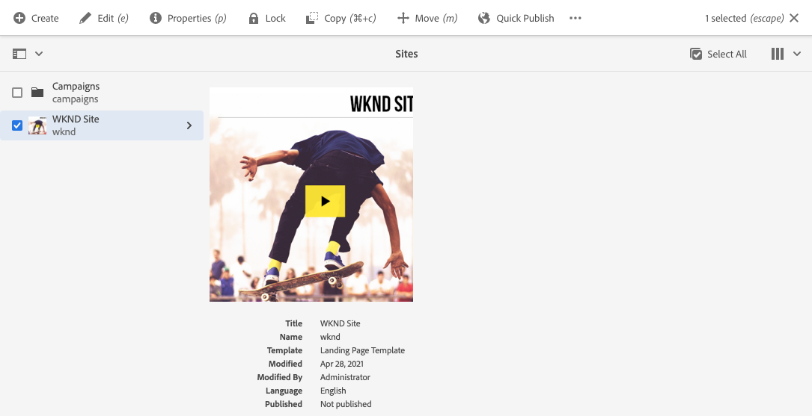

# 開始使用AEM Sites翻譯 {#getting-started}

瞭解如何組織您的AEM Sites內容以及AEM翻譯工具的運作方式。

## 到目前為止 {#story-so-far}

在AEM Sites翻譯歷程的上一個檔案中， [瞭解AEM Sites內容以及如何在AEM中翻譯](learn-about.md) 您已瞭解AEM Sites的基本理論，現在應：

* 瞭解AEM Sites內容建立的基本概念。
* 熟悉AEM支援翻譯的方式。

本文章以這些基本知識為基礎，以便您了解 AEM 如何儲存和管理 內容，以及您如何使用 AEM 的翻譯工具來翻譯該內容。

## 目標 {#objective}

本檔案可協助您瞭解如何開始在AEM中翻譯網站內容。 閱讀本文件後，您應該：

* 了解內容結構對翻譯的重要性。
* 了解 AEM 如何儲存 內容。
* 熟悉 AEM 的翻譯工具。

## 要求和先決條件 {#requirements-prerequisites}

開始翻譯AEM內容之前，有幾項需求。

### 知識 {#knowledge}

* 有在 CMS 中翻譯內容的經驗
* 有使用大型 CMS 基本功能的經驗
* 具備 AEM 基本處理的工作知識
* 了解您正在使用的翻譯服務
* 對您要翻譯的內容有基本的了解

>[!TIP]
>
>如果您不熟悉使用 AEM 等大型 CMS，請考慮查閱[基本處理](/help/sites-cloud/authoring/getting-started/basic-handling.md)文件再繼續進行。「基本處理」文件不是歷程的一部分。因此，請在完成後返回此頁面。

### 工具 {#tools}

* 用於測試內容翻譯作業的沙箱存取權
* 用於連接到您偏好之翻譯服務的認證
* 是 AEM `project-administrators` 群組的成員

## AEM 如何儲存 內容 {#content-in-aem}

對於翻譯專家來說，深入了解 AEM 如何管理 內容並不重要。不過，在稍後使用AEM翻譯工具時，熟悉基本概念和術語會很有幫助。 最重要的是，您需要瞭解您自己的內容，以及它是如何建構以有效地翻譯它。

### 網站主控台 {#sites-console}

網站主控台提供內容結構的概覽，可讓您透過建立新頁面、移動和複製頁面以及發佈內容，輕鬆導覽和管理內容。

若要存取網站主控台：

1. 在全域導覽功能表中，選取 **導覽** > **網站**.
1. 網站主控台會開啟至內容的最上層。
1. 確定 **欄檢視** 使用視窗右上角的檢視選擇器來選取。

   

1. 點選或按一下欄中的專案，它會在右側欄的階層中顯示其下方的內容。

   

1. 點選或按一下欄中某個專案的核取方塊，即會選取該專案並在右側欄中顯示所選專案的詳細資料，以及在上方工具列中針對所選專案顯示數個可用的動作。

   

1. 點選或按一下左上方的邊欄選擇器，您也可顯示 **內容樹狀結構** 檢視內容樹狀結構概觀。

   

您可以使用這些簡單工具，直覺地瀏覽您的內容結構。

>[!NOTE]
>
>內容架構師通常會定義內容結構，而內容作者會在該結構內建立內容。
>
>身為翻譯專家，請務必瞭解如何導覽該結構以及內容所在位置。

### 頁面編輯器 {#page-editor}

網站主控台可讓您導覽內容並提供其結構的概觀。 若要檢視個別頁面的詳細資訊，您必須使用網站編輯器。

若要編輯頁面：

1. 使用網站主控台來尋找及選取頁面。 請記住，您必須選取個別頁面的核取方塊才能選取它。

   

1. 點選 **編輯** 工具列中的選項。
1. 網站編輯器隨即開啟，並載入所選頁面，以在新的瀏覽器標籤中編輯。
1. 將滑鼠指標停留在內容上或點選內容會顯示個別元件的選取器。 元件是組成頁面的拖放建置區塊。

   

您可以隨時在瀏覽器中切換回該索引標籤，以返回網站主控台。 您可以使用網站編輯器快速檢視頁面內容，讓內容作者和您的對象看得見。

>[!NOTE]
>
>內容作者會使用網站編輯器建立您的網站內容。
>
>身為翻譯專家，請務必瞭解如何使用網站編輯器檢視該內容的詳細資訊。

## 結構是關鍵 {#content-structure}

AEM內容是由其結構所驅動。 AEM 對內容結構的要求很少，但在規劃專案時請仔細考慮您的內容階層可以使翻譯變得更加簡單。

>[!TIP]
>
>在AEM專案剛開始時，就規劃翻譯。 儘早與專案經理和內容架構師密切合作。
>
>可能需要一位具獨立角色的國際化專案經理，其職責是定義哪些內容應該翻譯，哪些內容不應該翻譯，以及哪些已翻譯內容可以由區域或本地內容製作者修改。

## 建議的內容結構 {#recommended-structure}

如前所述，與您的內容架構師一起確定適合您自己專案的內容結構。然而，以下是一個經過證明、簡單、直覺的結構，它非常有效。

在 `/content` 下定義專案的基本資料夾。

```text
/content/<your-project>
```

編寫內容所用的語言稱為語言根。我們的範例是使用英語，它應該位在此路徑下。

```text
/content/<your-project>/en
```

所有可能需要本地化的專案內容都應該放在語言根下。

```text
/content/<your-project>/en/<your-project-content>
```

建立語言根時應同時建立同層級資料夾用於翻譯工作，資料夾名稱代表該語言的 ISO-2 語言碼。例如，德語將具有以下路徑。

```text
/content/<your-project>/de
```

>[!NOTE]
>
>內容架構師通常負責建立這些語言資料夾。如果未建立，AEM 之後將無法建立翻譯工作。

最終結構可能如下所示。

```text
/content
    |- your-project
        |- en
            |- some
            |- exciting
            |- sites
            |- content
        |- de
        |- fr
        |- it
        |- ...
    |- another-project
    |- ...
```

您應該記下內容的特定路徑，因為稍後需要您設定翻譯。

>[!NOTE]
>
>通常內容架構師的職責是定義內容結構，通常會與翻譯專家合作。
>
>為了完整起見，這裡有詳細說明。

## AEM 翻譯工具 {#translation-tools}

現在您已瞭解網站主控台和編輯器以及內容結構的重要性，我們可以開始瞭解如何翻譯內容。 AEM 的翻譯工具非常強大，其大致概念很容易理解。

* **翻譯連接器** - 連接器是 AEM 與您使用的翻譯服務之間的連結。
* **翻譯規則**  — 規則會定義特定路徑下的應翻譯內容。
* **翻譯專案** - 翻譯專案收集由單一翻譯工作處理的內容並追蹤翻譯進度，與連接器連接以傳送要翻譯的內容並接收翻譯服務傳回的內容。

您通常只為每個專案的執行個體和規則設定一次聯結器。 然後，您使用翻譯專案來翻譯您的內容，並持續更新其翻譯。

## 下一步 {#what-is-next}

現在您已完成AEM Sites翻譯歷程的這一部分，您應：

* 了解內容結構對翻譯的重要性。
* 了解 AEM 如何儲存 內容。
* 熟悉 AEM 的翻譯工具。

在此基礎上繼續您的AEM Sites翻譯歷程，接下來檢閱檔案 [設定翻譯聯結器](configure-connector.md) 您可在其中學習如何將AEM連結至翻譯服務。|

## 其他資源 {#additional-resources}

雖然建議您查閱文件[設定翻譯連接器](configure-connector.md)來繼續 翻譯歷程的下個部分，以下也有一些其他選擇性資源，在深入探究本文件提到的一些概念，但不是繼續 歷程的必要條件。

* [AEM 基本處理](/help/sites-cloud/authoring/getting-started/basic-handling.md) - 了解 AEM UI 的基本知識，以便能夠輕鬆導覽和執行基本任務，例如尋找您的內容。
* [識別要翻譯的內容](/help/sites-cloud/administering/translation/rules.md) - 了解翻譯規則如何識別需要翻譯的內容。
* [設定翻譯整合框架](/help/sites-cloud/administering/translation/integration-framework.md) - 了解如何設定翻譯整合框架以與協力廠商翻譯服務整合。
* [管理翻譯專案](/help/sites-cloud/administering/translation/managing-projects.md) - 了解如何在 AEM 中建立和管理機器和人工翻譯專案。
