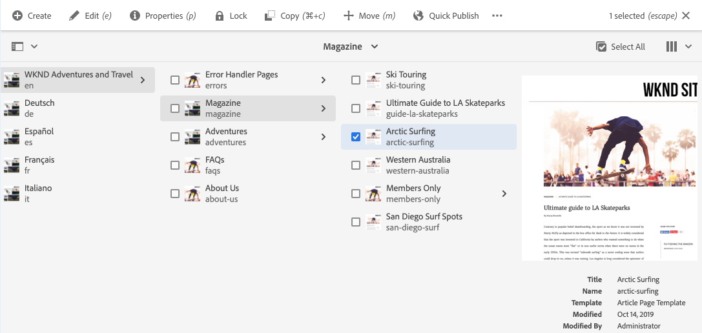

# 開始AEM Sites翻譯 {#getting-started}

瞭解如何組織您的AEM Sites內容以及翻譯工AEM具的工作。

## 到目前為止的故事 {#story-so-far}

在AEM Sites的前期翻譯過程中， [瞭解AEM Sites內容及翻譯方AEM法](learn-about.md) 你學到了AEM Sites的基本理論，現在就該說：

* 瞭解AEM Sites內容建立的基本概念。
* 熟悉如何支AEM持翻譯。

本文基於這些基礎知識，以便您了AEM解如何儲存和管理內容，以及如何使用翻AEM譯工具翻譯內容。

## 目標 {#objective}

此文檔可幫助您瞭解如何開始翻譯網站內容AEM。 閱讀完後，您應：

* 瞭解內容結構對翻譯的重要性。
* 瞭解內AEM容的儲存方式。
* 熟悉翻AEM譯工具。

## 要求和先決條件 {#requirements-prerequisites}

在開始翻譯內容之前，有許多要AEM求。

### 知識 {#knowledge}

* 在CMS中翻譯內容的經驗
* 使用大型CMS基本功能的經驗
* 具備基本處理AEM工作知識
* 瞭解您使用的翻譯服務
* 對要翻譯的內容有基本的瞭解

>[!TIP]
>
>如果您不熟悉使用大型CMS，請考AEM慮查看 [基本處理](/help/sites-cloud/authoring/getting-started/basic-handling.md) 文檔，然後繼續。 「基本處理」文檔不在此過程中，因此，完成後請返回此頁。

### 工具 {#tools}

* 用於測試翻譯內容的沙盒訪問
* 連接到首選翻譯服務的憑據
* 是 `project-administrators` 分組AEM

## 如何存AEM儲內容 {#content-in-aem}

對於翻譯專家來說，深入瞭解內容管理方式並AEM不重要。 但是，熟悉基本概念和術語後，在您以後使用翻譯工具時AEM會有所幫助。 最重要的是，您需要瞭解您自己的內容及其結構，以便有效地翻譯它。

### 站點控制台 {#sites-console}

站點控制台概述了您的內容結構，通過建立新頁面、移動和複製頁面以及發佈內容，您可以輕鬆瀏覽內容並管理內容。

要訪問站點控制台：

1. 在全局導航菜單中，按一下或點擊 **導航** -> **站點**。
1. 站點控制台開啟到內容的頂級。
1. 確保 **列視圖** 的子菜單。

   

1. 按一下或按一下列中的項，它將在右側列的層次結構中顯示其下方的內容。

   

1. 按一下或按一下列中某個項的複選框，它將選擇該項，並在右側的列中顯示選定項的詳細資訊，同時顯示上面工具欄中選定項的可用操作數。

   

1. 通過點擊或按一下左上方的滑軌選擇器，還可以顯示 **內容樹** 的子菜單。

   

使用這些簡單的工具，您可以直觀地瀏覽內容結構。

>[!NOTE]
>
>內容架構師通常定義內容結構，而內容作者在該結構內建立內容。
>
>作為翻譯專家，簡單瞭解如何瀏覽該結構並瞭解內容所在位置非常重要。

### 頁面編輯器 {#page-editor}

站點控制台允許您瀏覽內容並概述其結構。 要查看單個頁面的詳細資訊，需要使用站點編輯器。

編輯頁面：

1. 使用站點控制台查找並選擇頁面。 請記住，您需要點擊或按一下單個頁面的複選框才能選擇它。

   

1. 點擊 **編輯** 的子菜單。
1. 站點編輯器隨即開啟，其中已載入選定頁面，以便在新瀏覽器頁籤中進行編輯。
1. 對內容進行滑鼠移動或點擊顯示各個元件的選擇器。 元件是組成頁面的拖放構建塊。

   

您可以隨時切換回瀏覽器中的該頁籤，以返回到站點控制台。 使用網站編輯器，您可以快速查看內容作者和您的受眾將看到該頁面的內容。

>[!NOTE]
>
>內容作者使用站點編輯器建立您的站點內容。
>
>作為翻譯專家，只需瞭解如何使用站點編輯器查看該內容的詳細資訊就很重要。

## 結構是關鍵 {#content-structure}

內AEM容由其結構驅動。 對內AEM容結構要求很少，但在項目規劃中仔細考慮內容層次結構會使翻譯變得簡單得多。

>[!TIP]
>
>在項目開始時計畫AEM翻譯。 及早與項目經理和內容架構師密切合作。
>
>國際化項目經理可能需要作為單獨的角色，其職責是定義哪些內容應該翻譯哪些內容不應該翻譯，哪些翻譯的內容可由區域或本地內容製作者修改。

## 推薦的內容結構 {#recommended-structure}

如先前建議的那樣，與內容架構師合作，為您自己的項目確定適當的內容結構。 但是以下是一個經過驗證、簡單、直觀的結構，是相當有效的。

為項目定義基資料夾 `/content`。

```text
/content/<your-project>
```

編寫內容所用的語言稱為語言根。 在我們的例子中，它是英語，它應該位於這條路徑下方。

```text
/content/<your-project>/en
```

可能需要本地化的所有項目內容都應放在語言根下。

```text
/content/<your-project>/en/<your-project-content>
```

翻譯應作為同級資料夾與語言根目錄一起建立，其資料夾名稱代表語言的ISO-2語言代碼。 例如，德語會有以下路徑。

```text
/content/<your-project>/de
```

>[!NOTE]
>
>內容架構師通常負責建立這些語言資料夾。 如果未建立，AEM則以後將無法建立翻譯作業。

最後的結構可能如下所示。

```text
/content
    |- your-project
        |- en
            |- some
            |- exciting
            |- sites
            |- content
        |- de
        |- fr
        |- it
        |- ...
    |- another-project
    |- ...
```

您應注意內容的特定路徑，因為以後配置翻譯時需要它。

>[!NOTE]
>
>通常，內容架構師有責任定義內容結構，通常與翻譯專家協作。
>
>這裡詳細介紹了完整性。

## 翻AEM譯工具 {#translation-tools}

現在，您瞭解了站點控制台和編輯器以及內容結構的重要性，我們可以瞭解如何翻譯內容。 中的翻譯工AEM具功能強大，但在高級別上易於理解。

* **翻譯連接器**  — 連接器是您使用的AEM翻譯服務之間的連結。
* **翻譯規則**  — 規則定義應翻譯特定路徑下的內容。
* **翻譯項目**  — 翻譯項目收集應作為單一翻譯工作處理的內容，並跟蹤翻譯的進度，與連接器介面以傳輸要翻譯的內容並從翻譯服務接收回來。

通常，您只為實例和每個項目的規則設定一次連接器。 然後，您可以使用翻譯項目來翻譯您的內容並使其翻譯不斷更新。

## 下一步是什麼 {#what-is-next}

現在，您已完成AEM Sites翻譯過程的這一部分，您應：

* 瞭解內容結構對翻譯的重要性。
* 瞭解內AEM容的儲存方式。
* 熟悉翻AEM譯工具。

在此知識基礎上，繼續您的AEM Sites翻譯之旅，下一步查看文檔 [配置翻譯連接器](configure-connector.md) 您將學習如何連AEM接到翻譯服務。|

## 其他資源 {#additional-resources}

建議您通過審閱文檔來進入翻譯過程的下一部分 [配置翻譯連接器](configure-connector.md) 下面是一些附加的可選資源，這些資源對本文檔中提到的一些概念進行了更深入的瞭解，但不需要繼續旅行。

* [基AEM本處理](/help/sites-cloud/authoring/getting-started/basic-handling.md)  — 瞭解UI的基AEM本知識，以便輕鬆導航並執行基本任務，如查找內容。
* [確定要翻譯的內容](/help/sites-cloud/administering/translation/rules.md)  — 瞭解翻譯規則如何識別需要翻譯的內容。
* [配置翻譯整合框架](/help/sites-cloud/administering/translation/integration-framework.md)  — 瞭解如何配置翻譯整合框架以與第三方翻譯服務整合。
* [管理翻譯項目](/help/sites-cloud/administering/translation/managing-projects.md)  — 瞭解如何在中建立和管理機器和人類翻譯項AEM目。
