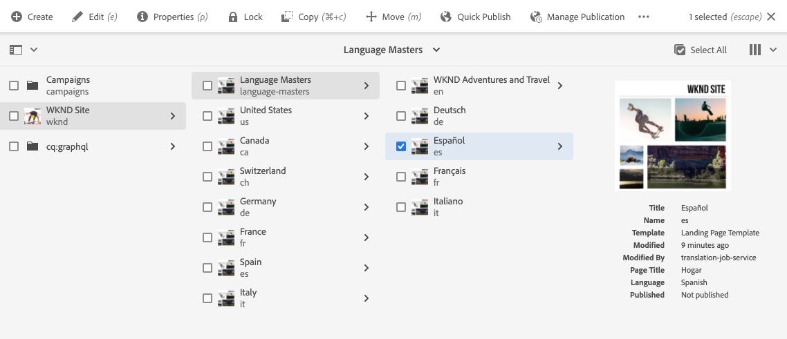
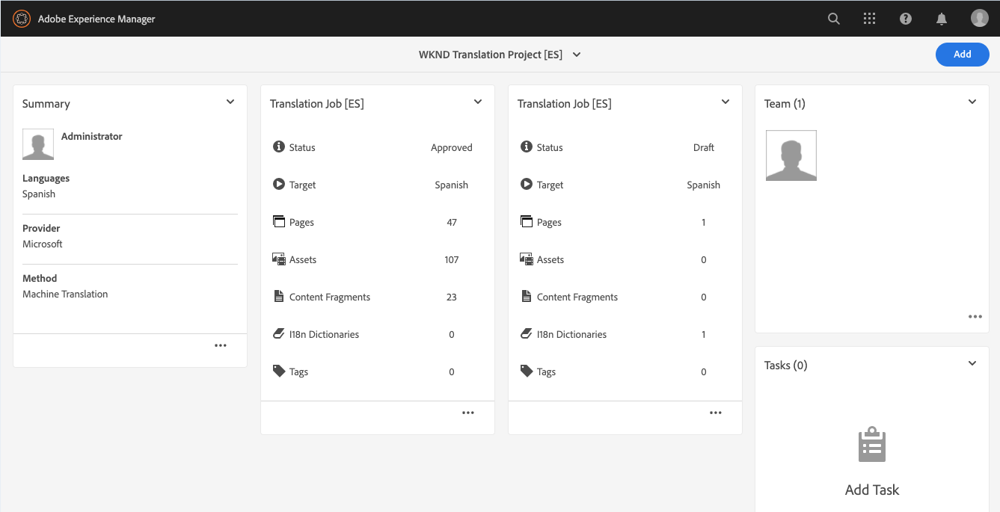
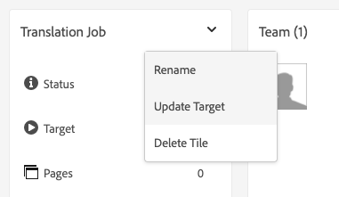

# 發佈已翻譯的內容 {#publish-content}

瞭解如何發佈翻譯的內容並在內容更新時更新翻譯。

## 到目前為止的故事 {#story-so-far}

在AEM Sites的前期翻譯過程中， [翻譯內容，](configure-connector.md) 您學習了如何使AEM用翻譯項目來翻譯您的內容。 您現在應該：

* 瞭解翻譯項目是什麼。
* 能夠建立新的翻譯項目。
* 使用翻譯項目來翻譯您的內容。

現在您的初始翻譯已完成，本文將引導您完成發佈該內容的下一步，以及在語言根中的基礎內容發生更改時如何更新翻譯。

## 目標 {#objective}

本文檔幫助您瞭解如何在中發佈內AEM容，以及如何建立連續的工作流，使翻譯保持最新。 閱讀此文檔後，您應：

* 瞭解的作者發佈模AEM型。
* 瞭解如何發佈已翻譯的內容。
* 能夠為翻譯的內容實施持續更新模型。

## 作AEM者發佈模型 {#author-publish}

在發佈內容之前，理解作者發佈模AEM式是個好主意。 簡化後，AEM將系統用戶分為兩組。

1. 建立和管理內容和系統的人員
1. 從系統中消費內容的人

因AEM此被物理地分為兩個實例。

1. 的 **作者** 實例是內容作者和管理員在其中建立和管理內容的系統。
1. 的 **發佈** 實例是將內容提供給使用者的系統。

在作者實例上建立內容後，必須將其傳輸到發佈實例，以便其可供使用。 調用從作者到發佈的轉移過程 **出版**。

## 發佈已翻譯的內容 {#publishing}

一旦您對已翻譯內容的狀態感到滿意，就必須發佈該內容，以便能夠訪問和使用它。 此任務通常不由翻譯專家負責，但此處記錄以說明整個工作流。

>[!NOTE]
>
>通常，當翻譯完成時，翻譯專家通知內容所有者翻譯已準備好發佈。 然後內容所有者會發佈這些內容。
>
>為實現完整性，提供了以下步驟。

發佈翻譯的最簡單方法是導航到項目資料夾。

```text
/content/<your-project>/
```

在此路徑下，您擁有每個翻譯語言的子資料夾，並可以選擇要發佈的子資料夾。

1. 轉到 **導航** -> **站點** -> **檔案** 開啟項目資料夾。
1. 此處顯示語言根資料夾和所有其他語言資料夾。 選擇要發佈的本地化語言或語言。
   
1. 點擊或按一下 **管理發布**。
1. 在 **管理發布** 窗口，確保 **發佈** 自動選擇 **操作** 還有 **現在** 在 **計畫**。 點擊或按一下 **下一個**。
   
1. 下一個 **管理發布** 的子菜單。 點擊或按一下 **發佈**。
   
1. 在AEM螢幕底部使用彈出消息確認發佈操作。
   

您的翻譯內容現在已發佈！ 現在可以訪問和使用它。

>[!TIP]
>
>在發佈時，您可以選擇多個項目（即多語言資料夾），以便一次發佈多個翻譯。

發佈內容時還有其他選項，例如安排發佈時間，這超出了此過程的範圍。 請參閱 [其他資源](#additional-resources) 的上界。

## 更新已翻譯的內容 {#updating-translations}

翻譯很少是一次性的練習。 通常，在初始翻譯完成後，內容作者會繼續在語言根目錄中添加和修改內容。 這意味著您還需要更新翻譯的內容。

特定的項目要求定義您在執行更新之前需要更新翻譯的頻率以及遵循的決策流程。 一旦您決定更新翻譯，中的過程AEM就非常簡單。 由於初始翻譯是基於翻譯項目，因此任何更新也是如此。

但是，與以前一樣，如果您選擇自動建立翻譯項目或手動建立翻譯項目，則流程會略有不同。

### 更新自動建立的翻譯項目 {#updating-automatic-project}

1. 導航到 **導航** -> **資產** -> **檔案**。 記住中的內AEM容儲存在 `/content`。
1. 選擇項目的語言根。 在此情況下，我們選擇 `/content/wknd/en`。
1. 點擊或按一下滑軌選擇器並顯示 **引用** 的子菜單。
1. 點擊或按一下 **語言副本**。
1. 檢查 **語言副本** 複選框。
1. 展開該部分 **更新語言副本** 的下界。
1. 在 **項目** 下拉清單，選擇 **添加到現有翻譯項目**。
1. 在 **現有翻譯項目** 下拉清單，選擇為初始轉換建立的項目。
1. 點擊或按一下 **更新**。


內容將添加到現有翻譯項目。 要查看翻譯項目，請執行以下操作：

1. 導航到 **導航** -> **項目**。
1. 點擊或按一下您剛剛更新的項目。
1. 點擊或按一下所更新的語言或其中一種語言。

您看到項目中添加了新的工作卡。 在此示例中，添加了另一個西班牙語翻譯。



您可能會注意到新卡上列出的統計資訊不同。 這是因AEM為可識別自上次翻譯後發生的更改，並且僅包括需要翻譯的內容。 這包括更新內容的重新翻譯以及新內容的首次翻譯。

從這一點上，你 [開始並管理您的翻譯工作，就像您完成原稿一樣。](translate-content.md#using-translation-project)

### 更新手動建立的翻譯項目 {#updating-manual-project}

要更新翻譯，您可以將新作業添加到負責翻譯更新內容的現有項目中。

1. 導航到 **導航** -> **項目**。
1. 點擊或按一下需要更新的項目。
1. 點擊或按一下 **添加** 按鈕。
1. 在 **添加磁貼** 按一下或按一下 **翻譯作業** 然後 **提交**。

   

1. 在新翻譯作業的卡上，點擊或按一下卡頂部的Chevron按鈕，然後選擇 **更新目標** 定義新作業的目標語言。

   

1. 在 **選擇目標語言** 對話框，使用下拉框選擇語言，然後點擊或按一下 **完成**。

   

1. 設定新翻譯作業的目標語言後，點擊或按一下作業卡底部的省略號按鈕以查看作業的詳細資訊。
1. 首次建立作業時該作業為空。 按一下或按一下 **添加** 按鈕並使用路徑瀏覽器 [就像您最初建立翻譯項目時一樣。](translate-content.md##manually-creating)

>[!TIP]
>
>路徑瀏覽器的強大篩選器再次可用於僅查找已更新的內容。
>
>您可以在 [其他資源部分。](#additional-resources)

從這一點上，你 [開始並管理您的翻譯工作，就像您完成原稿一樣。](translate-content.md#using-translation-project)

## 旅程結束？ {#end-of-journey}

恭喜！ 你完成了AEM Sites翻譯之旅！ 您現在應該：

* 瞭解基本的內AEM容管理功能。
* 了AEM解翻譯功能及其與網站內容的關聯。
* 能夠開始翻譯您自己的內容。

您現在已準備好在中翻譯您自己的內AEM容。 但是AEM它是一個功能強大的工具，並有許多其他選項可供選擇。 簽出中的某些可用額外資源 [「其他資源」部分](#additional-resources) 瞭解您在此過程中看到的功能。

## 其他資源 {#additional-resources}

* [管理翻譯項目](/help/sites-cloud/administering/translation/managing-projects.md)  — 瞭解翻譯項目和其他功能的詳細資訊，如人工翻譯工作流和多語言項目。
* [創作概念](/help/sites-cloud/authoring/getting-started/concepts.md)  — 詳細瞭解作者和發佈AEM模型。 此文檔側重於創作頁面，而不是內容片段，但該理論仍然適用。
* [發佈頁面](/help/sites-cloud/authoring/fundamentals/publishing-pages.md)  — 瞭解發佈內容時可用的其他功能。 此文檔側重於創作頁面，而不是內容片段，但該理論仍然適用。
* [創作環境和工具](/help/sites-cloud/authoring/fundamentals/environment-tools.md##path-selection)  — 提供AEM各種組織和編輯內容的機制，包括強健的路徑瀏覽器。
