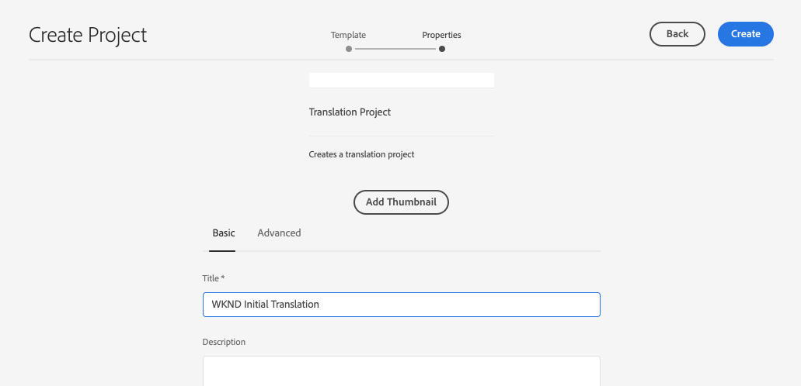

# 翻譯內容 {#translate-content}

使用翻譯連接器和規則來翻譯您的內容。

## 目前進度 {#story-so-far}

在 AEM Sites 翻譯歷程的上一份文件「[設定翻譯規則](translation-rules.md)」中，您已了解如何使用 AEM 的翻譯規則來識別您的翻譯內容。您現在應該：

* 了解翻譯規則的作用。
* 能夠定義您自己的翻譯規則。

現在您的連接器已設定，本文將帶您完成翻譯 AEM Sites 內容的下一步。

## 目標 {#objective}

此文件協助您了解如何使用 AEM 翻譯專案搭配連接器及您的翻譯規則來翻譯內容。閱讀本文件後，您應該：

* 了解什麼是翻譯專案。
* 能夠建立新的翻譯專案。
* 使用翻譯專案來翻譯您的 AEM Sites 內容。

## 建立翻譯專案 {#creating-translation-project}

翻譯專案使您能夠管理 AEM 內容的翻譯。翻譯專案將要翻譯的內容集中在一個位置，以便集中檢視翻譯工作。

將內容新增到翻譯專案時，會為其建立翻譯工作。工作會提供相關命令和狀態資訊，您可用來管理在資源上執行的人工翻譯和機器翻譯工作流程。

翻譯專案有兩種建立方法：

1. 選擇內容的語言根，讓 AEM 根據內容路徑自動建立翻譯專案。
1. 建立空白專案並手動選擇要新增至翻譯專案的內容

兩種都是有效的方法，通常只是根據執行翻譯的角色而不同：

* 翻譯專案經理 (TPM) 通常需要靈活地手動選擇翻譯專案的內容。
* 如果內容所有者也負責翻譯，讓 AEM 根據所選的內容路徑自動建立專案通常是更輕鬆的方法。

以下各節將探討這兩種方法。

### 根據內容路徑自動建立翻譯專案 {#automatically-creating}

對於同時負責翻譯的內容所有者，通常更輕鬆的方法是讓 AEM 自動建立翻譯專案。若要 AEM 根據內容路徑自動建立翻譯專案：

1. 導覽至「**導覽**」>「**網站**」並選擇您的專案。
1. 找到您的專案的語言根。例如，如果您的語言根是英語，`/content/<your-project>/en`。
   * 在第一次翻譯之前，其他語言資料夾是空白預留位置。這些通常由內容架構者建立的。
1. 找到您的專案的語言根。
1. 選取邊欄選擇器並顯示「**參考**」面板。
1. 選取「**語言副本**」。
1. 勾選&#x200B;**語言副本**&#x200B;核取方塊。
1. 展開參考面板底部的&#x200B;**更新語言副本**&#x200B;區段。
1. 在「**專案**」下拉式清單中，選取「**建立翻譯專案**」。
1. 為您的翻譯專案提供一個合適的標題。
1. 選取「**更新**」。


您會收到一條訊息，指出專案已建立。

>[!NOTE]
>
>假設已經為翻譯語言建立了必要的語言結構，做為[內容結構定義的一部分。](getting-started.md#content-structure)這應該與內容架構師協力完成。
>
>如果未先建立語言資料夾，您將無法按照前述步驟建立語言副本。

### 透過選擇您的內容手動建立翻譯專案 {#manually-creating}

對於翻譯專案經理，通常需要手動選擇特定內容以包含在翻譯專案中。若要建立這樣的手動翻譯專案，您必須先建立空白專案，然後選取要加入的內容。

1. 導覽至「**導覽**」>「**專案**」。
1. 選取「**建立**」>「**資料夾**」建立專案的資料夾。
   * 這是選擇性的，但有助於組織您的翻譯工作。
1. 在「**建立專案**」視窗中，新增資料夾的「**標題**」，然後選取「**建立**」。

   

1. 選擇資料夾以開啟該資料夾。
1. 在您的新專案資料夾中，選取「**建立**」>「**專案**」。
1. 專案是以範本為基礎。選擇「**翻譯專案**」範本來選取範本，然後選取「**下一步**」。

   

1. 在&#x200B;**基本**&#x200B;索引標籤上，輸入新專案的名稱。

   

1. 在「**進階**」標籤上，使用「**目標語言**」下拉式清單選取您的內容應翻譯成的語言。選取「**建立**」。

   

1. 在確認對話框中選取「**開啟**」。

   

專案已建立，但未包含要翻譯的內容。下一節將詳細介紹專案的結構以及加入內容的方式。

## 使用翻譯專案 {#using-translation-project}

翻譯專案旨在將與翻譯工作相關的所有內容和任務集中在一個地方，使您的翻譯變得簡單且易於管理。

若要檢視翻譯專案：

1. 導覽至「**導覽**」>「**專案**」。
1. 選取在上一個區段建立的專案 (「[根據內容路徑自動建立翻譯專案](#automatically-creating)」或「[透過選擇您的內容手動建立翻譯專案](#manually-creating)」，視您的情況而定)。


專案分隔成多個卡片。

* **摘要** - 這張卡片顯示專案的基本標頭資訊，包括所有者、語言和翻譯提供者。
* **翻譯工作** - 這張或這些卡片顯示實際翻譯工作的概觀，包括狀態、資產數量等。通常，每種語言都有一個工作，工作名稱後面附加了 ISO-2 語言代碼。
   * 當[自動建立翻譯工作時，](#automatically-creating) AEM 以非同步方式建立工作，它們可能不會立即出現在專案中。
* **團隊** - 這張卡片顯示協力執行此翻譯專案的使用者。此歷程不涵蓋此主題。
* **任務** - 與翻譯內容相關的其他任務，例如待辦事項或工作流程項目。此歷程不涵蓋此主題。

為了更好地理解 AEM 中的翻譯流程，變更一項專案設定很有幫助。生產翻譯不需要此步驟，但有助於理解該過程。

1. 在「**摘要**」卡上，選取卡片底部的省略號按鈕。
1. 在「**進階**」標籤上，取消勾取選項「**促銷活動後刪除啟動**」。

   

1. 選取「**儲存並關閉**」。

現在您已準備好使用您的翻譯專案。翻譯專案的使用方式取決於翻譯專案的建立方式：由 AEM 自動建立或手動建立。

### 使用自動建立的翻譯專案 {#using-automatic-project}

自動建立翻譯專案時，AEM 會根據您先前定義的翻譯規則評估您選擇的路徑下的內容。根據評估結果，它將需要翻譯的內容擷取到新的翻譯專案中。

若要查看此專案包含之內容的詳細資料：

1. 選取「**翻譯工作**」卡片底部的省略號按鈕。
1. **翻譯工作**&#x200B;視窗列出工作的所有項目。

   

1. 選取某行來查看該行的詳細資料，請記住一行可能代表多個要翻譯的內容項目。
1. 選取條列項目的選取核取方塊以查看更多選項，例如將項目從工作中刪除，或在Sites 主控台中查看項目。

   

通常，翻譯工作的內容從「**草稿**」狀態開始，如「**狀態**」欄 (在「**翻譯工作**」視窗) 所示。

若要開始翻譯工作，請返回翻譯專案概觀，並選取「**翻譯工作**」卡片頂端的 > 形按鈕，然後選取「**開始**」。


AEM 現在與您的翻譯設定和連接器通訊，以將內容傳送到翻譯服務。您可以返回&#x200B;**翻譯工作**&#x200B;視窗並檢視項目的&#x200B;**狀態**&#x200B;欄，來檢視翻譯進度。


機器翻譯會自動傳回且狀態為&#x200B;**核准**。人工翻譯允許更多互動，但不在本歷程的討論範圍內。

>[!TIP]
>
>處理翻譯工作可能需要一些時間，您可能會看到翻譯項目的狀態從「**草稿**」到「**翻譯進行中**」再到「**可供審核**」，最後到達「**已核准**」。這是預期發生的事。

>[!NOTE]
>
>如果您沒有停用專案選項「**促銷活動後刪除啟動**」，如同[在上一區段所述](#using-translation-project)，則翻譯的項目將出現「**已刪除**」狀態。這是正常現象，因為翻譯項目到達後，AEM 會自動丟棄翻譯記錄。已翻譯的項目已匯入為語言副本，僅刪除不再需要的翻譯記錄。
>
>如果不清楚，請不要擔心。這些是 AEM 運作原理的細節，不會影響您對歷程的理解。如果您想深入了解 AEM 如何處理翻譯，請參閱本文章結尾處的「[其他資源](#additional-resources)」區段。

### 使用手動建立的翻譯專案 {#using-manual-project}

手動建立翻譯專案時，AEM 會建立必要的工作，但不會自動選擇要包含在這些工作中的任何內容。這使翻譯專案經理可以靈活地挑選要翻譯的內容。

若要將內容新增到翻譯工作中：

1. 選取其中一張「**翻譯工作**」卡片底部的省略號按鈕。
1. 看到工作未包含任何內容。選取視窗頂端的「**新增**」按鈕和下拉式選單中的「**資產/頁面**」。

   

1. 路徑瀏覽器開啟，讓您可明確選取要新增的內容。找到您的內容並「選取」進行選擇。

   

1. 選取「**選取**」將所選內容新增到工作中。
1. 在「**翻譯**」對話框中，指定您想要「**建立語言副本**」。

   

1. 內容現在包含在工作中。

   

1. 選取條列項目的選取核取方塊以查看更多選項，例如將項目從工作中刪除，或在Sites 主控台中查看項目。

   

1. 重複這些步驟以將所有必要的內容加入到工作中。

>[!TIP]
>
>路徑瀏覽器是功能強大的工具，可讓您搜尋、篩選和導覽您的內容。選取「**僅內容/篩選器**」按鈕以切換側面板並顯示進階篩選器，例如「**修改日期**」或「**翻譯狀態**」。
>
>若要進一步了解路徑瀏覽器，請參閱[其他資源章節](#additional-resources)。

您可以使用前述步驟將必要的內容新增至專案的所有語言 (工作) 中。選取所有內容後，您可以開始翻譯。

通常，翻譯工作的內容從「**草稿**」狀態開始，如「**狀態**」欄 (在「**翻譯工作**」視窗) 所示。

若要開始翻譯工作，請返回翻譯專案概觀，並選取「**翻譯工作**」卡片頂端的 > 形按鈕，然後選取「**開始**」。


AEM 現在與您的翻譯設定和連接器通訊，以將內容傳送到翻譯服務。您可以返回&#x200B;**翻譯工作**&#x200B;視窗並檢視項目的&#x200B;**狀態**&#x200B;欄，來檢視翻譯進度。


機器翻譯會自動傳回且狀態為&#x200B;**核准**。人工翻譯允許更多互動，但不在本歷程的討論範圍內。

>[!TIP]
>
>處理翻譯工作可能需要一些時間，您可能會看到翻譯項目的狀態從「**草稿**」到「**翻譯進行中**」再到「**可供審核**」，最後到達「**已核准**」。這是預期發生的事。

>[!NOTE]
>
>如果您沒有停用專案選項「**促銷活動後刪除啟動**」，如同[在上一區段所述](#using-translation-project)，則翻譯的項目將出現「**已刪除**」狀態。這是正常現象，因為翻譯項目到達後，AEM 會自動丟棄翻譯記錄。已翻譯的項目已匯入為語言副本，僅刪除不再需要的翻譯記錄。
>
>如果不清楚，請不要擔心。這些是 AEM 運作原理的細節，不會影響您對歷程的理解。如果您想深入了解 AEM 如何處理翻譯，請參閱本文章結尾處的「[其他資源](#additional-resources)」區段。

## 檢閱翻譯後的內容 {#reviewing}

[如前所述，](#using-translation-project)機器翻譯的內容會流回 AEM，狀態為&#x200B;**已核准**，因為已假設使用了機器翻譯，所以不需人為介入。然而，仍然可以檢閱翻譯後的內容。

只需前往已完成的翻譯工作，然後點選或按一下核取方塊來選取一個行項目。在工具列中顯示「**在 Sites 中預覽**」圖示。


選取該圖示以便在其主控台中開啟已翻譯的內容，藉此查看已翻譯內容的詳細資料。


如果您有適當的權限，您可以視需要進一步修改翻譯內容，但編輯內容不在本次歷程的討論範圍內。如需此主題的更多資訊，請參閱本文件結尾處的[其他資源](#additional-resources)章節。

專案的目的在將所有與翻譯相關的資源集中在一處以方便存取和清楚概觀。然而，正如您查看已翻譯項目之詳細資料時所見，翻譯本身會回到翻譯語言的網站資料夾中。在此範例中，該資料夾是

```text
/content/<your-project>/es
```

如果您透過「**導覽**」>「**Sites**」導覽至此資料夾，會看到已翻譯內容。


AEM 的翻譯框架從翻譯連接器接收翻譯，然後根據語言根並使用連接器提供的翻譯，自動建立內容結構。

請務必了解此內容尚未發佈，因此無法提供取用。您了解此作者-發佈結構，並了解如何在翻譯歷程的下一步發佈已翻譯的內容。

## 人工翻譯 {#human-translation}

如果您的翻譯服務提供人工翻譯，則審核流程會提供更多選項。例如，翻譯返回專案時狀態為&#x200B;**草稿**，並且必須人工審核並核准或拒絕。

人工翻譯不在此歷程的討論範圍內。如需此主題的更多資訊，請參閱本文件結尾處的[其他資源](#additional-resources)章節。然而，除了額外的核准選項之外，人工翻譯的工作流程與本歷程描述的機器翻譯相同。

## 下一步 {#what-is-next}

您已完成 AEM Sites 翻譯歷程的這個部分，您應該：

* 了解什麼是翻譯專案。
* 能夠建立新的翻譯專案。
* 使用翻譯專案來翻譯您的內容。

以此知識為基礎並繼續您的 AEM Sites 翻譯歷程，接著檢閱文件「[發佈翻譯內容](publish-content.md)」，從中了解如何發佈翻譯內容以及在您的語言根內容變更時如何更新這些翻譯。

## 其他資源 {#additional-resources}

因為我們建議您檢閱文件「[發佈翻譯內容](publish-content.md)」來繼續翻譯歷程的下個部分，所以提供以下其他選用資源，協助深入瞭解本文件提及的一些概念，但是這些並非繼續執行歷程的必要條件。

* [管理翻譯專案](/help/sites-cloud/administering/translation/managing-projects.md) - 了解翻譯專案的詳細資料和其他功能，例如人工翻譯工作流程和多語言專案。
* [製作環境和工具](/help/sites-cloud/authoring/path-selection.md#path-selection) - AEM 提供各種機制來組織和編輯您的內容，包括強大的路徑瀏覽器。
