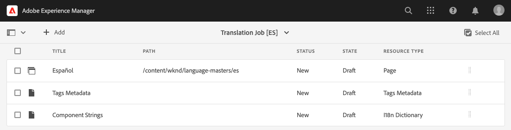

# 翻譯內容 {#translate-content}

使用翻譯連接器和規則來翻譯您的 內容。

## 到目前為止 {#story-so-far}

在AEM Sites翻譯歷程的上一個檔案中， [設定翻譯規則](translation-rules.md) 您已瞭解如何使用AEM翻譯規則來識別您的翻譯內容。 您現在應該：

* 了解翻譯規則的作用。
* 能夠定義您自己的翻譯規則。

現在您的聯結器和翻譯規則已設定完畢，本文將引導您完成翻譯AEM Sites內容的下一個步驟。

## 目標 {#objective}

本檔案可協助您瞭解如何使用AEM翻譯專案以及聯結器和您的翻譯規則來翻譯內容。 閱讀本文件後，您應該：

* 了解什麼是翻譯專案。
* 能夠建立新的翻譯專案。
* 使用翻譯專案來翻譯AEM Sites內容。

## 建立翻譯專案 {#creating-translation-project}

翻譯專案使您能夠管理 AEM 內容的翻譯。翻譯專案會將要翻譯的內容收集到一個位置，以便集中檢視翻譯工作。

將內容新增到翻譯專案時，會為其建立翻譯工作。工作會提供相關命令和狀態資訊，您可用來管理在資源上執行的人工翻譯和機器翻譯工作流程。

翻譯專案有兩種建立方法：

1. 選擇內容的語言根，讓 AEM 根據內容路徑自動建立翻譯專案。
1. 建立空白專案並手動選擇要新增至翻譯專案的內容

兩種都是有效的方法，通常只是根據執行翻譯的角色而不同：

* 翻譯專案經理 (TPM) 通常需要靈活地手動選擇翻譯專案的內容。
* 如果內容所有者也負責翻譯，讓 AEM 根據所選的內容路徑自動建立專案通常是更輕鬆的方法。

以下各節將探討這兩種方法。

### 根據內容路徑自動建立翻譯專案 {#automatically-creating}

對於同時負責翻譯的內容所有者，通常更輕鬆的方法是讓 AEM 自動建立翻譯專案。若要 AEM 根據內容路徑自動建立翻譯專案：

1. 瀏覽至 **導覽** -> **網站** 然後點選或按一下您的專案。
1. 找出專案的語言根目錄。 例如，如果語言根是英文， `/content/<your-project>/en`.
   * 請注意，在第一次翻譯之前，其他語言資料夾是空的預留位置。 這些通常由內容架構者建立。
1. 找出專案的語言根目錄。
1. 點選或按一下邊欄選擇器並顯示&#x200B;**參考**&#x200B;面板。
1. 點選或按一下 **語言副本**.
1. 勾選&#x200B;**語言副本**&#x200B;核取方塊。
1. 展開參考面板底部的 **更新語言副本**&#x200B;區段。
1. 在&#x200B;**專案**&#x200B;下拉選單中，選擇&#x200B;**建立翻譯專案**。
1. 為您的翻譯專案提供一個合適的標題。
1. 點選或按一下 **更新**.


您會收到一條訊息，指出專案已建立。

>[!NOTE]
>
>假設已經為翻譯語言建立了必要的語言結構，做為[內容結構定義的一部分。](getting-started.md#content-structure)這應該與內容架構師協力完成。
>
>如果未先建立語言資料夾，您將無法按照前述步驟建立語言副本。

### 透過選擇您的內容手動建立翻譯專案 {#manually-creating}

對於翻譯專案經理，通常需要手動選擇特定內容以包含在翻譯專案中。若要建立這樣的手動翻譯專案，您必須先建立空白專案，然後選取要加入的內容。

1. 導覽至&#x200B;**導覽**-> **專案**。
1. 點選或按一下&#x200B;**建立** -> **資料夾** 為專案建立資料夾。
   * 這是選擇性的，但有助於組織您的翻譯工作。
1. 在&#x200B;**建立專案**&#x200B;視窗中，新增資料夾的&#x200B;**標題**，然後點選或按一下&#x200B;**建立**。

   

1. 點選或按一下資料夾以開啟資料夾。
1. 在您的新專案資料夾中，點選或按一下&#x200B;**建立** -> **專案**。
1. 專案是以範本為基礎。點選或按一下&#x200B;**翻譯專案**&#x200B;範本加以選取，然後點選或按一下&#x200B;**下一步**。

   

1. 在&#x200B;**基本**&#x200B;索引標籤上，輸入新專案的名稱。

   

1. 在&#x200B;**進階**&#x200B;索引標籤上，使用&#x200B;**目標語言**&#x200B;下拉選單選擇您的內容應翻譯成的語言。點選或按一下&#x200B;**建立**。

   

1. 點選或按一下確認對話框中的&#x200B;**開啟**。

   

專案已建立，但未包含要翻譯的內容。下一節將詳細介紹專案的結構以及加入內容的方式。

## 使用翻譯專案 {#using-translation-project}

翻譯專案旨在將與翻譯工作相關的所有內容和任務集中在一個地方，使您的翻譯變得簡單且易於管理。

若要檢視翻譯專案：

1. 導覽至&#x200B;**導覽** -> **專案**。
1. 點選或按一下在上一個區段中建立的專案(依序為 [根據內容路徑自動建立翻譯專案](#automatically-creating) 或 [選取您的內容，手動建立翻譯專案](#manually-creating) 視您的情況而定)。


專案分隔成多個卡片。

* **摘要** - 這張卡片顯示專案的基本標頭資訊，包括所有者、語言和翻譯提供者。
* **翻譯工作** - 這張或這些卡片顯示了實際翻譯工作的概觀，包括狀態、資產數量等。通常，每種語言都有一個工作，工作名稱後面附加了 ISO-2 語言代碼。
   * 請注意，當 [自動建立翻譯工作，](#automatically-creating) AEM會以非同步方式建立作業，且這些作業可能不會立即出現在專案中。
* **團隊** - 這張卡片顯示協力執行此翻譯專案的使用者。此歷程不涵蓋此主題。
* **任務** - 與翻譯內容相關的其他任務，例如待辦事項或工作流程項目。此歷程不涵蓋此主題。

若要更清楚瞭解AEM的翻譯流程，專案設定的一項變更相當實用。 生產翻譯不需要此步驟，但有助於瞭解此程式。

1. 在 **摘要** 卡片，點選或按一下卡片底部的省略符號按鈕。
1. 在 **進階** 索引標籤，取消核取選項 **促銷活動後刪除啟動項**.

   

1. 點選或按一下&#x200B;**儲存並關閉**。

現在您已準備好使用您的翻譯專案。 翻譯專案的使用方式取決於翻譯專案的建立方式：由 AEM 自動建立或手動建立。

### 使用自動建立的翻譯專案 {#using-automatic-project}

自動建立翻譯專案時，AEM會根據您先前定義的翻譯規則，評估所選路徑下的內容。 根據評估結果，它將需要翻譯的內容擷取到新的翻譯專案中。

若要查看此專案包含之 內容的詳細資料：

1. 點選或按一下底部的省略符號按鈕 **翻譯工作** 卡片。
1. **翻譯工作**&#x200B;視窗列出工作的所有項目。

   

1. 點選或按一下某行以查看該行的詳細資料，請記住一行可能代表多個要翻譯的內容項目。
1. 點選或按一下條列專案的選取核取方塊，以檢視更多選項，例如，從工作中刪除條列或在Sites Console中檢視條的選項。

   

通常，翻譯工作的內容從&#x200B;**草稿**&#x200B;狀態開始，如&#x200B;**翻譯工作**&#x200B;視窗中的&#x200B;**狀態**&#x200B;欄所表示。

若要開始翻譯工作，請返回翻譯專案概觀，並點選或按一下&#x200B;**翻譯工作**&#x200B;卡片頂端的 > 形按鈕，然後選擇&#x200B;**開始**。


AEM 現在與您的翻譯設定和連接器通訊，以將內容傳送到翻譯服務。您可以返回&#x200B;**翻譯工作**&#x200B;視窗並檢視項目的&#x200B;**狀態**&#x200B;欄，來檢視翻譯進度。


機器翻譯會自動傳回且狀態為&#x200B;**核准**。人工翻譯允許更多互動，但不在本歷程的討論範圍內。

>[!TIP]
>
>處理翻譯工作可能需要一些時間，您可能會看到翻譯專案從以下狀態移動 **草稿** 至 **翻譯進行中** 至 **準備好審查** 在他們到達之前 **已核准** 州別。 這是正常現象。

>[!NOTE]
>
>如果您未停用專案選項 **促銷活動後刪除啟動項** 作為 [如上一節所述，](#using-translation-project) 已翻譯的專案將會顯示為 **已刪除** 州別。 這是正常的，因為一旦翻譯專案送達，AEM就會自動捨棄翻譯記錄。 已將翻譯專案匯入為語言副本，僅刪除翻譯記錄，因為不再需要這些記錄。
>
>如果不清楚，請不要擔心。 這些是AEM運作方式的深入細節，不會影響您對歷程的理解。 如果您想深入瞭解AEM處理翻譯的方式，請參閱 [其他資源](#additional-resources) 區段。

### 使用手動建立的翻譯專案 {#using-manual-project}

手動建立翻譯專案時，AEM會建立必要的作業，但不會自動選取要包含在這些作業中的任何內容。 這使翻譯專案經理可以靈活地挑選要翻譯的內容。

若要將內容新增到翻譯工作中：

1. 點選或按一下其中一張&#x200B;**翻譯工作**&#x200B;卡片底部的省略符號按鈕。
1. 看到工作未包含任何內容。依序點選或按一下視窗頂端的&#x200B;**新增**&#x200B;按鈕和下拉選單中的&#x200B;**資產/頁面**。

   

1. 路徑瀏覽器開啟，讓您可明確選取要新增的內容。找到您的內容，然後點選或按一下以選取。

   

1. 點選或按一下&#x200B;**選取**&#x200B;將所選內容新增到工作中。
1. 在&#x200B;**翻譯**&#x200B;對話框中，指定您想要&#x200B;**建立語言副本**。

   

1. 內容現在包含在工作中。

   

1. 點選或按一下條列專案的選取核取方塊，以檢視更多選項，例如，從工作中刪除條列或在Sites Console中檢視條的選項。

   

1. 重複這些步驟以將所有必要的內容加入到工作中。

>[!TIP]
>
>路徑瀏覽器是功能強大的工具，可讓您搜尋、篩選和導覽您的內容。點選或按一下&#x200B;**僅內容/篩選器**&#x200B;按鈕以切換側面板並顯示進階篩選器，例如&#x200B;**修改日期**&#x200B;或&#x200B;**翻譯狀態**。
>
>若要進一步了解路徑瀏覽器，請參閱[其他資源章節](#additional-resources)

您可以使用前述步驟將必要的內容新增至專案的所有語言 (工作) 中。選取所有內容後，您可以開始翻譯。

通常，翻譯工作的內容從&#x200B;**草稿**&#x200B;狀態開始，如&#x200B;**翻譯工作**&#x200B;視窗中的&#x200B;**狀態**&#x200B;欄所表示。

若要開始翻譯工作，請返回翻譯專案概觀，並點選或按一下&#x200B;**翻譯工作**&#x200B;卡片頂端的 > 形按鈕，然後選擇&#x200B;**開始**。


AEM 現在與您的翻譯設定和連接器通訊，以將內容傳送到翻譯服務。您可以返回&#x200B;**翻譯工作**&#x200B;視窗並檢視項目的&#x200B;**狀態**&#x200B;欄，來檢視翻譯進度。


機器翻譯會自動傳回且狀態為&#x200B;**核准**。人工翻譯允許更多互動，但不在本歷程的討論範圍內。

>[!TIP]
>
>處理翻譯工作可能需要一些時間，您可能會看到翻譯專案從以下狀態移動 **草稿** 至 **翻譯進行中** 至 **準備好審查** 在他們到達之前 **已核准** 州別。 這是正常現象。

>[!NOTE]
>
>如果您未停用專案選項 **促銷活動後刪除啟動項** 作為 [如上一節所述，](#using-translation-project) 已翻譯的專案將會顯示為 **已刪除** 州別。 這是正常的，因為一旦翻譯專案送達，AEM就會自動捨棄翻譯記錄。 已將翻譯專案匯入為語言副本，僅刪除翻譯記錄，因為不再需要這些記錄。
>
>如果不清楚，請不要擔心。 這些是AEM運作方式的深入細節，不會影響您對歷程的理解。 如果您想深入瞭解AEM處理翻譯的方式，請參閱 [其他資源](#additional-resources) 區段。

## 檢閱翻譯後的內容 {#reviewing}

[如前所述，](#using-translation-project)機器翻譯的內容會流回 AEM，狀態為&#x200B;**已核准**，因為已假設使用了機器翻譯，所以不需人為介入。然而，當然仍然可以檢閱翻譯後的內容。

只需前往已完成的翻譯工作，然後點選或按一下核取方塊來選取一個行項目。圖示 **在網站中預覽** 會顯示在工具列中。


點選或按一下該圖示可在其主控台中開啟翻譯內容，以檢視翻譯內容的詳細資訊。


如果您有適當的許可權，可以進一步修改必要的翻譯內容，但編輯內容超出了此歷程的範圍。 如需此主題的更多資訊，請參閱本文件結尾處的[其他資源](#additional-resources)章節。

專案的目的在將所有與翻譯相關的資源集中在一處以方便存取和清楚概覽。不過，如您檢視已翻譯專案的詳細資訊所見，翻譯本身會流回翻譯語言的網站資料夾。 在此範例中，資料夾是

```text
/content/<your-project>/es
```

如果您透過瀏覽至此資料夾： **導覽** -> **網站**，您會看到翻譯的內容。


AEM 的翻譯框架從翻譯連接器接收翻譯，然後根據語言根並使用連接器提供的翻譯，自動建立內容結構。

請務必瞭解此內容未發佈，因此無法供使用。 您將瞭解此製作 — 發佈結構，並瞭解如何在翻譯歷程的下一個步驟中發佈我們的已翻譯內容。

## 人工翻譯 {#human-translation}

如果您的翻譯服務提供人工翻譯，則審核流程會提供更多選項。例如，翻譯返回專案時狀態為&#x200B;**草稿**，並且必須人工審核並核准或拒絕。

人工翻譯不在此歷程的討論範圍內。如需此主題的更多資訊，請參閱本文件結尾處的[其他資源](#additional-resources)章節。然而，除了額外的核准選項之外，人工翻譯的工作流程與本歷程描述的機器翻譯相同。

## 下一步 {#what-is-next}

現在您已完成AEM Sites翻譯歷程的這一部分，您應：

* 了解什麼是翻譯專案。
* 能夠建立新的翻譯專案。
* 使用翻譯專案來翻譯您的 內容。

在此基礎上繼續您的AEM Sites翻譯歷程，接下來檢閱檔案 [發佈翻譯的內容](publish-content.md) 您可在其中瞭解如何發佈翻譯內容，以及如何在語言根內容變更時更新這些翻譯。

## 其他資源 {#additional-resources}

雖然建議您查閱文件[發佈已翻譯內容](publish-content.md)來繼續 翻譯歷程的下個部分，以下也有一些其他選擇性資源，在深入探究本文件提到的一些概念，但不是繼續 歷程的必要條件。

* [管理翻譯專案](/help/sites-cloud/administering/translation/managing-projects.md) - 了解翻譯專案的詳細資料和其他功能，例如人工翻譯工作流程和多語言專案。
* [編寫環境和工具](/help/sites-cloud/authoring/fundamentals/environment-tools.md##path-selection) - AEM 提供各種機制來組織和編輯您的內容，包括強大的路徑瀏覽器。
