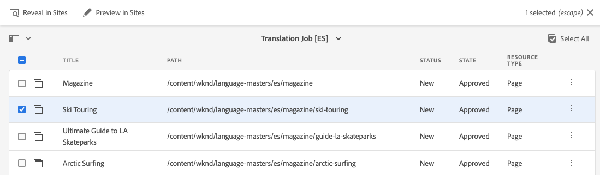

# 翻譯內容 {#translate-content}

使用翻譯連接器和規則來翻譯您的內容。

## 迄今為止的故事 {#story-so-far}

在AEM Sites翻譯歷程的上一份檔案中，您學習了如何使用AEM翻譯規則來識別翻譯內容。 [](translation-rules.md)您現在應該：

* 了解翻譯規則的功用。
* 可定義您自己的翻譯規則。

現在已設定連接器和翻譯規則，本文將帶您完成轉譯AEM Sites內容的下一步。

## 目標 {#objective}

本檔案可協助您了解如何使用AEM翻譯專案以及連接器和翻譯規則來翻譯內容。 閱讀本檔案後，您應：

* 了解翻譯專案是什麼。
* 能夠建立新的翻譯專案。
* 使用翻譯專案來翻譯您的AEM Sites內容。

## 建立翻譯專案 {#creating-translation-project}

翻譯專案可讓您管理AEM內容的翻譯。 翻譯專案會收集要在一個位置翻譯的內容，以集中檢視翻譯工作。

將內容新增至翻譯專案時，會為其建立翻譯工作。 作業提供命令和狀態資訊，用於管理在資源上執行的人工翻譯和機器翻譯工作流。

翻譯專案可透過兩種方式建立：

1. 選取內容的語言根目錄，並讓AEM根據內容路徑自動建立翻譯專案。
1. 建立空白專案，並手動選取要新增至翻譯專案的內容

這兩種有效方法通常都只會因執行翻譯的角色而異：

* 翻譯項目經理(TPM)通常需要靈活地手動選擇翻譯項目的內容。
* 如果內容擁有者也負責翻譯，讓AEM根據選取的內容路徑自動建立專案通常會比較容易。

以下幾節探討了這兩種方法。

### 根據內容路徑自動建立翻譯專案 {#automatically-creating}

對於同樣負責翻譯的內容擁有者，讓AEM自動建立翻譯專案通常較為容易。 若要讓AEM根據您的內容路徑自動建立翻譯專案：

1. 導覽至&#x200B;**Navigation** -> **Sites**，然後點選或按一下您的專案。
1. 找出專案的語言根目錄。 例如，如果語言根為英文，則`/content/<your-project>/en`。
   * 請注意，在第一次翻譯之前，其他語言資料夾是空的預留位置。 這些通常由內容架構者建立。
1. 找出專案的語言根目錄。
1. 點選或按一下邊欄選取器，並顯示&#x200B;**參考**&#x200B;面板。
1. 點選或按一下「語言副本&#x200B;**」。**
1. 勾選「**語言副本**」核取方塊。
1. 展開「參考」面板底部的「更新語言副本&#x200B;**」部分。**
1. 在&#x200B;**Project**&#x200B;下拉清單中，選擇&#x200B;**建立翻譯項目**。
1. 為您的翻譯專案提供適當的標題。
1. 點選或按一下&#x200B;**更新**。


您會收到已建立專案的訊息。

>[!NOTE]
>
>假設已建立翻譯語言的必要語言結構，作為內容結構[定義的一部分。](getting-started.md#content-structure) 這應與內容架構師共同執行。
>
>如果沒有提前建立語言資料夾，您將無法如前面的步驟所述建立語言副本。

### 選取您的內容，手動建立翻譯專案 {#manually-creating}

對於翻譯專案經理，通常需要手動選取要包含在翻譯專案中的特定內容。 若要建立此類手動翻譯專案，您必須先建立空白專案，然後選取要新增的內容。

1. 導覽至&#x200B;**導覽** -> **專案**。
1. 點選或按一下&#x200B;**Create** -> **Folder**&#x200B;以建立專案的資料夾。
   * 這是可選的，但有助於組織翻譯工作。
1. 在&#x200B;**建立專案**&#x200B;視窗中，為資料夾新增&#x200B;**標題**，然後點選或按一下&#x200B;**建立**。

   

1. 點選或按一下資料夾以開啟資料夾。
1. 在新專案資料夾中，點選或按一下「**Create** -> **Project**」。
1. 專案以範本為基礎。 點選或按一下&#x200B;**翻譯專案**&#x200B;範本以選取，然後點選或按一下&#x200B;**下一步**。

   

1. 在&#x200B;**Basic**&#x200B;標籤上，輸入新專案的名稱。

   

1. 在&#x200B;**Advanced**&#x200B;標籤上，使用&#x200B;**Target語言**&#x200B;下拉式清單來選取內容應翻譯到的語言。 點選或按一下&#x200B;**建立**。

   

1. 點選或按一下確認對話方塊中的&#x200B;**開啟**。

   

專案已建立，但不含要翻譯的內容。 下一節將詳細說明專案的結構以及如何新增內容。

## 使用翻譯專案 {#using-translation-project}

翻譯項目旨在集中收集與翻譯工作相關的所有內容和任務，讓您的翻譯簡單易懂。

要查看翻譯項目，請執行以下操作：

1. 導覽至&#x200B;**導覽** -> **專案**。
1. 點選或按一下在前一節中建立的專案(「根據內容路徑自動建立翻譯專案」](#automatically-creating)或「透過選取您的內容](#manually-creating)手動建立翻譯專案」（視您的情況而定）。[[


專案分為多張卡片。

* **摘要**  — 此卡片顯示項目的基本標題資訊，包括所有者、語言和翻譯提供程式。
* **翻譯工作**  — 此卡片或這些卡片顯示的實際翻譯工作概覽，包括狀態、資產數量等。通常，每個語言都有一個作業，作業名稱中附加了ISO-2語言代碼。
   * 請注意，當[自動建立翻譯作業時，](#automatically-creating) AEM會非同步建立作業，這些作業可能不會立即顯示在專案中。
* **團隊**  — 此卡片顯示正在協作此翻譯專案的使用者。此歷程不涵蓋此主題。
* **任務**  — 與轉譯內容（如執行項目或工作流項目）相關的其他任務。此歷程不涵蓋此主題。

為了更清楚了解AEM中的翻譯流程，對專案設定進行一次變更會很實用。 生產翻譯不需要此步驟，但有助於了解此程式。

1. 在&#x200B;**摘要**&#x200B;卡片上，點選或按一下卡片底部的刪節號按鈕。
1. 在&#x200B;**Advanced**&#x200B;標籤上，取消勾選選項&#x200B;**Delete Launch After Promotion**。

   

1. 點選或按一下「**儲存並關閉**」。

現在，您已準備好使用翻譯專案。 翻譯專案的使用方式取決於其建立方式：自動或手動執行。

### 使用自動建立的翻譯專案 {#using-automatic-project}

自動建立翻譯專案時，AEM會根據您先前定義的翻譯規則，評估您選取路徑下的內容。 根據該評估，它將需要翻譯的內容提取到新的翻譯項目中。

若要查看此專案中包含內容的詳細資訊：

1. 點選或按一下&#x200B;**翻譯工作**&#x200B;卡底部的刪節號按鈕。
1. **翻譯作業**&#x200B;窗口列出作業中的所有項。

   

1. 請點選或按一下某行以查看該行的詳細資訊，同時請記住，一行可能代表要翻譯的多個內容項目。
1. 點選或按一下條列項目的選取核取方塊，以查看其他選項，例如從工作中刪除或在網站主控台中檢視它的選項。

   

通常，翻譯作業的內容在&#x200B;**草稿**&#x200B;狀態中開始，如&#x200B;**翻譯作業**&#x200B;視窗中的&#x200B;**狀態**&#x200B;欄所示。

要啟動翻譯作業，請返回翻譯項目概述，點選或按一下&#x200B;**翻譯作業**&#x200B;卡頂部的>形按鈕，然後選擇&#x200B;**開始**。


AEM現在會與您的翻譯設定和連接器通訊，以將內容傳送至翻譯服務。 通過返回&#x200B;**翻譯作業**&#x200B;窗口並查看條目的&#x200B;**狀態**&#x200B;列，可以查看翻譯的進度。


機器翻譯會自動以狀態&#x200B;**Approved**&#x200B;傳回。 人類翻譯可讓您進行更多互動，但不在此歷程的範圍內。

>[!TIP]
>
>處理翻譯工作可能需要一些時間，您可能會看到您的翻譯項目在進入&#x200B;**Approved**&#x200B;狀態之前，從&#x200B;**Draft**&#x200B;狀態移至&#x200B;**Translation in Progress**&#x200B;到&#x200B;**Ready for Review**。 這是預期中的。

>[!NOTE]
>
>如果您未將專案選項&#x200B;**「促銷後刪除啟動」(Delete Launch After Promotion**)停用為前一節中所述的[，則](#using-translation-project)翻譯的項目將會以&#x200B;**Deleted**&#x200B;狀態顯示。 這很正常，因為AEM會在翻譯項目到達時自動捨棄翻譯記錄。 翻譯的項目已作為語言副本導入，因為不再需要翻譯記錄，所以只刪除了翻譯記錄。
>
>不要擔心這不清楚。 這些是AEM運作方式的深入詳細資訊，不會影響您對歷程的了解。 如果您想要更深入了解AEM處理翻譯的方式，請參閱本文結尾的[其他資源](#additional-resources)區段。

### 使用手動建立的翻譯專案 {#using-manual-project}

手動建立翻譯專案時，AEM會建立必要的工作，但不會自動選取要納入這些工作的任何內容。 這讓翻譯專案經理能夠靈活地挑選要翻譯的內容。

要向翻譯作業添加內容，請執行以下操作：

1. 點選或按一下&#x200B;**翻譯工作**&#x200B;卡片底部的刪節號按鈕。
1. 查看該作業不包含任何內容。 點選或按一下視窗頂端的&#x200B;**新增**&#x200B;按鈕，然後從下拉式清單中點選&#x200B;**資產/頁面**。

   

1. 路徑瀏覽器隨即開啟，可讓您明確選取要新增的內容。 找出您的內容，點選或按一下以選取。

   

1. 點選或按一下「**選取** 」，將選取的內容新增至工作。
1. 在&#x200B;**Translate**&#x200B;對話方塊中，指定您要&#x200B;**Create Language Copy**。

   

1. 內容現在已包含在工作中。

   

1. 點選或按一下條列項目的選取核取方塊，以查看其他選項，例如從工作中刪除或在網站主控台中檢視它的選項。

   

1. 重複這些步驟，將所有必要內容納入工作中。

>[!TIP]
>
>路徑瀏覽器是功能強大的工具，可讓您搜尋、篩選及導覽內容。 點選或按一下「**僅內容/篩選器**」按鈕，以切換側面板並顯示進階篩選器，例如「**修改日期**」或「**翻譯狀態**」。
>
>您可以在[其他資源部分中了解有關路徑瀏覽器的更多資訊。](#additional-resources)

您可以使用前述步驟，將必要的內容新增至專案的所有語言（工作）。 選取所有內容後，即可開始翻譯。

通常，翻譯作業的內容在&#x200B;**草稿**&#x200B;狀態中開始，如&#x200B;**翻譯作業**&#x200B;視窗中的&#x200B;**狀態**&#x200B;欄所示。

要啟動翻譯作業，請返回翻譯項目概述，點選或按一下&#x200B;**翻譯作業**&#x200B;卡頂部的>形按鈕，然後選擇&#x200B;**開始**。


AEM現在會與您的翻譯設定和連接器通訊，以將內容傳送至翻譯服務。 通過返回&#x200B;**翻譯作業**&#x200B;窗口並查看條目的&#x200B;**狀態**&#x200B;列，可以查看翻譯的進度。


機器翻譯會自動以狀態&#x200B;**Approved**&#x200B;傳回。 人類翻譯可讓您進行更多互動，但不在此歷程的範圍內。

>[!TIP]
>
>處理翻譯工作可能需要一些時間，您可能會看到您的翻譯項目在進入&#x200B;**Approved**&#x200B;狀態之前，從&#x200B;**Draft**&#x200B;狀態移至&#x200B;**Translation in Progress**&#x200B;到&#x200B;**Ready for Review**。 這是預期中的。

>[!NOTE]
>
>如果您未將專案選項&#x200B;**「促銷後刪除啟動」(Delete Launch After Promotion**)停用為前一節中所述的[，則](#using-translation-project)翻譯的項目將會以&#x200B;**Deleted**&#x200B;狀態顯示。 這很正常，因為AEM會在翻譯項目到達時自動捨棄翻譯記錄。 翻譯的項目已作為語言副本導入，因為不再需要翻譯記錄，所以只刪除了翻譯記錄。
>
>不要擔心這不清楚。 這些是AEM運作方式的深入詳細資訊，不會影響您對歷程的了解。 如果您想要更深入了解AEM處理翻譯的方式，請參閱本文結尾的[其他資源](#additional-resources)區段。

## 檢閱翻譯的內容 {#reviewing}

[如先前所見，](#using-translation-project) 機器翻譯的內容會以「已核准」狀 **** 態流回AEM，因為假設是因為正在使用機器翻譯，因此不需要人為干預。不過，當然仍可以檢閱翻譯的內容。

只要前往已完成的翻譯工作，點選或按一下核取方塊以選取條列項目即可。 工具列中會顯示「在Sites中預覽」圖示&#x200B;**。**



點選或按一下該圖示，以在其主控台中開啟翻譯的內容，以查看翻譯內容的詳細資訊。


只要您擁有適當的權限，即可進一步修改必要的翻譯內容，但編輯內容不在此歷程的討論範圍內。 請參閱本檔案結尾的[其他資源](#additional-resources)一節，了解有關本主題的詳細資訊。

項目的目的是在一個地方收集與翻譯相關的所有資源，以便於訪問和清楚的概述。 但是，如您所見，透過檢視翻譯項目的詳細資訊，翻譯本身會回流至翻譯語言的網站資料夾。 在此範例中，資料夾為

```text
/content/<your-project>/es
```

如果您透過&#x200B;**Navigation** -> **Sites**&#x200B;導覽至此資料夾，您會看到翻譯的內容。


AEM翻譯框架從翻譯連接器接收翻譯，然後根據語言根並使用連接器提供的翻譯自動建立內容結構。

請務必了解此內容未發佈，因此無法供使用。 我們將了解此作者發佈結構，並了解如何在翻譯歷程的下一個步驟中發佈翻譯內容。

## 人類翻譯 {#human-translation}

如果您的翻譯服務提供人工翻譯，則審閱流程提供更多選項。 例如，翻譯以&#x200B;**Draft**&#x200B;狀態傳回專案，且必須手動審核及核准或拒絕。

人類翻譯不在本地化歷程中。 請參閱本檔案結尾的[其他資源](#additional-resources)一節，了解有關本主題的詳細資訊。 不過，除了其他核准選項，人工翻譯的工作流程與本歷程中所述的機器翻譯相同。

## 下一步 {#what-is-next}

現在您已完成AEM Sites翻譯歷程的這一部分，您應：

* 了解翻譯專案是什麼。
* 能夠建立新的翻譯專案。
* 使用翻譯專案來翻譯您的內容。

根據此知識，接下來檢閱檔案[發佈翻譯內容](publish-content.md)，繼續您的AEM Sites翻譯歷程，您將在這裡了解如何發佈翻譯內容，以及如何隨著您的語言根內容變更更新這些翻譯。

## 其他資源 {#additional-resources}

雖然建議您透過檢閱檔案[發佈翻譯內容來繼續進行翻譯歷程的下一個階段，但以下是一些額外的選用資源，可深入探討本檔案中提及的某些概念，但您不需要繼續該歷程。](publish-content.md)

* [管理翻譯專案](/help/sites-cloud/administering/translation/managing-projects.md)  — 了解翻譯專案的詳細資訊和其他功能，例如人工翻譯工作流程和多語言專案。
* [製作環境和工具](/help/sites-cloud/authoring/fundamentals/environment-tools.md##path-selection)  - AEM提供多種機制，可組織和編輯您的內容，包括強大的路徑瀏覽器。
