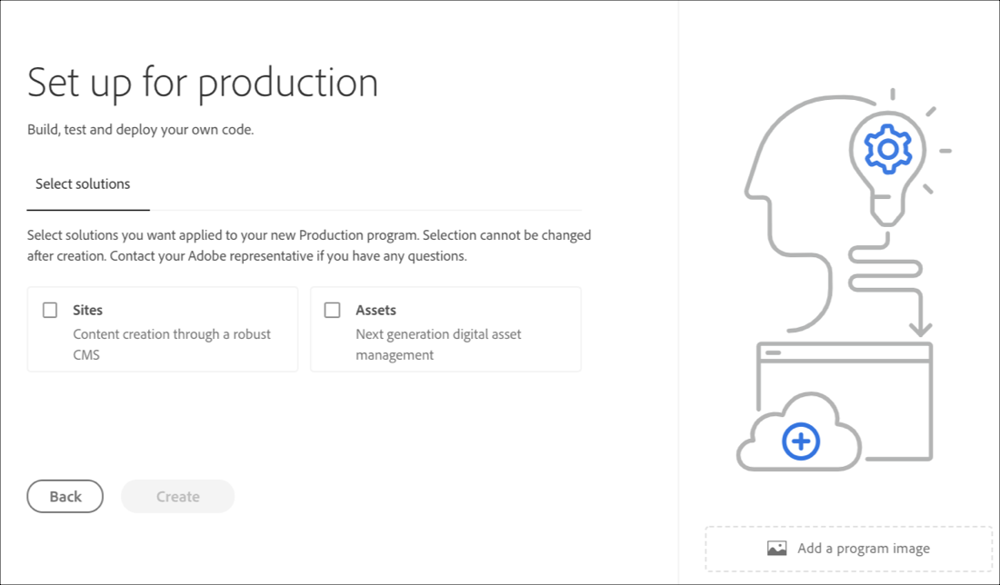

# 建立方案 {#create-a-program}

雲端原生解決方案為使用者提供必要的權限，以及在自助服務模型上建立程式的能力。

程式建立精靈會要求使用者提交詳細資訊，視使用者在特定客戶或組織可用內容範圍內建立程式的目標而定。

若是首次存取Cloud Manager或租用戶中沒有程式，使用者會看到「建立您的第 **一個程式** 」畫面。 如果使用者選 *取Esc* ，或點選對話方塊外，會顯示下列畫面：

## 使用建立程式嚮導 {#using-create-program-wizard}

根據使用者在特定客戶／組織可用項目群範圍內建立程式的目標，程式建立精靈會要求使用者提交一或多項詳細資訊。

>[!NOTE]
>If a program already exists, then you will see **Add Program** on the top right of the landing page, as shown in the figure below.

## 建立沙盒程式 {#create-demo-program}

請依照下列步驟建立沙盒程式：

1. 在建立程式嚮導中，選擇 **設定演示**。 用戶在選擇「建立」之前提交程 **序名**。

   

1. 使用者會在登陸頁面上看到新的沙盒程式卡片，並可將滑鼠指標暫留在該卡片上，以選取「雲端管理員」圖示，以導覽至「雲端管理員」概觀頁面。 卡片會通知使用者新建立的沙盒程式的自動設定狀態。 使用者將看到進展。

   

1. 在程式設定和項目建立步驟完成後，用戶可以訪問 **Manage Git** （管理Git）連結，如下圖所示：

   

   >[!NOTE]
   >
   >如要進一步瞭解如何使用Cloud Manager UI的自助服務Git帳戶管理存取和管理您的Git儲存庫，請參閱存 [取Git](/help/implementing/cloud-manager/accessing-git.md)。

1. 在建立開發環境後，使用者就可以 **存取AEM** 連結，如下圖所示：

   

1. 完成部署至開發的非生產管道後，精靈會引導使用者存取AEM（開發時）或將程式碼部署至開發環境：

   

   >[!NOTE]
   >您也可以從Cloud Manager概述頁面編輯、切換或新增程式，如下所示：

   

## 建立常規程式 {#create-regular-program}

Regular ** program是專為熟悉AEM和Cloud Manager的使用者而設計，並準備開始編寫、建立和測試程式碼，以將其部署至「生產」。

請依照下列步驟建立一般方案：

1. 在「 **建立程式」嚮導中** ，選擇「為生產設定」以建立常規程式。 用戶可以接受預設程式名或在選擇「繼續」之前對其進行 **編輯**。

   

1. 用戶將在螢幕上選擇要包含在程式中的解決方案，該螢幕將在上面螢幕後面顯示。

   >[!NOTE]
   >
   >以下畫面僅會針對已購買多個解決方案的客戶群顯示。 對於只購買一個解決方案的客戶，將不會顯示下列解決方案選擇畫面。

   

1. 選擇解決方案後，按一下「創 **建」**。

   

1. 在登陸頁面上看到您的程式卡片後，將滑鼠指標暫留在其上，以選取「Cloud Manager」圖示，以導覽至「Cloud Manager **Overview** 」頁面。

   

1. 主要的行動要求卡會引導使用者建立環境、建立非生產管道，最後是生產管道。
   

   >[!NOTE]
   >
   >A regular program does not have **Auto-setup** feature.

