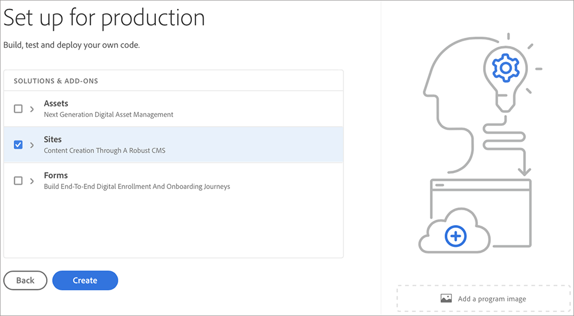

# 建立生產計畫 {#create-production-program}

*Production*&#x200B;程式適用於熟悉AEM和Cloud Manager且準備好開始編寫、建立和測試程式碼，以將程式碼部署至生產環境的使用者。

觀看兩部分教學課程影片，了解如何在Cloud Manager中建立方案：

>[!VIDEO](https://video.tv.adobe.com/v/334953)

>[!VIDEO](https://video.tv.adobe.com/v/334954)

此外，

請依照下列步驟建立生產方案：

1. 啟動Cloud Manager的登陸頁面，然後按一下畫面右上角的&#x200B;**新增方案**。

   

   >[!NOTE]
   >若要了解如何存取Cloud Manager，請參閱[Cloud Manager登陸頁面](/help/onboarding/what-is-required/navigate-to-cloud-manager.md)以取得詳細資訊。

1. 在「建立程式」嚮導中選擇「為生產設定」 **以建立生產程式。**&#x200B;用戶可以接受預設程式名或在選擇&#x200B;**Create**&#x200B;之前對其進行編輯。

   

1. 使用者會在螢幕中選取要包含在程式中的解決方案，該螢幕將呈現於上述螢幕後。 選取所需的解決方案或解決方案後，按一下「**建立**」。

   

   此外，您也可以選取&#x200B;**Sites**&#x200B;下的&#x200B;**Commerce**&#x200B;附加元件選項（如下圖所示），然後按一下&#x200B;**Create**。

   

1. 在登陸頁面上看到您的方案卡片後，將滑鼠指標暫留在該卡片上，以選取Cloud Manager圖示來導覽至Cloud Manager **概述**&#x200B;頁面。

   

1. 主要的動作呼叫卡將引導使用者建立環境、建立非生產管道，最後是生產管道。
   

   >[!NOTE]
   >生產程式沒有&#x200B;**自動設定**&#x200B;功能。
