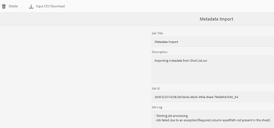
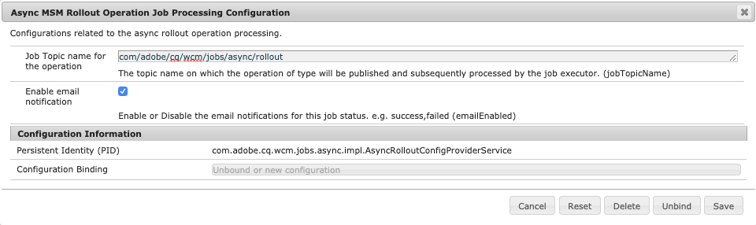

# 非同步操作 {#asynchronous-operations}

為了降低對效能的負面影響，Adobe Experience Manager會非同步處理某些長時間執行且耗用大量資源的作業。 非同步處理包括將多個作業入隊並以串列方式運行，這取決於系統資源的可用性。

這些操作包括：

* 刪除許多資產
* 移動許多資產或資產，並附上許多參照
* 大量匯出／匯入資產中繼資料
* 從遠程Experience Manager部署中提取高於閾值限制設定的資產
* 移動頁面
* 推出即時副本

您可以從「非同步作業狀態 **[!UICONTROL 」控制面板的「非同步作業狀態」控制面板查看]** Global Navigation **->** Operations **-> Jobs********** JobsStatus的狀態。

>[!NOTE]
>
>預設情況下，非同步作業並行運行。 如 *`n`* 果是CPU內核數，預設情況下， *`n/2`* 作業可以並行運行。 若要使用作業佇列的自訂設定，請從Web主控台修改 **[!UICONTROL Async Operation Default Queue Config]****和Async Operation Page Move and Rolout Config** 。
>
>如需詳細資訊，請參 [閱佇列設定](https://sling.apache.org/documentation/bundles/apache-sling-eventing-and-job-handling.html#queue-configurations)。

## 監視非同步操作的狀態 {#monitor-the-status-of-asynchronous-operations}

每當AEM以非同步方式處理作業時，您都會在收件匣中收 [到通知](/help/sites-cloud/authoring/getting-started/inbox.md) ，並透過電子郵件（如果已啟用）。

要詳細查看非同步操作的狀態，請定位至「非同步作業狀 **[!UICONTROL 態」頁]** 。

1. 在Experience Manager介面中，按一下「 **[!UICONTROL 作業]** >工 **[!UICONTROL 作」]**。

1. 在「非同 **[!UICONTROL 步作業狀態]** 」頁中，查看操作的詳細資訊。

   

   要確定特定操作的進度，請參閱「狀態」( **[!UICONTROL Status]** )列中的值。 視進度而定，會顯示下列狀態之一：

   * **[!UICONTROL 活動]**: 正在處理操作

   * **[!UICONTROL 成功]**: 操作完成

   * **[!UICONTROL 失敗]** 或 **[!UICONTROL 錯誤]**:無法處理操作

   * **[!UICONTROL 已排程]**: 該操作已排程以便稍後處理

1. 要停止活動操作，請從清單中選擇該操作，然後按一下工 **[!UICONTROL 具欄]** 中的停止。

   

1. 要查看額外詳細資訊（例如說明和日誌），請選擇操作，然後按一下工 **[!UICONTROL 具欄中]** 「開啟」。

   

   此時將顯示作業詳細資訊頁。

   

1. 要從清單中刪除操作，請從工具欄 **[!UICONTROL 中選擇]** 「刪除」。 若要下載CSV檔案中的詳細資訊，請按一下「下 **[!UICONTROL 載]**」。

   >[!NOTE]
   >
   >如果作業的狀態為「活動」或「已排 **隊** 」，則無 **法刪除**。

## 清除已完成的任務 {#purging-completed-jobs}

AEM每天01:00執行清除工作，以刪除已完成的超過一天的非同步工作。

您可以修改清除作業的計畫以及刪除完成作業之前保留其詳細資訊的持續時間。 您也可以設定在任何時間點保留詳細資料的已完成作業數上限。

1. 在全域導覽中，按一 **[!UICONTROL 下工具]** > **[!UICONTROL 作業]** > **[!UICONTROL 網頁主控台]**。
1. 開啟 **[!UICONTROL Adobe Granite非同步作業清除排程作業]** 。
1. 指定：
   * 刪除已完成作業的閾值天數。
   * 歷史記錄中保留詳細資訊的作業數上限。
   * 應運行清除時的cron表達式。

   

1. 儲存變更。

## 設定非同步處理 {#configuring-asynchronous-processing}

您可以設定AEM的資產、頁面或參考的臨界值數目，以非同步方式處理特定作業，以及切換處理工作時的電子郵件通知。

### 配置非同步資產刪除操作 {#configuring-synchronous-delete-operations}

如果要刪除的資產或檔案夾數目超過臨界值數目，則會非同步執行刪除作業。

1. 在全域導覽中，按一 **[!UICONTROL 下工具]** > **[!UICONTROL 作業]** > **[!UICONTROL 網頁主控台]**。
1. 在Web控制台中，開啟「非同步進 **[!UICONTROL 程預設隊列配置」。]**
1. 在「資 **[!UICONTROL 產的臨界值數目]** 」方塊中，指定資產／資料夾的臨界值數目，以便非同步處理刪除作業。

   

1. 選中「啟用 **電子郵件通知** 」選項，接收此工作狀態的電子郵件通知。 例如，成功，失敗。
1. 儲存變更。

### 配置非同步資產移動操作 {#configuring-asynchronous-move-operations}

如果要移動的資產／資料夾或參考數量超過閾值數量，將非同步執行移動操作。

1. 在全域導覽中，按一 **[!UICONTROL 下工具]** > **[!UICONTROL 作業]** > **[!UICONTROL 網頁主控台]**。
1. 從Web控制台中，開啟「非同步移 **[!UICONTROL 動操作作業處理配置」。]**
1. 在「資 **[!UICONTROL 產／參考的閾值數]** 」框中，指定資產／資料夾或參考的閾值數，以便非同步處理移動操作。

   

1. 選中「啟用 **電子郵件通知** 」選項，接收此工作狀態的電子郵件通知。 例如，成功，失敗。
1. 儲存變更。

### 配置非同步頁面移動操作 {#configuring-asynchronous-page-move-operations}

如果要移動的頁面的參考數超過閾值數，則非同步執行移動操作。

1. 在全域導覽中，按一 **[!UICONTROL 下工具]** > **[!UICONTROL 作業]** > **[!UICONTROL 網頁主控台]**。
1. 從Web控制台中，開啟「非同 **[!UICONTROL 步頁移動操作作業處理配置」。]**
1. 在「參 **[!UICONTROL 照的臨界值數目]** 」欄位中，指定頁面移動作業非同步處理的參考臨界值數目。

   

1. 選中「啟用 **電子郵件通知** 」選項，接收此工作狀態的電子郵件通知。 例如，成功，失敗。
1. 儲存變更。

### 配置非同步MSM操作 {#configuring-asynchronous-msm-operations}

1. 在全域導覽中，按一 **[!UICONTROL 下工具]** > **[!UICONTROL 作業]** > **[!UICONTROL 網頁主控台]**。
1. 從Web控制台中，開啟「非同 **[!UICONTROL 步頁移動操作作業處理配置」。]**
1. 選中「啟用 **電子郵件通知** 」選項，接收此工作狀態的電子郵件通知。 例如，成功，失敗。

   

1. 儲存變更。

>[!MORELIKETHIS]
>
>* [建立和組織頁面](/help/sites-cloud/authoring/fundamentals/organizing-pages.md)
>* [大量匯入和匯出資產中繼資料](/help/assets/metadata-import-export.md)。
>* [使用「連線資產」來共用來自遠端部署的DAM資產](/help/assets/use-assets-across-connected-assets-instances.md)。

