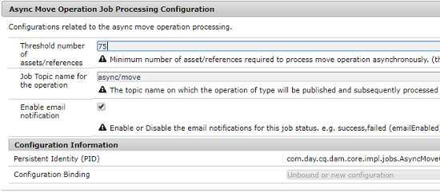

# 非同步操作 {#asynchronous-operations}

為了降低對效能的負面影響，Adobe Experience Manger會將某些長期執行且耗用大量資源的作業以非同步方式作為背景作業來處理。 非同步處理包括將多項作業排入佇列，並根據系統資源的可用情形依序執行。

這些操作包括：

* 刪除多項資產
* 移動多項資產或參照眾多的資產
* 大量匯出/匯入資產的中繼資料
* 從 Experience Manager 的遠端部署作業中擷取高於臨界值限制設定的資產
* 轉出即時副本

您可以在&#x200B;**全域導覽** > **工具** > **一般** > **作業**&#x200B;的&#x200B;**[!UICONTROL 背景作業]**&#x200B;儀表板中檢視非同步作業的狀態。

>[!NOTE]
>
>預設狀態下，非同步作業會並行運作。如果 CPU 核心數為 *`n`*，預設狀態下可供 *`n/2`* 項作業並行運作。若要使用作業佇列的自訂設定，請從 Web 主控台修改&#x200B;**[!UICONTROL 「非同步操作預設佇列設定」]**&#x200B;和&#x200B;**「非同步操作頁面移動與轉出設定」** 。
>
>如需詳細資訊，請參閱[佇列設定](https://sling.apache.org/documentation/bundles/apache-sling-eventing-and-job-handling.html#queue-configurations)。

## 監控非同步操作的狀態 {#monitor-the-status-of-asynchronous-operations}

AEM 以非同步方式處理操作時，您會透過[收件匣](/help/sites-cloud/authoring/inbox.md)和電子郵件 (如果已啟用) 收到通知。

若要檢視非同步操作的詳細狀態，請導覽至&#x200B;**[!UICONTROL 背景操作]**&#x200B;頁面。

1. 在Experience Manager介面中，選取&#x200B;**全域導覽** > **工具** > **一般** > **工作**。

1. 在&#x200B;**[!UICONTROL 背景作業]**&#x200B;頁面中，檢閱作業的詳細資料。

   

   若需了解特定操作的進度，請查看&#x200B;**[!UICONTROL 狀態]**&#x200B;欄中的值。系統會根據進度顯示下列其中一種狀態：

   * **[!UICONTROL 執行中]**：正在處理操作

   * **[!UICONTROL 成功]**：操作完成

   * **[!UICONTROL 失敗]**&#x200B;或&#x200B;**[!UICONTROL 錯誤]**：無法處理操作

   * **[!UICONTROL 已排程]**：操作已排程，等待稍後處理

1. 若要停止執行中的操作，請從清單中選取操作，然後按一下工具列中的&#x200B;**[!UICONTROL 「停止」]**。

   

1. 若要檢視額外詳細資訊（例如，說明和記錄），請選取操作，然後按一下工具列中的[開啟]。**&#x200B;**

   

   系統會顯示作業詳細資訊頁面。

   

1. 若要從清單中刪除操作，請選取工具列中的&#x200B;**[!UICONTROL 「刪除」]**。若要以 CSV 檔案格式下載詳細資訊，請按&#x200B;**[!UICONTROL 「下載」]**。

   >[!NOTE]
   >
   >狀態為&#x200B;**「執行中」**&#x200B;或&#x200B;**「已排入佇列」**&#x200B;的作業無法刪除。

## 設定非同步作業處理選項 {#configure}

非同步作業有數個選項可供設定。 下列範例說明如何在本機開發系統上使用Configuration Manager完成此操作。

>[!NOTE]
>
>[OSGi設定](/help/implementing/deploying/configuring-osgi.md#creating-osgi-configurations)被視為可變內容，任何這類設定都必須部署為生產環境的內容套件。

### 清除已完成的工作 {#purging-completed-jobs}

AEM每天01:00會執行清除作業，將超過一天的已完成非同步作業刪除。

您可以修改清除作業的排程，並調整已完成作業詳細資訊的保留時間。您也可以針對要保留詳細資訊的已完成作業，隨時設定數量上限。

1. 以管理員使用者身分在`https://<host>:<port>/system/console`登入AEM SDK Quickstart Jar的AEM Web主控台。
1. 瀏覽至&#x200B;**OSGi** > **設定**
1. 開啟&#x200B;**[!UICONTROL 「Adobe Granite 非同步作業清除已排程作業」]**。
1. 指定下列設定：
   * 已完成作業的保留天數上限。
   * 以記錄形式保留詳細資訊的作業數上限。
   * 清除作業執行時間的 cron 運算式。

   

1. 儲存變更。

### 設定非同步資產刪除操作 {#configuring-synchronous-delete-operations}

如果要刪除的資產或資料夾數量超過上限，系統就會以非同步方式執行刪除操作。

1. 以管理員使用者身分在`https://<host>:<port>/system/console`登入AEM SDK Quickstart Jar的AEM Web主控台。
1. 瀏覽至&#x200B;**OSGi** > **設定**
1. 從Web主控台開啟&#x200B;**[!UICONTROL 非同步處理預設佇列組態]**。
1. 在&#x200B;**[!UICONTROL 「資產數上限」]**&#x200B;方塊中，指定非同步處理刪除操作的資產/資料夾數量上限。

   

1. 勾選&#x200B;**「啟用電子郵件通知」**&#x200B;選項，接收此作業狀態的電子郵件通知，例如，成功、失敗。
1. 儲存變更。

### 設定非同步資產移動操作 {#configuring-asynchronous-move-operations}

如果要移動的資產/資料夾或參照數量超過上限，系統就會以非同步方式執行移動操作。

1. 以管理員使用者身分在`https://<host>:<port>/system/console`登入AEM SDK Quickstart Jar的AEM Web主控台。
1. 瀏覽至&#x200B;**OSGi** > **設定**
1. 從Web主控台開啟&#x200B;**[!UICONTROL 非同步移動操作作業處理設定]**。
1. 在&#x200B;**[!UICONTROL 「資產/參照數上限」]**&#x200B;方塊中，指定非同步處理移動操作的資產/資料夾或參照數量上限。

   

1. 勾選&#x200B;**「啟用電子郵件通知」**&#x200B;選項，接收此作業狀態的電子郵件通知，例如，成功、失敗。
1. 儲存變更。

### 設定非同步MSM操作 {#configuring-asynchronous-msm-operations}

1. 以管理員使用者身分在`https://<host>:<port>/system/console`登入AEM SDK Quickstart Jar的AEM Web主控台。
1. 瀏覽至&#x200B;**OSGi** > **設定**
1. 從Web主控台開啟&#x200B;**[!UICONTROL 非同步頁面移動操作作業處理設定]**。
1. 勾選&#x200B;**「啟用電子郵件通知」**&#x200B;選項，接收此作業狀態的電子郵件通知，例如，成功、失敗。

   

1. 儲存變更。

>[!MORELIKETHIS]
>
>* [管理頁面](/help/sites-cloud/authoring/sites-console/managing-pages.md)
>* [大量匯入和匯出資產的中繼資料](/help/assets/metadata-import-export.md)。
>* [透過連線資產共用遠端部署的 DAM 資產](/help/assets/use-assets-across-connected-assets-instances.md)。
