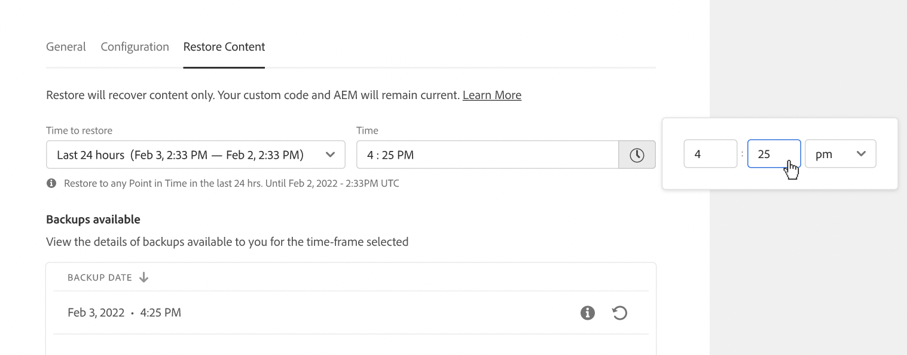
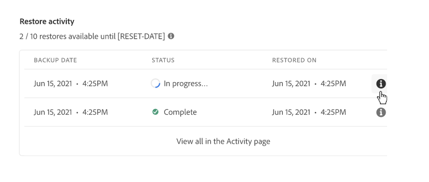

# AEM中的內容還原as a Cloud Service {#content-restore}

>[!CONTEXTUALHELP]
>id="aemcloud_golive_backuprestore"
>title="備份和還原"
>abstract="了解如何使用Cloud Manager從備份還原AEMas a Cloud Service內容。"

了解如何使用Cloud Manager從備份還原AEMas a Cloud Service內容。

>[!NOTE]
>
>* 此功能將分階段推出，但Cloud Manager中的所有租戶可能尚未啟用此功能。
>* 此功能目前僅限於測試和開發環境。 這些環境類型的功能使用方式和意見回饋，可確保在不久的將來成功推出至生產環境。

## 總覽 {#overview}

Cloud Manager的自助恢復過程會將資料從Adobe系統備份中複製，並將其恢復到其原始環境。 執行還原時，會將丟失、損壞或意外刪除的資料返回到其原始狀態。

還原程式只會影響內容，使您的程式碼和AEM版本維持不變。 您可以隨時啟動單個環境的恢復操作。

Cloud Manager提供兩種備份類型，您可以從中恢復內容。

* **時間點(PIT):** 此類型從當前時間過去24小時內連續系統備份中恢復。
* **上週：** 此類型在過去7天內從系統備份中恢復，但前24小時除外。

在這兩種情況下，自訂程式碼和AEM版本都維持不變。

在AEM as a ContentService中還原內容的效能量度指的是標準基準：

* **恢復時間目標(RTO):** 恢復時間目標會根據儲存庫的大小而有所不同，但根據經驗，恢復序列一旦開始，大約需要30分鐘。
* **恢復點目標(RPO):** 恢復點目標最大為24小時

>[!TIP]
>
>還可以還原備份 [使用公用API。](https://developer.adobe.com/experience-cloud/cloud-manager/reference/api/)

## 限制 {#limitations}

自助恢復機制的使用受以下限制限制。

* 還原操作限制為七天，這意味著無法還原超過七天的快照。
* 每個日曆月，每個計畫中的所有環境最多允許10次成功恢復。
* 建立環境後，需要6小時才能建立第一個備份快照。 在建立此快照之前，不能在環境中執行任何還原。
* 如果當前為環境運行了完整堆棧或Web層配置管道，則恢復操作將不啟動。
* 如果同一環境中已運行另一個還原，則無法啟動還原。
* 在極少數情況下，由於備份的時間限制為24小時/7天，因此選定的備份可能會變得不可用，因為從選擇備份到啟動恢復之間的延遲。
* 來自已刪除環境的資料會永久丟失，且無法恢復。

## 還原內容 {#restoring-content}

首先確定要還原的內容的時間範圍。 然後，要從備份中恢復環境的內容，請執行以下步驟。

>[!NOTE]
>
>使用 **業務負責人** 或 **部署管理員** 必須登錄角色，才能啟動還原操作。

1. 登入Cloud Manager，網址為 [my.cloudmanager.adobe.com](https://my.cloudmanager.adobe.com/) 並選取適當的組織。

1. 按一下要啟動還原的程式。

1. 從 **計畫概述** 頁面，在 **環境** 卡片上，按一下要啟動還原的環境旁邊的刪節號按鈕，然後選擇 **還原內容**.

   

   * 或者，您可以直接導覽至 **還原內容** 「環境詳細資訊」頁面的索引標籤。

1. 在 **還原內容** 頁簽中，首先在 **還原時間** 下拉式清單。

   1. 如果您選取 **過去24小時** 鄰近 **時間** 欄位可讓您指定過去24小時內要還原的確切時間。

      

   1. 如果您選取 **上週** 鄰近 **日** 欄位可讓您選取過去7天內的日期，但前24小時除外。

      

1. 選取日期或指定時間後， **可用備份** 以下部分顯示了可還原的可用備份清單

   

1. 使用資訊表徵圖查看有關該備份中包含的代碼和AEM版本的版本的資訊，並考慮當 [選擇備份。](#choosing-the-right-backup)

   

   * 請注意，為還原選項顯示的時間戳都基於用戶電腦的時區。

1. 按一下 **還原** 表徵圖位於行的右端，表示要恢復以啟動還原過程的備份。

1. 查看 **還原內容** 對話方塊，再按一下 **還原**.

   

備份進程已啟動，您可以在 **[還原活動](#restore-activity)** 表格。 還原操作完成所需的時間取決於要還原的內容的大小和配置檔案。

當還原成功完成時，環境將：

* 執行與啟動還原操作時相同的程式碼和AEM版本。
* 具有相同的內容（在所選快照的時間戳中可用），並重建索引以匹配當前代碼。

## 選擇正確的備份 {#choosing-backup}

僅將內容還原為AEM。 因此，您必須仔細考慮在所需還原點和當前時間之間所做的代碼更改，方法是查看當前提交ID和要還原到的ID之間的提交歷史記錄。

有幾種情況。

* 環境和還原上的自訂程式碼位於相同的存放庫和相同分支。
* 環境和還原上的自訂程式碼位於相同的存放庫，但位於具有共同提交的不同分支。
* 環境和還原上的自訂程式碼位於不同的存放庫。
   * 在這種情況下，不會顯示提交ID。
   * 強烈建議您克隆兩個儲存庫，並使用比較工具來比較分支。

此外，請記住，還原可能會導致您的生產和測試環境不同步。 您應對還原內容的後果負責。

## 還原活動 {#restore-activity}

此 **還原活動** 表顯示包括任何活動還原操作在內的十個最近還原請求的狀態。

通過按一下備份的資訊表徵圖，您可以下載該備份的日誌，並檢查代碼詳細資訊，包括啟動還原時快照與資料之間的差異。

## 異地備份 {#offsite-backup}

AEM雲端服務中的定期備份可能會出現意外刪除或技術故障，但區域故障可能會帶來其他風險。 除了可用性之外，此類地區中斷的最大風險是資料丟失。

AEM as a Cloud Service可持續將所有AEM內容複製到遠端地區，並在三個月的時間內讓其可用於恢復，以降低所有AEM生產環境的此風險。 此功能稱為離站備份。

AEM服務可靠性工程會在資料區域中斷時，為預備和生產環境從離站備份進行AEM雲端服務復原。
