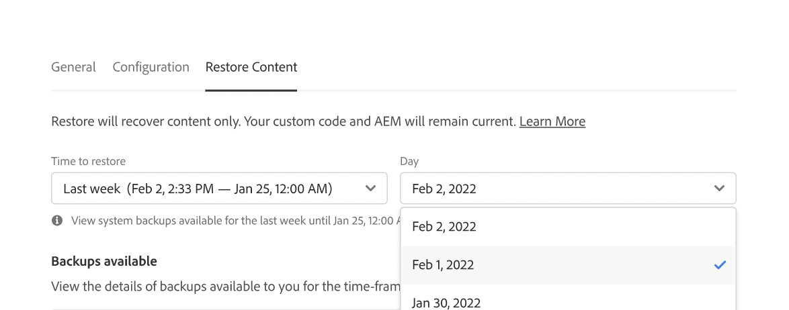

# 內容在AEMas a Cloud Service {#content-restore}

>[!CONTEXTUALHELP]
>id="aemcloud_golive_backuprestore"
>title="備份和恢復"
>abstract="瞭解如何使用Cloud Manager從AEM備份中恢復as a Cloud Service內容。"

瞭解如何使用Cloud Manager從AEM備份中恢復as a Cloud Service內容。

## 概觀 {#overview}

Cloud Manager的自助服務還原過程將資料從Adobe系統備份中複製並還原到其原始環境。 執行恢復以將丟失、損壞或意外刪除的資料返回到其原始狀態。

恢復過程只影響內容，而不會更改代碼和版AEM本。 您可以隨時啟動單個環境的恢復操作。

Cloud Manager提供了兩種類型的備份，您可以從中恢復內容。

* **時間點(PIT):** 此類型從當前時間的過去24小時內從連續系統備份中恢復。
* **上週：** 此類型在過去七天內從系統備份中恢復，前24小時除外。

在這兩種情況下，自定義代碼和版本的版本都AEM保持不變。

將內容恢復為ContentService的AEM效能指標參考了標準基準：

* **恢復時間目標(RTO):** 恢復時間目標會因儲存庫的大小而異，但根據經驗，一旦恢復序列開始，大約需要30分鐘。
* **恢復點目標(RPO):** 恢復點目標最大為24小時

>[!TIP]
>
>還可以恢復備份 [使用公共API。](https://developer.adobe.com/experience-cloud/cloud-manager/reference/api/)

## 限制 {#limitations}

使用自助恢復機制受以下限制。

* 恢復操作限制為七天，這意味著無法恢復超過七天的快照。
* 每個日曆月，程式中所有環境最多允許十次成功恢復。
* 建立環境後，建立第一個備份快照需要6個小時。 在建立此快照之前，不能對環境執行恢復。
* 如果當前為該環境運行了完整堆棧或Web層配置管道，則不會啟動還原操作。
* 如果同一環境中已運行另一個還原，則無法啟動還原。
* 在極少數情況下，由於備份限制為24小時/7天，因此選定的備份可能由於從選擇備份到啟動恢復之間的延遲而變得不可用。
* 來自已刪除環境的資料永久丟失，無法恢復。

## 恢復內容 {#restoring-content}

首先確定要恢復的內容的時間範圍。 然後，要從備份中恢復您環境的內容，請執行以下步驟。

>[!NOTE]
>
>具有 **業務所有者** 或 **部署管理器** 必須登錄角色，才能啟動還原操作。

1. 登錄到Cloud Manager(位於 [my.cloudmanager.adobe.com](https://my.cloudmanager.adobe.com/) 並選擇相應的組織。

1. 按一下要為其啟動恢復的程式。

1. 從 **計畫概述** 的 **環境** 卡，按一下要啟動還原的環境旁邊的省略號按鈕，然後選擇 **還原內容**。

   

   * 或者，可以直接導航到 **還原內容** 頁籤。

1. 在 **還原內容** 頁籤，首先在 **恢復時間** 下拉清單。

   1. 如果選擇 **過去24小時** 鄰國 **時間** 欄位中，您可以指定在過去24小時內要恢復的準確時間。

      

   1. 如果選擇 **上週** 鄰國 **日** 欄位允許您選擇過去七天內的日期，但前24小時除外。

      

1. 選擇日期或指定時間後， **備份可用** 下面一節顯示了可恢復的可用備份的清單

   

1. 使用資訊表徵圖查看有關該備份中包含的代碼版本和版本的資訊，並考慮AEM恢復時的影響，以查找要恢復的備份 [選擇備份。](#choosing-the-right-backup)

   

   * 請注意，為還原選項顯示的時間戳都基於用戶電腦的時區。

1. 按一下 **還原** 表徵圖，位於行的右端，表示要恢復以啟動恢復過程的備份。

1. 查看 **還原內容** 對話框，然後按一下 **還原**。

   

備份進程已啟動，您可以在 **[還原活動](#restore-activity)** 的子菜單。 恢復操作完成所需的時間取決於要恢復的內容的大小和配置檔案。

當恢復成功完成時，環境將：

* 運行與啟動還原AEM操作時相同的代碼和版本。
* 具有相同的內容，這些內容在選定快照的時間戳內可用，並重新生成索引以匹配當前代碼。

## 選擇正確的備份 {#choosing-backup}

只將內容還原到AEM。 因此，您必須仔細考慮在所需還原點和當前時間之間執行的代碼更改，方法是查看當前提交ID和要還原的提交ID之間的提交歷史記錄。

有幾種情形。

* 環境中的自定義代碼和還原位於同一儲存庫和同一分支上。
* 環境中的自定義代碼和還原位於同一儲存庫上，但位於具有公用提交的不同分支上。
* 環境中的自定義代碼和還原位於不同的儲存庫中。
   * 在這種情況下，將不顯示提交ID。
   * 強烈建議您克隆兩個儲存庫並使用比較工具來比較分支。

另外，請記住，恢復可能會導致您的生產和轉儲環境失去同步。 恢復內容的後果由您負責。

## 還原活動 {#restore-activity}

的 **還原活動** 該表顯示了最近十個還原請求的狀態，包括任何活動還原操作。

通過按一下備份的資訊表徵圖，您可以下載該備份的日誌，並檢查代碼詳細資訊，包括啟動恢復時快照和資料之間的差異。

## 異地備份 {#offsite-backup}

定期備份涵蓋AEM雲服務中意外刪除或技術故障的風險，但區域故障可能會帶來其他風險。 除了可用性外，此類地區中斷的最大風險是資料丟失。

AEMas a Cloud Service，通AEM過持續將所有內容複製到遠AEM程區域，並使其在三個月內可用於恢復，減輕了所有生產環境的這一風險。 此功能稱為異地備份。

AEM雲服務用於從異地備份中恢復過渡和生產環境，由服務可靠性工程AEM在資料區域中斷時執行。
