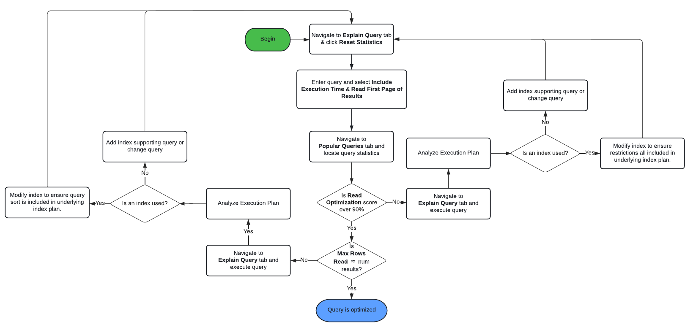

# 查詢和索引最佳做法 {#query-and-indexing-best-practices}

在AEMas a Cloud Service，與索引有關的所有操作方面都是自動化的。 這使開發人員能夠專注於建立高效查詢及其相應的索引定義。

## 何時使用查詢 {#when-to-use-queries}

查詢是訪問內容的一種方式，但並非唯一的可能。 在許多情況下，可以通過其他方式更有效地訪問儲存庫中的內容。 您應考慮查詢是否是訪問您的使用案例內容的最佳和最有效的方法。

### 儲存庫和分類設計 {#repository-and-taxonomy-design}

在設計儲存庫的分類時，需要考慮幾個因素。 這些包括訪問控制、本地化、元件和頁面屬性繼承等。

在設計可解決這些問題的分類時，考慮索引設計的「可遍歷性」也很重要。 在此上下文中，可遍歷性是分類允許根據內容的路徑可預測地訪問內容的能力。 這使得系統更高效，而且比需要執行多個查詢的系統更容易維護。

此外，在設計分類時，必須考慮排序是否重要。 在不需要顯式排序且需要大量同級節點的情況下，最好使用未排序的節點類型，如 `sling:Folder` 或 `oak:Unstructured`。 如果需要訂購， `nt:unstructured` 和 `sling:OrderedFolder` 更合適。

### 元件中的查詢 {#queries-in-components}

由於查詢可能是在系統上執行的較繁重的操作AEM之一，因此最好在元件中避免查詢。 每次呈現頁面時執行多個查詢通常會降低系統效能。 有兩種策略可用於避免在渲染元件時執行查詢： **[遍歷節點](#traversing-nodes)** 和 **[預取結果。](#prefetching-results)**

### 遍歷節點 {#traversing-nodes}

如果儲存庫的設計方式允許預先知道所需資料的位置，則可以部署從必要路徑檢索此資料的代碼，而無需運行查詢以查找它。

其中一個示例是呈現符合特定類別的內容。 一種方法是使用可查詢的類別屬性來組織內容，以填充顯示類別中項目的元件。

更好的方法是將此內容按類別結構化，以便可以手動檢索。

例如，如果內容儲存在類別中，類似於：

```xml
/content/myUnstructuredContent/parentCategory/childCategory/contentPiece
```

這樣 `/content/myUnstructuredContent/parentCategory/childCategory` 節點可以簡單地檢索，其子項可以被解析並用於呈現元件。

此外，當您處理小型或同構結果集時，遍歷儲存庫和收集所需節點的速度可以更快，而不是編寫查詢以返回相同的結果集。 作為一般考慮，在可能的情況下應避免查詢。

### 預取結果 {#prefetching-results}

有時，元件周圍的內容或要求不允許使用節點遍歷作為檢索所需資料的方法。 在這種情況下，需要在呈現元件之前執行所需的查詢，從而確保最佳效能。

如果可以在建立元件時計算元件所需的結果，並且沒有預期內容會更改，則可以在更改完成後執行查詢。

如果資料或內容將定期更改，則查詢可以按計畫或通過監聽程式執行，以更新基礎資料。 然後，結果可以寫入儲存庫中的共用位置。 需要此資料的任何元件隨後都可以從此單個節點中提取值，而無需在運行時執行查詢。

可以使用類似策略將結果保留在記憶體中的快取中，該快取在啟動時填充，並在更改完成時更新（使用JCR） `ObservationListener` 或吊帶 `ResourceChangeListener`)。

## 優化查詢 {#optimizing-queries}

Oak文檔提供 [高級概述如何執行查詢。](https://jackrabbit.apache.org/oak/docs/query/query-engine.html#query-processing) 這構成了本文檔中描述的所有優化活動的基礎。

AEMas a Cloud Service提供了查詢效能工具，該工具旨在支援高效查詢的實現。

* 它顯示已執行的查詢及其相關的效能特徵和查詢計畫。
* 它允許在不同級別執行即席查詢，從僅顯示查詢計劃開始到執行完整查詢。

查詢效能工具可通過 [雲管理器中的開發人員控制台。](https://experienceleague.adobe.com/docs/experience-manager-learn/cloud-service/debugging/debugging-aem-as-a-cloud-service/developer-console.html#queries) AEMas a Cloud Service的查詢效能工具提供了有關6.x版上查詢執行的詳細AEM資訊。

此圖說明了使用查詢效能工具優化查詢的一般流程。



### 使用索引 {#use-an-index}

每個查詢都應使用索引來提供最佳效能。 在大多數情況下，現有的現成索引應足以處理查詢。

有時需要將自定義屬性添加到現有索引中，因此可以使用索引查詢附加約束。 查看文檔 [內容搜索和索引](/help/operations/indexing.md#changing-an-index) 的子菜單。 的 [JCR查詢清單](#jcr-query-cheatsheet) 本文檔的一節介紹索引的屬性定義必須如何查找才能支援特定查詢類型。

### 使用正確的標準 {#use-the-right-criteria}

任何查詢的主要約束都應是屬性匹配，因為這是最有效的類型。 添加更多屬性約束會進一步限制結果。

查詢引擎只考慮單個索引。 這意味著可以而且應該通過向現有索引中添加更多自定義索引屬性來對其進行自定義。

的 [JCR查詢工作表](#jcr-query-cheatsheet) 本文檔的一節列出了可用約束，還概述了索引定義需要如何查找以便提取。 使用 [查詢效能工具](#query-performance-tool) test查詢並確保使用了正確的索引，並且查詢引擎不需要評估索引之外的約束。

### 排序 {#ordering}

如果請求了結果的特定順序，則查詢引擎有兩種方法來實現此目標：

1. 索引能夠以正確的順序完整地傳遞結果。
   * 如果用於排序的屬性注釋為 `ordered=true` 的子菜單。
1. 查詢引擎執行排序過程。
   * 當查詢引擎在索引外部執行篩選或排序屬性未使用 `ordered=true` 屬性。
   * 這要求將完整的結果集讀入記憶體進行排序，這比第一個選項慢得多。

### 限制結果大小 {#restrict-result-size}

檢索到的查詢結果的大小是查詢效能的一個重要因素。 由於以懶惰的方式讀取結果，因此僅讀取前20個結果與讀取10,000個結果（在運行時和記憶體使用方面）存在差異。

這也意味著只有在讀取所有結果時才能正確確定結果集的大小。 因此，讀取的結果集應始終受到限制，或者通過增加查詢(請參見 [JCR查詢工作表](#jcr-query-cheatsheet) 或限制結果的讀取。

這樣的限制還防止查詢引擎 **遍歷限制** 100,000個節點，導致強制停止查詢。

請參閱一節 [結果大的查詢](#queries-with-large-result-sets) 的子菜單。

## JCR查詢清單 {#jcr-query-cheatsheet}

為支援建立高效的JCR查詢和索引定義， [JCR查詢作弊表](https://experienceleague.adobe.com/docs/experience-manager-65/deploying/practices/best-practices-for-queries-and-indexing.html#jcrquerycheatsheet) 可供下載，並在開發過程中用作參考。

它包含QueryBuilder、XPath和SQL-2的示例查詢，涵蓋在查詢效能方面不同行為的多個情形。 它還提供了如何構建或自定義Oak索引的建議。 本「作弊表」的內容AEM適用於as a Cloud Service和AEM6.5。

## 具有大結果集的查詢 {#queries-with-large-result-sets}

儘管建議避免使用大結果集的查詢，但有些情況下必須處理大結果集。 結果的大小往往事先不知道，因此應當採取一些預防措施，使加工過程可靠。

* 不應在請求內執行查詢。 相反，應將查詢作為Sling Job或工作流的一部分AEM執行。 它們的總運行時沒有任何限制，並且在實例在處理查詢及其結果期間出現故障時重新啟動。
* 要克服100,000個節點的查詢限制，您應考慮使用 [鍵集分頁](https://jackrabbit.apache.org/oak/docs/query/query-engine.html#Keyset_Pagination) 並將查詢拆分為多個子查詢。

## 儲存庫遍歷 {#repository-traversal}

遍歷儲存庫的查詢不使用索引，而是使用與以下內容類似的消息進行記錄。

```text
28.06.2022 13:32:52.804 *WARN* [127.0.0.1 [1656415972414] POST /libs/settings/granite/operations/diagnosis/granite_queryperformance.explain.json HTTP/1.1] org.apache.jackrabbit.oak.plugins.index.Cursors$TraversingCursor Traversed 98000 nodes with filter Filter(query=select [jcr:path], [jcr:score], * from [nt:base] as a /* xpath: //* */, path=*) called by com.adobe.granite.queries.impl.explain.query.ExplainQueryServlet.getHeuristics; consider creating an index or changing the query
```

通過此日誌段，您可以確定：

* 查詢本身： `//*`
* 執行此查詢的Java代碼： `com.adobe.granite.queries.impl.explain.query.ExplainQueryServlet::getHeuristics` 的子菜單。

利用此資訊，可以使用中介紹的方法優化此查詢 [優化查詢](#optimizing-queries) 的子菜單。
