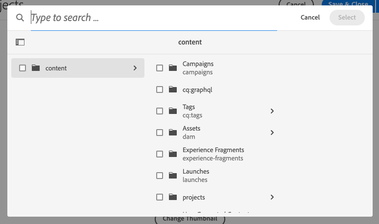

# 常規Lucene索引刪除 {#generic-lucene-index-removal}

Adobe打算刪除「泛型Lucene」索引(`/oak:index/lucene-*`)Adobe Experience Manager as a Cloud Service。 此索引自6.5AEM以來已棄用。在本文檔中介紹了此決定的影響，以及如何檢查實例是否受AEM到影響的詳細說明。 它還包含更改查詢的方法，以便它們在沒有通用Lucene索引的情況下繼續工作。

## 背景 {#background}

在中AEM，全文查詢是指使用以下函式的查詢：

* `jcr:contains()` 在JCR XPATH中
* `CONTAINS` 在JCR-SQL2中

如果不使用索引，則此類查詢無法返回結果。 與僅包含路徑或屬性限制的查詢不同，包含找不到索引的全文限制（因此執行遍歷）的查詢將始終返回零個結果。

泛型Lucene索引(`/oak:index/lucene-*`)自AEM6.0 / Oak 1.0以來就存在，以便在大多數儲存庫層次結構中提供全文搜索，但有些路徑，如 `/jcr:system` 和 `/var` 一直被排除在外。 但是，此索引已被更特定節點類型上的索引取代(例如 `damAssetLucene-*` 為 `dam:Asset` 節點類型)，支援全文和屬性搜索。

在AEM6.5中，通用Lucene索引被標籤為不建議使用，表示將在將來的版本中刪除它。 此後，在使用索引時記錄了WARN，如以下日誌片段所示：

```text
org.apache.jackrabbit.oak.plugins.index.lucene.LucenePropertyIndex This index is deprecated: /oak:index/lucene-2; it is used for query Filter(query=select [jcr:path], [jcr:score], * from [nt:base] as a where contains(*, 'search term') and isdescendantnode(a, '/content/mysite') /* xpath: /jcr:root/content/mysite//*[jcr:contains(.,"search term")] */ fullText="search" "term", path=/content/mysite//*). Please change the query or the index definitions.
```

在最新AEM版本中，通用Lucene索引已用於支援非常少的功能。 正在重新處理這些索引以使用其他索引，或以其他方式修改以刪除對此索引的依賴關係。

例如，引用查找查詢（如以下示例中）現在應使用的索引位於 `/oak:index/pathreference`，僅索引 `String` 與查找JCR路徑的規則運算式匹配的屬性值。

```text
//*[jcr:contains(., '"/content/dam/mysite"')]
```

為了支援更大的客戶資料量，Adobe將不再在新as a Cloud Service環境上建立通用LuceneAEM索引。 此外，Adobe將開始從現有儲存庫中刪除索引。 [查看時間線](#timeline) 以瞭解更多詳細資訊。

Adobe已通過 `costPerEntry` 和 `costPerExecution` 屬性，以確保其他索引，如 `/oak:index/pathreference` 在可能的情況下優先使用。

使用仍然依賴此索引的查詢的客戶應用程式應立即更新，以利用其他現有索引，如果需要，可以自定義這些索引。 或者，可以將新的自定義索引添加到客戶應用程式。 有關as a Cloud Service中索引管理AEM的完整說明，請參見 [索引文檔。](/help/operations/indexing.md)

## 您受影響嗎？ {#are-you-affected}

如果沒有其他全文索引可以為查詢服務，則通用Lucene索引當前用作回退。 使用此不建議使用的索引時，將在WARN級別記錄如下消息：

```text
org.apache.jackrabbit.oak.plugins.index.lucene.LucenePropertyIndex This index is deprecated: /oak:index/lucene-2; it is used for query Filter(query=select [jcr:path], [jcr:score], * from [nt:base] as a where contains(*, 'test') /* xpath: //*[jcr:contains(.,"test")] */ fullText="test", path=*). Please change the query or the index definitions.
```

在某些情況下，Oak可能會嘗試使用另一個全文索引(如 `/oak:index/pathreference`)以支援全文查詢，但如果查詢字串與索引定義上的規則運算式不匹配，則將在WARN級別記錄一條消息，並且查詢可能不會返回結果。

```text
org.apache.jackrabbit.oak.query.QueryImpl Potentially improper use of index /oak:index/pathReference with queryFilterRegex (["']|^)/ to search for value "test"
```

一旦刪除了泛型Lucene索引，如果全文查詢找不到任何合適的索引定義，則將在WARN級別記錄如下所示的消息：

```text
org.apache.jackrabbit.oak.query.QueryImpl Fulltext query without index for filter Filter(query=select [jcr:path], [jcr:score], * from [nt:base] as a where contains(*, 'test') /* xpath: //*[jcr:contains(.,"test")] */ fullText="test", path=*); no results will be returned
```

>[!IMPORTANT]
>
>**需要客戶操作**
>
> 如果記錄了上述任何警告消息，則可能需要重新編寫查詢以使用不同的全文索引，或者提供新索引以支援查詢。
>
>以下各節提供了您可能看到的依賴關係類型以及如何解決這些依賴關係的詳細資訊。

## 泛型Lucene索引的潛在依賴關係 {#potential-dependencies}

在許多領域，您的應用程式和AEM安裝可能都依賴於作者和發佈實例上的通用Lucene索引。

### 發佈實例 {#publish-instance}

#### 自定義應用程式查詢 {#custom-application-queries}

在發佈實例上使用通用Lucene索引的查詢最常見的來源是自定義應用程式查詢。

在最簡單的情況下，這些查詢可能是未指定節點類型的查詢，因此表示 `nt:base` 或 `nt:base` 明確指定，如：

```text
/jcr:root/content/mysite//*[jcr:contains(., 'search term')]
/jcr:root/content/mysite//element(*, nt:base)[jcr:contains(., 'search term')]
```

>[!IMPORTANT]
>
>**需要客戶操作**
>
>上述查詢應修改為使用相應的節點類型，如下節所詳述。

例如，可以修改查詢以返回匹配頁的結果或位於 `cq:Page node`。 因此，查詢可能變成：

```text
/jcr:root/content/mysite//element(*, cq:Page)[jcr:contains(., 'search term')]
```

在其他情況下，查詢可能指定節點類型，但包含無法由其他全文索引處理的全文限制，例如：

```text
/jcr:root/content/dam//element(*, dam:Asset)[jcr:contains(jcr:content/metadata/@cq:tags, 'NewsTopics:cateogries/domestic'))]
```

在這種情況下，查詢 `dam:Asset` 節點類型，但包含對相對 `jcr:content/metadata/@cq:tags` 屬性。

此屬性未在 `damAssetLucene` 索引，它是最常用於查詢的全文索引 `dam:Asset` 節點類型。 因此，此索引不能用於此查詢。

因此，查詢將返回到通用全文索引上，其中所有包含的屬性都由通配符匹配在 `/oak:index/lucene-2/indexRules/nt:base/properties/prop`。

>[!IMPORTANT]
>
>**需要客戶操作**
>
>標籤 `jcr:content/metadata/@cq:tags` 在自定義版本中分析的屬性 `damAssetLucene` 索引將導致此查詢由此索引處理，並且不會記錄WARN。

### 作者實例 {#author-instance}

除了客戶應用程式servlet、OSGi元件和呈現指令碼中的查詢外，還可以有許多特定於作者的通用Lucene索引用法。

#### 引用搜索 {#reference-search}

過去，通用Lucene索引用於支援引用搜索或搜索包含對其他內容路徑的引用的內容。 此類查詢應已更新為使用新查詢 `/oak:index/pathreference` 。

#### 路徑欄位選取器搜索 {#picker-search}

包AEM括具有Sling資源類型的自定義對話框元件 `granite/ui/components/coral/foundation/form/pathfield`，它提供用於選擇其他路徑的瀏覽器/選AEM取器。 預設路徑欄位選取器，在沒有自定義時使用 `pickerSrc` 屬性在內容結構中定義，在彈出式對話框中呈現搜索欄。

可以使用 `nodeTypes` 屬性。

目前，如果沒有 `nodeTypes` 屬性存在，基礎搜索查詢將使用 `nt:base` 節點類型，因此可能使用泛型Lucene索引，通常記錄與以下內容類似的WARN消息。

```text
20.01.2022 18:56:06.412 *WARN* [127.0.0.1 [1642704966377] POST /mnt/overlay/granite/ui/content/coral/foundation/form/pathfield/picker.result.single.html HTTP/1.1] org.apache.jackrabbit.oak.plugins.index.lucene.LucenePropertyIndex This index is deprecated: /oak:index/lucene-2; it is used for query Filter(query=select [jcr:path], [jcr:score], * from [nt:base] as a where contains(*, 'test') and isdescendantnode(a, '/content') /* xpath: /jcr:root/content//element(*, nt:base)[(jcr:contains(., 'test'))] order by @jcr:score descending */ fullText="test", path=/content//*). Please change the query or the index definitions.
```

在刪除泛型Lucene索引之前， `pathfield` 將更新元件，以便使用預設選取器為元件隱藏搜索框，該選取器不提供 `nodeTypes` 屬性。

| 帶搜索的路徑欄位選取器 | 不搜索的路徑欄位選取器 |
|---|---|
|  |  |

>[!IMPORTANT]
>
>**需要客戶操作**
>
>如果客戶希望在路徑欄位選取器中保留搜索功能， `nodeTypes` 應提供屬性，列出要查詢的節點類型。 這些可以指定為以逗號分隔的 `String` 屬性。 如果不需要搜索，則不需要客戶執行任何操作。

>[!NOTE]
>
>內容片段模型編輯器使用具有Sling資源類型的專用路徑欄位 `dam/cfm/models/editor/components/contentreference`。
> * 目前，這些查詢執行時未指定節點類型，導致由於使用通用Lucene索引而記錄WARN。
> * 這些元件的實例很快將自動預設為使用 `cq:Page` 和 `dam:Asset` 節點類型，而無需進一步的客戶操作。
> * 的 `nodeTypes` 可以添加屬性以覆蓋這些預設節點類型。


## 通用Lucene刪除時間軸 {#timeline}

Adobe將採用兩階段方法刪除通用Lucene索引。

* **階段1** （計畫於2022年1月31日開始）:不再建立 `/oak:index/lucene-*` 新的AEMas a Cloud Service。
* **階段2** （計畫於2022年3月31日開始）:刪除 `/oak:index/lucene-*` 索AEM引。

Adobe將監視上述日誌消息，並嘗試聯繫仍依賴通用Lucene索引的客戶。

作為短期緩解措施，Adobe將直接向客戶系統添加自定義索引定義，以防止因必要時刪除通用Lucene索引而導致的功能或效能問題。

在這種情況下，將向客戶提供更新的索引定義，並建議客戶通過雲管理器將其納入其應用程式的未來版本。
