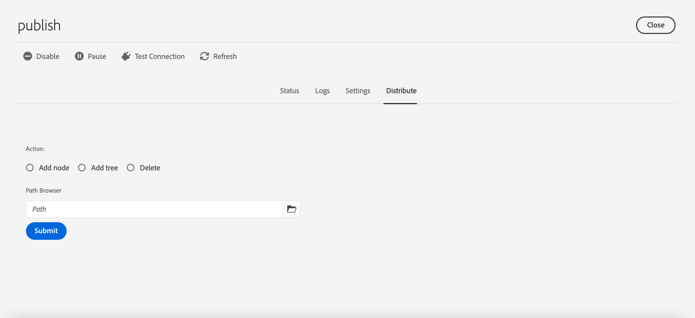

# 複寫 {#replication}

Adobe Experience Manager as a Cloud Service使用 [Sling內容分送](https://sling.apache.org/documentation/bundles/content-distribution.html) 能夠將要複製的內容移動到AEM執行階段以外Adobe I/O上執行的管道服務。

>[!NOTE]
>
>閱讀 [分發](/help/overview/architecture.md#content-distribution) 以取得更多資訊。

## 發佈內容的方法 {#methods-of-publishing-content}

### 快速取消/發佈 — 計畫取消/發佈 {#publish-unpublish}

這可讓您立即發佈所選頁面，而無需透過「管理出版物」方法提供其他選項。

如需詳細資訊，請參閱 [管理出版物](/help/sites-cloud/authoring/fundamentals/publishing-pages.md#manage-publication).

### 開啟和關閉時間 — 觸發配置 {#on-and-off-times-trigger-configuration}

其他可能性 **準時** 和 **關閉時間** 可從 [頁面屬性的基本索引標籤](/help/sites-cloud/authoring/fundamentals/page-properties.md#basic).

要實現自動複製，您需要啟用 **自動復寫** 在 [OSGi配置](/help/implementing/deploying/configuring-osgi.md) **開關觸發器配置**:


### 管理發佈 {#manage-publication}

「管理出版物」提供的選項比「快速發佈」更多，可包含子頁面、自訂參考、啟動任何適用的工作流程，以及提供在稍後發佈的選項。

將「稍後發佈」選項的資料夾子項納入會叫用「發佈內容樹」工作流程，如本文所述。

您可以在 [發佈基礎知識檔案](/help/sites-cloud/authoring/fundamentals/publishing-pages.md#manage-publication).

### 樹激活 {#tree-activation}

>[!NOTE]
>
>此方法應視為已過時，並將於2021年9月30日或之後移除，因為它不會保留狀態，且可擴充性較其他方法低。 Adobe的建議是改用管理發布或工作流程方法

要執行樹激活：

1. 從AEM開始功能表導覽至 **工具>部署>分發**
2. 選取資訊卡 **發佈**
3. 進入發佈Web控制台UI後， **選擇分發**

   
4. 在路徑瀏覽器中選擇路徑，根據需要選擇添加節點、樹或刪除，然後選擇 **提交**

為獲得最佳效能，使用此功能時請遵循以下准則：
* 建議一次複製少於100個路徑，並設定500個路徑硬限制。
* 複製內容的總大小必須低於5 MB。 這僅包括節點和屬性，但不包括任何二進位檔，其中包括工作流程套件和內容套件。

### 發佈內容樹工作流 {#publish-content-tree-workflow}

通過選擇 **工具 — 工作流程 — 模型** 和複製 **發佈內容樹** 現成工作流程模型，如下所示：


請勿修改或調用原始模型。 請務必先複製模型，然後修改或叫用該復本。

如同所有工作流程，您也可以透過API叫用。 如需詳細資訊，請參閱 [以程式設計的方式與工作流程互動](https://experienceleague.adobe.com/docs/experience-manager-65/developing/extending-aem/extending-workflows/workflows-program-interaction.html?lang=en#extending-aem).

或者，您也可以建立使用 `Publish Content Tree` 處理步驟：

1. 從AEMas a Cloud Service首頁，前往 **工具 — 工作流程 — 模型**
1. 在「工作流模型」頁面中，按 **建立** 在螢幕的右上角
1. 新增標題和名稱至模型。 如需詳細資訊，請參閱 [建立工作流模型](https://experienceleague.adobe.com/docs/experience-manager-65/developing/extending-aem/extending-workflows/workflows-models.html)
1. 從清單中選取新建立的模型，然後按 **編輯**
1. 在以下窗口中，將「處理步驟」(Process Step)拖放到當前模型流中：

   

1. 按一下流程中的「處理」步驟，然後選取 **設定** 按扳手錶徵圖
1. 按一下 **程式** 索引標籤和選取 `Publish Content Tree` 從下拉式清單

   

1. 在 **引數** 欄位。 多個逗號分隔引數可以字串在一起。 例如：

   `enableVersion=true,agentId=publish,includeChildren=true`


   >[!NOTE]
   >
   >如需參數清單，請參閱 **參數** 一節。

1. Press **完成** 以保存工作流模型。

**參數**

* `includeChildren` （布林值，預設值） `false`)。 false表示僅發佈路徑。 true表示孩子也會被發表。
* `replicateAsParticipant` （布林值，預設值） `false`)。 若已設為 `true`，復寫會使用 `userid` 執行參與者步驟的主體。
* `enableVersion` （布林值，預設值） `true`)。 此參數會決定是否在復寫時建立新版本。
* `agentId` （字串值，預設值表示僅使用發佈的代理）。 建議您明確說明agentId;例如，設定它：發佈。 將代理設定為 `preview` 將發佈至預覽服務
* `filters` （字串值，預設值表示所有路徑皆已啟用）。 可用值包括：
   * `onlyActivated`  — 只有未標示為已啟用的路徑才會啟用。
   * `onlyModified`  — 僅啟用已啟用且修改日期晚於啟用日期的路徑。
   * 上方可以用垂直號「|」來ORed。 例如， `onlyActivated|onlyModified`.

**記錄**

樹激活工作流步驟開始時，它將在INFO日誌級別上記錄其配置參數。 啟動路徑時，也會記錄INFO陳述式。

然後，在複製所有路徑後，將記錄最終的INFO語句。

此外，您也可以提高以下記錄器的記錄層級 `com.day.cq.wcm.workflow.process.impl` 除錯/TRACE，以取得更多記錄資訊。

如果發生錯誤，工作流程步驟會以 `WorkflowException`，其中包含基礎例外。

以下是範例發佈內容樹狀結構工作流程期間產生的記錄檔範例：

```
21.04.2021 19:14:55.566 [cm-p123-e456-aem-author-797aaaf-wkkqt] *INFO* [JobHandler: /var/workflow/instances/server60/2021-04-20/brian-tree-replication-test-2_1:/content/wknd/us/en/adventures] com.day.cq.wcm.workflow.process.impl.treeactivation.TreeActivationWorkflowProcess TreeActivation options: replicateAsParticipant=false(userid=workflow-process-service), agentId=publish, chunkSize=100, filter=, enableVersion=false
```

```
21.04.2021 19:14:58.541 [cm-p123-e456-aem-author-797aaaf-wkkqt] *INFO* [JobHandler: /var/workflow/instances/server60/2021-04-20/brian-tree-replication-test-2_1:/content/wknd/us/en/adventures] com.day.cq.wcm.workflow.process.impl.ChunkedReplicator closing chunkedReplication-VolatileWorkItem_node1_var_workflow_instances_server60_2021-04-20_brian-tree-replication-test-2_1, 17 paths replicated in 2971 ms
```

**繼續支援**

工作流程會以區塊處理內容，每個區塊代表要發佈之完整內容的子集。 如果由於任何原因，工作流被系統停止，它將重新啟動並處理尚未處理的區塊。 記錄陳述式會指出內容已從特定路徑繼續。

### 復寫API {#replication-api}

您可以使用AEM as a Cloud Service中精選的取代API來發佈內容。

如需詳細資訊，請參閱 [API檔案](https://javadoc.io/doc/com.adobe.aem/aem-sdk-api/latest/com/day/cq/replication/package-summary.html).

**API的基本使用**

```
@Reference
Replicator replicator;
@Reference
ReplicationStatusProvider replicationStatusProvider;

....
Session session = ...
// Activate a single page to all agents, which are active by default
replicator.replicate(session,ReplicationActionType.ACTIVATE,"/content/we-retail/en");
// Activate multiple pages (but try to limit it to approx 100 at max)
replicator.replicate(session,ReplicationActionType.ACTIVATE, new String[]{"/content/we-retail/en","/content/we-retail/de"});

// ways to get the replication status
Resource enResource = resourceResolver.getResource("/content/we-retail/en");
Resource deResource = resourceResolver.getResource("/content/we-retail/de");
ReplicationStatus enStatus = enResource.adaptTo(ReplicationStatus.class);
// if you need to get the status for more more than 1 resource at once, this approach is more performant
Map<String,ReplicationStatus> allStatus = replicationStatusProvider.getBatchReplicationStatus(enResource,deResource);
```

**使用特定代理進行複製**

如上例所示，複製資源時，將僅使用預設活動的代理。 在AEMas a Cloud Service中，這只會是名為「發佈」的代理程式，將作者連接至發佈層級。

為支援預覽功能，已新增名為「預覽」的新代理，預設為非作用中。 此代理程式用於將作者連接至預覽層。 如果只想通過預覽代理進行複製，則需要通過 `AgentFilter`.

請參閱下列範例，了解如何執行此作業：

```
private static final String PREVIEW_AGENT = "preview";

ReplicationStatus beforeStatus = enResource.adaptTo(ReplicationStatus.class); // beforeStatus.isActivated == false

ReplicationOptions options = new ReplicationOptions();
options.setFilter(new AgentFilter() {
  @Override
  public boolean isIncluded (Agent agent) {
    return agent.getId().equals(PREVIEW_AGENT);
  }
});
// will replicate only to preview
replicator.replicate(session,ReplicationActionType.ACTIVATE,"/content/we-retail/en", options);

ReplicationStatus afterStatus = enResource.adaptTo(ReplicationStatus.class); // afterStatus.isActivated == false
ReplicationStatus previewStatus = afterStatus.getStatusForAgent(PREVIEW_AGENT); // previewStatus.isActivated == true
```

如果您未提供此類篩選器且僅使用「發佈」代理，則不會使用「預覽」代理，且復寫動作不會影響預覽層。

整體 `ReplicationStatus` 僅當複製操作包含至少一個預設活動的代理時才修改資源的。 在上例中，情況並非如此，因為復寫僅使用「預覽」代理。 因此，您需要使用 `getStatusForAgent()` 方法，允許查詢特定代理的狀態。 此方法也適用於「發佈」代理程式。 如果使用提供的代理完成了任何複製操作，則返回非空值。


**復寫API路徑和大小限制**

建議複製少於100個路徑，其中500個是硬限制。 超過硬限制時，將引發ReplicationException。 如果您的應用程式邏輯不需要原子複製，則可通過將ReplicationOptions.setUseAtomicCalls設定為false來克服此限制，這將接受任意數量的路徑，但在內部建立儲存桶以保持在此限制以下。 每個復寫呼叫傳輸的內容量不得超過5 MB，其中包含節點和屬性，但不得有任何二進位檔（工作流程套件和內容套件視為二進位檔）。

## 疑難排解 {#troubleshooting}

若要疑難排解復寫，請導覽至AEM製作服務Web UI中的復寫佇列：

1. 從AEM開始功能表導覽至 **工具>部署>分發**
2. 選取資訊卡 **發佈**
   
3. 檢查應為綠色的隊列狀態
4. 您可以測試與復寫服務的連線
5. 選取 **記錄檔** 頁簽，其中顯示內容發佈的歷史記錄


如果無法發佈內容，則會從AEM發佈服務還原整個發佈。
在這種情況下，可編輯的主隊列將顯示紅色狀態，應進行審核，以確定哪些項導致取消發佈。 按一下該佇列，其待定項目便會顯示，如有需要，可從中清除單一項目或所有項目。
