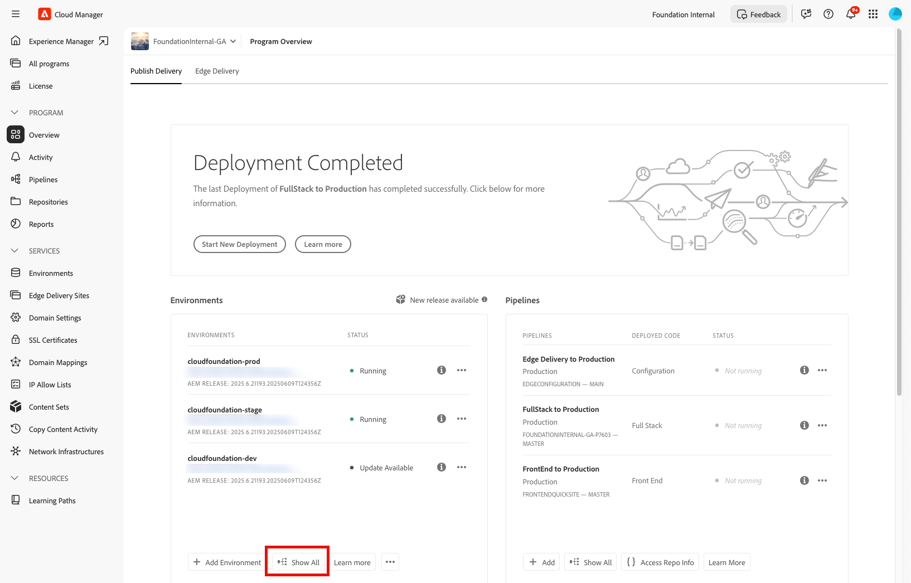

# 還原先前在AEM as a Cloud Service中部署的原始程式碼 {#restore-previous-code-deployed}

>[!NOTE]
>
>本文所述功能僅可透過Beta版計畫使用。 若要註冊Beta版，請參閱[管道部署的一鍵回覆](/help/implementing/cloud-manager/release-notes/current.md##one-click-rollback)。

使用&#x200B;**還原先前部署的程式碼**，將環境立即復原到其上次成功的組建 — 不需要執行管道。

您只要開啟所選環境的選單，並選擇&#x200B;**還原** > **先前部署程式碼**&#x200B;即可回覆最近部署的原始程式碼（以秒為單位）。

>[!TIP]
>
>您可以在&#x200B;**一般**&#x200B;標籤下方的環境詳細資料檢視中，檢視使用中的原始程式碼版本。 檢視[檢視環境的詳細資料](/help/implementing/cloud-manager/manage-environments.md#viewing-environment)。
>
>

**只有在符合下列條件時，才能還原先前部署的程式碼**：

* 每個成功的管道執行僅允許一個還原；若要再次還原，請完成另一個成功的管道執行。
* 您擁有&#x200B;**環境還原建立**&#x200B;許可權。 如需管理許可權的詳細資訊，請參閱[自訂許可權](/help/implementing/cloud-manager/custom-permissions.md)。
* 您的組織已註冊Beta版計畫，且功能標幟已啟用。
* 程式會在AEM as a Cloud Service上執行。
* 該環境的最後一個管道已成功完成，並在&#x200B;**少於30天**&#x200B;前執行。
* 環境狀態為&#x200B;*正在執行*，而且沒有管道正在進行中。
* **可以在**&#x200B;環境、`Development`環境或`Stage`上完成還原先前部署的程式碼`Specialized Testing Environment`。

如果任何檢查失敗，Cloud Manager會開啟下列對話方塊，其中列出一或多個未滿足的條件，並停用&#x200B;**Confirm**，以防止還原。

。

如果您只想將已遺失、損壞或意外刪除的資料還原至其原始狀態，您可以使用[在AEM as a Cloud Service中還原內容](/help/operations/restore.md)。 此還原程式只會影響內容，而不會變更您的原始程式碼和AEM版本。

**若要還原先前部署的程式碼：**

1. 在 [my.cloudmanager.adobe.com](https://my.cloudmanager.adobe.com/) 登入 Cloud Manager 並選取適當的組織。

1. 按一下要啟動還原的程式。

1. 透過執行下列操作之一，列出該計畫的所有環境：

   * 從左側功能表的&#x200B;**服務**&#x200B;下方，按一下 **環境**。

     

   * 從左側功能表的&#x200B;**程式**&#x200B;下方，按一下&#x200B;**總覽**，然後從&#x200B;**環境**&#x200B;卡片，按一下 **全部顯示**。

     

     >[!NOTE]
     >
     >**環境**&#x200B;卡僅列出三個環境。 按一下卡片中的[顯示全部&#x200B;**]以檢視程式的**&#x200B;全部&#x200B;*環境。*

1. 在「環境」表格中，在您要還原其原始程式碼的環境右側，按一下，然後按一下&#x200B;**還原** > **先前已部署程式碼**。

   

1. 在&#x200B;**還原先前部署的程式碼**&#x200B;對話方塊中，檢閱目前部署的版本以及您要還原的版本，然後按一下&#x200B;**確認**。

   

1. Cloud Manager將環境復原到先前的組建、保持內容和設定不變，並在環境頁面上標示環境&#x200B;**正在還原**，直到部署完成。

   
