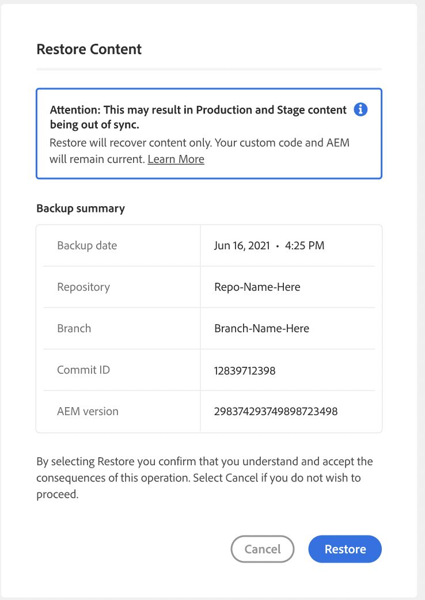

# AEM as a Cloud Service 中的內容還原 {#content-restore}

瞭解如何使用 Cloud Manager 從備份中還原 AEM as a Cloud Service 內容。

## 概觀 {#overview}

Cloud Manager 的自助還原程式會從 Adobe 系統備份中複製資料，並將其還原到其原始環境。 執行還原以將已遺失、損壞或意外刪除的資料恢復至其原始狀態。

還原程式只會影響內容，而不會變更您的程式碼和 AEM 版本。 您可以隨時啟動個別環境的還原操作。

Cloud Manager 提供兩種型別的備份，您可以從中還原內容。

* **時間點 (PIT)：** 此型別會從目前時間後過去 24 小時的連續系統備份中還原。
* **上週：** 此型別在過去七天內從系統備份還原，但前 24 小 時除外。

在這兩種情況下，您的自訂程式碼版本和 AEM 版本會維持不變。

>[!TIP]
>
>也可以使用公用API[還原備份](https://developer.adobe.com/experience-cloud/cloud-manager/reference/api/)。

>[!WARNING]
>
>* 只有在程式碼或內容發生嚴重問題時，才應使用此功能。
>* 還原備份將導致從備份到目前之間的最近資料遺失。 暫存資料也會還原為舊版本。
>* 在起始內容還原作業之前，請先考慮其他選擇性內容還原選項。

## 選擇性內容還原選項 {#selective-options}

在還原至完整內容還原之前，請考慮以下選項以更輕鬆地還原您的內容。

* 如果已刪除路徑的封裝可用，請使用[封裝管理員](/help/implementing/developing/tools/package-manager.md)再次安裝封裝。
* 如果刪除的路徑是Sites中的頁面，請使用[還原樹狀結構功能](/help/sites-cloud/authoring/sites-console/page-versions.md)。
* 如果刪除的路徑是資產資料夾，且原始檔案可供使用，請透過[Assets主控台](/help/assets/add-assets.md)重新上傳。
* 如果刪除內容為資產，請考慮還原[資產的舊版本](/help/assets/manage-digital-assets.md)。

如果上述選項都無法運作，且已刪除路徑的內容很重要，請依下列各節所述執行內容還原。

## 建立使用者角色 {#user-role}

依預設，沒有任何使用者擁有在開發、生產或中繼環境中執行內容還原的許可權。 若要將此許可權委派給特定使用者或群組，請遵循這些一般步驟。

1. 以表示式名稱建立產品描述檔，該名稱是指內容復原。
1. 提供必要程式的&#x200B;**程式存取**&#x200B;許可權。
1. 根據您的使用案例，提供程式所需環境或所有環境的&#x200B;**環境還原建立**&#x200B;許可權。
1. 將使用者指派給該設定檔。

如需管理許可權的詳細資訊，請參閱[自訂許可權](/help/implementing/cloud-manager/custom-permissions.md)檔案。

## 還原內容 {#restoring-content}

首先，決定您要還原之內容的時間範圍。 然後，若要從備份中還原環境的內容，請執行這些步驟。

>[!NOTE]
>
>使用者必須有[適當的許可權](#user-role)，才能起始還原作業。

1. 在 [my.cloudmanager.adobe.com](https://my.cloudmanager.adobe.com/) 登入 Cloud Manager 並選取適當的組織。

1. 按一下要啟動還原的程式。

1. 從&#x200B;**計畫總覽**&#x200B;頁面，在&#x200B;**環境**&#x200B;卡中，按一下您想要啟動還原的環境旁的省略符號按鈕，並選取&#x200B;**還原內容**。

   

   * 或者，您可以直接導覽至&#x200B;**還原內容**&#x200B;特定環境的「環境詳細資訊」頁面標籤。

1. 在環境詳細資料頁面的&#x200B;**還原內容**&#x200B;標籤上，先在&#x200B;**還原時間**&#x200B;下拉式清單下選取還原的時間範圍。

   1. 如果您選取&#x200B;**過去 24 小時**，相鄰的&#x200B;**時間**&#x200B;欄位可讓您指定過去 24 小時內要還原的確切時間。

      

   1. 如果您選取&#x200B;**上週**，相鄰的&#x200B;**日**&#x200B;欄位可讓您選取過去 七 天內的日期 (不包括之前的 24 小時)。

      

1. 選取日期或指定時間後，以下&#x200B;**可用備份**&#x200B;部份會顯示可還原的可用備份清單

   

1. 使用資訊圖示來尋找您要還原的備份，以檢視有關該備份中包含的程式碼版本和AEM版本的資訊，並在[選擇備份](#choosing-the-right-backup)時考慮還原的影響。

   

   * 針對還原選項顯示的時間戳記都根據使用者電腦的時區而定。

1. 按一下代表您要還原之備份列右端的&#x200B;**還原**&#x200B;圖示，以啟動還原程式。

1. 檢視以下專案的詳細資訊：**還原內容**&#x200B;對話方塊，然後再按一下以確認您的請求&#x200B;**還原**。

   

備份程式已啟動，您可以在下列位置檢視其狀態：**[還原活動](#restore-activity)**&#x200B;清單。 完成還原操作所需的時間取決於要還原的內容的大小和設定檔。

當還原成功完成時，環境將：

* 執行與啟動還原操作時相同的程式碼和 AEM 版本。
* 具有與所選快照的時間戳記上可用的內容相同，並重新建置索引以符合目前的程式碼。

## 選擇合適的備份 {#choosing-backup}

Cloud Manager 的自助式還原程式只會將內容還原到 AEM。 因此，您必須仔細考量在想要的還原點與目前時間之間所做的程式碼變更，方法是檢閱目前認可 ID 與要還原到的認可 ID 之間的認可歷史記錄。

有幾種情況。

* 環境和還原中的自訂程式碼位於相同的存放庫和相同分支。
* 環境和還原中的自訂程式碼位於相同的存放庫上，但位於具有相同認可的不同分支上。
* 環境和還原中的自訂程式碼位於不同的存放庫中。
   * 在此情況下，不會顯示認可 ID。
   * 強烈建議您原地複製兩個存放庫，並使用差異工具來比較分支。

此外，請記住，還原可能會導致您的生產和測試環境失去同步。 還原內容的後果由您負責。

## 還原活動 {#restore-activity}

**還原活動**&#x200B;清單顯示最近十個還原要求的狀態，包括任何使用中的還原操作。

按一下備份的資訊圖示，即可下載該備份的記錄，並檢查程式碼詳細資訊，包括啟動還原時的快照與資料之間的差異。

## 異地備份 {#offsite-backup}

定期備份涵蓋 AEM Cloud Service 中意外刪除或技術故障的風險，但區域故障可能會帶來其他風險。 除了可用性外，這類地區中斷的最大風險是資料遺失。

AEM as a Cloud Service 會持續將所有 AEM 內容複製到遠端區域，並讓該內容在三個月的時間內可供復原，藉此緩解所有 AEM 生產環境的這項風險。 此功能稱為異地備份。

在資料區域發生中斷時，AEM 服務可靠性工程部門會從異地備份復原用於中繼和生產環境的 AEM Cloud Service。

## 限制 {#limitations}

自助還原機制的使用受下列限制。

* 還原作業限制為七天，這表示無法還原超過七天的快照。
* 每個日曆月，一個計畫中的所有環境最多允許 10 次成功還原。
* 環境建立後，需要六個小時才能建立第一個備份快照。 在建立此快照之前，無法對環境執行還原。
* 如果環境目前正在執行完整棧疊或 Web 層設定管道，則不會起始還原操作。
* 如果同一環境中已執行另一個還原，則無法啟動還原。
* 在極少數的情況下，由於備份時間限制為 24 小時/ 7 天選取的備份可能會因為選取備份到啟動還原之間的延遲而變得無法使用。
* 已刪除環境中的資料會永久遺失且無法復原。
