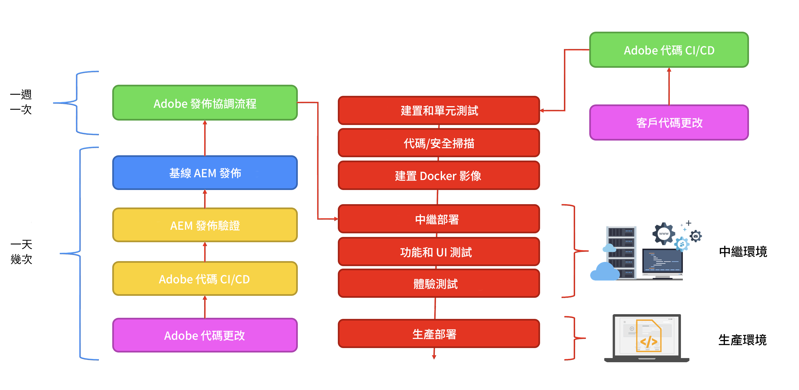

# Adobe Experience Manager as a Cloud Service 架構簡介 {#an-introduction-to-the-architecture-adobe-experience-manager-as-a-cloud-service}

>[!CONTEXTUALHELP]
>id="intro_aem_cloudservice_architecture"
>title="AEM as a Cloud Service Architecture 簡介"
>abstract="在此索引標籤中，您可以檢視 AEM as a Cloud Service 的新架構並了解變更。AEM 產生了具有可變影像數量的動態架構，因此請務必花時間了解雲端架構。"
>additional-url="https://video.tv.adobe.com/v/330542/" text="架構概觀"

Adobe Experience Manager (AEM) as a Cloud Service 提供一組可組合的服務，用於建立和管理高影響力的體驗。

本頁面介紹 AEM as a Cloud Service 的邏輯架構、服務架構、系統架構及開發架構。

## 邏輯架構 {#logical-architecture}

AEM as a Cloud Service 是由 AEM Sites、AEM Assets 和 AEM Forms 等高階解決方案組成。這些服務是個別授權，但可以在共同作業中使用。每個解決方案都使用 AEM as a Cloud Service 提供之可組合服務的組合，但具體取決於其各自的使用案例。

### 方案 {#programs}

視授權權利而定，AEM 應用程式會以您在 Cloud Manager 應用程式中建立的[方案](/help/implementing/cloud-manager/getting-access-to-aem-in-cloud/program-types.md)形式具體化。這些方案可讓您在特定專案環境中完全控制 AEM 應用程式的命名、設定和權限的分配。

身為客戶，您通常被 Adobe 識別為&#x200B;**租用戶**，也稱為 *IMS 組織* (Identity Management System)。租用戶可以視需要擁有任意數量的方案並獲得授權。例如，AEM Assets 常見於統一管理的方案，AEM Sites 則可能在對應於多種線上體驗的多重方案中使用。

>[!NOTE]
>
>AEM Edge Delivery Services 在 Cloud Manager 中是以最高層級解決方案公開，而從授權的角度來看，這是其他主要解決方案的一部分。例如，具有 Edge Delivery Services 的 AEM Sites。

方案可以設定為高層級解決方案的任意組合，而且每個解決方案都可以獲得一對多附加元件的支援。例如，AEM Sites 的 Commerce 或 Screens、AEM Assets 的 Dynamic Media 或 Brand Portal。

### 環境 {#environments}

使用 AEM Sites、AEM Assets 或 AEM Forms 解決方案建立方案後，相關聯的 AEM 執行個體將在此方案中以 AEM 環境的形式表示。

AEM as a Cloud Service 提供四種類型的[環境](/help/implementing/cloud-manager/manage-environments.md)：

* 生產環境：

   * 生產環境為商業從業者託管應用程式並執行即時體驗。

* 中繼環境：

   * 中繼環境通常與生產環境維持 1:1 的關係。
   * 中繼環境的主要設計，是在將應用程式的變更推送至生產環境之前進行自動化測試。
      * 這與 Adobe 作為維護更新的一部分或透過您的程式碼部署發起的變更無關。
      * 您也可以在程式碼部署時進行手動測試。
   * 中繼環境的內容通常會透過自助內容複製功能與生產內容保持同步。
   * 在中繼環境進行效能和安全測試。它的大小與生產環境相同。
* 開發環境：
   * 開發環境可讓您的開發人員在與中繼和生產環境相同的執行階段條件下，實作和測試 AEM 應用程式。
   * 這些變更是透過部署管道進行，以便具備與生產部署管道相同的程式碼品質和安全閘道。
   * 開發環境的大小與中繼環境和生產環境不同，且不應用於進行效能和安全測試。
* 快速開發環境 (RDE)：
   * 將新的或現有的程式碼部署到 RDE 執行個體時，RDE 環境可進行快速的開發疊代，而無需像一般開發環境那樣透過正式的部署管道。

### Edge Delivery Services {#logical-architecture-edge-delivery-services}

AEM 方案也可以設定為 [Edge Delivery Services](/help/edge/overview.md)。

設定完成後，AEM 可以參照用於建立具備 Edge Delivery Services 體驗的 GitHub 程式碼存放庫。因此，新的設定選項就可以用於相關聯的體驗。其中包括設定 Adobe-Managed CDN 以及存取授權指標或 SLA 報告。

## 服務架構 {#service-architecture}

AEM as a Cloud Service 中的高層級可組合服務清單可以用兩個區段表示 - 內容管理和體驗交付：

內容管理有兩組主要的內容製作服務，兩者都以&#x200B;*內容來源*&#x200B;來表示：

* AEM 製作層：
提供網頁型介面 (具備相關聯的 API) 來管理網頁內容。這適用於兩種方法：
   * 有周邊 - 透過頁面編輯器和 Universal Editor
   * Headless - 透過內容片段編輯器
* 文件型製作層：
可讓您使用標準應用程式製作內容，例如：
   * Microsoft Word 和 Excel - 透過 SharePoint
   * Google 文件和試算表 - 透過 Google 雲端硬碟

對於體驗交付，使用 AEM Sites 或 AEM Forms 時，還有兩組主要的服務，它們不互斥，而且在共用的 Adobe-Managed CDN (內容傳遞網路) 下以不同的來源運作：

* AEM 發佈層：
   * 執行標準 AEM 發佈器和 Dispatcher 陣列，允許動態呈現網頁以及已集結發佈內容的 API 內容 (例如 GraphQL)。
   * 主要以伺服器端應用程式邏輯為基礎。
* Edge Delivery 發佈層：
   * 允許動態呈現來自各種內容來源 (例如 AEM 製作層或文件型製作層) 的網頁和 API 內容。
   * 以用戶端應用程式邏輯為基礎，專門發揮最大效能。

還有關鍵的相鄰服務：

* Edge Delivery Assets 層：
   * 可從 AEM Assets 交付已批准和已發佈的媒體項目。例如影像和影片。
   * 媒體項目通常是從 AEM 發佈層或 Edge Delivery 發佈層上執行的體驗中引用，或是從與 AEM Assets 整合的任何其他 Adobe Experience Cloud 應用程式中引用。
* AEM 預覽層和 Edge Delivery Services 預覽層：
   * 也適用於分別使用 AEM 發佈層或 Edge Delivery 發佈層建置的體驗。
   * 可讓內容製作在發佈操作之前預覽上下文中的內容。

>[!NOTE]
>
>根據預設，僅限 Assets 的方案沒有發佈層，也沒有預覽層。

還有其他鄰近服務：

* 複寫服務：
   * 位於內容管理層和體驗交付層之間。
   * 負責處理內容作者核發的&#x200B;*發佈*&#x200B;操作，然後將發佈的內容提供給發佈層 (AEM 或 Edge Delivery)。

  >[!NOTE]
  >與 AEM 6.x 版本相比，複寫服務已經過徹底的重新設計，因為先前版本 AEM 的複寫框架不再用來發佈內容。
  >
  >最新的架構是以使用雲端型內容佇列的&#x200B;*發佈和訂閱*&#x200B;方法為基礎。對於 AEM 發佈層，它允許可變數量的發佈者訂閱發佈內容，而且對於 AEM as a Cloud Service 而言，這是實現真正快速之自動調整規模的重要組成部分

* 內容存放庫服務：
   * 由 AEM 製作層使用。
   * 是 JCR 相容內容存放庫的雲端型執行個體，由 Apache Oak 技術實作。
   * 內容的持久性主要以 blob 型雲端儲存空間為基礎。
* CI/CD 服務：
   * 代表專用於管理 AEM 環境部署管道的 Cloud Manager 功能子集。
* 測試服務：
   * 代表用於執行以下內容的底層基礎結構：
      * 功能測試、
      * UI 測試 (例如以 Selenium 或 Cypress 指令碼為基礎)、
      * 體驗稽核測試 (例如 Lighthouse 分數)、

     作為 AEM 環境部署管道的一部分，或作為 Edge Delivery 程式碼存放庫之 GitHub 提取要求的一部分。
* 資料服務：
   * 負責公開客戶資料，例如授權指標 (例如內容要求、儲存、使用者) 或使用報告 (例如上傳、下載數量)。
   * 客戶資料可以透過 API 以及在產品使用者介面中 (例如 Cloud Manager) 公開。
* 操作遙測服務：
   * 負責從客戶體驗中收集關鍵量度 (例如頁面瀏覽次數、Core Web Vitals、轉換事件)，並回應相關聯查詢 (例如過去 7 天內指定網域的熱門頁面瀏覽次數)。
* Assets Compute 服務：
   * 負責處理上傳的影像、影片和文件；例如 PDF 和 Adobe Photoshop 檔案。處理作業可使用Adobe AI擷取影像和視訊中繼資料（例如描述性標籤或主要色調），然後產生轉譯（例如不同大小或格式），並存取Adobe Photoshop和Adobe Lightroom API等API。
* Identity Management Service (IMS)：
   * 是負責管理和驗證指定 Adobe Experience Cloud 應用程式 (例如 Cloud Manager 或 AEM 製作層) 之使用者和使用者群組的中心位置。
   * 透過 Adobe Admin Console 存取。

## 系統架構 {#system-architecture}

### AEM 製作、預覽和發佈層 {#aem-author-preview-publish-tiers}

AEM 製作層和發佈層是以一組 Docker 容器實作，由標準的 Container Orchestration Service 運作。所產生的容器化架構代表的是完全動態的系統、具有可變數量的 Pod，且取決於實際活動 (用於內容管理) 和實際流量 (用於體驗交付)。這樣可使 AEM as a Cloud Service 因應您的流量模式而變更。

AEM 製作層是以共用單一內容存放庫的 AEM 製作 Pod 叢集進行操作。至少兩個 Pod 就能夠在執行維護任務或進行部署流程時實現業務連續性。

AEM 發佈層是以 AEM 發佈執行個體陣列執行，每個執行個體都有自有的已發佈內容的內容存放庫。每個發佈者都會搭配一個配備 AEM Dispatcher 模組的 Apache 執行個體，用於內容的具體化檢視，作為 Adobe-Managed CDN 的來源。至少兩個 Pod 也能夠實現業務連續性，但在高流量期間看到這個數字擴大並不罕見。

AEM 預覽層是由單一 AEM 節點組成。在發佈至發佈層之前，這可用來確保內容的品質。預覽層偶爾會發生停機，尤其是在部署期間。

### Edge Delivery Services {#system-architecture-edge-delivery-services}

Edge Delivery Services 是在 CDN 和無伺服器基礎結構上運作，以最高效的方式組合頁面。要求資源時，無伺服器基礎結構會負責將發佈的內容轉換為語義 HTML，並作為 CDN 的來源。

對語義 HTML 的轉換發生自 AEM 製作層或文件型製作環境所提供的已發佈內容中。

下圖說明如何在 Microsoft Word (文件型製作) 中編輯 Sites 內容並將其發佈到 Edge Delivery。圖中還展示了使用各種編輯器的傳統 AEM 發佈方法。

Edge Delivery Services 屬於 Adobe Experience Manager 一部分，因此 Edge Delivery、AEM Sites 和 AEM Assets 可以在相同網域中共存。這是較大型網站的常見使用案例。例如，客戶可能希望將高流量的特定頁面移轉到 Edge Delivery Services，所有其他頁面則可能保持在 AEM 發佈層上。

## 開發架構 {#development-architecture}

### 程式碼存放庫 {#code-repositories}

AEM 專案的程式碼和設定會儲存在程式碼存放庫中；進行變更時，會從該存放庫發出部署管道。有不同類型的程式碼存放庫：

* AEM 全堆疊：
   * 用於儲存 AEM 製作層和發佈層的伺服器端 Java 程式碼和 OSGI 設定。
* AEM 前端：
   * 用於儲存 AEM 製作和發佈層的用戶端 JS、CSS 和 HTML 程式碼。
如需更多有關 clientlibs 的詳細資料，請參閱「[在 AEM as a Cloud Service 上使用用戶端資料庫](/help/implementing/developing/introduction/clientlibs.md)」。
* AEM Web 層：
   * 儲存 AEM 發佈層的 Dispatcher 設定檔案。
* AEM 設定：
   * 可儲存 AEM 發佈層和 Edge Delivery Services 發佈層的各種設定選項 (例如 CDN 設定或維護任務設定)。
* AEM 邊緣交付：
   * 用於儲存使用 Edge Delivery Services 建置之網站的用戶端 JS、CSS 和 HTML 程式碼

### 部署管道 {#deployment-pipelines}

開發人員和管理員可使用 Continuous Integration/Continuous Delivery (CI/CD) 服務 (可透過 Cloud Manager 取得) 管理 AEM as a Cloud Service 應用程式。Cloud Manager 也會公開任何與監控、維護和疑難排解相關的內容 (例如記錄檔的存取權) 和授權。

Cloud Manager 會管理 AEM as a Cloud Service 執行個體的所有更新。這屬於強制性質的管理作業，是對製作、預覽和發佈層建置、測試和部署客戶應用程式的唯一方式。AEM Cloud Service 推出新版本時，Adobe 便會觸發這些更新作業；您的應用程式推出新版本時，則由您自己觸發。

這是透過搭配至方案中每個環境的部署管道來實作。Cloud Manager 管道運作時，會對製作及發佈層同時建立客戶應用程式的新版本。這主要是透過結合最新客戶套件和最新基準 Adobe 影像來達成。

客戶變更程式碼或 Adobe 部署新的維護版本時，就會觸發部署管道。

在這兩種情況下，都會執行同一組自動化測試。它包括的測試是：

* 由 Adobe 提供，以確保產品完整性
* 客戶提供的測試
   * 功能測試：透過向 AEM 製作或發佈層發出 http 要求
   * UI 測試：基於 Selenium 或 Cypress 技術

這些自動化測試是在中繼環境中執行──這就是務必使中繼環境內容盡可能接近生產執行個體上之內容的原因。

一旦所有測試都成功通過，新程式碼就會部署到生產環境。

### 滾動式更新 {#rolling-updates}

Cloud Manager 會透過滾動式更新模式來更新所有服務節點，藉此完全自動切換到最新版本的 AEM 應用程式。這表示製作或發佈服務時不會產生&#x200B;**任何停機時間**。

## 自 AEM 6.x 以來的重大創新 {#major-innovations-since-aem-6x}

與前幾代產品 (AEM 6.x 和先前版本) 相比，AEM as a Cloud Service 的最新架構提出了幾項根本上的變革與創新：

* 所有檔案都是從雲端資料存放區直接上傳和提供。相關聯的位元串流不會經過 AEM 製作和發佈服務的 JVM 處理。所以，AEM 製作和發佈服務的節點可能更小，因此更符合快速自動調整規模的期望。商務從業人員在上傳及下載影像、影片和進行其他任務時，可因此享有更快速的體驗。

* 所有構成發佈內容的作業現在皆需遵循訂閱模式，納入管道。發佈內容會推送至管道中的各個佇列，而發佈服務的所有節點都會訂閱這些佇列。因此，製作層不需知悉發佈服務中的節點數量，這可讓發佈層快速自動調整規模。

* 該架構將應用程式內容與應用程式的程式碼和設定完全分離。所有程式碼和設定實際上都不可改變，且會製作成基準影像，據以建立製作及發佈服務的各種節點。因此，每個節點都保證相同，只有執行 Cloud Manager 管道，才能對程式碼和設定執行全域變更。

* 該架構包括基於無伺服器技術構建的多個微服務，尤其是搭配 Adobe I/O Runtime 時

## 更多資訊 {#further-information}

* 方案設定
   * [上線歷程](/help/journey-onboarding/overview.md)
   * [方案和方案類型](/help/implementing/cloud-manager/getting-access-to-aem-in-cloud/program-types.md)
* 開發架構
   * [Cloud Manager 存放庫](/help/implementing/cloud-manager/managing-code/managing-repositories.md)
   * [CI/CD 管道](/help/implementing/cloud-manager/configuring-pipelines/introduction-ci-cd-pipelines.md)
   * [程式碼品質測試](/help/implementing/cloud-manager/code-quality-testing.md)
* Edge Delivery Services：
   * [AEM as a Cloud Service 概觀 - 含 Edge Delivery Services](/help/edge/overview.md)
   * [使用 Edge Delivery Services](/help/edge/overview.md)
   * [探索 AEM as a Cloud Service 含 Edge Delivery Services 的基本架構和重要元件。](https://experienceleague.adobe.com/docs/experience-manager-learn/cloud-service/introduction/architecture.html)
