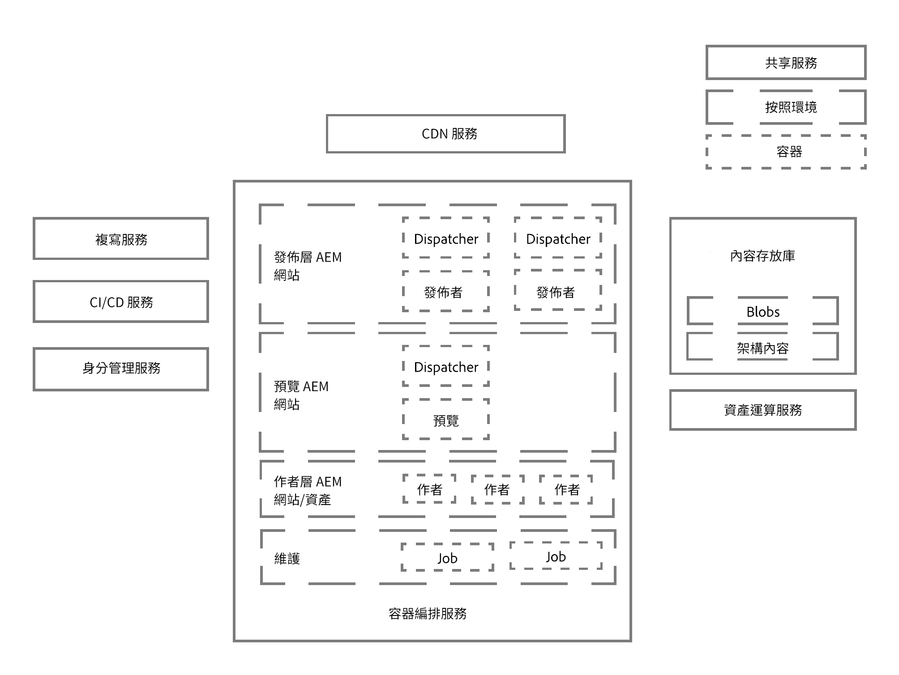
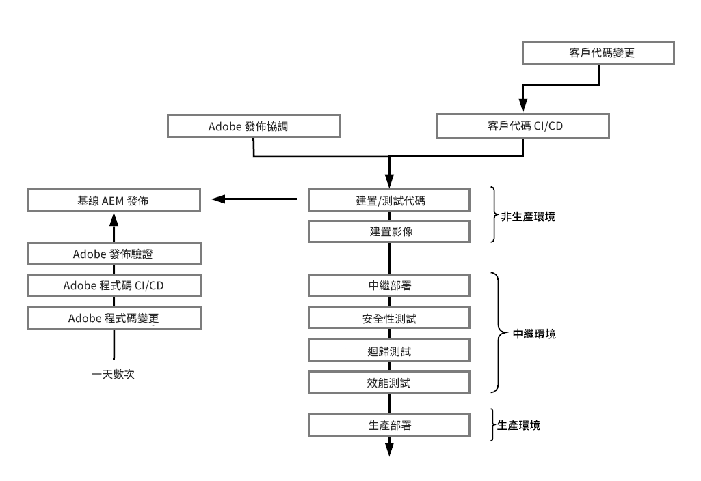

# Adobe Experience Manager as a Cloud Service 架構簡介 {#an-introduction-to-the-architecture-adobe-experience-manager-as-a-cloud-service}

>[!CONTEXTUALHELP]
>id="intro_aem_cloudservice_architecture"
>title="as a Cloud Service架AEM構簡介"
>abstract="在此頁籤中，您可以查看新的AEMas a Cloud Service體系結構並瞭解更改。 AEM已產生具有可變影像數的動態體系結構，因此花費時間去瞭解它非常重要。"
>additional-url="https://video.tv.adobe.com/v/330542/" text="體系結構概述"

Adobe Experience Manager (AEM) as a Cloud Service 的架構有所變更。

## 縮放比例 {#scaling}

AEM as a Cloud Service 現已具備：

* AEM 映像數量可變的動態架構。

此架構特色：

* 根據&#x200B;*實際*&#x200B;流量和&#x200B;*實際*&#x200B;活動調整規模。

* 需要時才會執行某些個別例項。

* 使用模組化應用程式。

* 以製作叢集為預設值，這能避免因執行維護任務而發生停機狀況。

如此一來，架構就能根據多變的使用模式，自動調整規模：

為達此目的，AEM as a Cloud Service 的所有例項在建立之初條件皆相等，節點數、配置的記憶體和運算容量等方面，每個例項都具有相同的預設大小調整特性。

AEM as a Cloud Service 以協調引擎為運作基礎，該引擎的功能包括：

* 持續監控服務狀態。

* 根據實際需求動態調整每個服務例項的規模，可視需求擴充或縮減。

此特性：

* 適用於節點數、記憶體大小和每個節點所配置的 CPU 容量。

* 使 AEM as a Cloud Service 能因應流量變化。

您可以在兩軸上透過自動或手動方式，為服務的每個租用戶例項調整規模：

* 垂直：可針對固定的節點數量擴充或縮減配置的記憶體和 CPU 容量。

* 水平：可針對特定服務增減節點數量。

## 環境 {#environments}

>[!NOTE]
>如需詳細資訊，請參閱[部署 - 執行模式](/help/implementing/deploying/overview.md#runmodes)

AEM as a Cloud Service 可作為個別例項使用，每個例項皆代表完整的 AEM 環境。

有三種類型的環境，具AEM有as a Cloud Service:

* **生產環境**：為商務從業人員代管應用程式。

* **預備環境**：始終與單一生產環境維持 1:1 關係。將應用程式的變更推送至生產環境之前，可先使用預備環境測試效能和品質。

* **開發環境**：開發人員可在與預備和生產環境相同的執行階段條件下，實作 AEM 應用程式。

   請參閱 [管理環境](https://experienceleague.adobe.com/docs/experience-manager-cloud-service/implementing/using-cloud-manager/manage-environments.html?lang=en#using-cloud-manager) 的子菜單。

## 計劃 {#programs}

所有新的 AEM 專案都會與單一特定程式碼基底建立繫結，專案的設定和自訂程式碼都會儲存於基底之中。這些資訊會儲存在程式碼存放庫中，供您在建立新計劃時使用，透過一般的 Git 用戶端即可存取。

AEM 計劃是包含下列項目的容器：

|  計劃元素 |  數量 |
|--- |--- |
| 程式碼存放庫 (Git) |  1 |
| 基準映像 (Sites 或 Assets) |  1 |
| 預備和生產環境集 (1:1) | 0 或 1 |
| 非生產環境 (開發或展示) | 0 到 N |
| 各環境相關管道 | 0 或 1 |

AEM as a Cloud Service 最初提供兩種類型的計劃：

* AEM Cloud Sites Service

* AEM Cloud Assets Service

兩者皆可存取幾項功能。作者層將包含所有程式的所有站點和資產功能，但預設情況下，資產程式將不具有發佈層或預覽層。

## 執行階段架構 {#runtime-architecture}

此新架構具備多種主要元件：

<!--- needs reworking -->

* AEM Sites as a Cloud Service：

   * 延續各環境 (高階層) 具備製作層級和發佈層級的概念。

   * 製作層級是由單一製作叢集內兩個以上節點所組成，會根據製作活動自動調整規模。

      * 內容作者/建立者登入 AEM 製作層級，以建立、編輯及管理內容。

      * 製作層級的登入活動由 Adobe Identity Management Services (IMS) 管理。

      * Assets 整合與處理作業會使用專屬的 Assets Compute Service。
   * 預覽層由單個預覽節點組成。 這用於在發佈到發佈層之前保證內容的質量。

   * 發佈層級是由單一發佈伺服器陣列中兩個以上節點所組成：節點可獨立運作。每個節點均包含 AEM 發佈者和具備 AEM Dispatcher 模組的網頁伺服器，而節點會根據網站流量需求自動調整規模。

      * 一般使用者或網站訪客能透過 AEM Publish Service 造訪網站。

* AEM Assets as a Cloud Service：

   * 此架構僅包含製作環境。

* 作者層、預覽層和發佈層都從內容儲存庫服務讀取並保留內容。

   * 發佈層和預覽層僅從持久性層讀取內容。

   * 製作層級會從持續層讀取內容，也會將內容寫入持續層。

   * Blob儲存在發佈層、預覽層和作者層之間共用；檔案不 *移動*。

   * 當內容從作者層獲得批准時，這表示內容可以被激活，因此被推到發佈層持久性層；或（可選）預覽層。 此過程會透過複寫服務 (一種中介管道) 來實現。該管道接收新內容，而單個發佈服務（或預覽服務）節點訂閱推送到管道的內容。

      >[!NOTE]
      >
      >如需詳細資訊，請參閱[複寫](/help/operations/replication.md)。

   * 開發人員和管理員能使用 Continuous Integration/Continuous Delivery (CI/CD) 服務 (可透過 [Cloud Manager](/help/overview/what-is-new-and-different.md#cloud-manager) 取得) 管理 AEM as a Cloud Service，包括使用 Cloud Manager 的 CI/CD 管道來部署程式碼和設定。任何與監控、維護和疑難排解相關的項目 (例如記錄檔)，都會向 Cloud Manager 中的客戶公開。

   * 使用者需一概透過負載平衡器存取製作和發佈層級。負載平衡器會與各層級作用中的節點連動，反映其最新狀態。

   * 對於發佈層和預覽層，連續分發網路(CDN)服務也可用作第一入口點。

* 對於 AEM as a Cloud Service 的展示例項，架構會簡化為單一製作節點，因此不會呈現標準開發、預備或生產環境的所有特點。換言之，架構偶爾會發生停機現象，且不支援備份/還原操作。

## 部署架構 {#deployment-architecture}

Cloud Manager 會管理 AEM as a Cloud Service 例項的所有更新。它是強制性的，是構建、test和部署客戶應用程式的唯一方法，可同時用於作者、預覽和發佈層。 AEM 雲端服務發佈最新版本時，Adobe 便會觸發這些更新作業，或是當客戶的應用程式推出最新版本時，由客戶觸發。

技術上來說，這是基於部署管道，與計劃中各環境配合之下的實作結果。當Cloud Manager管道正在運行時，它會為作者、預覽和發佈層建立客戶應用程式的新版本。 這主要是透過結合最新客戶套件和最新基準 Adobe 映像來達成。成功建立並測試新映像後，Cloud Manager 會採取滾動式更新模式，更新所有服務節點，使移轉至最新映像版本的作業全面自動化。因此，製作或發佈服務時不會產生任何停機時間。

<!--- needs reworking -->

## 內容發佈 {#content-distribution}

Adobe Experience Manager as a Cloud Service 修改了發佈內容的方式。有了 AEM as a Cloud Service，舊版 AEM 的複寫框架將不再用於發佈頁面 (將變更從製作例項移至發佈例項)。

AEM as a Cloud Service 現在主要使用 [Sling 內容分送](https://sling.apache.org/documentation/bundles/content-distribution.html)功能來移動適當內容。這會使用 Adobe I/O 上執行的管道服務，該服務獨立於 AEM 執行階段之外。

設定程序會自動完成，包括在執行階段新增、移除或回收發佈節點時自動完成設定。

單一發佈或取消發佈要求中可包含多項資源，但系統僅會針對所有資源傳回單一狀態，換言之，AEM Publish Service 的所有資源會全部顯示為處理成功或失敗。這可避免 AEM Publish Service 中的資源處於不一致的狀態。

**高階內容發佈架構圖**

## 重要革新 {#key-evolutions}

比起前幾代產品，AEM as a Cloud Service 的新架構提出了幾項根本變革與創新：

* 所有檔案 (Blob) 一律從雲端資料存放區直接上傳及提供。相關聯的位元串流一律不經 AEM 製作和發佈服務的 JVM 處理。因此，AEM 製作和發佈服務的節點可以更少，更符合快速自動調整規模的期望。商務從業人員可因此享有更快速的影像、影片上傳與下載體驗。

* 所有構成發佈內容的作業現在皆需遵循訂閱模式，納入管道。發佈內容會推送至管道中的各個佇列，而發佈服務的所有節點都會訂閱這些佇列。因此，製作層級不需知悉發佈服務中的節點數量，這可讓發佈層級快速自動調整規模。

* 導入 Golden Master 概念，實現發佈節點生命週期自動化。Golden Master 是專門的發佈節點，所有一般使用者都無法存取，且系統會從中建立發佈服務的所有節點。維護操作 (例如壓縮) 會在附加至 Golden Master 的內容存放庫中執行。這些發佈節點每天都會回收，不需任何例行維護。過去，這類維護工作會產生些許停機時間，尤其是處理製作例項時，更為顯著。

* 該架構將應用程式內容與應用程式的程式碼和設定完全分離。所有程式碼和設定實際上都不可改變，且會製作成基準映像，據以建立製作及發佈服務的各種節點。因此，每個節點都保證相同，只有執行 Cloud Manager 管道，才能對程式碼和設定執行全域變更。
