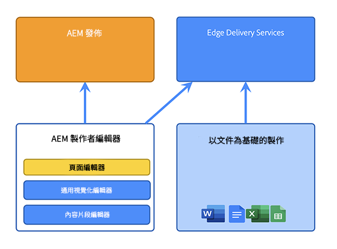

# Adobe Experience Manager as a Cloud Service 架構簡介 {#an-introduction-to-the-architecture-adobe-experience-manager-as-a-cloud-service}

>[!CONTEXTUALHELP]
>id="intro_aem_cloudservice_architecture"
>title="AEM as a Cloud Service Architecture 簡介"
>abstract="在此索引標籤中，您可以檢視 AEM as a Cloud Service 的新架構並了解變更。AEM 產生了具有可變影像數量的動態架構，因此請務必花時間了解雲端架構。"
>additional-url="https://video.tv.adobe.com/v/330542/" text="架構概述"

Adobe Experience Manager (AEM) as a Cloud Service提供一組可撰寫的服務，用於建立和管理高影響力的體驗。

此頁面提供AEMas a Cloud Service的邏輯架構、服務架構、系統架構和開發架構簡介。

## 邏輯架構 {#logical-architecture}

AEMas a Cloud Service由AEM Sites、AEM Assets和AEM Forms等高階解決方案組成。 這些服務會個別授權，但可用於共同作業。 每個解決方案會根據其各自的使用案例，組合使用AEMas a Cloud Service提供的可組合服務。

### 計畫 {#programs}

AEM應用程式的具體化形式為 [計畫](/help/implementing/cloud-manager/getting-access-to-aem-in-cloud/program-types.md) 根據您的授權權利，在Cloud Manager應用程式中建立的專案。 這些程式可讓您完全控制特定專案內容中關聯AEM應用程式的命名、設定及許可權配置方式。

身為客戶，Adobe通常會將您識別為 **租使用者**，也稱為 *IMS組織* (Identity Management系統)。 租使用者可擁有所需數量的計畫並取得授權。 例如，通常會看到AEM Assets的中央程式，而AEM Sites可能會用於對應多個線上體驗的多個程式中。

>[!NOTE]
>
>AEMEdge Delivery Services在Cloud Manager中公開為頂級解決方案，但從授權的角度來說，則是其他主要解決方案的一部分。 例如，具有Edge Delivery Services的AEM Sites。

計畫可設定為包含任何高階解決方案的組合，每個解決方案都可支援一對多附加元件。 例如，Commerce或Screens for AEM Sites、Dynamic Media或Brand Portal for AEM Assets。

### 環境 {#environments}

使用AEM Sites、AEM Assets或AEM Forms解決方案建立計畫後，關聯的AEM執行個體將在此計畫中以AEM環境的形式表示。

有四種型別 [環境](/help/implementing/cloud-manager/manage-environments.md) 適用於AEMas a Cloud Service：

* 生產環境：

   * 生產環境為商務從業人員託管應用程式並執行即時體驗。

* 中繼環境：

   * 預備環境通常與生產環境維持1:1關係。
   * 預備環境主要是為自動化測試而設計，之後才會將對應用程式的變更推送至生產環境。
      * 這與Adobe在維護更新時啟動的變更無關，也與程式碼部署無關。
      * 您也可以在程式碼部署的情況下進行手動測試。
   * 使用自助式內容複製功能，預備環境的內容通常會與生產內容保持同步。
* 開發環境：
   * 開發環境可讓您的開發人員在與預備和生產環境相同的執行階段條件下，實作和測試AEM應用程式。
   * 變更會透過部署管道進行，允許與生產部署管道相同的計畫碼品質和安全性閘道。
* 快速開發環境(RDE)：
   * 將新的或現有的程式碼部署到RDE執行個體中時，RDE環境可讓您進行快速開發反複專案，而不需依照一般開發環境的方式，透過正式的部署管道。

### Edge Delivery Services {#logical-architecture-edge-delivery-services}

AEM程式可設定為 [Edge遞送服務](/help/edge/overview.md) 以及。

在設定之後，AEM可以參考用來建置具有Edge Delivery Services的體驗的GitHub程式碼存放庫。 因此，新的設定選項將可用於關聯的體驗。 這些功能包括設定Adobe管理的CDN，以及存取授權量度或SLA報告。

## 服務架構 {#service-architecture}

AEMas a Cloud Service中高層級可撰寫服務清單可由兩個區段表示 — 內容管理及體驗傳送：

針對內容管理，製作內容有兩個主要服務集，分別表示為 *內容來源*：

* AEM作者階層：提供用於管理網頁內容的網頁型介面（具有相關聯的API）。 這適用於兩種方法：
   * Headful — 透過頁面編輯器和通用編輯器
   * Headless — 透過內容片段編輯器
* 檔案型編寫階層：可讓您使用標準應用程式來編寫內容，例如：
   * Microsoft Word和Excel — 透過SharePoint
   * Google檔案和工作表 — 透過Google Drive

就體驗傳送而言，使用AEM Sites或AEM Forms時，也有兩組主要服務，非互斥，且以共用Adobe管理的CDN （內容傳送網路）作為不同來源運作：

* AEM發佈階層：
   * 執行標準AEM發佈程式和Dispatcher的陣列，允許動態轉譯與已發佈內容組合在一起的網頁和API內容(例如GraphQL)。
   * 主要是以伺服器端應用程式邏輯為基礎。
* Edge Delivery發佈階層：
   * 允許動態呈現來自各種內容來源(例如AEM作者層級或檔案型編寫層)的網頁和API內容。
   * 以使用者端應用程式邏輯為基礎，專為最佳效能而設計。

此外，還有關鍵的相鄰服務：

* 邊緣傳送資產階層：
   * 允許從AEM Assets傳送已核准和已發佈的媒體專案。 例如影像和影片。
   * 媒體專案通常會從在AEM發佈層級或Edge Delivery發佈層級執行的體驗，或是從與AEM Assets整合的任何其他Adobe Experience Cloud應用程式中參照。
* AEM預覽層和Edge Delivery Services預覽層：
   * 也可供分別以AEM發佈層級或Edge Delivery發佈層級建立的體驗使用。
   * 可讓內容作者在發佈作業前預覽內容內容。

>[!NOTE]
>
>依預設，僅限資產的計畫沒有發佈層級，也沒有預覽層級。

還有其他相鄰的服務：

* 復寫服務：
   * 位於內容管理層級與體驗傳送層級之間。
   * 負責處理 *發佈* 由內容作者所發行的作業，然後將已發佈內容提供給發佈階層(AEM或Edge Delivery)。

  >[!NOTE]
  >與AEM 6.x版相比，復寫服務經過了完整的重新設計，因為舊版AEM的復寫架構不再用於發佈內容。
  >
  >最新的架構是以 *發佈和訂閱* 雲端式內容佇列的方法。 對於AEM發佈層級，它允許可變數量的發佈者訂閱發佈內容，並且是為AEMas a Cloud Service實現真正和快速自動縮放的必要部分

* 內容存放庫服務：
   * 由AEM作者層級使用。
   * 是符合JCR的內容存放庫的雲端型例項，由Apache Oak技術實作。
   * 內容的持續性主要根據blob型雲端儲存空間。
* CI/CD服務：
   * 代表專門用於管理通往AEM環境的部署管道的Cloud Manager功能子集。
* 測試服務：
   * 代表用來執行的基礎架構：
      * 功能測試，
      * UI測試：例如，根據Selenium或Cypress指令碼，
      * 體驗稽核測試：例如Lighthouse分數、

     作為指向AEM環境的部署管道的一部分，或作為指向Edge傳送計畫碼存放庫的GitHub提取請求的一部分。
* 資料服務：
   * 負責公開客戶資料，例如授權量度（例如內容請求、儲存、使用者）或使用報表（例如上傳和下載的數量）。
   * 客戶資料可透過API並在產品使用者介面（例如Cloud Manager）中公開。
* 即時使用者量度(RUM)服務：
   * 負責從客戶體驗中收集關鍵量度（例如頁面檢視、核心Web重要功能、轉換事件），以及回應相關查詢（例如過去7天內指定網域的最上層頁面檢視）。
* 資產計算服務：
   * 負責處理上傳的影像、影片和檔案；例如PDF和Adobe Photoshop檔案。 處理作業可使用Adobe Sensei來擷取影像和視訊中繼資料（例如描述性標籤或主要色調），然後產生轉譯（例如不同大小或格式），並存取Adobe Photoshop和Adobe Lightroom API等API。
* Identity Management服務(IMS)：
   * 是負責管理和驗證指定Adobe Experience Cloud應用程式(例如，Cloud Manager或AEM作者階層)的使用者和使用者群組的中央位置。
   * 可透過Adobe Admin Console存取。

## 系統架構 {#system-architecture}

### AEM作者、預覽和發佈階層 {#aem-author-preview-publish-tiers}

AEM製作和發佈層級作為一組Docker容器實施，由標準Container Orchestration Service操作。 產生的容器化架構表示完全動態的系統，其Pod數量會依實際活動（用於內容管理）和實際流量（用於體驗傳送）而定。 這可讓AEMas a Cloud Service在流量模式變更時進行調整。

AEM作者層級是以AEM作者Pod叢集的方式運作，共用單一內容存放庫。 在執行維護工作或部署程式時，至少兩個Pod可提供業務連續性。

AEM發佈層級是以AEM發佈執行個體的陣列來運作，每個執行個體都有其自己已發佈內容的內容存放庫。 每個發佈者都會連線到一個配備AEM Dispatcher模組的Apache執行個體，以用於內容的具體化檢視，當作Adobe管理的CDN的來源。 至少兩個Pod也可以實現業務連續性，但在高流量期間這個數字會增加的情況並不罕見。

AEM預覽層級由單一AEM節點組成。 這用於在發佈到發佈層級之前保證內容品質。 偶爾的停機時間，尤其是在部署期間，可能會發生在預覽層級。

### Edge Delivery Services {#system-architecture-edge-delivery-services}

這些Edge Delivery Services在CDN和無伺服器基礎架構之上運作，以最有效率的方式組裝頁面。 請求資源時，無伺服器基礎架構負責將發佈內容轉換為語意HTML，並當作CDN的來源。

語意HTML的轉換會從AEM作者層級或檔案式撰寫環境中提供的已發佈內容進行。

下圖說明如何在Microsoft Word （檔案式撰寫）中編輯Sites內容，以及如何發佈至Edge Delivery。 圖中還展示了使用各種編輯器的傳統 AEM 發佈方法。

由於Edge Delivery Services是Adobe Experience Manager的一部分，因此Edge Delivery、AEM Sites和AEM Assets可以共存於同一個網域中。 這是大型網站的常見使用案例。例如，客戶可能會想要將高流量的特定頁面移轉至Edge Delivery Services，而所有其他頁面可能仍保留在AEM發佈層上。

## 開發架構 {#development-architecture}

### 程式碼存放庫 {#code-repositories}

AEM專案的程式碼和設定儲存在程式碼存放庫中，進行變更時會從中發出部署管道。 有不同型別的計畫碼存放庫：

* AEM完整棧疊：
   * 用於儲存AEM製作和發佈層級的伺服器端Java程式碼和OSGI設定。
* AEM前端：
   * 用於儲存AEM作者和發佈層級的使用者端JS、CSS和HTML代碼。
如需clientlibs的詳細資訊，請參閱 [在AEMas a Cloud Service上使用使用者端資料庫。](/help/implementing/developing/introduction/clientlibs.md)
* AEM網頁層：
   * 儲存AEM發佈層級的Dispatcher設定檔案。
* AEM設定：
   * 允許儲存AEM發佈層和Edge Delivery Services發佈層的各種設定選項（例如CDN設定或維護任務設定）。
* AEM Edge傳遞：
   * 儲存使用Edge Delivery Services建立之網站的使用者端JS、CSS和HTML程式碼

### 部署管道 {#deployment-pipelines}

開發人員和管理員能使用Continuous Integration/Continuous Delivery (CI/CD)服務（可透過Cloud Manager取得）管理AEMas a Cloud Service應用程式。 Cloud Manager也會公開與監控、維護、疑難排解（例如存取記錄檔）和授權相關的任何內容。

Cloud Manager會管理您的AEMas a Cloud Service例項的所有更新。 這是強制性的，且是建置、測試客戶應用程式，並將其部署至作者、預覽和發佈階層的唯一方法。 新版AEM Cloud Service就緒時，可透過Adobe觸發這些更新，或在您的應用程式就緒時，由您自行觸發。

這是透過部署管道實施，並與方案中的每個環境結合。 Cloud Manager 管道運作時，會針對製作及發佈層級同時建立客戶應用程式的最新版本。這主要是透過結合最新客戶套件和最新基準 Adobe 影像來達成。

當客戶變更程式碼或Adobe部署新的維護版本時，就會觸發部署管道。

在這兩種情況下，會執行同一組自動化測試。 它由測試組成：

* 由Adobe協助以確保產品完整性
* 客戶貢獻的測試
   * 功能測試：透過向AEM作者或發佈層級提出http請求
   * UI測試：根據Selenium或Cypress技術

這些自動化測試會在預備環境中執行，因此務必要儘可能讓預備環境內容接近生產執行個體上的內容。

成功通過所有測試後，新計畫碼將部署到生產環境。

### 滾動式更新 {#rolling-updates}

Cloud Manager會透過使用滾動更新模式更新所有服務節點，將轉換至最新版AEM應用程式的作業完全自動化。 這表示 **無停機時間** 用於作者或發佈服務。

## 自AEM 6.x以來的重大創新 {#major-innovations-since-aem-6x}

與前幾代(AEM 6.x和舊版)相比，AEMas a Cloud Service的最新架構引入了一些根本性的變化和創新：

* 所有檔案會直接從雲端資料存放區上傳及提供。 相關聯的位元串流一律不經 AEM 編寫和發佈服務的 JVM 處理。因此，AEM製作和發佈服務的節點可以更小，因此更符合快速自動縮放的期望。 商務從業人員可因此享有更快速的影像、影片上傳與下載體驗。

* 所有構成發佈內容的作業現在皆需遵循訂閱模式，納入管道。發佈內容會推送至管道中的各個佇列，而發佈服務的所有節點都會訂閱這些佇列。因此，製作層級不需知悉發佈服務中的節點數量，這可讓發佈層級快速自動調整規模。

* 該架構將應用程式內容與應用程式的程式碼和設定完全分離。所有程式碼和設定實際上都不可改變，且會製作成基準影像，據以建立製作及發佈服務的各種節點。因此，每個節點都保證相同，只有執行 Cloud Manager 管道，才能對程式碼和設定執行全域變更。

* 此架構包含多種以無伺服器技術為基礎的微服務，尤其是以Adobe I/O執行階段為基礎

## 更多資訊 {#further-information}

另請參閱：

* Edge Delivery Services:

   * [AEM as a Cloud Service 概觀 - 含 Edge Delivery Services](/help/edge/overview.md)
   * [使用 Edge Delivery Services](/help/edge/using.md)
   * [探索 AEM as a Cloud Service 含 Edge Delivery Services 的基本架構和重要元件。](https://experienceleague.adobe.com/docs/experience-manager-learn/cloud-service/introduction/architecture.html)
