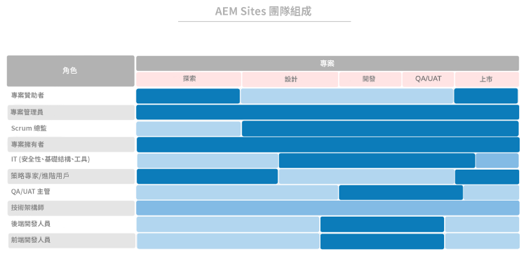

# **首先，讓合適的人擔任合適的角色**

>[!CONTEXTUALHELP]
>id="aemcloud_chooseteam"
>title="選擇適當的團隊"
>abstract="讓合適的人員從事正確的工作，幫助推動您的Adobe Experience Manager部署取得成功。"
>additional-url="https://experienceleague.adobe.com/docs/experience-manager-cloud-service/onboarding/best-practices/aligning-kpis.html?lang=en" text="調整KPI"
>additional-url="https://experienceleague.adobe.com/docs/experience-manager-cloud-service/onboarding/best-practices/assessing-kpis.html?lang=en" text="評估KPI"

在您的組織中，可能有幾個部門在數字型驗方面有不同的方面。 沒有治理，舞台就注定會無休止的辯論、內訌和混亂。

數字治理首先要搞清楚誰負責什麼和誰在做以數字為重點的工作。 您可能需要進行一些戰略性招聘，以增加所需的技能。 一個更大的挑戰是推動文化轉變 — 為新技術建立廣泛的支援，幫助人們習慣新的做事方式。 這一努力的一個關鍵部分是建立一個數字社區，讓人們互相學習和支援。

目前，我們將專注於讓合適的人員從事合適的工作，以幫助推動您的Adobe Experience Manager部署。 對於每個核心產品 — Experience Manager Sites和Experience Manager Assets — 我們提供了您需要擔任的角色清單，以及使人們能夠有效地擔任各種角色的技能、專業水準和屬性。

您本週的任務是與您的實施團隊一起審核這兩個清單，並確保每個角色都有具備相關資格的人員。

## **關鍵角AEM色Experience Manager Sites**

獲勝的團隊需要9個人在合適的座位上 — 就像你的部署團隊一樣。 你與Adobe Experience Manager Sites的成功取決於你的團隊成員的實力以及他們的合作是否順利。 確保將這九個角色分配給具有建議資格的人員。

| 角色 | 技能 | 功能級別 | 品質 |
|--- |--- |--- |--- |
| 項目經理 | PMP認證、敏捷認證、風險管理經驗 | 專家 | 公平、一致、負責、有組織、積極、平易近人，願意接受變革 |
| 斯庫姆大師 | ScrumMaster認證、敏捷認證、便利化經驗 | 專家 | 一致、富於創造力 |
| 產品所有者 | 靈活的認證，深入瞭解業務需求 | 專家 | 平衡、自信 |
| IT在安全、基礎架構和工具方面處於領先地位 | CISM認證，Adobe Experience Manager元件開發人員認證 | 專家 | 面向細節 |
| 策略師/超級用戶 | 熟練的Adobe Experience Manager Sites | 新手到專家 | 頑強、好奇、徹底、開放，願意接受變革，合作 |
| QA/UAT主管 | 敏捷的認證，對SDLC的理解 | 新手到中級 | 面向細節，流程驅動，一致 |
| 技術架構師 | IT基礎架構體驗 | 專家 | 面向細節、流程驅動、一致 |
| 後端開發人員 | 敏捷的認證、電腦寫程式和電腦科學的經驗 | 新手到中級 | 面向細節、流程驅動、一致 |
| 前端開發人員 | 靈活的認證、對HTML、CSS和JavaScript的瞭解 | 新手到中級 | 面向細節、流程驅動、一致 |

現在，您知道需要什麼角色，請查看下圖，查看每個角色在實施過程中何時發揮作用。

 

**與您的實施團隊一起查看此清單** 確保每個角色都有具備相關資質的人。 不太熟悉Adobe Experience Cloud的團隊成員可以使用 [Experience League](https://experienceleague.adobe.com/#recommended/solutions/experience-manager) 學習資源，通過 [Adobe數字學習](https://learning.adobe.com/certification.html)。

## **關鍵角AEM色Experience Manager Assets**

從建築師到ScrumMaster，這個團隊中的每一個角色都是不可或缺的 — 包括DAM圖書管理員。

您可能已經擁有了運行成功的Adobe Experience Manager資產實施所需的大部分人員。 這份清單與Adobe Experience Manager Sites的清單相似，還有一份重要補充：您需要一個圖書管理員來確保數字資產的組織和標籤以便於查找。

| 角色 | 技能 | 功能級別 | 品質 |
|--- |--- |--- |--- |
| 項目經理 | PMP認證、敏捷認證、風險管理經驗 | 專家 | 公平、一致、負責、有組織、積極、平易近人，願意接受變革 |
| 斯庫姆大師 | ScrumMaster認證、敏捷認證、便利化經驗 | 專家 | 一致、富於創造力 |
| 產品所有者 | 靈活的認證，深入瞭解業務需求 | 專家 | 平衡、自信 |
| IT在安全、基礎架構和工具方面處於領先地位 | CISM認證，Adobe Experience Manager元件開發人員認證 | 專家 | 面向細節 |
| 策略師/超級用戶 | 熟練的Adobe Experience Manager Sites | 新手到專家 | 頑強、好奇、徹底、開放，願意接受變革，合作 |
| QA/UAT主管 | 敏捷的認證，對SDLC的理解 | 新手到中級 | 面向細節，流程驅動，一致 |
| 技術架構師 | IT基礎架構體驗 | 專家 | 面向細節、流程驅動、一致 |
| 後端開發人員 | 敏捷的認證、電腦寫程式和電腦科學的經驗 | 新手到中級 | 面向細節、流程驅動、一致 |
| 前端開發人員 | 靈活的認證、對HTML、CSS和JavaScript的瞭解 | 新手到中級 | 面向細節、流程驅動、一致 |
| DAM管理員 | 圖書館學背景與學位 | 專家 | 面向細節、流程驅動、組織 |

現在，您知道需要什麼角色，請查看下圖，查看每個角色在實施過程中何時發揮作用。

 

>[!TIP]
>
> 瞭解有關Adobe Experience Cloud的更多資訊，並利用資源 [Experience League](https://experienceleague.adobe.com/#recommended/solutions/experience-manager) 通過認證 [Adobe數字學習](https://learning.adobe.com/certification.html)。
