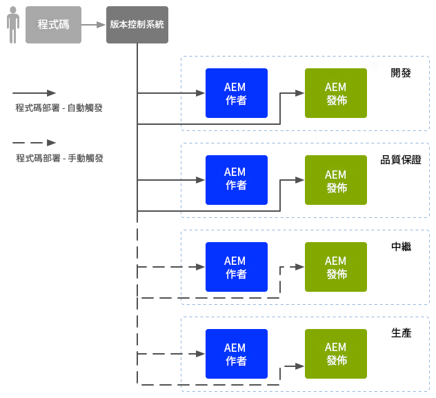
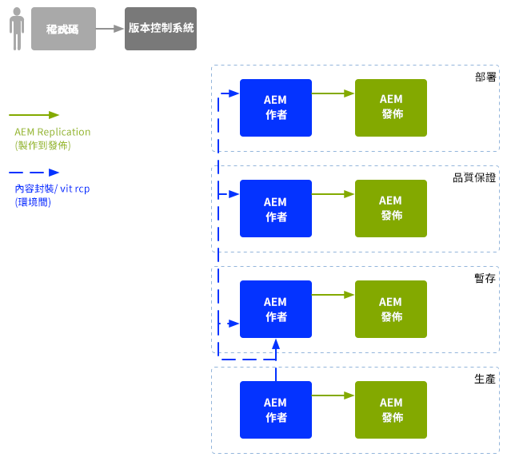

# 企業 DevOps{#enterprise-devops}

DevOps涵蓋下列工作所需的程式、方法和通訊：

* 輕鬆地在各種環境中部署您的軟體。
* 簡化開發、測試和部署團隊之間的共同作業。

DevOps 旨在避免下列問題：

* 人為錯誤。
* 被遺忘的元素；例如檔案、設定詳細資訊。
* 不一致；例如開發人員的本機環境與其他環境間的差異。

## 環境 {#environments}

Adobe Experience Manager (AEM) as a Cloud Service 通常由多個環境組成，並用於不同層級的不同用途：

* [開發](#development)
* [品質保證](#quality-assurance)
* [預備](#staging)
* [生產](#production-author-and-publish)

>[!NOTE]
>
>在生產環境中，必須至少有一個作者環境和一個發佈環境。
>
>我們建議由作者和發佈環境組成所有其他環境，以便反映生產環境，並啟用初期測試。

### 開發 {#development}

開發人員負責開發和自訂所提出的專案（網站、行動應用程式、DAM實作等），並具備所有必要的功能。 上述功能為：

* 開發和自訂必要的要素；例如範本、元件、工作流程、應用程式
* 實現設計
* 開發必要的服務和指令碼，以便您實作必要的功能

的設定 [開發](/help/implementing/developing/introduction/development-guidelines.md) 環境可能取決於多種因素，但通常包括：

* 具備版本控制的整合式開發系統，可提供整合式程式碼庫。 此整合式程式碼庫用於合併和合併來自每個開發人員使用的個別開發環境的程式碼。
* 屬於每個開發人員的個人環境；通常位於他們的本機電腦上。程式碼會以適當的間隔與版本控制系統同步

根據您的系統規模，開發環境可同時擁有作者執行個體和發佈執行個體。

### 品質保證 {#quality-assurance}

品質保證團隊會使用此環境，來全面測試您的新系統；包括設計與功能。此環境應同時具備作者環境、發佈環境及適當的內容，並提供所有啟用完整測試套件所需的服務。

### 預備 {#staging}

中繼環境應為生產環境的映象（設定、程式碼和內容）：

* 此環境用於測試要用來實作實際部署的指令碼。
* 在部署到生產環境之前，可使用此環境進行最終測試（設計、功能和介面）。
* 雖然預備環境未必與生產環境完全相同，但應該盡量使兩者相似，以便啟用效能與負載測試。

### 生產：作者與發佈 {#production-author-and-publish}

生產環境由以下環境組成： [作者與發佈](/help/sites-cloud/authoring/getting-started/concepts.md) 您的實作。

生產環境至少會由一個製作環境和一個發佈環境組成：

* 輸入內容的[製作](#author)執行個體。
* 可供您的訪客/使用者使用的內容之[發佈](#publish)執行個體。

根據專案的規模，它通常包含數位作者或/和發佈者。 在較低的層級中，也可以將存放庫與多個執行個體一起加入叢集。

#### 作者 {#author}

製作執行個體通常位於內部防火牆之後。 此內部防火牆是您和您的同事執行製作工作的環境，例如：

* 管理整個系統
* 輸入內容
* 設定內容的配置和設計
* 為發佈環境啟用內容

已啟用的內容會封裝並放置在作者環境的複製佇列中。接著，複製程序會將內容傳輸至發佈環境。

若要將發佈環境中產生的資料反向復寫回製作環境，製作環境中的復寫接聽程式會輪詢發佈環境，並從發佈環境的反向復寫寄件匣中擷取此類內容。

#### 發佈 {#publish}

通常，發佈環境位於「非軍事區域」(DMZ)中。 此環境是訪客存取您的內容（例如，透過網站或以行動應用程式的形式）並與之互動（不論是公開或內部網路中）的地方。 發佈環境：

* 可保留從作者環境複製的內容
* 供訪客使用該內容
* 儲存訪客產生的使用者資料，例如留言或其他提交的表單
* 可以設定將上述使用者資料新增至寄件匣，以便反向複製回作者環境

發佈環境會即時動態產生您的內容，而且可針對每位使用者個人化內容。

## 程式碼動向 {#code-movement}

一律從下往上傳播程式碼：

* 程式碼最初在本機開發，然後在開發環境中整合
* 接著在QA環境中進行徹底測試
* 然後在預備環境中再次測試
* 此時，才可以將程式碼部署至生產環境

通常，程式碼（例如自訂的Web應用程式功能和設計範本）會透過在不同內容存放庫之間匯出和匯入套件來傳輸。 這代表可以將此複製設定為自動程序。

AEMas a Cloud Service上的專案通常會觸發程式碼部署：

* 自動：用於轉移至開發和 QA 環境。
* 手動：部署至預備和生產環境的方式比較可控，通常以手動進行；不過必要時可自動化。

## 內容動向 {#content-movement}

為生產而建立的內容應&#x200B;**一律**&#x200B;在生產作者執行個體上編寫。

內容不應隨著程式碼從較低層級環境移至較高層級環境而移動。 也就是說，讓作者在本機電腦或較低層級環境中建立內容，然後將其移至生產環境，這並不是理想的作法。 原因是這可能會導致錯誤和不一致。

生產內容應從生產環境移至預備環境，以確保預備環境提供有效率且精確的測試環境。

>[!NOTE]
>
>此方法不代表預備內容必須持續與生產同步；定期更新便已足夠，尤其在測試新的程式碼疊代之前。 QA和開發環境中的內容不需要頻繁更新。 它必須是生產內容的良好呈現。

內容可以轉移：

* 在不同環境間：透過匯出和匯入套件。
* 在不同執行個體之間 — 透過直接複製(AEMas a Cloud Service複製)內容（使用HTTP或HTTPS連線）。

