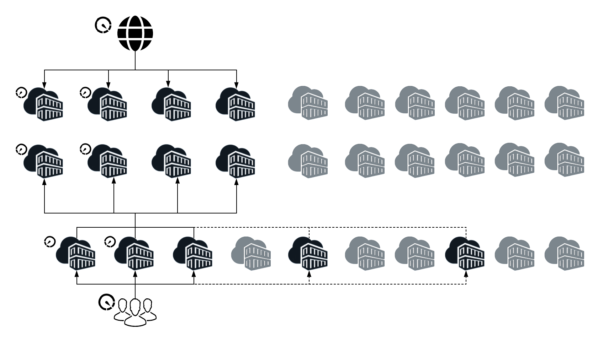

# 新增功能與不同功能 {#what-is-new-and-what-is-different}

多年來，AEM已推出兩種功能：

* On-Premise

* 作為受管理服務

以前的這些方式與AEM（雲端服務）之間有內在的差異：

* [建築](#architecture)
* [升級](#upgrades)
* [Cloud Manager](#cloud-manager)
* [入門](#onboarding)
* [開發](#developing)
* [操作與效能](#operations-and-performance)
* [身分識別管理](#identity-management)
* [編寫使用者介面](#authoring-user-interface)
* [AEM Sites](#aem-sites)
* [AEM Assets](#aem-assets)

>[!NOTE]
>
>這些概述並非詳盡無遺，但旨在作一介紹。

<!-- change link when 6.5 hub page migrated -->

>[!NOTE]
>
>如需內部部署和受管理服務版本的詳細資訊，請參閱 [AEM 6.5的檔案集](https://helpx.adobe.com/support/experience-manager/6-5.html)。

<!-- * [Miscellaneous](#miscellaneous) -->

## 建築 {#architecture}

>[!NOTE]
>
>如需詳細資訊，請參閱 [架構](/help/core-concepts/architecture.md)。

<!--
### Previous Versions {#previous-versions-architecture}

Both AEM on-premise, and AEM under Managed Services used a static architecture comprised of a fixed number of machines and instances. 

These:

* Were sized for *peak* traffic (internet) and *peak* activity (marketing), which resulted in them being idle for significant periods of time:

* Were monolithic applications (the quickstart).

* Had a single author instance; which was subject to downtime during maintenance windows.

### AEM as a Cloud Service {#aem-as-a-cloud-service-architecture}
-->

AEM即雲端服務現已具備：

* 具有可變數目AEM影像的動態架構。

此架構：

* 會根據實際流量和 *實際* 活動 *縮放* 。

* 具有僅在需要時運行的單個實例。

* 使用模組化應用程式。

* 具有作者群集作為預設值；這樣可以避免維護任務的停機。

如此可針對各種使用模式自動縮放：

## 升級 {#upgrades}

<!--
>[!NOTE]
>
>For further details see the [Deploying Introduction](/help/sites/deploying/introduction.md).
-->

<!--
### Previous Versions {#previous-versions-upgrades}

Both AEM on-premise, and AEM under Managed Services were subject to a fixed pattern of a yearly major release augmented by service packs, feature packs and hot-fixes. Often instances would run a major version for two or more years. 

Depending on the upgrade type, the process could require significant preparation consisting of analysis, development and testing, followed with a window of downtime for the actual upgrade.

### AEM as a Cloud Service {#aem-as-a-cloud-service-upgrades}
-->

AEM作為雲端服務，現在使用「持續整合與持續傳送」(CI/CD)來確保您的專案具備最新狀態。 這表示所有升級作業都完全自動化，因此使用者不需要中斷任何服務。

Adobe會主動將服務的所有營運執行個體更新為最新版本的AEM程式碼庫：

* 錯誤修正：

   * 可以每天發佈。

   * 例項會經常更新為最新的錯誤修正。 隨著變更的定期套用，影響會逐漸增加，降低對服務的影響。

   * 大部分更新都是出於維護和安全原因。

* 新功能：

   * 將透過可預測的每月排程發佈。

>[!NOTE]
>
>如需詳細資訊，請參閱 [部署架構](/help/core-concepts/architecture.md#deployment-architecture)。

## Cloud Manager {#cloud-manager}

Adobe Cloud manager是AEM雲端服務持續升級方法的一環，因為它可控制您例項的所有更新——這是必備的。

當有新版雲端服務推出時，Adobe可觸發更新。 或者，您也可以使用Cloud manager提供的管線觸發應用程式更新。

Cloud Manager是：

* 用來管理AEM程式和環境，

* AEM的「雲端服務」基本元件；每個新租用戶都會先布建Cloud manager存取權，

* 為您的營運與開發人員提供單一入門點。

具體而言，可從Cloud manager建立的AEM程式數目和類型可衍生為：

* 從客戶授權合約，

* 當AEM作為雲端服務用於實作或訓練時，從內部導向的演員傳授意見，

* 從Adobe.com開始的試用等外部驅動程式。

Cloud manager已發展為自助服務入口網站，可在其中建立並設定AEM（雲端服務）的主要元件：

* 建立和管理新程式。

* 在這些程式中建立和管理AEM環境。

* 建立並管理將客戶代碼和相關配置部署到特定環境的管道。

* 收到這些元件的重要生命週期事件通知（例如產品更新）。

目前，Cloud manager能夠在3個地理區域（下面有更多區域）建立環境：

* 美國（東部）

* EMEA（荷蘭）

* 亞太地區（澳洲）

## 入門 {#onboarding}

<!--
>[!NOTE]
>
>For further details see [Onboarding - An Overview](/help/onboarding/overview.md).
-->

<!--
### Previous Versions {#previous-versions-onboarding}

Implementing an AEM project basically followed traditional project management methods.  

### AEM as a Cloud Service {#aem-as-a-cloud-service-onboarding}

Starting and managing an AEM project is significantly easier when using AEM as a Cloud service as Adobe is responsible for many aspects:
-->

當將AEM當做雲端服務使用時，啟動和管理AEM專案很簡單，因為Adobe負責許多方面：

* 基準AEM影像會針對特定使用案例最佳化。

* 許多手動配置任務已變得冗餘。

與現在的情況也大不相同：

* 評估階段，以確保符合所有先決條件；包括，例如：

   * 法律要求

   * 合約協定

   * 客戶自訂之任何現有內容及／或程式碼的技術需求

* 部署需求：

   * 程式碼更新；任何針對舊版AEM開發的客戶應用程式都需要進行審查，而且可能會進行更新。

   * 內容移轉

## 開發 {#developing}

>[!NOTE]
>
>如需詳細資訊，請從開發指 [南檔案開始](/help/implementing/developing/introduction/development-guidelines.md) 。

<!--
>[!NOTE]
>
>For further details start with [The Developing Experience](/help/sites/developing/introduction/developer-experience.md, [Developing - The Basics](/help/sites/developing/introduction/the-basics.md) and [Developing Best Practices](/help/sites/best-practices/developing.md).
-->

<!--
### Previous Versions {#previous-versions-developing}
-->

<!-- needs more detail -->

<!-- 
Development was an intensive task performed locally, followed by deployment to the production instance. 

### AEM as a Cloud Service {#aem-as-a-cloud-service-developing}
-->

<!-- Will need information for new customers -->
支援AEM為雲端服務的全新架構包含對整體開發人員體驗的一些重要變更。 AEM做為雲端服務的主要目標之一，是讓經驗豐富的客戶（在內部部署或在Adobe Managed Services中使用AEM）盡快移轉至AEM做為雲端服務，而不需重寫其大量自訂程式碼。 不過，可能仍需要進行一些調整。

<!-- adjusting title level -->

### 雲端開發 {#aem-as-a-cloud-service-developing-cloud-development}

若要在AEM上以雲端服務形式執行現有的AEM應用程式，請執行下列步驟：

* 應用程式碼和配置必須儲存在關聯的Cloud manager程式的Git代碼儲存庫中。
* 應用程式碼和設定必須與最新版的基準AEM影像相容（可能每天都會變更）。
   * 客戶應用程式必須使用與Cloud manager環境關聯的Cloud manager管道構建和部署。
* 客戶應用程式必須傳遞管道中強制執行的所有程式碼品質、安全性和效能閘道。
* 為客戶應用程式構建的映像必須由Cloud manager管道部署。

<!-- duration of what? -->
此程式通常稱為雲端開發。 由於端對端持續時間預計需要幾分鐘（視應用程式的複雜性而定，從20到50），因此在雲端嘗試進行擱置中的程式碼和組態變更之前，必須採用快速開發方法。

<!-- is this really relevant at this point? -->
AEM的使用者不再可直接存取Web Console，因為Web Console會管理OSGI組合及其相關的組態，而且先前也是AEM quickStart的一部分。 此介面仍可透過使用新的開發人員主控台，以唯讀模式存取。 使用此主控台，開發人員可直接選擇並登入作者或發佈服務的任何特定節點，然後存取預設封鎖的區域。

開發人員的另一個常見需求是快速存取各種環境的記錄檔。 以AEM為雲端服務，作者和發佈節點中不同節點的記錄檔可透過Cloud manager取得，可以是可下載的檔案，也可以是透過API取得。

由於程式碼和內容的明確分離，開發人員可使用特定程式來更新部署中的內容。 可變內容的典型使用案例包括：

* 屬於 *客戶專案* （例如，資料夾、範本、工作流程等）的標準預設內容

* 搜索索引定義

* ACL和權限

* 服務使用者和使用者群組

<!-- adjusting title level -->

### 地方開發 {#aem-as-a-cloud-service-developing-local-development}

為了支援快速的迭代和開發，您也可以在AEM以外部開發AEM應用程式，做為雲端服務內容。 為此，開發人員可使用下列物件：

* AEM a Cloud Service QuickStart:最新 `.jar` AEM程式碼庫的基礎獨立安裝程式，具有相同的功能和API表面。

* AEM as a Cloud Service Dispatcher SDK:在本地測試和驗證Dispatcher配置的基於映像的過程

>[!NOTE]
>
>請注意，Cloud quickStart不允許所有AEM Sites和AEM Assets功能。 它由簡單的作者環境組成，其中大部分的擴充功能都可進行開發和測試。

## 操作與效能 {#operations-and-performance}

>[!NOTE]
>
>有關詳細資訊，請從 [備份](/help/operations/backup.md)、索引 [和其](/help/operations/indexing.md)他維護任務開始 。

<!--
### Previous Versions {#previous-versions-operations-and-performance}

In the past, especially on the author side, there was a need to periodically stop an instance; for routine maintenance operations, as well as upgrades and updates. For some customers, this resulted in hours of scheduled downtime on a weekly basis. 

### AEM as a Cloud Service {#aem-as-a-cloud-service-operatioms-and-performance}
-->

以AEM為雲端服務，此類作業會自動化，因此不再需要任何服務中斷。

在這些領域：

* 許多任務都實現了自動化。

* 優化拓撲以實現最大的恢復能力和效率；例如，無二進位複製是預設值。

* 大量負載的工作（例如佇列、工作和大量處理工作）已移出核心AEM例項，由共用和專用的微型服務處理。

AEM雲端服務的運作也受到新的監控、報告和警報基礎架構的支援。 這可讓Adobe SRE（網站可靠性工程師）主動維持服務的健康。 該建築的各種元素都配備了各種健康檢查。 如果由於某種原因，體系結構的某個特定節點被認為不健康，則該節點將從服務中刪除，並無訊息地被新的健康節點所取代。

## 身分識別管理 {#identity-management}

<!--
>[!NOTE]
>
>For further details see [Security - Single Sign-On](/help/sites/security/single-sign-on.md).
-->

<!--
### Previous Versions {#previous-versions-identity-management}

By default, identity management was internal to AEM.

>[!NOTE]
>
>AEM 6.4.3.0 introduced:
>
>* Admin Console support for AEM instances. 
>* Adobe IMS (Identity Management System) based authentication for AEM Managed Services customers.

### AEM as a Cloud Service {#aem-as-a-cloud-service-identity-management}
-->

AEM雲端服務的重大變更，是完全整合使用Adobe ID來存取作者層。

這需要使用 [Adobe Admin Console](https://helpx.adobe.com/enterprise/using/admin-console.html) ，來管理使用者和使用者群組。 使用者帳戶可讓您的使用者存取Adobe產品和服務，因為使用者個人檔案資訊會集中在Adobe Identity Management System(IMS)中，以便在所有雲端服務間共用。 一旦指派AEM的存取權後，使用者帳戶就可在AEM中以雲端服務的身分被參照（如先前）;例如，用於從AEM Security使用者介面定義角色和權限。

這結合了以下優點：

* 使用Adobe Identity Management System(IMS)在所有Adobe雲端應用程式中提供單一登入。

* 使用者偏好設定仍保留在AEM每個特定例項的本機，做為雲端服務。

## 編寫使用者介面 {#authoring-user-interface}

<!--
>[!NOTE]
>
>For further details, the [Basic Handling](/help/sites/authoring/getting-started/basic-handling.md) and [Best Practices](/help/sites/best-practices/authoring.md) are good starting points.
-->

<!--
### Previous Versions {#previous-versions-authoring}

The user interface of the author instance (UI), for both Sites and Assets, was progressively developed and optimized to cater for all use-cases, using both the touch-enabled and classic UIs.

### AEM as a Cloud Service {#aem-as-a-cloud-service-authoring}
-->

過去使用過AEM的人將十分熟悉網站和資產的製作使用者介面(UI)的基本原則。

主要的不同在於，使用者介面完全可觸控；傳統UI已不再可用。 否則，基本功能保持不變，只有微小的變更。

## AEM Sites {#aem-sites}

Adobe Experience Manager Sites as a Cloud Service可讓您結合AEM內容管理系統與AEM數位資產管理的強大功能，為客戶提供個人化、內容導向的體驗。

如需詳細資訊，請參閱網站 [變更概觀](/help/sites-cloud/sites-cloud-changes.md)。

## AEM Assets {#aem-assets}

Adobe Experience Manager Assets as a Cloud Service為企業提供雲端原生SaaS解決方案，不僅可快速且有影響力地執行其數位資產管理和動態媒體作業，還可在永遠最新、永遠可用且隨時學習的系統中使用新一代智慧功能，例如AI/ML。

資產產品包括雲端的新一代資產處理，以及高效能資產擷取與搜尋。

如需詳細資訊，請 [參閱「資產即雲端服務」概觀和簡介](/help/assets/overview.md)。
