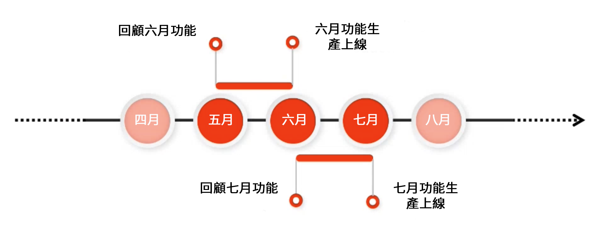

# 發行資訊 {#release-information}

| 產品 | Adobe Experience Manager as a Cloud Service  |
|---|---|
| 版本 | 2025.11.0 |
| 類型 | 持續更新 |
| 推出日期 | 持續更新 |

## AEM 發行排程 {#release-schedule}

因為 [!DNL Adobe Experience Manager] as a Cloud Service 採用持續發行模型，應用程式會持續自動更新。更新有兩種類型，包括功能版本和維護版本：

* **功能發行以可預測的每月頻率進行，並專注於新功能和產品創新。**
   * 查看[最新發行說明](/help/release-notes/release-notes-cloud/release-notes-current.md)，了解最新功能版本的詳細資訊。
* **維護版本**&#x200B;會經常發行，並以安全性更新、錯誤修正和效能增強為主。
   * 這可確保 [!DNL Adobe Experience Manager] as a Cloud Service 始終保持最新狀態並安裝任何重要修正。
   * 查看[最新維護發行說明](/help/release-notes/maintenance/latest.md)，了解最新維護版本的詳細資訊。

此模型可確保持續發行且服務不會中斷。通常會在一個版本中宣布即將推出的功能，然後在下一個版本中公開發行。透過這種方式，您可以評估即將推出的功能並針對自己的專案實施該功能的可能情形進行規劃。這樣一來，您便可以在下一個功能版本發佈 (即功能正式推出) 之前先行規劃。

例如，如果現在是五月，您可以評估即將推出的功能，而那些功能將在下一次發佈 (例如六月) 時正式推出。

此發行頻率是一個不斷更新的時間區段，此間您可以評估任何即將推出的功能對您的專案和自訂內容的影響，並計劃這類功能之推出、測試和使用者培訓。

請查看 [Experience Manager 發行路徑圖](https://experienceleague.adobe.com/docs/experience-manager-release-information/aem-release-updates/update-releases-roadmap.html#aem-as-cloud-service)，了解即將推出的版本之詳細資訊。

## 如何針對發行版本做好準備 {#how-to-prepare}

若要針對發行版本做好準備：

1. [標示您的行事曆](#mark-calendars)
1. [檢閱發行說明](#release-notes)
1. [存取並試用即將推出的功能](#upcoming-features)
1. [訓練您的使用者](#train-users)

## 標示您的行事曆 {#mark-calendars}

功能發行都會事先安排好，並於 [Adobe Experience League](https://experienceleague.adobe.com/docs/experience-manager-release-information/aem-release-updates/update-releases-roadmap.html#aem-as-cloud-service) 上發佈功能發行啟用日期。

記下發行日期，以便規劃時間來檢視和測試即將推出的功能。

## 檢閱發行說明 {#release-notes}

在行事曆上標示發行日期後，請務必在發行當天查看 [Adobe Experience League](/help/release-notes/release-notes-cloud/release-notes-current.md) 網站以取得最新的發行說明。

每個版本都附有發行說明，不僅記錄了該版本中的新功能，也記錄了即將推出的功能，以方便評估。取提前掌握情況，並為利用 AEMaaCS 的最新功能進行規劃！

您還可以查看與每個版本一起發佈的[已知問題](/help/release-notes/maintenance/latest.md)，這樣您也可以了解可能對您評估或最終採用任何新功能構成挑戰的任何技術問題。

## 存取並試用即將推出的功能 {#upcoming-features}

通常會透過以下兩種方式之一發佈即將推出的功能：

* 作為 Alpha、Beta 或限量開放計畫的一部分
* 透過預發行通道使用

[發行說明](#release-notes)中會詳細說明即將推出的功能的發行方式。

* 如果包含在 Alpha、Beta 或限量開放計劃中，您通常必須聯絡 Adobe 來啟用此功能 (如發行說明所述)。
* 若是透過預發行通道使用該功能，則您必須[在開發或沙箱環境中啟用預發行通道。](/help/release-notes/prerelease.md)

## 訓練您的使用者 {#train-users}

待您針對即將推出的功能完成測試並決定在您的專案中使用之後，便需要訓練您的使用者。

Adobe Experience League 提供了用來學習 AEMaaCS 的大量資源。

* [AEMaaCS 文件](https://experienceleague.adobe.com/docs/experience-manager-cloud-service.html)
* [教學課程](https://experienceleague.adobe.com/docs/experience-manager-learn/aem-tutorials/overview.html)
* 發行說明中的[每月發行概觀影片](/help/release-notes/release-notes-cloud/release-notes-current.md#release-video)

## 重要版本資訊 {#key-articles}

* [功能發行說明](/help/release-notes/release-notes-cloud/release-notes-current.md)
* [維護版本發行說明](/help/release-notes/maintenance/latest.md)
* [新增功能](what-is-new.md)
* [重大變更](aem-cloud-changes.md)
* [過時和移除的功能](deprecated-removed-features.md)
