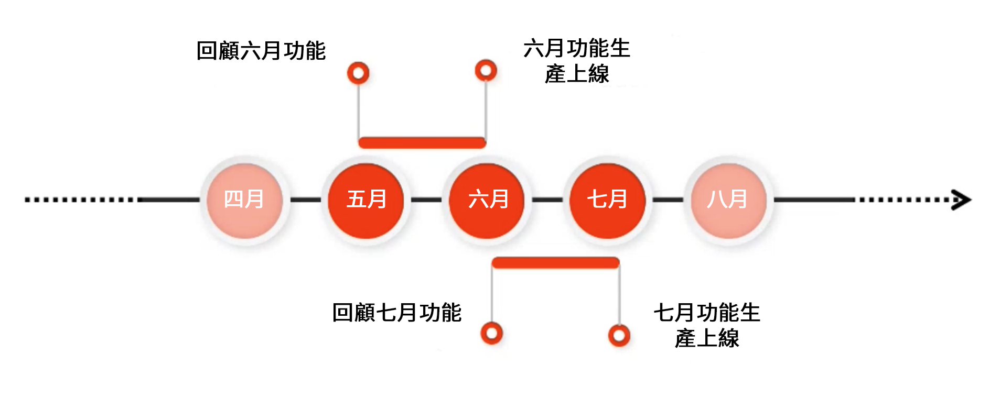
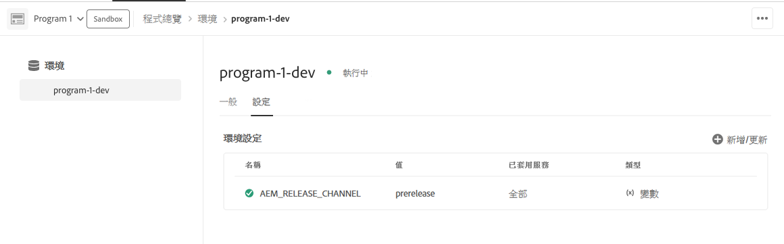

# Adobe Experience Manager as a Cloud Service 發行前通道 {#prerelease-channel}

了解如何使用發行前通道來取得即將推出的 AEM as a Cloud Service 功能預覽。

## 簡介 {#introduction}

Adobe Experience Manager as a Cloud Service 會根據 [Experience Manager 發行藍圖](https://experienceleague.adobe.com/docs/experience-manager-release-information/aem-release-updates/update-releases-roadmap.html#aem-as-cloud-service)每月提供新功能。

若要熟悉排定在下個月上線的功能，您可以訂閱發行前通道，您可藉由設定您的開發環境或任何沙箱環境來存取該通道。客戶可以預覽可透過 AEM UI 存取的變更，也可以針對任何新的發行前 API 建置程式碼。

特定月份的發行前功能清單會在[每月發行說明](/help/release-notes/release-notes-cloud/release-notes-current.md)中發佈。

## AEM as a Cloud Service 發行 {#releases}

AEM as a Cloud Service 有兩種發行。

* **每月發行**&#x200B;會在 AEM as a Cloud Service 中新增功能和特性
* **重大更新**&#x200B;會新增安全性更新、效能增強功能和錯誤修正，而且每天都會套用。

此模式可確保持續發行而不會中斷服務。

發行前通道可讓您預覽即將到來的每月發行中預定推出的功能，以便評估即將推出的功能，並針對其可能在您自己專案中的實作方式進行規劃。它可讓您提前規劃下個月的發行。

例如，假設現在是五月，而且您訂閱了發行前通道，您可以評估即將推出的六月發行中的功能。



發行前版本為您提供為期一個月的滾動時段，讓您了解即將推出的 AEMaaCS 功能，讓您有時間評估任何新功能對您專案和自訂內容的影響，並且規劃推出此類功能、測試和使用者培訓。

有效利用發行前通道需要採取四個步驟。

1. [標示您的行事曆](#mark-calendars)
1. [檢閱發行說明](#release-notes)
1. [存取及試用新功能](#new-features)
1. [訓練您的使用者](#train-users)

## 標示您的行事曆 {#mark-calendars}

每月發行都會事先安排好，並於 [Adobe Experience League](https://experienceleague.adobe.com/docs/experience-manager-release-information/aem-release-updates/update-releases-roadmap.html#aem-as-cloud-service) 上公開發行日期。

記下發行日期，以便您可以規劃時間來檢閱和測試即將推出的功能。

## 檢閱發行說明 {#release-notes}

在行事曆上標示發行日期後，請務必在發行當天查看 [Adobe Experience League](/help/release-notes/release-notes-cloud/release-notes-current.md) 網站以取得最新的發行說明。

每個版本都附有發行說明，其中不僅記錄了該版本中的新功能，也記錄了可用於發行前評估的功能。取提前掌握情況，並為利用 AEMaaCS 的最新功能進行規劃！

您還可以查看與每個版本一起發佈的[已知問題](/help/release-notes/known-issues.md)，這樣您也可以了解可能對您評估或最終採用任何新功能構成挑戰的任何技術問題。

## 啟用發行前通道來存取及試用新功能 {#new-features}

可以在任何開發或沙箱環境中啟用發行前通道。中繼環境或生產環境中不可啟用發行前通道。

可以透過不同方式體驗發行前功能：

* [雲端環境](#cloud-environments)
* [本機 SDK](#local-sdk)

### 雲端環境 {#cloud-environments}

若要更新雲端環境來使用發行前版本，您必須增加一個新的環境變數。您可以使用 Cloud Manager UI 或透過 CLI 執行此操作。

#### 使用 UI 新增環境變數 {#add-with-ui}

1. 在 [my.cloudmanager.adobe.com](https://my.cloudmanager.adobe.com/) 登入 Cloud Manager 並選取適當的組織。

1. 瀏覽至您要啟用發行前版本的計畫。

1. 選取您要啟用發行前版本的環境，並透過&#x200B;**計畫** > **環境** > **環境設定**&#x200B;存取其設定。

1. 增加一個新的[環境變數](../implementing/cloud-manager/environment-variables.md)：

   | 名稱 | 值 | 套用的服務 | 類型 |
   |------|-------|-----------------|------|
   | `AEM_RELEASE_CHANNEL` | `prerelease` | 全部 | 變數 |

1. 儲存變更，環境將重新整理並啟用發行前功能切換。

   

#### 使用 CLI 新增環境變數 {#add-with-cli}

您也可以使用 Cloud Manager API 和 CLI 來更新環境變數。

* 使用 [Cloud Manager API 的環境變數端點](https://developer.adobe.com/experience-cloud/cloud-manager/reference/api/#operation/patchEnvironmentVariables)，將 `AEM_RELEASE_CHANNEL` 環境變數設定為值 `prerelease`。

   ```text
   PATCH /program/{programId}/environment/{environmentId}/variables
   [
           {
                   "name" : "AEM_RELEASE_CHANNEL",
                   "value" : "prerelease",
                   "type" : "string"
           }
   ]
   ```

* 也可以使用 [Cloud Manager CLI](https://github.com/adobe/aio-cli-plugin-cloudmanager#aio-cloudmanagerset-environment-variables-environmentid)

   ```shell
   aio cloudmanager:environment:set-variables <ENVIRONMENT_ID> --programId=<PROGRAM_ID> --variable AEM_RELEASE_CHANNEL “prerelease
   ```

如果您希望環境還原為一般 (非發行前) 通道的行為，可以刪除該變數或將其設回不同的值。

### 本機 SDK {#local-sdk}

您可以在本機快速入門 SDK 的 Sites 主控台中查看新功能，並藉由設定您的 Maven 專案來參照位於 Maven Central 中的發行前 `API Jar`，針對發行前版本中的新 API 進行編碼。您也可以藉由在發行前模式下啟動一般快速入門 SDK，在本機開發環境中查看這些發行前功能。

#### 在發行前模式下啟動快速入門 SDK {#prerelease-mode}

1. 從軟體散發入口網站下載 SDK，並依照[存取 AEM as a Cloud Service SDK](/help/implementing/developing/introduction/aem-as-a-cloud-service-sdk.md) 中所述的步驟進行安裝。
1. 啟動 SDK 快速入門時，請包含引數 `-r prerelease`。

值為 sticky，因此只能在第一次啟動時選取它。重新安裝 SDK 以變更命令列選項。

由於每月功能發行之間可能會有多個 AEM 維護版本，因此您可以下載這些新的 SDK 並在 maven 專案中參照新的 SDK API Jar 版本。 維護版本不會新增其他發行前功能，但可能包括其他較小幅的變更，例如錯誤修正、安全性修正和效能增強。
Javadoc 會發佈到 Maven Central。

#### 針對發行前 SDK 進行建置 {#build-sdk}

1. 修改您的 Maven 專案的 `pom.xml` 以參照獨特的發行前 SDK API jar，這個檔案已發佈到 Maven Central。它包含用於發行前功能的任何新 Java API，並且相依於 SDK API jar。它使用相同的版本。

   例如，這裡是參照一般 API jar 的父系 pom 的相依性管理區段中的片段：

   ```
   <dependencyManagement>
    <dependencies>
        <dependency>
            <groupId>com.adobe.aem</groupId>
            <artifactId>aem-sdk-api</artifactId>
            <version>${aem.sdk.api}</version>
            <scope>provided</scope>
        </dependency>
   ```

   然後是模組中的用法：

   ```
    <dependencies>
     <dependency>
         <groupId>com.adobe.aem</groupId>
         <artifactId>aem-sdk-api</artifactId>
     </dependency>
   ```

   為了變更為發行前 SDK，只需將相依性從 `com.adobe.aem:aem-sdk-api` 變更為 `com.adobe.aem:aem-prerelease-sdk-api`，如下所述：

   ```
   <dependencyManagement>
    <dependencies>
      <dependency>
            <groupId>com.adobe.aem</groupId>
            <artifactId>aem-prerelease-sdk-api</artifactId>
            <version>${aem.sdk.api}</version>
            <scope>provided</scope>
      </dependency>
   <dependencies>
      <dependency>
         <groupId>com.adobe.aem</groupId>
         <artifactId>aem-prerelease-sdk-api</artifactId>
      </dependency>
   ```

   如同往常，個別專案可以使用相依性。

1. 部署到您的本機伺服器.

1. 如果您滿意它在本機有如預期般運作，請將程式碼提交到開發分支並使用 Cloud Manager 非生產管道，以部署到有訂閱發行前通道的環境。

>[!CAUTION]
> 
> 部署到中繼或生產環境時，絕不能使用 `aem-prerelease-sdk-api` artifactId。透過生產管道部署時，請一律使用 `aem-sdk-api`。同樣地，參照發行前 API 的程式碼不應該透過生產管道進行部署。

[AEM CS SDK Build Analyzer Maven 外掛程式 v1.0 及更高版本](https://experienceleague.adobe.com/docs/experience-manager-core-components/using/developing/archetype/build-analyzer-maven-plugin.html#developing)將透過檢查相依性來偵測專案中是否使用了發行前 API。如果該分析器有找到，它將使用發行前 SDK API 來分析專案。

## 訓練您的使用者 {#train-users}

一旦您在發行前通道中測試了新功能，並已決定在您的專案中利用這些功能後，您就需要訓練您的使用者。

Adobe Experience League 提供了用來學習 AEMaaCS 的大量資源。

* [AEMaaCS 文件](https://experienceleague.adobe.com/docs/experience-manager-cloud-service.html)
* [教學課程](https://experienceleague.adobe.com/docs/experience-manager-learn/aem-tutorials/overview.html)
* 發行說明中的[每月發行概觀影片](/help/release-notes/release-notes-cloud/release-notes-current.md#release-video)

## 考量事項 {#considerations}

使用發行前通道時，需要注意幾個事項。

* 發行前通道不一定包含所有將在下一版中推出的新功能。
* 發行前版本中的功能經過嚴格的品質保證，旨在提供完整的功能而不是測試版品質。如果您發現任何問題，請提報，就像您在懷疑一般 AEM 版本中的功能存在錯誤時所做的。
* 若要判斷是否為發行前通道設定了環境，請前往 AEM 主控台的&#x200B;**關於**&#x200B;頁面，並檢查 AEM 版本號碼是否包含 *prerelease* 尾碼，例如 ```Adobe Experience Manager 2021.4.5226.20210427T070726Z-210429-PRERELEASE```。


