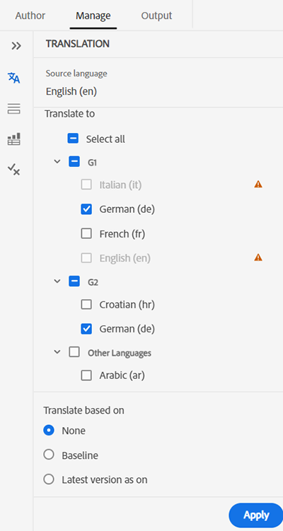
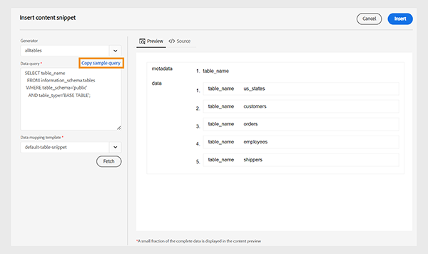

# [!DNL Adobe Experience Manager] as a Cloud Service 最新發行說明 {#release-notes}

以下章節概述 [!DNL Experience Manager] as a Cloud Service 目前 (最新) 版本的功能發行說明。

>[!NOTE]
>
>從這裡，您可以導覽至先前版本的發行說明，例如 2021 或 2022。
>
>查看 [Experience Manager 發行藍圖](https://experienceleague.adobe.com/zh-hant/docs/experience-manager-release-information/aem-release-updates/update-releases-roadmap)，了解關於 [!DNL Experience Manager] as a Cloud Service 未來功能的啟用。

>[!NOTE]
>
>請參閱[近期文件更新](https://experienceleague.adobe.com/zh-hant/docs/experience-manager-release-information/aem-release-updates/doc-updates/documentation-updates)瞭解與版本不直接相關的文件更新的詳細資料。

## 發行日期 {#release-date}

的發行日期 [!DNL Adobe Experience Manager] as a [!DNL Cloud Service] 目前功能版本(2024.4.0)為2024年4月25日。 下一個功能版本(2024.5.0)計畫於2024年5月30日發行。

## 維護版本發行說明 {#maintenance}

您可以在[這裡](/help/release-notes/maintenance/latest.md)找到最新的維護版本發行說明。

<!-- ## Release Video {#release-video}

Have a look at the April 2024 Release Overview video for a summary of the features added in the 2024.4.0 release:

>[!VIDEO](https://video.tv.adobe.com/v/3428342?quality=12)

-->

## [!DNL Experience Manager Sites] as a [!DNL Cloud Service] {#sites}

### 早期採用者計劃 {#sites-early-adopter}

**產生變化版本**

透過 AEM 新功能「[產生變化版本](/help/generative-ai/generate-variations.md)」運用 GenAI；此功能現在可於雲端服務中存取。產生變化版本可協助您透過使用生成式 AI 來產生和擴展內容建立。請聯絡您的 Adob&#x200B;&#x200B;e 客戶團隊以考慮參與該計劃。

**在內容片段控制台中瀏覽資產**

內容作者現在可以瀏覽、查看影像，並對影像執行動作，而無需離開內容片段控制台。

有興趣嘗試該功能並分享回饋意見嗎？從您的官方電子郵件 ID 傳送電子郵件到 aemcs-headless-adopter@adobe.com，深入了解有關早期採用者計劃的資訊。

## [!DNL Experience Manager Assets] as a [!DNL Cloud Service] {#assets}

### 資產檢視中的新功能 {#assets-view-new-features}

**內容相關搜尋**

您現在也可以 [定義文字提示以搜尋存放庫中的可用資產](/help/assets/search-assets-view.md#contextual-search). Experience Manager Assets 會自動轉換這些文字提示，以便搜尋篩選器並顯示搜尋結果。您可以使用篩選器窗格查看和修改自動篩選器，以進一步縮小搜尋結果範圍。

**表達影片快速動作**

Experience Manager Assets現在包含 [由Adobe Express提供支援的簡單直覺式視訊編輯工具](/help/assets/edit-videos-assets-view.md) 提升內容重複使用率並加快內容速度。 此編輯選項包括修剪、裁切、調整影片大小以及將 MP4 轉換為 GIF 檔案。

**動態轉譯**

您現在可以 [檢視和下載動態轉譯（包括智慧型裁切）](/help/assets/renditions.md) 在Experience Manager Assets中。 動態轉譯是即時建立的影像資產的自訂版本，可滿足特定需求，例如根據裝置解析度調整影像大小或裁切以符合不同的外觀比例。 這些轉譯可讓組織提供個人化和最佳化的體驗，以滿足不同的受眾需求。

**就地重命名資產和資料夾**

Experience Manager Assets現在提供簡化的使用者體驗 [按一下即可重新命名資產或資料夾](/help/assets/manage-organize-assets-view.md).

**指派或刪除中繼資料表單至多個資料夾**

您現在可以 [將中繼資料表單指派或移除至多個資料夾](/help/assets/metadata-assets-view.md#assign-metadata-form-to-a-folder).

## [!DNL Experience Manager Forms] as a [!DNL Cloud Service] {#forms}

<!-- 

* **Configure a shard for Adobe Sign for AEM Forms**: Adobe distributes Acrobat Sign API around the globe in many deployment units called "shards." Each shard serves a customer's account, such as NA1, NA2, NA3, EU1, JP1, AU1, IN1, and others. The shard names correspond to geographic locations. You can now use more than one shard while using Adobe Sign integration with AEM Forms. 

-->

### AEM Forms中的新功能 {#forms-new-features}

* **核心元件式最適化表單的增強型視覺規則編輯器**：此版本針核心元件式最適化表單的視覺規則編輯器進行重大升級。此版本對核心元件式最適化表單的視覺規則編輯器進行重大升級。此更新著重於簡化與自訂函數的互動，讓您能夠建立更強大、更有效率的表單。

  現在您可以透過以下方式簡化自訂函數互動：

   * [利用新附註提供更清晰的函數定義](/help/forms/create-and-use-custom-functions.md#supported-javascript-annotations-for-custom-function)。
   * [為自訂函數使用快取機制，提高表單效能](/help/forms/create-and-use-custom-functions.md#caching-support-for-custom-function)。
   * [無縫地使用自訂函數中的全域物件](/help/forms/create-and-use-custom-functions.md#field-and-global-scope-objects-in-custom-functions)。
   * [在自訂函數中定義和使用可選參數](/help/forms/create-and-use-custom-functions.md#parameter)。

  此更新還增強以下規則編輯器功能。您可以：

   * 為條件執行實施功能強大的 [“when-then-else”](/help/forms/rule-editor-core-components.md#when) 邏輯。
   * 利用現代 JavaScript 功能，如 let 和箭頭函數 (ES10 支援)。
   * 不僅可驗證或重設欄位，還可驗證或重設整個面板和表單，以擴大對使用者互動的控制。

  在視覺規則編輯器中建立規則和自訂函數時，這方面的進步可提供更直觀、更強大的體驗。

* **[建立多版本的最適化表單](/help/forms/add-comments-annotations-versioning-adaptive-form-core-components.md)**：您現在可以輕鬆管理現有表單的變化版本。這簡化了版本控制並可促進表單最佳化的比較，所有都可在一個簡化的工作流程中進行。

* **[比較最適化表單](/help/forms/compare-forms.md)**：您現在可以輕鬆比較兩個表單，識別兩個表單之間的差異。這可方便團隊成員有效地比較修訂版本並討論變更，進而讓成員可順利協作。

* **手寫簽名元件的協助工具功能增強**：這項更新為手寫簽名元件提供顯著的協助工具功能改善：

  **經改善的鍵盤導覽：**
   * 按 Tab 鍵允許使用者瀏覽簽章對話方塊中的所有互動元素。
   * 使用筆刷或鍵盤來簽名，並按 Enter 鍵關閉對話方塊。
   * 簽名並按一下「確定」後，仍然要著重簽署控制。

  **清除簽名功能：**

   * 可透過 Tab 鍵存取用來擦拭簽名的清除十字圖示。
   * 還可透過標籤導覽來存取「清除簽名確認」對話方塊。

  **增強的標籤和控制項：**
   * 鍵盤簽名按鈕的標籤現在更加清晰，使用「aria-label」來宣布功能 (例如「aria-label=&#39;Sign using Keyboard&#39;」)。
   * 改善的對比度可確保手寫簽名中的所有控制都項都易於區分。
   * 確定/勾選標記按鈕現在可以視覺方式表明功能為非使用狀態。

  **螢幕閱讀器的簽名意見回饋：**
   * 輸入簽名時，螢幕閱讀器使用者可以聽到用來建立簽名的文字。

此更新改善了手寫簽名元件的導覽、清晰度和意見回饋，可確保為殘障使用者提供更具包容性的體驗。

### 早期採用者計劃 {#forms-early-adopter}

* **[將最適化表單提交到 Adobe Workfront Fusion 情境](/help/forms/submit-adaptive-form-to-workfront-fusion.md)**：Forms as a Cloud Service 提供開箱即用的選項，可輕鬆將最適化表單與 Adobe Workfront 連接。這簡化了將最適化表單提交到 Adobe Workfront 情境的程序，讓您在提交最適化表單時觸發 Workfront Fusion 情境。

       使用 Adob&#x200B;&#x200B;e Workfront Fusion Connector，您可以設計在提交最適化表單時自動觸發的工作流程。例如，設想這樣一個場景：啟動工作流程以便將審查提交資料的任務分配給特定個人，進而允許根據透過最適化表單擷取的資訊來核准或拒絕申請。這種簡化的整合方式提高了效率，並為您的工作流程帶來了全新的自動化層級。

* **[Reader 延伸模組服務](/help/forms/aem-forms-cloud-service-communications-introduction.md#reader-extension-service)**：AEM Forms Communication API 引入了 Reader 延伸模組服務，讓您可以為一般的 PDF 新增表單填寫和評論等功能，讓免費 Adob&#x200B;&#x200B;e Reader 的使用者可使用這些功能。

* [從右至左語言支援](/help/forms/supporting-new-language-localization-core-components.md)：以核心元件為主的最適化表單現在可以呈現從右至左 (RTL) 語言 (如阿拉伯文、波斯文和烏都文)。全球有超過 20 億人使用 RTL 語言。使用 RTL 語言的表單可讓您擴展最適化表單的範圍，以滿足這些不同的受眾並選擇進入 RTL 市場。在某些地區，法律也強制要求以當地語言提供表單。透過適應當地語言，您不僅可以向更廣泛的受眾敞開大門，還可以確保遵守相關法律和法規。

* **[使用 DocAssurance API (通訊 API 的一部分) 保護您的文件](/help/forms/aem-forms-cloud-service-communications-introduction.md#document-assurance-doc-assurance)**：DocAssurance API 可讓您透過在文件上簽名和加密來保護敏感資訊。透過加密，文件內容會被轉換為不可讀的格式，確保只有授權的使用者才能存取。這個強化的保護層不僅可以防止重要資料受到未經授權的查看，還可以讓您高枕無憂。簽名 API 可讓您的組織保護所分發和接收 Adobe PDF 文件的安全和隱私。這項服務使用數位簽名和認證來確保只有預期的收件人才能變更文件。

  您可以透過您的官方電子郵件 ID 寫信給 `aem-forms-ea@adobe.com`，加入早期採用者計畫並要求存取該功能。

* **[您可以利用真實使用者監控 (RUM) 資料服務](/help/implementing/cloud-manager/content-requests.md#real-user-monitoring-for-aem-as-a-cloud-service)**&#x200B;啟用 AEM as a Cloud Service 的用戶端系列。真實使用者監控 (RUM) 資料服務可以更準確地反映使用者互動，確保可靠地測量網站參與度。這是深入了解頁面效能的絕佳機會。這對於使用 Adobe 管理 CDN 或非 Adobe 管理 CDN 的客戶很有幫助。此外，對於使用非 Adobe 管理 CDN 的客戶，現在可以啟用自動流量報告，而無需與 Adobe 共享任何流量報告。

  如果您有興趣測試此新功能並分享意見回饋，請使用與您的 Adobe ID 相關聯的電子郵件地址，傳送電子郵件至 `aemcs-rum-adopter@adobe.com`，並在郵件中附上要啟用 RUM 的每個環境網域名稱。Adobe 的產品團隊隨後會為您啟用真實使用者監控 (RUM) 資料服務。

## [!DNL Experience Manager] as a [!DNL Cloud Service] 基礎 {#foundation}

### CDN 設定 {#cdn-config}

透過以下方式設定AdobeCDN的流量：

* [要求轉換](/help/implementing/dispatcher/cdn-configuring-traffic.md#request-transformations)  — 修改傳入請求的方面，包括路徑、查詢引數和HTTP標頭，然後再路由至AEM。
* [回應轉換](/help/implementing/dispatcher/cdn-configuring-traffic.md#response-transformations)  — 先變更傳出回應的HTTP標頭，再提供給瀏覽器。
* [來源選取器](/help/implementing/dispatcher/cdn-configuring-traffic.md#response-transformations#origin-selectors)  — 透過CDN將流量路由至AEM以外的網站和應用程式。

在原始檔控制(git)中宣告這些規則後，您就可以使用Cloud Manager設定管道將它們部署到CDN。 另請參閱下方早期採用者章節中的使用者端重新導向功能。

### 自訂CDN錯誤頁面 {#cdn-error-pages}

萬一發生CDN無法將流量路由到AEM來源的可能情況，可以宣告自訂錯誤頁面，取代通用版本。 [瞭解更多](/help/implementing/dispatcher/cdn-error-pages.md) 關於如何提供品牌錯誤頁面。

### 早期採用者計劃 {#foundation-early-adopter}

#### 使用者端重新導向（早期採用者計畫） {#client-side-redirects-early-adopter}

在原始檔控制中設定301/302使用者端重新導向，並部署至CDN。 [瞭解更多](/help/implementing/dispatcher/cdn-configuring-traffic.md#client-side-redirectors) 並透過電子郵件加入率先採用者計畫 **<aemcs-cdn-config-adopter@adobe.com>**.

#### 流量篩選規則警報 (早期採用者計畫) {#traffic-filter-rules-alerts-early-adopter}

最近發佈的[流量篩選規則](/help/security/traffic-filter-rules-including-waf.md) (其中包括可授權選項的 Web 應用程式防火牆 (WAF) 規則) 可讓您設定應該允許或拒絕哪些流量。

現在您可以發送電子郵件 **<aemcs-cdn-config-adopter@adobe.com>** 加入早期採用者計劃，以便您在流量篩選規則被觸發時收到提醒。當發生某些流量狀況時，行動中心電子郵件通知將通知您，以便您採取適當的措施。

#### 重新寫入對應的 Apache/Dispatcher 執行時間擷取 (早期採用者計畫) {#apache-rewritemaps-early-adopter}

與 AEM 6.5 類似，Apache/Dispatcher 將擷取放在發佈存放庫中特定位置的重新寫入對應並將其載入，而不需要 Web 層級的管道執行。這讓商業使用者有機會使用 UI 來聲明重新導向，例如 ACS Commons Redirect Map Manager 提供的 UI。請聯絡 **<aemcs-cdn-config-adopter@adobe.com>** 了解更多。

#### 用來載入動態內容的 Edge Side Includes (ESI) (早期採用者計畫) {#esi-early-adopter}

Adobe Managed CDN 現在支援 Edge Side Includes (ESI)，這是一種用於邊緣層級動態 Web 內容組合的標記語言。透過包含 ESI 程式碼段，您可以在具有較高 TTL 的 CDN 上快取整個 HTML 頁面，同時更頻繁地從來源取得需要較高節奏更新 (較低 TTL) 的較小區段。請聯絡 **<aemcs-cdn-config-adopter@adobe.com>** 了解更多。

#### 使用網站主題和網站範本對前端程式碼的 RDE 支援 (早期採用者計劃) {#rde-frontend-early-adopter}

[快速開發環境 (RDE)](/help/implementing/developing/introduction/rapid-development-environments.md) 現在支援以[網站主題](/help/sites-cloud/administering/site-creation/site-themes.md)和[網站範本](/help/sites-cloud/administering/site-creation/site-templates.md)為主的前端程式碼 (適用於早期採用者)。對於 RDE，這是使用命令列指令完成，而不是使用 [前端管道](/help/sites-cloud/administering/site-creation/enable-front-end-pipeline.md)來完成。請聯絡 **<aemcs-rde-support@adobe.com>**，要求嘗試並提供意見回饋。

#### 增強的 RDE 記錄 (早期採用者計劃) {#rde-logging-early-adopter}

在[快速開發環境 (RDE)](/help/implementing/developing/introduction/rapid-development-environments.md) 中進行程式碼除錯時，開發人員現在可以使用命令列更有效設定和串流記錄，而無需修改版本控制中的 OSGI 屬性。功能包含：

* 在每個套件或類別層級聲明記錄層級
* 自訂記錄輸出格式
* 並行串流多個記錄

請聯絡 **<aemcs-rde-support@adobe.com>**，要求嘗試並提供意見回饋。

## [!DNL Experience Manager] 指南 {#guides}

### 能夠使用預先設定的語言群組將內容翻譯成多種語言

Experience Manager指南現在可讓您建立語言群組，並輕鬆將內容翻譯成多種語言。 此功能可協助您根據組織的需求組織和管理翻譯。

例如，如果您需要為某些歐洲國家/地區翻譯您的內容，您可以建立一個歐洲語言的語言群組，例如英文(EN)、法文(FR)、德文(DE)、西班牙文(ES)和義大利文(IT)。

*選取您要翻譯檔案的語言群組或語言。*

>[!NOTE]
>
>如果語言的目標資料夾遺失或目標語言與來源相同，則會呈現灰色並顯示警告符號。

作為管理員，您可以建立語言群組並將其設定為多個資料夾設定檔。 身為作者，您可以檢視在資料夾設定檔上設定的語言群組。

整體而言，建立語言群組可提升翻譯專案的效率和生產力，最終改善多種語言的本地化流程。

瞭解如何 [從網頁編輯器翻譯檔案](https://experienceleague.adobe.com/en/docs/experience-manager-guides/using/user-guide/author-content/create-preview-topics/author-content-aem-guides/work-with-web-editor/translate-documents-web-editor)

### 在存放庫檢視中搜尋和篩選檔案的改版體驗

現在，您有了更優異的檔案篩選體驗。 經過改寫的檔案篩選功能提供更方便您搜尋和瀏覽檔案的方法。

*搜尋包含文字的檔案`general purpose.`*

享受更快存取相關檔案和更直覺的使用者介面等好處，讓您的搜尋體驗更順暢、更有效率。

*使用快速篩選器來搜尋DITA和非DITA檔案。*

進一步瞭解 **篩選搜尋** 中的功能 [左側面板](https://experienceleague.adobe.com/en/docs/experience-manager-guides/using/user-guide/author-content/create-preview-topics/author-content-aem-guides/work-with-web-editor/web-editor-features#id2051EA0M0HS) 區段。

### 資料來源聯結器的增強功能

已對2024.4.0版的資料來源聯結器進行下列增強功能：

#### 連線至Salsify、Akeneo和Microsoft Azure DevOps Boards (ADO)資料來源

除了現有的現成可用聯結器外，Experience Manager指南也提供Salsify、Akeneo和Microsoft Azure DevOps Boards (ADO)資料來源的聯結器。 身為管理員，您可以下載並安裝這些聯結器。 然後，設定已安裝的聯結器。

#### 複製並貼上範例查詢以建立內容片段或主題

您可以在產生器中輕鬆複製並貼上範例資料查詢，以建立內容片段或主題。 使用此功能，您不必記住語法或手動建立查詢。 與其手動輸入查詢，您可以複製並貼上範例查詢、編輯它，然後按照您的要求使用它擷取資料。

*複製並編輯範例查詢以建立內容片段。*

#### 使用檔案聯結器連線至JSON資料檔案

現在，作為管理員，您可以設定JSON檔案聯結器以使用JSON資料檔案作為資料來源。 使用聯結器從您的電腦或Adobe Experience Manager Assets匯入JSON檔案。 然後，身為作者，您可以使用產生器建立內容片段或主題。

此功能可協助您使用儲存在JSON檔案中的資料，並在各種程式碼片段中重複使用。 內容也會在每次更新JSON檔案時動態更新。

#### 設定聯結器的多個資源URL以建立內容片段或主題

作為管理員，您可以為某些聯結器設定多個資源URL，例如Generic REST Client、Salsify、Akeneo和Microsoft Azure DevOps Boards (ADO)。
然後，以作者身分連線至資料來源，以使用產生器建立內容片段或主題。 此功能相當實用，因為您不需要為每個URL建立資料來源。 它可協助您從單一內容片段或主題中特定資料來源的任何資源快速擷取資料。 檢視有關資料來源聯結器及操作方法的更多詳細資料 [從使用者介面設定資料來源聯結器](https://experienceleague.adobe.com/en/docs/experience-manager-guides/using/install-guide/cs-ig/web-editor-configs-cs/conf-data-source-connector-tools). 瞭解如何 [使用來自您資料來源的資料](https://experienceleague.adobe.com/en/docs/experience-manager-guides/using/user-guide/author-content/create-preview-topics/author-content-aem-guides/work-with-web-editor/web-editor-content-snippet).

如需新功能和增強功能的詳細資訊，請檢視 [2024.04.0版的新增功能](https://experienceleague.adobe.com/en/docs/experience-manager-guides/using/release-info/release-notes/cloud-release-notes/2024-releases/2404-release/whats-new-2024-04-0).

如需此版本中修正的問題清單，請檢視 [已修正2024.4.0版本中的問題](https://experienceleague.adobe.com/en/docs/experience-manager-guides/using/release-info/release-notes/cloud-release-notes/2024-releases/2404-release/fixed-issues-2024-04-0).

## Cloud Manager {#cloud-manager}

您可以在[這裡](/help/implementing/cloud-manager/release-notes/current.md)找到 Cloud Manager 每月發行的完整清單。

## 移轉工具 {#migration-tools}

您可以在[這裡](/help/journey-migration/release-notes/release-notes-migration-tools-current.md)找到移轉工具版本的完整清單。
