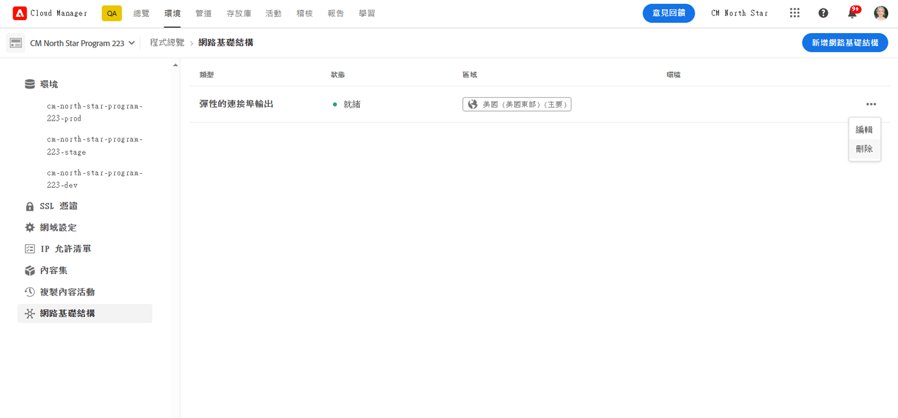

# 設定 AEM as a Cloud Service 的進階網路 {#configuring-advanced-networking}

本文介紹 AEM as a Cloud Service 所提供的進階網路功能。這些功能包括 VPN、非標準連接埠和專用輸出 IP 位址的自助服務與 API 佈建。

除了本文件以外，還有一系列教學課程，旨在引導您逐步了解每個進階網路選項。請參閱[進階網路](https://experienceleague.adobe.com/zh-hant/docs/experience-manager-learn/cloud-service/networking/advanced-networking)。

>[!IMPORTANT]
>
>您可以透過 Cloud Manager UI 或使用 Cloud Manager API (例如 cURL)，設定 AEM as a Cloud Service 的進階網路。
>
>本文的重點是說明如何使用 UI 方法。如果想要透過 API 將設定自動化，請參閱[虛擬私人網路 (VPN) 教學課程](https://experienceleague.adobe.com/zh-hant/docs/experience-manager-learn/cloud-service/networking/vpn)。
>
>**使用 API 將進階網路設定自動化**
>若要將進階網路設定 (例如建立 VPN) 自動化，可以使用 Cloud Manager API：
>
>```bash
>curl -X POST https://cloudmanager.adobe.io/api/program/{PROGRAM_ID}/environment/{ENV_ID}/vpn \
>   -H "Authorization: Bearer {ACCESS_TOKEN}" \
>   -H "x-api-key: {API_KEY}" \
>   -H "Content-Type: application/json" \
>   -d '{
>       "providerId": "aws",
>       "portMappings": [
>           {
>               "name": "SSH",
>               "protocol": "TCP",
>               "port": 22
>           }
>       ]
>   }'
>```
>
>請參閱[虛擬私人網路 (VPN) 教學課程](https://experienceleague.adobe.com/zh-hant/docs/experience-manager-learn/cloud-service/networking/vpn)的完整教學課程和更多 API 範例。
>

## 概觀 {#overview}

AEM as a Cloud Service 提供以下進階網路選項：

* [彈性連接埠輸出](#flexible-port-egress) - 設定 AEM as a Cloud Service 為允許從非標準連接埠輸出流量。
* [專用輸出 IP 位址](#dedicated-egress-ip-address) - 將 AEM as a Cloud Service 的對外流量設定為源自唯一的 IP。
* [虛擬私人網路 (VPN)](#vpn) - 如果您有 VPN，可保護您的基礎結構與 AEM as a Cloud Service 之間的流量。

本文首先會詳細說明每個選項以及為什麼您可能會使用這些選項，然後會說明如何使用 Cloud Manager UI 和 API 來設定選項。本文最後提供了一些進階用例。

>[!CAUTION]
>
>如果您已佈建舊版專用輸出技術並想設定這些進階網路選項之一，[聯絡 Adobe Client Care](https://experienceleague.adobe.com/zh-hant?support-solution=Experience+Manager#home)。
>
>嘗試使用舊版專用輸出技術設定進階網路時，可能會影響網站連線。

### 要求和限制 {#requirements}

設定進階網路功能時，有以下限制。

* 一個程式可以提供單一進階網路選項 (彈性連接埠輸出、專用輸出 IP 位址或 VPN)。
* 進階網路不適用於[沙箱方案](/help/implementing/cloud-manager/getting-access-to-aem-in-cloud/program-types.md)。
* 使用者必須擁有&#x200B;**管理員**&#x200B;角色，才能在您的方案中新增和設定網路基礎結構。
* 必須先建立生產環境，然後才能將網路基礎架構加入您的程式。
* 您的網路基礎設施必須與生產環境的主要區域位於相同區域內。
   * 如果您的生產環境有[額外的發佈區域](/help/implementing/cloud-manager/manage-environments.md#multiple-regions)，您可以建立對應每個額外區域的另一個網路基礎架構。
   * 您建立的網路基礎架構數量不得超過生產環境中設定的最大區域數量。
   * 您可以定義與生產環境可用區域一樣多的網路基礎結構，但新基礎結構必須與先前建立的基礎結構類型相同。
   * 建立多個基礎架構時，您只能選取尚未建立進階網路基礎架構的區域。

### 設定和啟用進階網絡 {#configuring-enabling}

使用進階網路功能需要兩個步驟：

1. 進階網路選項之設定，無論是[彈性連接埠輸出](#flexible-port-egress)、[專用輸出 IP 位址](#dedicated-egress-ip-address)或 [VPN](#vpn)，都必須先在方案層級完成。
1. 若要使用進階網路選項，必須[在環境層級啟用](#enabling)。

這兩個步驟都可以使用 Cloud Manager UI 或 Cloud Manager API 來完成。

* 使用 Cloud Manager UI 時，這表示要使用程式層級的精靈建立進階網路設定，然後編輯您想要啟用設定的每個環境。

* 使用 Cloud Manager API 時，系統會在程式層級呼叫 `/networkInfrastructures` API 端點來宣告所需的進階網路類型。接下來是對每個環境的 `/advancedNetworking` 端點的呼叫，以啟用基礎設施並設定環境特定的參數。

## 彈性連接埠輸出 {#flexible-port-egress}

此進階網路功能可讓您設定 AEM as a Cloud Service 以透過預設開啟的 HTTP (連接埠 80) 和 HTTPS (連接埠 443) 以外的連接埠輸出流量。

>[!TIP]
>
>在決定使用彈性連接埠輸出或專用輸出 IP 位址時，如果不需要特定的 IP 位址，建議您選擇彈性連接埠輸出。這是因為 Adobe 可以將彈性的連接埠輸出流量效能最佳化。

>[!NOTE]
>
>在建立後，彈性連接埠輸出基礎架構類型將無法編輯。變更設定值的唯一方法是刪除並重新建立。

### UI 設定 {#configuring-flexible-port-egress-provision-ui}

1. 在 [my.cloudmanager.adobe.com](https://my.cloudmanager.adobe.com/) 登入 Cloud Manager 並選取適當的組織。

1. 在「**[我的程式](/help/implementing/cloud-manager/navigation.md#my-programs)**」控制台中，選取程式。

1. 從「**程式概觀**」頁面，導覽至「**環境**」標籤，然後在左側面板選取「**網路基礎設施**」。

   

1. 在「**新增網路基礎結構**」精靈中，選取「**彈性的連接埠輸出**」。
1. 從「**區域**」下拉選單選擇所要的區域，然後按一下「**繼續**」。

   

1. 「**確認**」標籤會總結您的選擇和後續步驟。按一下「**儲存**」並建立內容結構。

   

側面板的「**網路基礎結構**」標題下方會出現一筆新的記錄。其中包括基礎結構類型、狀態、區域以及啟用的環境等詳細資訊。


>[!NOTE]
>
>建立彈性連接埠輸出的基礎設施可能需要長達一個小時，之後可以在環境層級進行設定。

### API 設定 {#configuring-flexible-port-egress-provision-api}

對每個程式會叫用一次 POST`/program/<programId>/networkInfrastructures` 端點，直接傳遞 `flexiblePortEgress` 的值 (`kind` 參數和區域)。端點會以 `network_id` 及其他資訊回應，包括狀態。

呼叫後，通常需要大約 15 分鐘的時間來佈建網路基礎結構。對 Cloud Manager 的[網路基礎結構 GET 端點](https://developer.adobe.com/experience-cloud/cloud-manager/reference/api/#operation/getNetworkInfrastructure)的呼叫會顯示「**就緒**」狀態。

>[!TIP]
>
>完整的參數、正確的語法，以及哪些參數之後不能變更等重要資訊，[可參考 API 文件](https://developer.adobe.com/experience-cloud/cloud-manager/reference/api/#operation/createNetworkInfrastructure)。

### 流量路由 {#flexible-port-egress-traffic-routing}

對於流向 80 或 443 以外連接埠的 http 或 https 流量，應使用以下主機和連接埠環境變數來設定 Proxy：

* 對於 HTTP：`AEM_PROXY_HOST`/ `AEM_HTTP_PROXY_PORT ` (在 AEM 版本 &lt; 6094 中預設為 `proxy.tunnel:3128`)
* 對於 HTTPS：`AEM_PROXY_HOST` / `AEM_HTTPS_PROXY_PORT ` (在 AEM 版本 &lt; 6094 中預設為 `proxy.tunnel:3128`)

例如，以下是傳送要求至 `www.example.com:8443` 的範例程式碼：

```java
String url = "www.example.com:8443"
String proxyHost = System.getenv().getOrDefault("AEM_PROXY_HOST", "proxy.tunnel");
int proxyPort = Integer.parseInt(System.getenv().getOrDefault("AEM_HTTPS_PROXY_PORT", "3128"));
HttpClient client = HttpClient.newBuilder()
      .proxy(ProxySelector.of(new InetSocketAddress(proxyHost, proxyPort)))
      .build();
 
HttpRequest request = HttpRequest.newBuilder().uri(URI.create(url)).build();
HttpResponse<String> response = client.send(request, BodyHandlers.ofString());
```

如果使用非標準 Java™ 網路程式庫，請使用上述屬性為所有流量設定 Proxy。

目標流經 `portForwards` 參數中宣告的連接埠的非 http/s 流量應該參照一個名為 `AEM_PROXY_HOST` 的屬性，以及對應的連接埠。例如：

```java
DriverManager.getConnection("jdbc:mysql://" + System.getenv("AEM_PROXY_HOST") + ":53306/test");
```

下表描述了流量路由：

<table>
<thead>
  <tr>
    <th>流量</th>
    <th>目標條件</th>
    <th>連接埠</th>
    <th>連線</th>
    <th>外部目標範例</th>
  </tr>
</thead>
<tbody>
  <tr>
    <td><b>Http 或 https 通訊協定</b></td>
    <td>標準 http/s 流量</td>
    <td>80 或 443</td>
    <td>允許</td>
    <td></td>
  </tr> 
  <tr>
    <td></td>
    <td>流經使用以下環境變數和 Proxy 連接埠號碼設定的 http proxy 的非標準流量 (在 80 或 443 以外的其他連接埠上)。請勿在 Cloud Manager API 呼叫的 portForwards 參數中宣告目標連接埠：<br><ul>
     <li>AEM_PROXY_HOST (在 AEM 版本 &lt; 6094 中預設為 `proxy.tunnel`)</li>
     <li>AEM_HTTPS_PROXY_PORT (在 AEM 版本 &lt; 6094 中預設為連接埠 3128)</li>
    </ul>
    <td>80 或 443 之外的連接埠</td>
    <td>允許</td>
    <td>example.com:8443</td>
  </tr>
  <tr>
    <td></td>
    <td>不使用 http proxy 的非標準流量 (在連接埠 80 或 443 之外的其他連接埠上)</td>
    <td>80 或 443 之外的連接埠</td>
    <td>已封鎖</td>
    <td></td>
  </tr>
  <tr>
    <td><b>非 http 或非 https</b></td>
    <td>連接到 <code>AEM_PROXY_HOST</code> 環境變數 (使用 <code>portOrig</code> 在 <code>portForwards</code> API 參數中宣告) 的用戶端。</td>
    <td>任何</td>
    <td>允許</td>
    <td><code>mysql.example.com:3306</code></td>
  </tr>
  <tr>
    <td></td>
    <td>其他一切</td>
    <td>任何</td>
    <td>已封鎖</td>
    <td><code>db.example.com:5555</code></td>
  </tr>
</tbody>
</table>

#### Apache / Dispatcher 設定 {#apache-dispatcher}

可以使用上述屬性設定 AEM Cloud Service Apache / Dispatcher 層的 `mod_proxy` 指令。

```
ProxyRemote "http://example.com:8080" "http://${AEM_PROXY_HOST}:3128"
ProxyPass "/somepath" "http://example.com:8080"
ProxyPassReverse "/somepath" "http://example.com:8080"
```

```
SSLProxyEngine on //needed for https backends
 
ProxyRemote "https://example.com:8443" "http://${AEM_PROXY_HOST}:3128"
ProxyPass "/somepath" "https://example.com:8443"
ProxyPassReverse "/somepath" "https://example.com:8443"
```

## 專用輸出 IP 位址 {#dedicated-egress-ip-address}

在與 SaaS 廠商 (如 CRM 廠商) 整合或在 AEM as a Cloud Service 之外有提供 IP 位址允許清單的其他整合時，專用的 IP 位址可以增強安全性。新增專用的 IP 位址新增至允許清單，可確保只允許來自 AEM Cloud Service 的流量流向外部服務。此方法是對任何其他已允許 IP 流量的額外補充。

相同的專用 IP 適用於方案中的所有環境，並且適用於製作和發佈服務。

如果沒有啟用專用 IP 位址功能，AEM as a Cloud Service 的流量會流經一組共用的 IP。這些是 AEM as a Cloud Service 的其他客戶所使用的 IP。

設定專用輸出 IP 位址類似於[彈性的連接埠輸出](#flexible-port-egress)。主要區別在於設定後，流量一律從專用的唯一 IP 輸出。若要尋找該 IP，請使用 DNS 解析器識別與 `p{PROGRAM_ID}.external.adobeaemcloud.com` 相關聯的 IP 位址。該 IP 位址預期不會變更，但如果必須變更會事先通知。

>[!TIP]
>
>在決定使用彈性連接埠輸出或專用輸出 IP 位址時，如果不需要特定的 IP 位址，可選擇彈性連接埠輸出。這是因為 Adobe 可以將彈性的連接埠輸出流量效能最佳化。

>[!NOTE]
>
>如果在 2021.09.30 之前 (即 2021 年 9 月版本之前) 已為您佈建專用輸出 IP，則您的專用輸出 IP 功能僅支援 HTTP 和 HTTPS 連接埠。
>
>此結果包含 HTTP/1.1，若加密也會包含 HTTP/2。此外，一個專用輸出端點可以分別透過連接埠 80/443 上的 HTTP/HTTPS 與任何目標通訊。

>[!NOTE]
>
>建立後，專用輸出 IP 位址基礎架構類型將無法編輯。變更設定值的唯一方法是刪除並重新建立。

### UI 設定 {#configuring-dedicated-egress-provision-ui}

1. 在 [my.cloudmanager.adobe.com](https://my.cloudmanager.adobe.com/) 登入 Cloud Manager 並選取適當的組織。

1. 在「**[我的程式](/help/implementing/cloud-manager/navigation.md#my-programs)**」控制台中，選取程式。

1. 從「**程式概觀**」頁面，導覽至「**環境**」標籤，然後在左側面板選取「**網路基礎設施**」。

   

1. 在開啟的「**新增網路基礎結構**」精靈中，按一下「**專用輸出 IP 位址**」。
1. 從「**區域**」下拉選單選擇所要的區域，然後按一下「**繼續**」。

   

1. 「**確認**」標籤會總結您的選擇和後續步驟。按一下「**儲存**」並建立內容結構。

   

側面板的「**網路基礎結構**」標題下方會出現一筆新的記錄。其中包括基礎結構類型、狀態、區域以及啟用的環境等詳細資訊。


>[!NOTE]
>
>建立彈性連接埠輸出的基礎設施可能需要長達一個小時，之後可以在環境層級進行設定。

### API 設定 {#configuring-dedicated-egress-provision-api}

對每個程式會叫用一次 POST`/program/<programId>/networkInfrastructures` 端點，直接傳遞 `dedicatedEgressIp` 的值 (`kind` 參數和區域)。端點會以 `network_id` 及其他資訊回應，包括狀態。

呼叫後，通常需要大約 15 分鐘的時間來佈建網路基礎結構。對 Cloud Manager 的[網路基礎結構 GET 端點](https://developer.adobe.com/experience-cloud/cloud-manager/reference/api/#operation/getNetworkInfrastructure)的呼叫會顯示「**就緒**」狀態。

>[!TIP]
>
>完整的參數、正確的語法，以及哪些參數之後不能變更等重要資訊，[可參考 API 文件](https://developer.adobe.com/experience-cloud/cloud-manager/reference/api/#operation/createNetworkInfrastructure)。

### 流量路由 {#dedicated-egress-ip-traffic-routing}

Http 或 https 流量會流經預先設定的 Proxy，前提是它們使用標準 Java™ 系統屬性進行 Proxy 設定。

目標流經 `portForwards` 參數中宣告的連接埠的非 http/s 流量應該參照一個名為 `AEM_PROXY_HOST` 的屬性，以及對應的連接埠。例如：

```java
DriverManager.getConnection("jdbc:mysql://" + System.getenv("AEM_PROXY_HOST") + ":53306/test");
```

<table>
<thead>
  <tr>
    <th>流量</th>
    <th>目標條件</th>
    <th>連接埠</th>
    <th>連線</th>
    <th>外部目標範例</th>
  </tr>
</thead>
<tbody>
  <tr>
    <td><b>Http 或 https 通訊協定</b></td>
    <td>到 Azure (*.windows.net) 或 Adobe 服務的流量</td>
    <td>任何</td>
    <td>流經共用叢集 IP (不是專用的 IP)</td>
    <td>adobe.io<br>api.windows.net</td>
  </tr>
  <tr>
    <td></td>
    <td>符合 <code>nonProxyHosts</code> 參數的主機</td>
    <td>80 或 443</td>
    <td>流經共用叢集 IP</td>
    <td></td>
  </tr>
  <tr>
    <td></td>
    <td>符合 <code>nonProxyHosts</code> 參數的主機</td>
    <td>80 或 443 之外的連接埠</td>
    <td>已封鎖</td>
    <td></td>
  </tr>
  <tr>
    <td></td>
    <td>透過 HTTP Proxy 設定處理，此設定預設適用於使用標準 Java™ HTTP 用戶端程式庫的 HTTP/S 流量</td>
    <td>任何</td>
    <td>流經專用輸出 IP</td>
    <td></td>
  </tr>
  <tr>
    <td></td>
    <td>忽略 http proxy 設定 (例如，如果從標準 Java™ HTTP 用戶端資料庫中明確移除，或者如果使用忽略標準 Proxy 設定的 Java™ 資料庫)</td>
    <td>80 或 443</td>
    <td>流經共用叢集 IP</td>
    <td></td>
  </tr>
  <tr>
    <td></td>
    <td>忽略 http proxy 設定 (例如，如果從標準 Java™ HTTP 用戶端資料庫中明確移除，或者如果使用忽略標準 Proxy 設定的 Java™ 資料庫)</td>
    <td>80 或 443 之外的連接埠</td>
    <td>已封鎖</td>
    <td></td>
  </tr>
  <tr>
    <td><b>非 http 或非 https</b></td>
    <td>連接到 <code>AEM_PROXY_HOST</code> 環境變數 (使用 <code>portOrig</code> 在 <code>portForwards</code> API 參數中宣告) 的用戶端</td>
    <td>任何</td>
    <td>流經專用輸出 IP</td>
    <td><code>mysql.example.com:3306</code></td>
  </tr>
  <tr>
    <td></td>
    <td>其他任何項目</td>
    <td></td>
    <td>已封鎖</td>
    <td></td>
  </tr>
</tbody>
</table>

### 功能使用情況 {#feature-usage}

功能與導致輸出流量的 Java™ 程式碼或資料庫相容，前提是它們使用標準 Java™ 系統屬性進行 Proxy 設定。實際上，此方法應該包括最常見的資料庫。

以下是程式碼範例：

```java
public JSONObject getJsonObject(String relativePath, String queryString) throws IOException, JSONException {
  String relativeUri = queryString.isEmpty() ? relativePath : (relativePath + '?' + queryString);
  URL finalUrl = endpointUri.resolve(relativeUri).toURL();
  URLConnection connection = finalUrl.openConnection();
  connection.addRequestProperty("Accept", "application/json");
  connection.addRequestProperty("X-API-KEY", apiKey);

  try (InputStream responseStream = connection.getInputStream(); Reader responseReader = new BufferedReader(new InputStreamReader(responseStream, Charsets.UTF_8))) {
    return new JSONObject(new JSONTokener(responseReader));
  }
}
```

一些資料庫需要明確設定才能使用標準 Java™ 系統屬性進行 Proxy 設定。

使用 Apache HttpClient 的範例，需要明確呼叫
[`HttpClientBuilder.useSystemProperties()`](https://hc.apache.org/httpcomponents-client-4.5.x/current/httpclient/apidocs/org/apache/http/impl/client/HttpClientBuilder.html) 或使用 
[`HttpClients.createSystem()`](https://hc.apache.org/httpcomponents-client-4.5.x/current/httpclient/apidocs/org/apache/http/impl/client/HttpClients.html#createSystem())：

```java
public JSONObject getJsonObject(String relativePath, String queryString) throws IOException, JSONException {
  String relativeUri = queryString.isEmpty() ? relativePath : (relativePath + '?' + queryString);
  URL finalUrl = endpointUri.resolve(relativeUri).toURL();

  HttpClient httpClient = HttpClientBuilder.create().useSystemProperties().build();
  HttpGet request = new HttpGet(finalUrl.toURI());
  request.setHeader("Accept", "application/json");
  request.setHeader("X-API-KEY", apiKey);
  HttpResponse response = httpClient.execute(request);
  String result = EntityUtils.toString(response.getEntity());
}
```

### 偵錯考量 {#debugging-considerations}

若要驗證流量確實在預期的專用 IP 位址上傳出，請檢查目標服務中的記錄 (如果可用)。否則，呼叫偵錯服務可能會有幫助，例如 [https://ifconfig.me/ip](https://ifconfig.me/ip) 會傳回呼叫的 IP 位址。

## 虛擬私人網路 (VPN) {#vpn}

VPN 允許從製作、發佈或預覽執行個體連線到內部部署基礎結構或資料中心。例如，此能力對於保護資料庫存取很有用。VPN 還允許連線到 SaaS 廠商，例如支援 VPN 的 CRM 廠商。

支援大多數採用 IPSec 技術的 VPN 裝置。請查閱[本裝置清單](https://learn.microsoft.com/zh-tw/azure/vpn-gateway/vpn-gateway-about-vpn-devices#devicetable)內 **RouteBased 設定指示**&#x200B;欄中的資訊。按照表格所述設定裝置。

>[!NOTE]
>
>以下是 VPN 基礎設施的限制：
>
>* 支援僅限於單一 VPN 連線
>* DNS Resolver 必須列在閘道位址空間中才能解析私有主機名稱。

### UI 設定 {#configuring-vpn-ui}

1. 在 [my.cloudmanager.adobe.com](https://my.cloudmanager.adobe.com/) 登入 Cloud Manager 並選取適當的組織。

1. 在「**[我的程式](/help/implementing/cloud-manager/navigation.md#my-programs)**」控制台中，選取程式。

1. 從「**程式概觀**」頁面，導覽至「**環境**」標籤，然後在左側面板選取「**網路基礎設施**」。

   

1. 在啟動的「**新增網路基礎設施**」精靈中，選取「**虛擬私人網路**」並提供必要的資訊，然後按一下「**繼續**」。

   * **區域** - 應該建立基礎結構的區域。
   * **位址空間** - 位址空間只能是您自己空間中的 1/26 CIDR (64 IP 位址) 或更大的 IP 範圍。
      * 這個值之後無法變更。
   * **DNS 資訊** - 遠端 DNS 解析器的清單。
      * 輸入 DNS 伺服器位址後，按下 `Enter` 再新增另一個位址。
      * 在位址後面，按一下 `X` 即可移除。
   * **共用金鑰** - 您的 VPN 預先共用金鑰。
      * 選取「**顯示共用金鑰**」，顯示金鑰，以便您仔細檢查該值。

   

1. 在精靈的「**連線** 」標籤中，提供「**連線名稱**」以識別您的 VPN 連線，並按一下「**新增連線**」。

   

1. 在「**新增連線**」對話框中，定義您的 VPN 連線，然後按一下「**儲存**」。

   * **連線名稱** - VPN 連線的說明性名稱，這是您在上一個步驟提供的名稱，且可以在此處更新。
   * **位址** - VPN 裝置的 IP 位址。
   * **位址空間** - 透過 VPN 進行路由的 IP 位址範圍。
      * 輸入一個範圍後，按下 `Enter` 再新增另一個範圍。
      * 在一個範圍後面，按一下 `X` 即可移除。
   * **IP 安全性原則** - 依需要調整預設值

   

1. 對話框關閉，您會返回精靈的「**連線**」索引標籤。按一下&#x200B;**「繼續」**。

   

1. 「**確認**」標籤會總結您的選擇和後續步驟。按一下「**儲存**」並建立內容結構。

   

側面板的「**網路基礎結構**」標題下方會出現一筆新的記錄。其中包括基礎結構類型、狀態、區域以及啟用的環境等詳細資訊。

### API 設定 {#configuring-vpn-api}

對每個程式會叫用一次 POST `/program/<programId>/networkInfrastructures` 端點，這會傳遞設定資訊的承載該資訊包括 `kind` 參數、區域、位址空間 (CIDR 清單 - 請注意，以後無法修改此值)、DNS 解析器 (用於解析網路中的名稱) 的 **vpn** 值。還包括 VPN 連接訊息，例如網關設定、共享 VPN 金鑰和 IP 安全性原則。端點會以 `network_id` 及其他資訊回應，包括狀態。

呼叫後，通常需要 45 至 60 分鐘的時間進行網路基礎結構佈建。可以呼叫 API 中的 GET 方法傳回目前狀態，這最終會從 `creating` 轉成 `ready`。請參閱 API 文件以了解各種狀態。

>[!TIP]
>
>完整的參數、正確的語法，以及哪些參數之後不能變更等重要資訊，[可參考 API 文件](https://developer.adobe.com/experience-cloud/cloud-manager/reference/api/#operation/createNetworkInfrastructure)。

### 流量路由 {#vpn-traffic-routing}

下表描述了流量路由。

<table>
<thead>
  <tr>
    <th>流量</th>
    <th>目標條件</th>
    <th>連接埠</th>
    <th>連線</th>
    <th>外部目標範例</th>
  </tr>
</thead>
<tbody>
  <tr>
    <td><b>Http 或 https 通訊協定</b></td>
    <td>到 Azure 或 Adobe 服務的流量</td>
    <td>任何</td>
    <td>流經共用叢集 IP (不是專用的 IP)</td>
    <td>adobe.io<br>api.windows.net</td>
  </tr>
  <tr>
    <td></td>
    <td>符合 <code>nonProxyHosts</code> 參數的主機</td>
    <td>80 或 443</td>
    <td>流經共用叢集 IP</td>
    <td></td>
  </tr>
  <tr>
    <td></td>
    <td>符合 <code>nonProxyHosts</code> 參數的主機</td>
    <td>80 或 443 之外的連接埠</td>
    <td>已封鎖</td>
    <td></td>
  </tr>
  <tr>
    <td></td>
    <td>如果 IP 位在 <i>VPN 閘道位址</i>空間範圍內，並透過 HTTP Proxy 設定 (此設定預設適用於使用標準 Java™ HTTP 用戶端程式庫的 HTTP/S 流量) 處理</td>
    <td>任何</td>
    <td>流經 VPN</td>
    <td><code>10.0.0.1:443</code><br>它也可以是主機名稱。</td>
  </tr>
  <tr>
    <td></td>
    <td>如果 IP 不在 <i>VPN 閘道位址</i>空間範圍內，並透過 HTTP Proxy 設定 (此設定預設適用於使用標準 Java™ HTTP 用戶端程式庫的 HTTP/S 流量) 處理</td>
    <td>任何</td>
    <td>流經專用輸出 IP</td>
    <td></td>
  </tr>
  <tr>
    <td></td>
    <td>忽略 HTTP Proxy 設定 (例如，如果明確從標準 Java™ HTTP 用戶端程式庫中移除，或者如果使用忽略標準 Proxy 設定的 Java™ 資料庫)
</td>
    <td>80 或 443</td>
    <td>流經共用叢集 IP</td>
    <td></td>
  </tr>
  <tr>
    <td></td>
    <td>忽略 HTTP Proxy 設定 (例如，如果明確從標準 Java™ HTTP 用戶端程式庫中移除，或者如果使用忽略標準 Proxy 設定的 Java™ 資料庫)</td>
    <td>80 或 443 之外的連接埠</td>
    <td>已封鎖</td>
    <td></td>
  </tr>
  <tr>
    <td><b>非 http 或非 https</b></td>
    <td>如果 IP 在 <i>VPN 閘道位址空間</i>範圍內，並且用戶端連線到 <code>AEM_PROXY_HOST</code> 環境變數 (使用 <code>portOrig</code> 在 <code>portForwards</code>API 參數中宣告)</td>
    <td>任何</td>
    <td>流經 VPN</td>
    <td><code>10.0.0.1:3306</code><br>它也可以是主機名稱。</td>
  </tr>
  <tr>
    <td></td>
    <td>如果 IP 不在 <i>VPN 閘道位址空間</i>範圍內，並且用戶端連線到 <code>AEM_PROXY_HOST</code> 環境變數 (使用 <code>portOrig</code> 在 <code>portForwards</code>API 參數中宣告)</td>
    <td>任何</td>
    <td>流經專用輸出 IP</td>
    <td></td>
  </tr>
  <tr>
    <td></td>
    <td>其他任何項目</td>
    <td>任何</td>
    <td>已封鎖</td>
    <td></td>
  </tr>
</tbody>
</table>

### 供設定的實用網域 {#vpn-useful-domains-for-configuration}

下圖提供了一組網域和相關聯的 IP 的視覺化表示，對設定和開發很有幫助。圖表下方的表格描述了這些網域和 IP。


<table>
<thead>
  <tr>
    <th>網域模式</th>
    <th>說明</th>
  </tr>
</thead>
<tbody>
  <tr>
    <td><code>p{PROGRAM_ID}.external.adobeaemcloud.com</code></td>
    <td>專用輸出IP位址，用於流向網際網路的流量，而不是流經私人網路的流量。</td>
  </tr>
  <tr>
    <td><code>p{PROGRAM_ID}.{REGION}-gateway.external.adobeaemcloud.com</code></td>
    <td>AEM 端 VPN 閘道的 IP。您的網路工程團隊可以使用此 IP，僅允許來自特定 IP 位址的 VPN 連線進入您的 VPN 閘道。 </td>
  </tr>
</tbody>
</table>

## 在環境中啟用進階網路設定 {#enabling}

為程式設定好進階網路選項後，無論是[彈性連接埠輸出、](#flexible-port-egress) [專用輸出 IP 位址](#dedicated-egress-ip-address) 或 [VPN](#vpn)，若要使用，您必須在環境層級啟用。

當您為環境啟用進階網路設定時，您也可以啟用選用的連接埠轉送和非代理主機。 您可以設定每個環境的參數，以便提供彈性。

* **連接埠轉送** - 任何目標連接埠若不是 80/443，則應該宣告連接埠轉送規則，但僅適用於不使用 HTTP 或 HTTPS 通訊協定的情況。
   * 定義連接埠轉送規則的方法是指定一組目標主機 (名稱或 IP 和連接埠)。
   * 透過 HTTP/HTTPS 使用連接埠 80/443 的用戶端連線，在其連線中仍然必須使用 Proxy 設定，才能讓進階網路的屬性套用至該連線。
   * 對於每個目標主機，您必須將預期的目標連接埠對應到 30000 到 30999 之間的連接埠。
   * 連接埠轉送規則適用於所有進階網路類型。

* **非代理主機** - 非代理主機可讓您宣告一組主機，這些主機應透過共用 IP 位址範圍 (而非專用 IP) 進行路由。
   * 此方法可能很有用，因為可以進一步最佳化透過共用 IP 輸出的流量。
   * 非代理主機僅適用於專用輸出進階 IP 位址和 VPN 進階網路類型。

>[!NOTE]
>
>如果環境在&#x200B;**更新**&#x200B;狀態中，您無法為環境啟用進階網路設定。

### 啟用使用 UI {#enabling-ui}

1. 在 [my.cloudmanager.adobe.com](https://my.cloudmanager.adobe.com/) 登入 Cloud Manager 並選取適當的組織。

1. 在「**[我的程式](/help/implementing/cloud-manager/navigation.md#my-programs)**」控制台中，選取程式。

1. 從「**計劃概觀**」頁面，導覽至「**環境**」標籤，並選取您想要啟用進階網路設定的環境 (在左側面板的「**環境**」標題中)。 然後，選取所選環境的「**進階網路設定**」標籤，然後按一下「**啟用網路基礎設施**」。

   

1. 「**設定進階網路**」對話框開啟。

1. 在「**非代理主機**」標籤上，對於專用輸出 IP 位址和 VPN，您可以選擇性定義一組主機。這些主機應透過共用 IPS 位址範圍進行路由 (而非專用的 IP)，方法是在「**非代理主機**」欄位中提供主機名，然後按一下「**新增**」。

   * 該主機將會新增至標籤上的主機清單。
   * 如果您想要新增多個主機，可重複此步驟。
   * 如果您想要移除主機，可按一下該列右側的 X。
   * 此標籤不適用於彈性連接埠輸出設定。

   

1. 在「**連接埠轉送**」標籤上，如果不使用 HTTP 或 HTTPS，您可以選擇為除 80/443 以外的任何目標連接埠定義連接埠轉送規則。提供&#x200B;**名稱**、 **連接埠來源**&#x200B;和&#x200B;**連接埠目標**，然後按一下「**新增**」。

   * 該規則將會新增至標籤上的規則清單中。
   * 如果您想要新增多個規則，可重複此步驟。
   * 如果您想要移除規則，可按一下該列右側的 X。

   

1. 在對話框中，按一下「**儲存**」，以便您可將設定套用至環境。

進階網路設定將適用於所選環境中。返回「**環境**」標籤，您可以查看套用於所選環境的設定詳細資訊及其狀態。


### 啟用使用 API {#enabling-api}

若要為環境啟用進階網路設定，必須為每個環境叫用 `PUT /program/<program_id>/environment/<environment_id>/advancedNetworking` 端點。

API 應該會在幾秒鐘內做出回應，指示 `updating` 的狀態。約 10 分鐘後，對 Cloud Manager 環境 GET 端點的呼叫會顯示  `ready` 的狀態，這表示已套用環境更新。

每個環境的連接埠轉送規則可以透過叫用 `PUT /program/{programId}/environment/{environmentId}/advancedNetworking` 端點來更新，包括完整的設定參數集而非子集。

專用輸出 IP 位址和 VPN 進階網路類型支援 `nonProxyHosts` 參數。透過這項支援，您可以宣告應透過共用的 IP 位址範圍 (而非專用的 IP) 進行路由的一組主機。`nonProxyHost` URL 可能遵循 `example.com` 或`*.example.com` 的模式，其中僅在網域開頭支援萬用字元。

即使沒有環境流量路由規則 (主機或旁路)，仍然必須用空白承載呼叫 `PUT /program/<program_id>/environment/<environment_id>/advancedNetworking`。

>[!TIP]
>
>完整的參數、正確的語法，以及哪些參數之後不能變更等重要資訊，[可參考 API 文件](https://developer.adobe.com/experience-cloud/cloud-manager/reference/api/#operation/createNetworkInfrastructure)。

## 編輯並刪除環境中的進階網路設定 {#editing-deleting-environments}

[啟用環境的進階網路設定](#enabling)後，您可以更新這些設定的詳細資訊或將其刪除。

>[!NOTE]
>
>如果網路基礎設施在「**建立中**」、「**更新中**」或「**刪除中**」的狀態，您就無法編輯網路基礎設施。

### 使用 UI 編輯或刪除 {#editing-ui}

1. 在 [my.cloudmanager.adobe.com](https://my.cloudmanager.adobe.com/) 登入 Cloud Manager 並選取適當的組織。

1. 在「**[我的程式](/help/implementing/cloud-manager/navigation.md#my-programs)**」控制台中，選取程式。

1. 從「**計劃概觀**」頁面，導覽至「**環境**」標籤，並選取您想要啟用進階網路設定的環境 (在左側面板的「**環境**」標題中)。 然後，選取所選環境的「**進階網路設定**」標籤，然後按一下省略號按鈕。

   

1. 在省略號選單中，選取「**編輯**」或「**刪除**」。

   * 如果您選擇「**編輯**」，請按照上一節「[利用使用者介面啟用](#enabling-ui)」中所述的步驟更新資訊，然後按一下「**儲存**」。
   * 如果您選擇「**刪除**」，請在「**刪除網路設定**」對話框中使用「**刪除**」來確認刪除，或使用「**取消**」來中止。

變更會反映在「**環境**」標籤上。

### 使用 API 編輯或刪除 {#editing-api}

若要刪除特定環境的進階網絡，請呼叫 `DELETE [/program/{programId}/environment/{environmentId}/advancedNetworking]()`。

>[!TIP]
>
>完整的參數、正確的語法，以及哪些參數之後不能變更等重要資訊，[可參考 API 文件](https://developer.adobe.com/experience-cloud/cloud-manager/reference/api/#operation/createNetworkInfrastructure)。

## 編輯和刪除程式的網路基礎結構 {#editing-deleting-program}

一旦為程式建立了網路基礎結構，就只能編輯有限的屬性。如果您不需要，您可以刪除整個程式的進階網路基礎架構。

>[!NOTE]
>
>編輯和刪除網路基礎設施有以下限制：
>
>* 如果所有環境都停用了進階網路，則刪除作業只會刪除基礎結構。
>* 如果網路基礎設施在「**建立中**」、「**更新中**」或「**刪除中**」的狀態，您就無法編輯網路基礎設施。
>* 建立後，只能編輯 VPN 進階網路基礎架構類型，然後，只能編輯有限的欄位。
>* 基於安全理由，在編輯進階 VPN 網路基礎架構時，一定要隨時提供&#x200B;**共用金鑰**，即使您未編輯金鑰也一樣要提供。

### 使用 UI 編輯和刪除 {#delete-ui}

1. 在 [my.cloudmanager.adobe.com](https://my.cloudmanager.adobe.com/) 登入 Cloud Manager，並選取適當的組織。

1. 在「**[我的程式](/help/implementing/cloud-manager/navigation.md#my-programs)**」控制台中，選取程式。

1. 從「**方案概觀**」頁面，導覽至「**環境**」索引標籤。
1. 在左側面板中，按一下「**網路基礎結構**」。
1. 按一下您想要刪除之基礎結構旁的按鈕。

   

1. 按一下「**編輯**」或「**刪除**」。

1. 執行下列任一項作業：

   * 如果您已選擇「**編輯**」，則「**編輯網路基礎結構**」精靈會開啟。請依照建立基礎結構時說明的步驟，依需要進行編輯。

   * 如果您選擇「**刪除**」，請在「**刪除網路設定**」對話框中使用「**刪除**」以確認刪除，或使用「**取消**」中止。

變更會反映在「**環境**」標籤上。

### 使用 API 編輯和刪除 {#delete-api}

要&#x200B;**刪除**&#x200B;程式的網路基礎結構，請叫用 `DELETE /program/{program ID}/networkinfrastructure/{networkinfrastructureID}`。

## 變更程式的進階網路基礎架構類型 {#changing-program}

一個方案一次只能設定一種類型的進階網路基礎結構。進階網路基礎結構必須是彈性連接埠輸出、專用輸出 IP 位址或 VPN。

如果您決定需要其他進階網路基礎架構類型，而不需要已設定的網路基礎架構類型，可刪除現有的網路基礎架構類型並建立另一個網路基礎架構類型。請執行下列動作：

1. [刪除所有環境中的進階網路](#editing-deleting-environments)。
1. [刪除進階網路基礎結構](#editing-deleting-program)。
1. 建立您現在需要的進階網路基礎架構類型，包括[彈性連接埠輸出](#flexible-port-egress)、[專用輸出 IP 位址](#dedicated-egress-ip-address)或 [VPN](#vpn)。
1. [在環境層級重新啟用進階網路](#enabling)。

>[!WARNING]
>
> 此程序會導致進階網路服務在刪除和重新建立之間停機。
> 如果停機導致顯著的業務衝擊，請聯絡客戶支援以尋求協助，描述已經建立的內容和變更的原因。

## 其他發佈區域的進階網路設定 {#advanced-networking-configuration-for-additional-publish-regions}

當已設定進階網路的環境中新增額外的區域時，來自額外發佈區域的流量會遵循現有規則。預設情況下，相符的流量將路由經過主要區域。但是，如果主要區域變成無法使用，並且在額外區域中尚未啟用進階網路，則進階網路流量會下降。如果您想在其中一個區域發生中斷時將延遲最佳化並提高可用性，則有必要啟用額外發佈區域的進階網路。以下章節會說明兩種不同的案例。

>[!NOTE]
>
>所有區域都共用[環境進階網路設定](https://developer.adobe.com/experience-cloud/cloud-manager/reference/api/#tag/Environment-Advanced-Networking-Configuration)，因此無法根據流量輸出的區域將流量路由至不同的目標。

### 專用的輸出 IP 位址 {#additional-publish-regions-dedicated-egress}

#### 進階網路已在主要區域中啟用 {#already-enabled}

如果已在主要區域中啟用進階網路設定，請依照下列步驟進行：

1. 如果您已鎖定基礎結構，以便將專用的 AEM IP 位址加入允許清單，可暫時停用該基礎結構中的任何否決規則。如果跳過此步驟，您的基礎結構將暫時拒絕來自新區域 IP 位址的請求。如果您已使用完整網域名稱 (FQDN) (例如 `p1234.external.adobeaemcloud.com`) 鎖定基礎結構，則不需要執行這個步驟。所有 AEM 區域都從同一個 FQDN 輸出進階網路流量。
1. 根據進階網路文件中的說明，可透過對 Cloud Manager Create Network Infrastructure API 的 POST 呼叫為次要區域建立計畫範圍的網路基礎結構。承載的 JSON 設定相對於主要區域的唯一差異是區域屬性
1. 如果您必須要透過 IP 鎖定基礎結構以允許 AEM 流量，請新增對應於 `p1234.external.adobeaemcloud.com` 的 IP。每個區域都應該有一個。

#### 尚未在任何區域中設定進階網路 {#not-yet-configured}

此程序和先前的說明大部分類似。但是，如果尚未啟用進階網路的生產環境，則有機會先在中繼環境中啟用以測試該設定：

1. 透過對 [Cloud Manager Create Network Infrastructure API](https://developer.adobe.com/experience-cloud/cloud-manager/reference/api/#tag/Network-infrastructure/operation/createNetworkInfrastructure) 的 POST 呼叫建立所有區域的網路基礎結構。承載的 JSON 設定相對於主要區域的唯一差異是區域屬性。
1. 若是中繼環境，可透過執行 `PUT api/program/{programId}/environment/{environmentId}/advancedNetworking` 啟用和設定環境範圍的進階網路。如需詳細資訊，請參閱 [API 文件](https://developer.adobe.com/experience-cloud/cloud-manager/reference/api/#tag/Environment-Advanced-Networking-Configuration/operation/enableEnvironmentAdvancedNetworkingConfiguration)
1. 如有必要，可鎖定外部基礎結構，最好透過 FQDN (例如 `p1234.external.adobeaemcloud.com`)。不然可透過 IP 位址進行
1. 如果中繼環境按預期運作，請啟用並設定環境範圍的進階網路設定以進行生產。

#### VPN {#vpn-regions}

該程序和專用的輸出 IP 位址說明幾乎相同。唯一的差異是區域屬性的設定與主要區域不同。此外，您也可以選擇設定 `connections.gateway` 欄位。此設定可路由至由貴組織操作的不同 VPN 端點，在地理位置上更接近新區域。

## 疑難排解

請注意，以下幾點資訊是供您參考的準則，並包含疑難排解的最佳實務。這些建議旨在協助有效診斷和解決問題。

### 連線集區 {#connection-pooling-advanced-networking}

連線集區是一種專門用來建立和維持連線存放庫的技術，隨時可供任何可能需要連線的執行緒立即使用。在各種線上平台和資源中可以找到許多連線集區技術，每種技術都有其獨特的優點和考量。Adobe 建議客戶研究這些方法，以找出與其系統架構最為相容的方法。

實作適當的連線集區策略是主動修正系統設定中常見疏忽的措施，因為這種疏忽經常導致效能不佳。用正確的方式建立連線集區，可協助 Adobe Experience Manager (AEM) 改善外部呼叫的效率。此方法不但可以減少資源消耗，亦可緩解服務中斷的風險，並降低與上游伺服器通訊時發生請求失敗的機率。

Adobe 建議您根據這些資訊檢查目前的 AEM 設定。也可以考慮刻意在進階網路設定中使用連線集區。管理並行連線的數量並減少過時連線有助於網路效能最佳化。這些動作可降低 Proxy 伺服器達到其連線數量限制的風險。因此，此策略實作旨在降低請求無法與外部端點連接通訊的可能性。

#### 連線限制常見問題

使用進階網路時，連線數量會受到限制，以確保各個環境之間保持穩定性，並避免較低階的環境耗盡可用的連線。

每個 AEM 執行個體的連線數量限制為 1000 個，當數量達到 750 個時，系統會向客戶傳送警報。

##### 連線限制只適用於非標準連接埠的輸出流量，還是適用於所有輸出流量？

此限制只適用於使用進階網路的連線 (非標準連接埠上的輸出、使用專用輸出 IP 或 VPN)。

##### 輸出連線的數量似乎沒有明顯增加。為什麼現在才收到通知？

如果客戶動態建立連線 (例如，每個請求建立一個或多個連線)，流量增加可能會導致連線數量激增。

##### 以前是否已經發生過類似的情況而沒有觸發警報？

只有達到軟限制時，系統才會發送警報。

##### 如果達到限制上限會發生什麼？

達到硬性數量限制時，來自 AEM 並經過進階網路 (非標準連接埠上的輸出、使用專用輸出 IP 或 VPN) 的新輸出連線將中斷，以避免 DoS 攻擊。

##### 可以提高限制嗎？

不可以，大量連線可能會導致顯著的效能影響，以及跨 Pod 和環境的 DoS。

##### AEM 系統會在一段時間後自動關閉連線嗎？

是的，會在 JVM 層級以及在網路基礎結構的不同點上關閉連線。但此工作流程對任何生產服務而言，都只是亡羊補牢。當您不再使用連線時應確實關閉該連線，或在使用連線集區的情況下讓連線返回集區中。否則，資源會過度消耗，並可能導致資源耗盡。

##### 如果達到連線限制上限，是否會影響授權並導致額外費用？

不會，沒有與此限制相關的授權或費用。這是一個技術限制。

##### 目前的使用量距離數量限制還有多遠？數量限制的允許上限是多少？

當連線數超過 750 時，將觸發警報。每個 AEM 執行個體的連線數上限為 1000 個。

##### 此限制適用於 VPN 嗎？

是的，此限制適用於使用進階網路 (包括 VPN) 的連線。

##### 在使用專用輸出 IP 時，是否仍然適用該限制？

是的，如果使用專用輸出 IP，仍然適用該限制。
