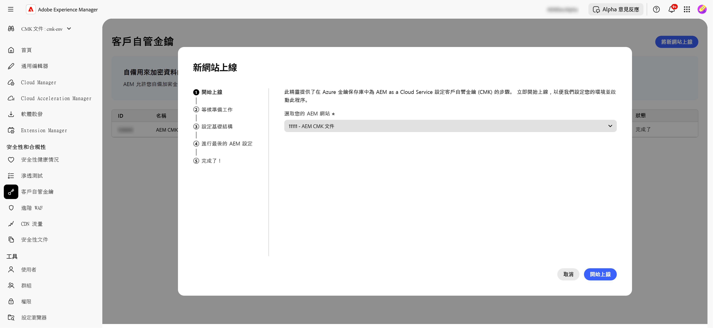
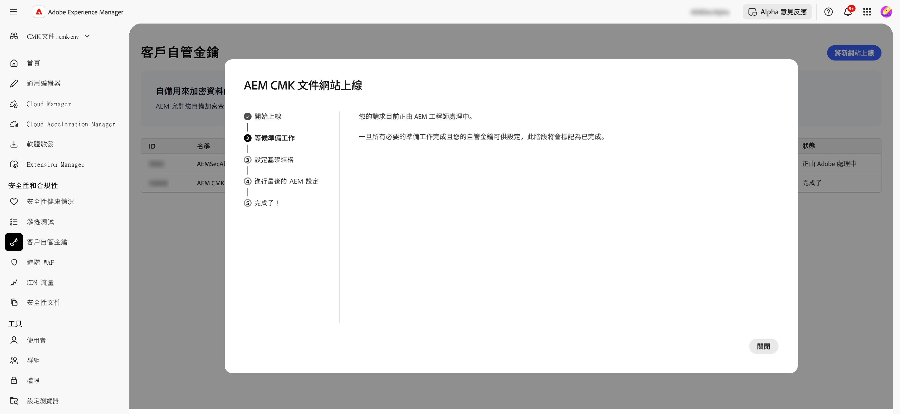
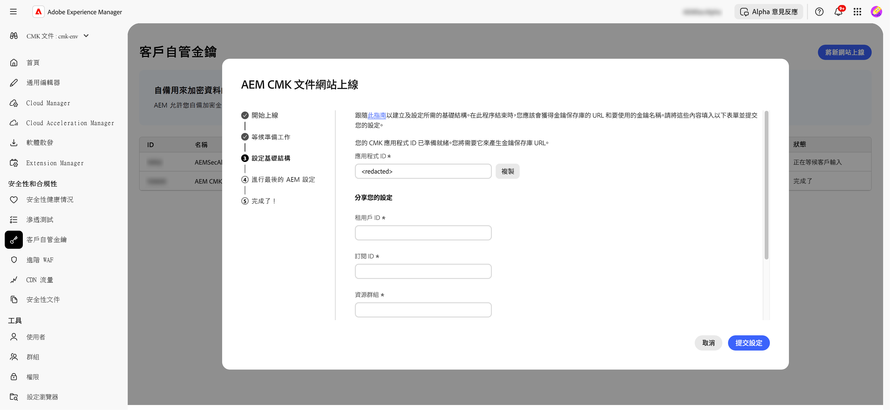
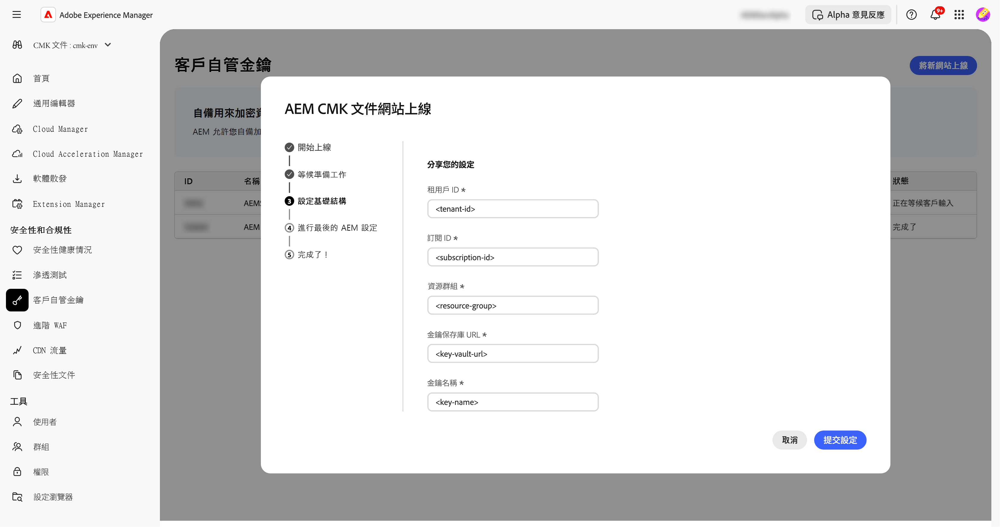
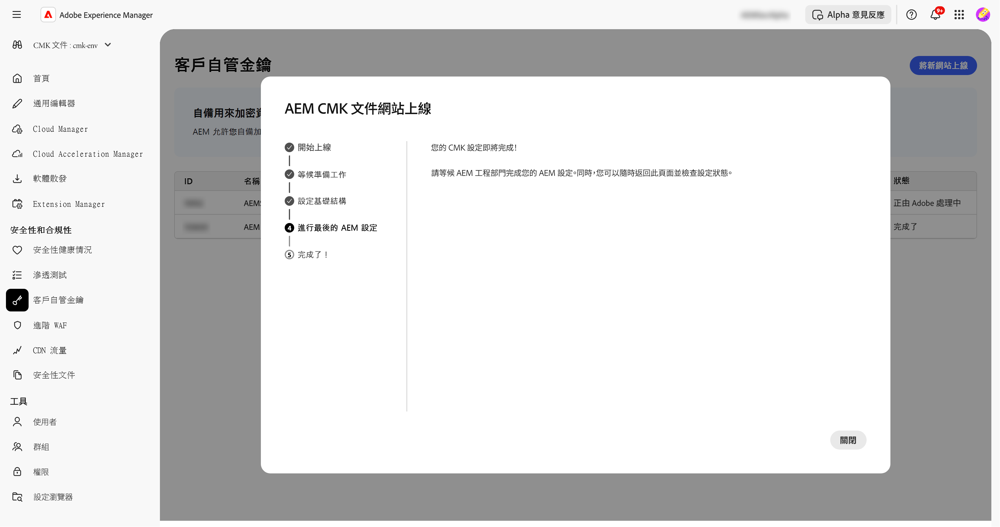
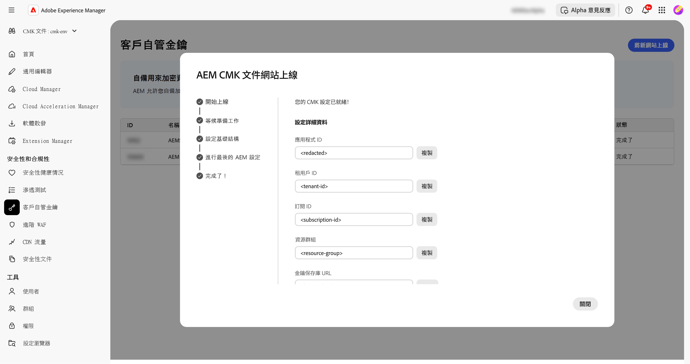

# AEM as a Cloud Service 的客戶自控金鑰 {#customer-managed-keys-for-aem-as-a-cloud-service}

AEM as a Cloud Service 目前將客戶資料儲存在 Azure Blob 儲存空間和 MongoDB 中，可依預設利用提供者管理的加密金鑰來保護資料。雖然此設定符合許多組織的安全性需求，但受監管產業中的企業或需要增強資料安全性的企業可能會設法更有效地控制其加密作業。對於優先考慮資料安全性、合規性和管理加密金鑰能力的組織來說，客戶自控金鑰 (CMK) 解決方案可提供重要的增強功能。

## 正在解決的問題 {#the-problem-being-solved}

由提供者管理的金鑰對於需要額外隱私和完整性的企業來說可能會造成疑慮。如果無法控制金鑰管理，組織會在滿足合規性需求、實施自訂安全性原則，以及確保完整資料安全性方面面臨挑戰。

採用客戶自控金鑰 (CMK) 可讓 AEM 客戶完全控制其加密金鑰，進而解決了這些問題。透過 Microsoft Entra ID (以前稱為 Azure Active Directory) 進行身份驗證，AEM CS 可安全連接到客戶的 Azure Key Vault，他讓們能夠管理其加密金鑰的生命週期，包括金鑰建立、輪調和撤銷。

CMK 提供多項優點：

* **控制資料和應用程式加密：**&#x200B;直接管理 AEM 應用程式和資料加密金鑰，藉此提高安全性。
* **提高保密性和完整性：**&#x200B;透過完整的加密管理，降低無意間存取和洩漏敏感或專有資料的可能性。
* **Azure Key Vault 支援：**&#x200B;使用 Azure Key Vault 可以進行金鑰儲存、處理機密操作，以及執行金鑰輪換。

透過採用 CMK，客戶可以增強對其資料安全性和加密作業的控制、增強安全性並降低風險，同時繼續享受 AEM CS 的擴充性和靈活性。

AEM as a Cloud Service 可讓您使用自己的加密金鑰來加密靜態資料。本指南提供在 Azure Key Vault 中為 AEM as a Cloud Service 設定客戶自控金鑰 (CMK) 的步驟。

>[!WARNING]
>
>在設定 CMK 後，您就無法恢復為系統管理的金鑰。您負責安全管理您的金鑰，並且要提供在 Azure 中對 Key Vault、金鑰和 CMK 應用程式的存取權，以防止遺失您的資料存取權。

系統也會引導您完成以下步驟，以便建立和設定所需的基礎架構：

1. 設定您的環境
1. 向 Adob&#x200B;&#x200B;e 取得應用程式 ID
1. 建立新資源群組
1. 建立金鑰儲存庫
1. 授予Adobe對金鑰儲存庫的存取權
1. 建立加密金鑰

您需要向 Adob&#x200B;&#x200B;e 分享金鑰保存庫 URL、加密金鑰名稱以及有關金鑰保存庫的資訊。

## 設定您的環境 {#setup-your-environment}

Azure 命令列介面 (CLI) 是使用本指南的唯一需求。如果您尚未安裝 Azure CLI，請依[此處](https://learn.microsoft.com/en-us/cli/azure/install-azure-cli)的正式安裝說明來進行。

在繼續本指南的其餘部分之前，請使用`az login`登入您的CLI。

>[!NOTE]
>
>雖然本指南使用 Azure CLI，但您可以透過 Azure 控制台執行相同的操作。如果您希望使用 Azure 控制台，請使用下列命令作為參考。


## 開始AEM as a Cloud Service的CMK設定程式 {#request-cmk-for-aem-as-a-cloud-service}

您需要透過UI為您的AEM as a Cloud Service環境請求客戶自控金鑰(CMK)設定。 若要這麼做，請導覽至&#x200B;**客戶自控金鑰**區段下的AEM首頁安全性UI。
接著，您可以按一下**開始上線**&#x200B;按鈕，開始上線程式。




## 向 Adob&#x200B;&#x200B;e 取得應用程式 ID {#obtain-an-application-id-from-adobe}

開始入門流程後，Adobe將會提供Entra應用程式ID。 此應用程式ID是指南其他部分所必需的，並將用於建立可讓Adobe存取您的金鑰儲存庫的服務主體。 如果您還沒有應用程式ID，則需要等到Adobe提供。



請求完成後，您就能在CMK UI中看到應用程式ID。



## 建立新資源群組 {#create-a-new-resource-group}

在您選擇的位置建立新的資源群組。

```powershell
# Choose a location and a name for the resource group.
$location="<AZURE LOCATION>"
$resourceGroup="<RESOURCE GROUP>"

# Create the resource group.
az group create --location $location --resource-group $resourceGroup
```

如果您已有資源群組，可隨時使用您的群組。在本指南的其他部分中，資源群組的位置及其名稱會個別以 `$location` 和 `$resourceGroup`標識。

## 建立金鑰保存庫 {#create-a-key-vault}

您將需要建立一個金鑰保存庫，用來加入您的加密金鑰。金鑰保存庫必須啟用虛刪除保護功能。對於要加密來自其他 Azure 服務的靜態資料一定要使用虛刪除保護。必須啟用公用網路存取，以確保Adobe服務可以存取金鑰儲存庫。

>[!IMPORTANT]
>若是建立已停用公共網路存取的金鑰保存庫，此時，系統會強制要求所有與金鑰保存庫相關的操作 (例如金鑰建立或輪換) 都必須從擁有金鑰保存庫網路存取權的環境中執行 - 例如，可以存取金鑰保存庫的虛擬機裝置。

```powershell
# Reuse this information from the previous step.
$location="<AZURE LOCATION>"
$resourceGroup="<RESOURCE GROUP>"

# Choose a name for the key vault.
$keyVaultName="<KEY VAULT NAME>"

# Create the key vault.
az keyvault create `
  --location $location `
  --resource-group $resourceGroup `
  --name $keyVaultName `
  --default-action=Allow `
  --enable-purge-protection `
  --enable-rbac-authorization `
  --public-network-access Enabled
```

## 授予 Adobe 存取金鑰保存庫的權限 {#grant-adobe-access-to-the-key-vault}

在此步驟中，您將允許 Adob&#x200B;&#x200B;e 透過 Entra 應用程式存取您的金鑰保存庫。Adobe 應該已經提供 Entra 應用程式 ID。

首先，您必須建立附加至Entra應用程式的服務主體，並為其指派&#x200B;**金鑰儲存庫Reader**&#x200B;和&#x200B;**金鑰儲存庫加密使用者**&#x200B;角色。 這些角色僅限於本指南中建立的金鑰保存庫。

```powershell
# Reuse this information from the previous steps.
$resourceGroup="<RESOURCE GROUP>"
$keyVaultName="<KEY VAULT NAME>"

# The application ID is provided by Adobe.
$appId="<APPLICATION ID>"

# Retrieve the ID of the key vault.
$keyVaultId=(az keyvault show --resource-group $resourceGroup --name $keyVaultName --query id --output tsv)

# Create a new service principal.
$servicePrincipalId=(az ad sp create --id $appId --query id --out tsv)

# Assign the roles to the service principal.
az role assignment create --assignee $servicePrincipalId --role "Key Vault Reader" --scope $keyVaultId
az role assignment create --assignee $servicePrincipalId --role "Key Vault Crypto User" --scope $keyVaultId
```

## 建立加密金鑰 {#create-an-encryption-key}

最後，您可以在金鑰保存庫中建立加密金鑰。請注意，您將需要&#x200B;**金鑰保存庫密碼人員**&#x200B;角色來完成此步驟。如果登入的使用者沒有此角色，請聯絡您的系統管理員為您提供此角色，或要求已經擁有該角色的人員為您完成此步驟。

若要建立加密金鑰，則需要有金鑰保存庫的網路存取權。首先驗證您是否可以存取金鑰保存庫並繼續建立金鑰：

```powershell
# Reuse this information from the previous steps.
$keyVaultName="<KEY VAULT NAME>"

# Choose a name for your key.
$keyName="<KEY NAME>"

# Create the key.
az keyvault key create --vault-name $keyVaultName --name $keyName
```

## 共用金鑰保存庫資訊 {#share-the-key-vault-information}

至此，一切準備就緒。您只需要透過CMK UI共用一些必要資訊，這會啟動環境設定程式。

```powershell
# Reuse this information from the previous steps.
$resourceGroup="<RESOURCE GROUP>"
$keyVaultName="<KEY VAULT NAME>"

# Retrieve the URL of your key vault.
$keyVaultUri=(az keyvault show --name $keyVaultName `
    --resource-group $resourceGroup `
    --query properties.vaultUri `
    --output tsv)

# In addition we would need the tenantId and the subscriptionId in order to setup the connection.
$tenantId=(az keyvault show --name $keyVaultName `
    --resource-group $resourceGroup `
    --query properties.tenantId `
    --output tsv)
$subscriptionId="<Subscription ID>"
```
在CMK UI中提供以下資訊：


## 撤銷金鑰存取權的影響 {#implications-of-revoking-key-access}

撤銷或停用存取金鑰保存庫、金鑰或 CMK 應用程式的權限可能會導致重大中斷，其中包括平台操作的重大變更。一旦停用這些金鑰，平台中的資料可能會變得無法存取，並且任何依賴此資料的下游操作都將停止運作。在進行任何重要設定的變更以前，一定要充分了解下游影響。

如果決定撤銷平台對資料的存取權，則在 Azure 中的金鑰保存庫移除與應用程式關聯的使用者角色，即可撤銷存取權。

## 後續步驟 {#next-steps}

您在CMK UI中提供所需資訊後，Adobe會針對您的AEM as a Cloud Service環境開始設定程式。 此程式可能需要一些時間，完成後您將會收到通知。




## 完成CMK設定 {#complete-the-cmk-setup}

完成設定程式後，您就能在UI中看到CMK設定的狀態。 您也可以看到金鑰儲存庫和加密金鑰。


## 問題與支援 {#questions-and-support}

如果您有任何疑問、查詢或需要協助，請聯絡我們，瞭解適用於AEM as a Cloud Service的客戶自控金鑰設定。 Adobe支援可協助您解決任何可能的問題。