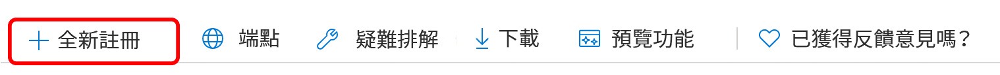

# 郵件服務的 OAuth2 支援 {#oauth2-support-for-the-mail-service}

AEM as a Cloud Service 為其整合的郵件服務提供 OAuth2 支援，以允許組織遵守安全電子郵件要求。

您可以為多個電子郵件提供者設定 OAuth。以下是設定 AEM 郵件服務以使用 Microsoft Office 365 Outlook. 透過 OAuth2 進行驗證的逐步指示可以類似的方式設定其他廠商。

如需關於 AEM as a Cloud Service 郵件服務的詳細資訊，請參閱[傳送電子郵件 ](/help/implementing/developing/introduction/development-guidelines.md#sending-email)。

## Microsoft Outlook {#microsoft-outlook}

1. 前往 [https://portal.azure.com/](https://portal.azure.com/) 並登入。
1. 在搜尋列中搜尋 **Azure Active Directory**，然後按一下結果。或者，您可以直接瀏覽到 [https://portal.azure.com/#blade/Microsoft_AAD_IAM/ActiveDirectoryMenuBlade/Overview](https://portal.azure.com/#blade/Microsoft_AAD_IAM/ActiveDirectoryMenuBlade/Overview)
1. 按一下「**應用程式註冊** - **新註冊**」

   

1. 根據您的要求填寫資訊，然後按一下「**註冊**」
1. 前往新建的應用程式，然後選取「**API 權限**」
1. 移至「**新增權限** - **Graph 權限** - **委派的權限**」
1. 為您的應用程式選取以下權限，然後按一下「**新增權限**」：
   * `SMTP.Send`
   * `Mail.Read`
   * `Mail.Send`
   * `openid`
   * `offline_access`
1. 移至「**驗證** - **新增平台** - **Web**」，並且在「**重新島向 URL**」區段，新增以下 URL - 一個有正斜線，一個沒有正斜線：
   * `http://localhost/`
   * `http://localhost`
1. 新增每個 URL 按「**設定**」，並根據您的要求進行設定
1. 接下來，移至「**憑證和密碼**」，按一下「**新增用戶端密碼**」，並按照畫面上的步驟建立密碼。請務必記下此密碼以備稍後使用
1. 在左側窗格中按「**概觀**」並複製「**應用程式 (用戶端) ID**」和「**目錄 (租用戶) ID**」的值以供稍後使用

回顧一下，您需要以下資訊為 AEM 端的郵件服務設定 OAuth2：

* 驗證 URL，將使用租用戶 ID 建構。 它將具有此形式：`https://login.microsoftonline.com/<tenantID>/oauth2/v2.0/authorize`
* 權杖 URL，將使用租用戶 ID 建構。 它將具有此形式：`https://login.microsoftonline.com/<tenantID>/oauth2/v2.0/token`
* 重新整理 URL，將使用租用戶 ID 建構。 它將具有此形式：`https://login.microsoftonline.com/<tenantID>/oauth2/v2.0/token`
* 用戶端 ID
* 用戶端密碼

### 產生重新整理權杖 {#generating-the-refresh-token}

接下來，您需要產生重新整理權杖，這將成為後續步驟中 OSGi 設定的一部分。

您可以按照以下步驟執行此操作：

1. 取代 `clientID` 和 `tenantID` 後在瀏覽器中開啟如下 URL，並使用特定於您帳戶的值：`https://login.microsoftonline.com/<tenantID>/oauth2/v2.0/authorize?client_id=<clientId>&response_type=code&redirect_uri=http://localhost&response_mode=query&scope=https%3A%2F%2Foutlook.office365.com%2FSMTP.Send%20EWS.AccessAsUser.All%20https%3A%2F%2Foutlook.office365.com%2FSMTP.Send%20https%3A%2F%2Foutlook.office365.com%2FMail.Read%20https%3A%2F%2Foutlook.office365.com%2FMail.Send%20openid%20offline_access&state=12345`
1. 詢問時允許權限
1. 該 URL 將重新導向到一個新位置，以此格式建構：`http://localhost/?code=<code>&state=12345&session_state=4f984c6b-cc1f-47b9-81b2-66522ea83f81#`
1. 複製上例中`<code>` 的值
1. 使用以下 cURL 命令取得 refreshToken。您需要將 tenantID、clientID 和 clientSecret 取代為您帳戶的值，以及 `<code>` 的值:

   ```
   curl --location --request POST 'https://login.microsoftonline.com/<tenantId>/oauth2/v2.0/token' \
   --header 'Content-Type: application/x-www-form-urlencoded' \
   --header 'Cookie: buid=0.ARgAep0nU49DzUGmoP2wnvyIkcQjsx26HEpOnvHS0akqXQgYAAA.AQABAAEAAAD--DLA3VO7QrddgJg7Wevry9XPJSKbGVlPt5NWYxLtTl3K1W0LwHXelrffApUo_K02kFrkvmGm94rfBT94t25Zq4bCd5IM3yFOjWb3V22yDM7-rl112sLzbBQBRCL3QAAgAA; esctx=AQABAAAAAAD--DLA3VO7QrddgJg7Wevr4a8wBjYcNbBXRievdTOd15caaeAsQdXeBAQA3tjVQaxmrOXFGkKaE7HBzsJrzA-ci4RRpor-opoo5gpGLh3pj_iMZuqegQPEb1V5sUVQV8_DUEbBv5YFV2eczS5EAhLBAwAd1mHx6jYOL8LwZNDFvd2-MhVXwPd6iKPigSuBxMogAA; x-ms-gateway-slice=estsfd; stsservicecookie=estsfd; fpc=Auv6lTuyAP1FuOOCfj9w0U_5vR5dAQAAALDXP9gOAAAAwIpkkQEAAACT2T_YDgAAAA' \
   --data-urlencode 'client_id=<clientID>' \
   --data-urlencode 'scope=https://outlook.office365.com/SMTP.Send https://outlook.office365.com/Mail.Read https://outlook.office365.com/Mail.Send openid' \
   --data-urlencode 'redirect_uri=http://localhost' \
   --data-urlencode 'grant_type=authorization_code' \
   --data-urlencode 'client_secret=<clientSecret>' \
   --data-urlencode 'code=<code>'
   ```

1. 記下 refreshToken 和 accessToken。

### 驗證權杖 {#validating-the-tokens}

在 AEM 端繼續設定 OAuth 之前，請確定使用以下程序驗證 accessToken 和 refreshToken：

1. 使用上一程序中產生的 refreshToken 來產生 accessToken。您可以使用以下 curl 來達到此目的，取代 `<client_id>`、`<client_secret>` 和 `<refreshToken>` 的值：

   ```
   curl --location --request POST 'https://login.microsoftonline.com/<tenetId>/oauth2/v2.0/token' \
   --header 'Content-Type: application/x-www-form-urlencoded' \
   --header 'Cookie: buid=0.ARgAep0nU49DzUGmoP2wnvyIkcQjsx26HEpOnvHS0akqXQgYAAA.AQABAAEAAAD--DLA3VO7QrddgJg7Wevry9XPJSKbGVlPt5NWYxLtTl3K1W0LwHXelrffApUo_K02kFrkvmGm94rfBT94t25Zq4bCd5IM3yFOjWb3V22yDM7-rl112sLzbBQBRCL3QAAgAA; esctx=AQABAAAAAAD--DLA3VO7QrddgJg7Wevr4a8wBjYcNbBXRievdTOd15caaeAsQdXeBAQA3tjVQaxmrOXFGkKaE7HBzsJrzA-ci4RRpor-opoo5gpGLh3pj_iMZuqegQPEb1V5sUVQV8_DUEbBv5YFV2eczS5EAhLBAwAd1mHx6jYOL8LwZNDFvd2-MhVXwPd6iKPigSuBxMogAA; x-ms-gateway-slice=estsfd; stsservicecookie=estsfd; fpc=Auv6lTuyAP1FuOOCfj9w0U_IezHLAQAAAPeNSdgOAAAA' \
   --data-urlencode 'client_id=<client_id>' \
   --data-urlencode 'scope=https://outlook.office365.com/SMTP.Send https://outlook.office365.com/Mail.Read https://outlook.office365.com/Mail.Send openid' \
   --data-urlencode 'redirect_uri=http://localhost' \
   --data-urlencode 'grant_type=refresh_token' \
   --data-urlencode 'client_secret=<client_secret>' \
   --data-urlencode 'refresh_token=<refreshToken>'
   ```

1. 使用 accessToken 傳送郵件，查看是否正常運作。

>[!NOTE]
>
> 您可以從[此位置](https://docs.microsoft.com/en-us/azure/active-directory/develop/v2-oauth2-auth-code-flow)取得 Postman API 集合。

### 與 AEM as a Cloud Service 整合 {#integration-with-aem-as-a-cloud-service}

1. 使用以下語法建立一個名為 `com.day.cq.mailer.oauth.impl.OAuthConfigurationProviderImpl.cfg.json` (在`/apps/<my-project>/osgiconfig/config` 下) 的 OSGI 屬性檔案：

   ```
   {
       authUrl: "<Authorization Url>",
       tokenUrl: "<Token Url>",
       clientId: "<clientID>",
       clientSecret: "$[secret:SECRET_SMTP_OAUTH_CLIENT_SECRET]",
       scopes: [
          "scope1",
          "scope2"
       ],
       refreshUrl: "<Refresh token Url>",
       refreshToken: "$[secret:SECRET_SMTP_OAUTH_REFRESH_TOKEN]"
   }
   ```

1. 填寫 `authUrl`、`tokenUrl` 和 `refreshURL`，並按照上一節中的描述建構它們。
1. 將以下範圍新增到設定中：
   * `openid`
   * `offline_access`
   * `https://outlook.office365.com/Mail.Send`
   * `https://outlook.office365.com/Mail.Read`
   * `https://outlook.office365.com/SMTP.Send`
1. 建立 OSGI 屬性檔案 `called com.day.cq.mailer.DefaultMailService.cfg.json`
(在 
`/apps/<my-project>/osgiconfig/config` 下)，並使用下列語法：

   ```
   {
    "smtp.host": "<smtp hostname>"
    "smtp.user": "<user account that logged into get the oauth tokens>",
    "smtp.password": "value not used",
    "smtp.port": 587,
    "from.address": "<from address used for sending>"
    "smtp.ssl": false,
    "smtp.starttls": true,
    "smtp.requiretls": true,
    "debug.email": false,
    "oauth.flow": true
   }
   ```

1. 對於 outlook，`smtp.host` 設定值為 `smtp.office365.com`
1. 在執行階段，使用 Cloud Manager 變數傳遞 `refreshToken values` 和 `clientSecret`，如[此處](/help/implementing/deploying/configuring-osgi.md#setting-values-via-api)所述。應該定義變數 `SECRET_SMTP_OAUTH_REFRESH_TOKEN` 和 `SECRET_SMTP_OAUTH_CLIENT_SECRET` 的值。

### 疑難排解 {#troubleshooting}

如果郵件服務無法正常運作，在大多數情況下，您需要重新產生 `refreshToken`，如上所述，透過 Cloud Manager API 傳遞新值。 部署新值需要幾分鐘的時間。
