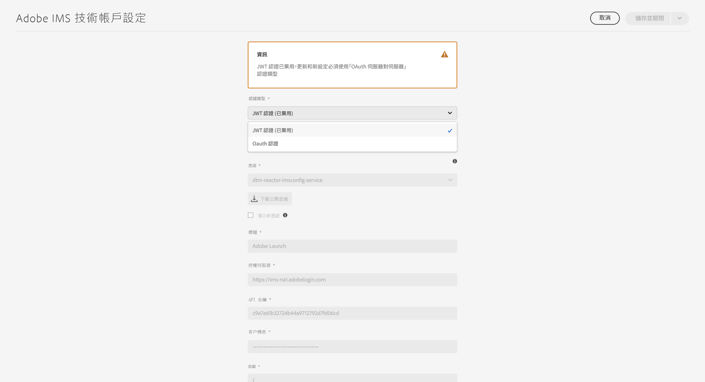

# 為 AEM as a Cloud Service 設定 IMS 整合 {#setting-up-ims-integrations-for-aemaacs}

>[!NOTE]
>
>自動佈建的 JWT 設定不應手動移轉，因為它們將由 Adobe 自動處理。

Adobe Experience Manager (AEM) as a Cloud Service 可以與許多其他 Adobe 解決方案整合。例如 Adobe Target、Adobe Analytics 等。

整合會使用 IMS 整合，並設定 S2S OAuth。

* 您建立以下項目後：

   * [Developer Console 中的認證](#credentials-in-the-developer-console)

* 就可以：

   * 建立 (新的) [OAuth 設定](#creating-oauth-configuration)

   * [將現有 JWT 設定移轉到 OAuth 設定](#migrating-existing-JWT-configuration-to-oauth)

>[!CAUTION]
>
>先前是使用 [JWT 認證進行設定，現在 Adobe Developer Console 將淘汰這些認證](/help/security/jwt-credentials-deprecation-in-adobe-developer-console.md)。
>
>此類設定無法再建立或更新，但可以移轉至 OAuth 設定。

## Developer Console 中的認證 {#credentials-in-the-developer-console}

作為第一步，您必須在 Adobe Developer Console 中設定 OAuth 認證。

如需有關如何執行此操作的詳細資訊，請根據您的要求參閱 Developer Console 文件：

* 概觀：

   * [伺服器對伺服器驗證](https://developer.adobe.com/developer-console/docs/guides/authentication/ServerToServerAuthentication/)

* 建立新的 OAuth 認證：

   * [OAuth 伺服器對伺服器認證實作指南](https://developer.adobe.com/developer-console/docs/guides/authentication/ServerToServerAuthentication/implementation)

* 將現有 JWT 認證移轉到 OAuth 認證：

   * [從服務帳戶 (JWT) 認證移轉至 OAuth 伺服器對伺服器認證](https://developer.adobe.com/developer-console/docs/guides/authentication/ServerToServerAuthentication/migration/)

例如：

## 建立 OAuth 設定 {#creating-oauth-configuration}

若要使用 OAuth 建立新的 Adobe IMS 整合：

1. 在 AEM 中，導覽至「**工具**」、「**安全性**」、「**Adobe IMS 整合**」。

1. 選取「**建立**」。

1. 根據 [Developer Console](https://developer.adobe.com/developer-console/docs/guides/authentication/ServerToServerAuthentication/implementation) 中的詳細資訊完成設定。例如：

   

1. **儲存**&#x200B;您的變更。

## 將現有 JWT 設定移轉到 OAuth 設定 {#migrating-existing-JWT-configuration-to-oauth}

若要移轉基於 JWT 認證的現有 Adobe IMS 整合：

>[!NOTE]
>
>此範例顯示的是 Launch IMS 設定。

1. 在 AEM 中，導覽至「**工具**」、「**安全性**」、「**Adobe IMS 整合**」。

1. 選取需要移轉的 JWT 設定。JWT 設定以「**JWT 認證 (已淘汰)**」警告標示。

1. 選取「**屬性**」：

   

1. 該設定將以唯讀方式開啟：

   

1. 從「**驗證類型**」下拉選單中選取「**OAuth**」：

   

1. 系統將更新可用的屬性。使用 Developer Console 中的詳細資訊來填寫以下內容：

   

1. 使用「**儲存並關閉**」保留您的更新。
您返回控制台時，「**JWT 認證 (已淘汰)**」警告就會消失。
