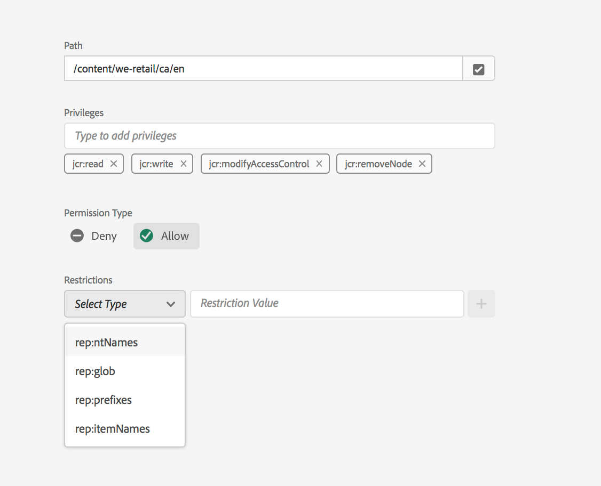

# 許可權管理的主體檢視 {#principal-view-for-permissions-management}

## 概觀 {#overview}

AEM推出使用者和群組的許可權管理。 主要功能與傳統UI相同，但更加方便使用者且更有效率。

## 存取UI {#accessing-the-ui}

新的UI型許可權管理可透過「安全性」下的「許可權」卡進行存取，如下所示：

新檢視可讓您更輕鬆地檢視所有已明確授予許可權的路徑中指定主體的整套許可權和限制。 如此一來，您就不需要前往

CRXDE可管理進階許可權和限制。 它已在相同檢視中合併。

有一個篩選器可讓使用者選取主參與者型別，以檢視&#x200B;**使用者**、**群組**&#x200B;或&#x200B;**全部**&#x200B;並搜尋任何主參與者&#x200B;**。**

## 檢視主體的許可權 {#viewing-permissions-for-a-principal}

左側的框架可讓使用者向下捲動以尋找任何主參與者，或根據選取的篩選器搜尋「群組」或「使用者」，如下所示：

按一下名稱即可在右側顯示指派的許可權。 許可權窗格會顯示特定路徑上的存取控制專案清單以及設定的限制。

## 為主體加入新的存取控制專案 {#adding-new-access-control-entry-for-a-principal}

可以透過新增存取控制專案來新增新許可權。 只要按一下「新增ACE」按鈕即可。

的ACL

這會顯示以下視窗，下一步是選擇必須設定許可權的路徑。

在此選取一個路徑，您可在其中設定&#x200B;**dam-users**&#x200B;的許可權：

選取路徑後，工作流程會回到此畫面，使用者接著可以從可用的名稱空間（例如`jcr`、`rep`或`crx`）選取一或多個許可權，如下所示。

您可以使用文字欄位進行搜尋，然後從清單中選取，以新增許可權。

>[!NOTE]
>
>如需完整的許可權和說明清單，請參閱[使用者、群組和存取許可權管理](https://experienceleague.adobe.com/zh-hant/docs/experience-manager-65/content/security/user-group-ac-admin#access-right-management)。

指定路徑的 

選取許可權清單後，使用者即可選擇許可權型別：拒絕或允許，如下所示。

 

## 使用限制 {#using-restrictions}

除了指定路徑的許可權清單和許可權型別之外，此畫面還可讓您新增精細存取控制的限制，如下所示：

>[!NOTE]
>
>如需每個限制含義的詳細資訊，請參閱[Jackrabbit Oak檔案](https://jackrabbit.apache.org/oak/docs/security/authorization/restriction.html)。

選擇限制型別、輸入值並點選&#x200B;**+**&#x200B;圖示，即可新增如下所示的限制。

 

新的ACE會反映在「存取控制清單」中，如下所示。 請注意，`jcr:write`是包含上面新增的`jcr:removeNode`的彙總許可權，但並未顯示於下方，因為它包含在`jcr:write`之下。

## 編輯ACE {#editing-aces}

選取主參與者並選擇您要編輯的ACE，即可編輯存取控制專案。

例如，您可以在此處按一下右側的鉛筆圖示，編輯&#x200B;**dam-users**&#x200B;的下方專案：

編輯畫面中會顯示預先選取的已設定ACE，按一下它們旁邊的交叉圖示即可刪除這些ACE，或者可以為指定路徑新增許可權，如下所示。

已在此為指定路徑上的&#x200B;**dam-users**&#x200B;新增`addChildNodes`許可權。

按一下右上方的&#x200B;**儲存**&#x200B;按鈕可以儲存變更，並且變更會反映在&#x200B;**dam-users**&#x200B;的新許可權中，如下所示：

## 刪除ACE {#deleting-aces}

可以刪除存取控制專案，以移除指定給特定路徑上主要人的所有許可權。 ACE旁的X圖示可用來刪除它，如下所示：

 

## 許可權檢視 {#permissions-view}

### Touch UI許可權檢視 {#touch-ui-permisions-view}

管理員需要在節點層級更細微地控制和顯示許可權指派，以便在AEM內獲得更好的安全性和管理。 以前，只有以主體為基礎的許可權檢視可用，這限制了檢視ACL如何套用至特定節點或篩選檢視的能力。 新節點和篩選的檢視可提供許可權指派的詳細內容化觀點，允許對安全性設定進行更好的管理和稽核。 此功能可加強管理監督並簡化許可權管理、改善安全性、減少錯誤設定，並簡化AEM中的使用者存取控制。

您可以按一下&#x200B;**工具 — 安全性 — 許可權**，存取「許可權觸控式UI」檢視，如下所示：

啟動[許可權]檢視後，您可以根據您的檢視偏好按一下熒幕右上角的&#x200B;**節點檢視**&#x200B;或&#x200B;**篩選檢視**。

#### 節點檢視

在此檢視中，會針對每個個別節點（路徑）顯示ACL。 它提供以下資訊：

所選節點的本機ACL。
有效的ACL，包括套用到每個父節點的ACL，直到根(「/」)。
使用者可以選擇新增、移除或更新ACL。 當按一下路徑時，左窗格會顯示其子項，而右邊會顯示與該路徑相關聯的所有ACL的表格檢視。

#### 已篩選的檢視

此檢視可讓使用者有效地搜尋指定路徑和主體的許可權。 在此檢視中，使用者可以輕鬆判斷針對所選路徑授予一組主體的許可權型別。
此外，「已篩選的檢視」可提供有效ACL的深入分析。 它會顯示與所選路徑之父節點相關聯的ACL，並會考慮所選主參與者及任何一般主參與者。

### 存放庫瀏覽器許可權檢視 {#the-repository-browser-permissions-view}

也可以透過[存放庫瀏覽器](/help/implementing/developing/tools/repository-browser.md)存取許可權檢視。

您可以透過以下方式存取它：

1. 開啟開發人員主控台，按一下&#x200B;**存放庫瀏覽器**&#x200B;標籤，然後在&#x200B;**開啟存放庫瀏覽器**

   

1. 進入存放庫瀏覽器後，按一下&#x200B;**許可權**&#x200B;標籤

   

**注意**：若要檢視許可權，需要系統管理員許可權。 依照[這裡](/help/implementing/developing/tools/repository-browser.md#navigate-the-hierarchy-navigate-the-hierarchy)提及的步驟來存取許可權。

## 傳統UI許可權組合 {#classic-ui-privilege-combinations}

新許可權UI會明確使用基本許可權集，而非無法真正反映已授與之確切基礎許可權的預定義組合。

這會導致混淆，無法確定確切的設定內容。 下表列出從傳統UI到組成許可權的實際許可權組合之間的對應：

<table>
 <tbody>
  <tr>
   <th>傳統UI許可權組合</th>
   <th>許可權UI許可權</th>
  </tr>
  <tr>
   <td>讀取</td>
   <td><code>jcr:read</code></td>
  </tr>
  <tr>
   <td>修改</td>
   <td>
<code>jcr:modifyProperties</code>
 
<code>jcr:lockManagement</code>
 
<code>jcr:versionManagement</code>
 </td>
  </tr>
  <tr>
   <td>建立</td>
   <td>
<code>jcr:addChildNodes</code>
 
<code>jcr:nodeTypeManagement</code>
 </td>
  </tr>
  <tr>
   <td>刪除</td>
   <td>
<code>jcr:removeNode</code>
 
<code>jcr:removeChildNodes</code>
 </td>
  </tr>
  <tr>
   <td>讀取 ACL</td>
   <td><code>jcr:readAccessControl</code></td>
  </tr>
  <tr>
   <td>編輯 ACL</td>
   <td><code>jcr:modifyAccessControl</code></td>
  </tr>
  <tr>
   <td>複寫</td>
   <td><code>crx:replicate</code></td>
  </tr>
 </tbody>
</table>
