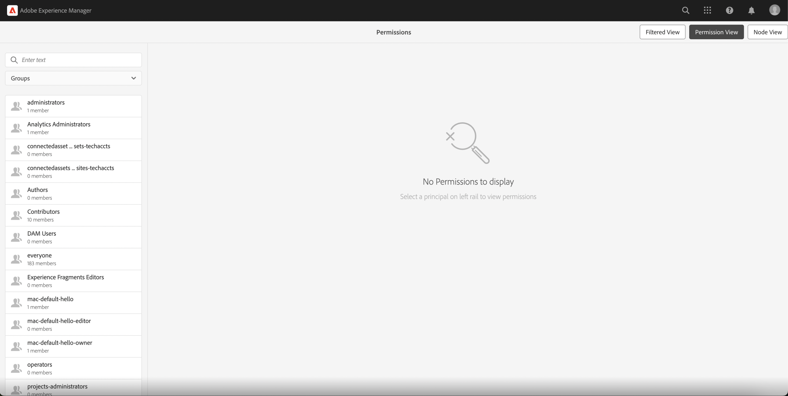
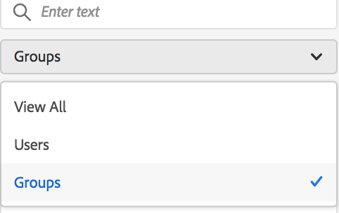
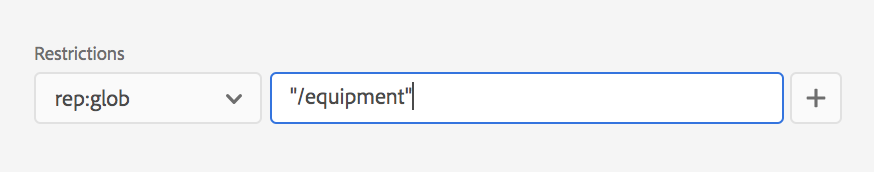
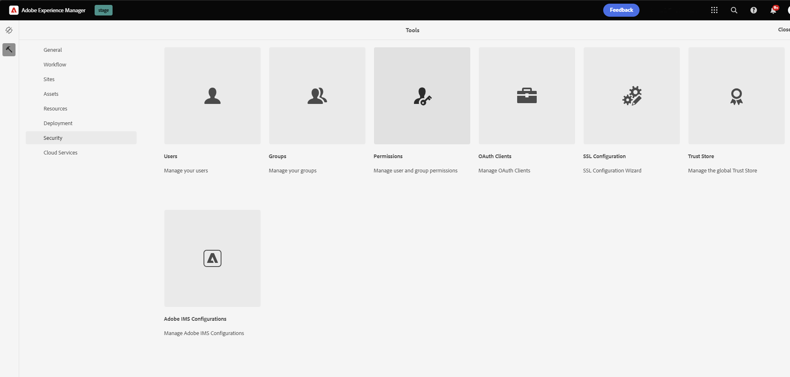

# 權限管理的主體視圖 {#principal-view-for-permissions-management}

## 概觀 {#overview}

AEM 推出使用者和群組的權限管理。其主要功能與傳統使用者介面相同，但更為使用者友善及有效率。

## 存取使用者介面 {#accessing-the-ui}

新的使用者介面型權限管理，可以透過「安全性」之下的「權限」卡片存取，如下所示：

透過新的視圖，可以在已明確授予權限的所有路徑上，更輕鬆地查看指定主體的完整權限與限制集。如此一來，不需要前往

CRXDE 也能管理進階權限與限制。其已合併於同一個視圖中。

設有一個篩選器讓使用者能夠選取要用於查看&#x200B;**使用者**、**群組**&#x200B;或&#x200B;**全部**&#x200B;的主體類型，以及搜尋任何主體&#x200B;**。**

## 檢視主體權限 {#viewing-permissions-for-a-principal}

使用者能運用位於左側的方框，向下捲動查找任何主體，或者根據所選取的篩選器搜尋群組或使用者，如下所示：

按一下名稱，已指派的權限便會顯示於右側。權限窗格會顯示特定路徑上的存取控制項目清單，以及設定好的限制。

## 加入新的主體存取控制項目 {#adding-new-access-control-entry-for-a-principal}

可以透過新增存取控制項目來新增權限。只要按一下「新增 ACE」按鈕即可。

然後便會帶出下方所示的視窗，下一步是選擇必須設定權限的路徑。

如此處所示，已選取一條路徑，您可以在其中設定 **dam-users** 的權限：

選取路徑後，工作流程會回到此畫面，使用者能夠從可供使用的命名空間中選取一個或多個權限 (如 `jcr`、`rep` 或 `crx`)，如下所示。

若要新增權限，可以使用文字欄位搜尋，然後自清單中選取。

>[!NOTE]
>
>關於權限的完整清單和說明，請參閱[使用者、群組和存取權管理](https://experienceleague.adobe.com/zh-hant/docs/experience-manager-65/content/security/user-group-ac-admin#access-right-management)。

 

選取權限清單後，使用者可以選擇權限類型：「拒絕」或「允許」，如下所示。

 

## 運用限制 {#using-restrictions}

除了指定路徑上的權限清單和權限類型之外，您也能於此畫面新增精確存取控制的限制，如下所示：

>[!NOTE]
>
>如需關於每項限制實際內容的詳細資訊，請參閱 [Jackrabbit Oak 文件](https://jackrabbit.apache.org/oak/docs/security/authorization/restriction.html)。

若要新增限制，請選擇限制類型、輸入值，並且點擊「**+**」圖示，如下所示。

 

新的 ACE 會反映在存取控制清單中，如下所示。請注意，`jcr:write` 是一項彙總權限，其中包括上面新增的 `jcr:removeNode`，但由於其涵蓋在 `jcr:write` 之下，因此下方圖中未顯示。

## 編輯 ACE {#editing-aces}

若要編輯存取控制項目，可以選取一個主體，然後選擇要編輯的 ACE。

例如，您可以按一下位於右側的鉛筆圖示，編輯 **dam-users** 的以下項目：

編輯畫面會顯示出來，並預先選取已設定的 ACE，按一下旁邊的十字圖示可以刪除這些 ACE，或者可以加入指定路徑的新權限，如下所示。

如此處所示，已在指定路徑上新增 **dam-users** 的 `addChildNodes` 權限。

按一下右上角的「**儲存**」按鈕便能儲存變更，然後變更會反映在 **dam-users** 的新權限中，如下所示：

## 刪除 ACE {#deleting-aces}

刪除存取控制項目，可以將授予特定路徑上之主體的所有權限移除。可以使用 ACE 旁邊的 X 圖示將其刪除，如下所示：

 

## 權限視圖 {#permissions-view}

### 觸控式使用者介面權限視圖 {#touch-ui-permisions-view}

管理員需要針對節點層級的權限指派取得更精細的控制和可見度，以便在 AEM 內達到更好的安全性和管理。過去，只能使用主體型的權限視圖，因而對深入了解 ACL 如何套用於特定節點或經篩選之視圖的能力造成限制。新的節點和經篩選之視圖能提供關於權限指派的詳細脈絡視圖，因此能更完善地對安全性設定進行管理和稽核。此功能可以增強管理監督，並簡化權限管理、提高安全性、減少錯誤設定，以及簡化 AEM 中的使用者存取控制過程。

若要存取權限觸控式使用者介面視圖，您可以按一下「**工具 - 安全性 - 權限**」，如下圖所示：

權限視圖啟動後，可以根據您的檢視偏好，按一下畫面右上角的&#x200B;**節點視圖**&#x200B;或者&#x200B;**經篩選之視圖**。

#### 節點視圖

於此視圖中，各個獨立節點 (路徑) 都會顯示其 ACL。其中會提供以下資訊：

所選取之節點的本機 ACL。
有效 ACL，包括套用至每個父系節點直至根 (“/”) 的 ACL。
使用者可以選擇新增、移除或更新 ACL。當您按一下某個路徑時，左側窗格會顯示其子系路徑，而右側窗格則會顯示與該路徑關聯之所有 ACL 的表格視圖。

#### 經篩選之視圖

此視圖讓使用者能夠有效率地搜尋指定路徑和主體的權限。於此視圖中，使用者可以輕鬆判定授予所選取之路徑的主體群組權限類型。
此外，經篩選之視圖還能提供針對有效 ACL 的見解。其會顯示與所選取之路徑的父系節點關聯的 ACL，並且將所選取之主體和任何常見主體都納入考量。

### 存放庫瀏覽器權限視圖 {#the-repository-browser-permissions-view}

也可以透過[存放庫瀏覽器](/help/implementing/developing/tools/repository-browser.md)存取權限視圖。

您可以依照以下方式存取：

1. 開啟 Developer Console，按一下「**存放庫瀏覽器**」索引標籤，然後按一下「**開啟存放庫瀏覽器**」

   

1. 進入存放庫瀏覽器後，按一下「**權限**」索引標籤

   

**備註**：若要檢視權限，需要管理員權限。按照[此處](/help/implementing/developing/tools/repository-browser.md#navigate-the-hierarchy-navigate-the-hierarchy)所述的步驟存取權限。

## 傳統使用者介面權限組合 {#classic-ui-privilege-combinations}

新的權限使用者介面會明確地使用基本權限集，而非預先定義的組合，因為預先定義的組合無法真正反映出已授予的確切基本權限。

這會導致人們對於實際的設定內容感到困惑。以下表格列出傳統使用者介面中的權限組合，與其實際構成權限之間的對應：

<table>
 <tbody>
  <tr>
   <th>傳統使用者介面權限組合</th>
   <th>權限使用者介面權限</th>
  </tr>
  <tr>
   <td>讀取</td>
   <td><code>jcr:read</code></td>
  </tr>
  <tr>
   <td>修改</td>
   <td>
<code>jcr:modifyProperties</code>
 
<code>jcr:lockManagement</code>
 
<code>jcr:versionManagement</code>
 </td>
  </tr>
  <tr>
   <td>建立</td>
   <td>
<code>jcr:addChildNodes</code>
 
<code>jcr:nodeTypeManagement</code>
 </td>
  </tr>
  <tr>
   <td>刪除</td>
   <td>
<code>jcr:removeNode</code>
 
<code>jcr:removeChildNodes</code>
 </td>
  </tr>
  <tr>
   <td>讀取 ACL</td>
   <td><code>jcr:readAccessControl</code></td>
  </tr>
  <tr>
   <td>編輯 ACL</td>
   <td><code>jcr:modifyAccessControl</code></td>
  </tr>
  <tr>
   <td>複寫</td>
   <td><code>crx:replicate</code></td>
  </tr>
 </tbody>
</table>
