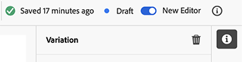
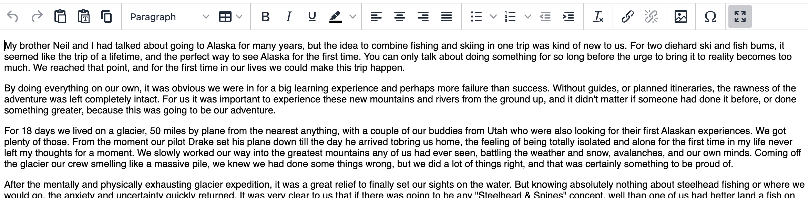
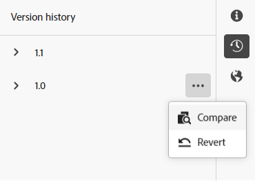
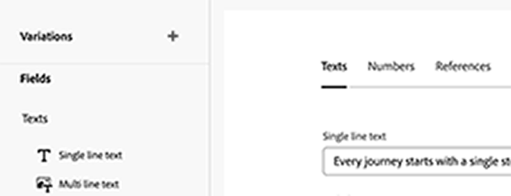

# 製作內容片段 {#authoring-content-fragments}

編寫您的內容片段時同時注重Headless傳送和頁面編寫。

有兩個編輯器可用於內容片段。 本節所述的編輯器：

* 已針對headless內容傳送開發（儘管可用於所有情境）
* 可從&#x200B;**內容片段**&#x200B;主控台使用

此編輯器提供：

* [自動儲存](#saving-autosaving)，以防止意外遺失編輯。
* [以內容參考的方式內嵌上傳資產](#reference-images)，無需先上傳至資產DAM。
* [產生變數](#generate-variations-ai)以使用Generative AI根據提示加速內容建立。
* 內容片段所傳遞呈現體驗的[預覽](#preview-content-fragment)。
* 可從編輯器[發佈](#publish-content-fragment)和[取消發佈](#unpublish-content-fragment)。
* 可在編輯器中[檢視及開啟相關的語言副本](#view-language-copies)。
* 能夠在編輯器中[檢視版本詳細資料](#view-version-history)。 您也可以還原至選取的版本。
* 能夠[檢視和開啟父系參考](#view-parent-references)。
* 使用[結構樹狀結構](#structure-tree)的內容片段及其參考的階層檢視。

>[!WARNING]
>
>本節中說明的編輯器&#x200B;*僅*&#x200B;可在[Unified Shell](/help/overview/aem-cloud-service-on-unified-shell.md)中使用；因此&#x200B;*線上* Adobe Experience Manager (AEM) as a Cloud Service，而不是本機執行個體。

## 內容片段編輯器 {#content-fragment-editor}

第一次開啟內容片段編輯器時，您會看到四個主要區域：

* 頂端工具列：用於關鍵資訊和動作
   * 內容片段主控台的連結 (首頁圖示)
   * 有關模型和檔案夾的資訊
   * [預覽的連結（如果為模型設定了預設預覽URL模式）](/help/sites-cloud/administering/content-fragments/managing-content-fragment-models.md#model-properties)
   * [發佈](#publish-content-fragment)和[取消發佈](#unpublish-content-fragment)動作
   * 顯示全部&#x200B;**父參考內容**&#x200B;的選項 (連結圖示)
   * **[狀態](/help/sites-cloud/administering/content-fragments/managing.md#statuses-content-fragments)**&#x200B;片段，以及最後儲存的資訊
   * 用來切換至原始 (以資產為主) 編輯器的切換開關

     >[!WARNING]
     >
     >原始編輯器會在相同標籤中開啟。 不建議同時開啟兩個編輯器。

* 左面板：顯示內容片段的&#x200B;**[變數](#variations)**&#x200B;及其&#x200B;**欄位**：
   * 這些連結可用於[瀏覽內容片段結構](#navigate-structure)
* 右側面板：顯示標籤[，其中顯示屬性（中繼資料）和標籤](#view-properties-tags)、有關[版本歷程記錄](#view-version-history)的資訊，以及與任何[語言副本](#view-language-copies)相關的資訊
   * 在「**屬性**」標籤中，您可以更新片段的「**標題**」和「**說明**」，或者更新「**變數**」
   * 您可以在&#x200B;**註解**&#x200B;索引標籤中新增及讀取註解，協助您與其他作者共同作業
* 中央面板：顯示所選變數的實際欄位和內容
   * 允許您編輯內容
      * 當在模型中設定為（多個）時，各種資料型別可讓您&#x200B;**新增**&#x200B;相關欄位的例項
   * 如果&#x200B;**索引標籤預留位置**&#x200B;欄位已在模型中定義，則會顯示在這裡，並且：
      * 可用於導覽
      * 將會水準顯示或以下拉式清單顯示

  >[!NOTE]
  >
  >根據基礎模型中的定義，欄位可能會受特定型別的[驗證](/help/assets/content-fragments/content-fragments-models.md#validation)的限制。

## 導覽內容片段結構 {#navigate-structure}

單一內容片段；

* 包含兩個層級：

   * 內容片段的&#x200B;**[變數](#variations)**
   * **欄位** — 由內容片段模型定義，並由每個變數使用

* 可以包含各種參照。

### 變數和欄位 {#variations-and-fields}

在左側面板中，您可以看到：

* 已針對此片段建立的&#x200B;**[變數](#variations)**&#x200B;清單：
   * **Main**&#x200B;是第一次建立內容片段時出現的變數，您可以稍後新增其他變數
   * 您可以使用「產生變#generate-variations」，以使用Adobe針對特定使用案例建立的提示型範本。
   * 您也可以[建立變數](#create-variation)
* 片段中的&#x200B;**欄位**&#x200B;及其變數：
   * 圖示表示[資料型別](/help/sites-cloud/administering/content-fragments/content-fragment-models.md#data-types)
   * 文字是欄位名稱
   * 這些共同提供了中央面板中欄位內容的直接連結（適用於目前的變數）

### 追蹤連結 {#follow-links}

在編輯器的各個部分中，您可以看到連結圖示。 此圖示可用來開啟顯示的專案；例如，內容片段模型、父參考或參考的片段：

### 結構樹 {#structure-tree}

從編輯器工具列開啟&#x200B;**結構樹狀結構**&#x200B;標籤，以顯示內容片段及其參照的階層結構。 使用連結圖示導覽至參照。

>[!NOTE]
>
>如需詳細資訊，請參閱[分析內容片段結構 — 結構樹狀結構](/help/sites-cloud/administering/content-fragments/analysis.md#structure-tree)。

## 儲存和自動儲存 {#saving-autosaving}

<!-- CHECK: cannot be saved, no undo, redo -->

每次進行更新後，內容片段都會自動儲存。 上次儲存的時間會顯示在頂端工具列中。

## 變化 {#variations}

[變數](/help/sites-cloud/administering/content-fragments/overview.md#main-and-variations)是AEM內容片段的重要功能。 它們可讓您建立並編輯&#x200B;**主要**&#x200B;內容的復本，以用於特定管道和情境，使Headless內容傳送和頁面製作更加靈活。

從編輯器中，您可以：

* 建立&#x200B;**主要**&#x200B;內容的[變數](#create-variation)

* [使用「產生變數AI」](#generate-variations-ai)來使用Generative AI，以使用Adobe針對特定使用案例建立的提示型範本。

* 選取編輯內容所需的變數

* [重新命名變數](#rename-variation)

* [刪除變數](#delete-variation)

### 建立變數 {#create-variation}

若要建立內容片段的變數：

1. 在左側面板中，選取&#x200B;**變數**&#x200B;右側的&#x200B;**加號** （**建立變數**）。

   >[!NOTE]
   >
   >建立第一個變數後，現有的變數將會列在相同面板中。

   

1. 在對話方塊中，輸入變數的&#x200B;**Title**，並視需要輸入&#x200B;**Description**：

   

1. **建立**&#x200B;變數。 它會出現在清單中。

### 重新命名變數 {#rename-variation}

若要重新命名&#x200B;**變數**：

1. 選取所需的變數。

1. 開啟右側面板中的&#x200B;**屬性**&#x200B;索引標籤。

1. 更新變數&#x200B;**標題**。

1. 按下&#x200B;**Return**&#x200B;或移至其他欄位以自動儲存變更。 標題已在左側的&#x200B;**變數**&#x200B;面板中更新。

### 使用GenAI建立變化並產生變化 {#generate-variations-ai}

使用Generative Variations來利用Generative AI加速內容建立。

開啟內容片段編輯器以尋找產生變異的進入點。

如需瞭解詳細資訊，請參閱[產生變數 — 整合至AEM編輯器](/help/generative-ai/generate-variations-integrated-editor.md)。

### 刪除變數 {#delete-variation}

若要刪除內容片段的變數：

    >[！NOTE]
    >
    >您無法刪除**Main**.

1. 選取變數。

1. 在&#x200B;**變數**&#x200B;面板中，選取刪除圖示（垃圾桶）：

   

1. 對話方塊隨即開啟。 選取&#x200B;**刪除**&#x200B;以確認動作。

## 編輯多行文字欄位 — 純文字或Markdown {#edit-multi-line-text-fields-plaintext-markdown}

**[多行文字](/help/sites-cloud/administering/content-fragments/content-fragment-models.md#data-types)**&#x200B;欄位可以有下列三種格式之一：

* 純文字
* [Markdown](/help/sites-cloud/administering/content-fragments/markdown.md)
* [RTF 文字](#edit-multi-line-text-fields-rich-text)

定義為純文字或Markdown的欄位具有簡單的文字方塊，不含（熒幕上）格式選項：

## 編輯多行文字欄位 — Rtf {#edit-multi-line-text-fields-rich-text}

定義為&#x200B;**RTF**&#x200B;的&#x200B;**[多行文字](/help/sites-cloud/administering/content-fragments/content-fragment-models.md#data-types)**&#x200B;欄位可使用各種功能：

* 編輯內容：
   * 還原/重做
   * 貼上/貼上成文字
   * 複製
   * 選取段落格式
   * 建立/管理表格
   * 文字格式；粗體、斜體、底線、顏色
   * 設定段落對齊方式
   * 建立/管理清單；專案符號、編號
   * 縮排文字；減少、增加
   * 清除目前的格式
   * 插入連結
   * 選取並插入影像資產的參照
   * 新增特殊字元
* [全熒幕編輯器](#full-screen-editor-rich-text) — 在全熒幕和流動之間切換
* [統計資料](#statistics-rich-text)
* [比較與同步](#compare-and-synchronize-rich-text)

例如：

>[!NOTE]
>
>在&#x200B;**欄位**&#x200B;面板中，多行文字欄位也由適當的[圖示](#fields-datatypes-icons)表示。

### 全熒幕編輯器 — RTF {#full-screen-editor-rich-text}

全熒幕編輯器提供與內嵌相同的編輯選項，但提供更多空間給文字。

例如：

### 統計資料 — RTF文字 {#statistics-rich-text}

動作&#x200B;**Statistics**&#x200B;會顯示多行欄位中文字的資訊範圍。

例如：

### 比較和同步 — RTF {#compare-and-synchronize-rich-text}

當您開啟&#x200B;**變數**&#x200B;時，動作&#x200B;**比較**&#x200B;可用於多行欄位。

這會在全熒幕中開啟多行欄位，並且：

* 同時顯示&#x200B;**主要**&#x200B;和目前&#x200B;**變數**&#x200B;的內容，並反白顯示任何差異

* 差異以顏色表示：

   * 綠色表示已新增內容（至變數）
   * 紅色表示內容已移除（從變數中）
   * 藍色表示取代的文字

* 提供&#x200B;**同步**&#x200B;動作，將內容從&#x200B;**主要**&#x200B;同步至目前的變數

   * 如果&#x200B;**主要**&#x200B;已更新，則這些變更將會傳輸到變數
   * 如果已更新變數，則這些變更將會被&#x200B;**主要**&#x200B;的內容覆寫

  >[!CAUTION]
  >
  >同步僅可用於將變更&#x200B;*從&#x200B;**Main**複製到變數*。
  >
  >將變更&#x200B;*從變化傳輸至&#x200B;**主要***不提供選項。

例如，變數內容已完全重寫的情境，因此同步處理會以&#x200B;**主要**&#x200B;的內容取代該新內容：

## 管理引用 {#manage-references}

### 片段參考 {#fragment-references}

[片段參考](/help/sites-cloud/administering/content-fragments/content-fragment-models.md#fragment-reference-nested-fragments)可用於：

* [建立現有內容片段的參考](#create-reference-existing-content-fragment)
* [建立內容片段，然後參考它](#create-reference-content-fragment)

#### 建立現有內容片段的參考 {#create-reference-existing-content-fragment}

若要建立現有內容片段的參考：

1. 選取欄位。
1. 選取&#x200B;**新增現有片段**。
1. 從片段選擇器中選取所需的片段。

   >[!NOTE]
   >
   >您一次只能選取一個片段。

#### 建立內容片段和參考 {#create-reference-content-fragment}

或者，您可以[選取&#x200B;**建立新片段**&#x200B;以開啟&#x200B;**建立**&#x200B;對話方塊](/help/sites-cloud/administering/content-fragments/managing.md#creating-a-content-fragment)。 建立後，將參考此片段。

### 內容參考 {#content-references}

[內容參考](/help/sites-cloud/administering/content-fragments/content-fragment-models.md#content-reference)是用來參考其他AEM內容型別，例如影像、頁面和體驗片段。

#### 參考影像 {#reference-images}

在&#x200B;**內容參考**&#x200B;欄位中，您可以：

* 參考已存在於您本機存放庫中的資產
* 位於遠端存放庫中的參考資產
* 將資產直接上傳至欄位；如此可避免需使用&#x200B;**Assets**&#x200B;主控台來上傳

  >[!NOTE]
  >
  >若要將影像直接上傳到&#x200B;**內容參考**&#x200B;欄位，它&#x200B;**必須**：
  >
  >* 已定義&#x200B;**根路徑** （在[內容片段模型](/help/sites-cloud/administering/content-fragments/content-fragment-models.md#content-reference)中）。 這會指定影像的儲存位置。
  >* 在接受的內容型別清單中包含&#x200B;**影像**

##### 參考本機Assets {#reference-local-assets}

若要參考本機資產，您可以：

* 將新的資產檔案直接拖放到&#x200B;**內容參考**&#x200B;欄位（例如，從您的檔案系統）
* 使用&#x200B;**新增資產**&#x200B;動作，然後選取&#x200B;**瀏覽Assets**&#x200B;或&#x200B;**上傳**&#x200B;以開啟適當的選取器供您使用：

  

##### 參考遠端Assets {#reference-remote-assets}

若要參照遠端資產：

1. 瀏覽資產時指定遠端&#x200B;**存放庫**：

   

2. 選取後，即可在資產資訊中看到位置：

   

###### 遠端Assets — 限制 {#remote-assets-limitations}

參照遠端資產時，有一些限制：

* 只有[已核准的](/help/assets/approve-assets.md)個資產可供遠端資產存放庫參考。

* 如果從遠端存放庫移除參照的資產，這將導致內容參照損毀。

* 使用者有權存取的所有傳遞資產存放庫都可供選擇，可用的清單不可限制。

* AEM執行個體和遠端資產存放庫執行個體都必須是相同版本。

* 不會透過管理API或傳送API公開任何資產中繼資料。 您必須使用資產中繼資料API來擷取資產中繼資料詳細資訊：

   * 個別資產中繼資料： [https://adobe-aem-assets-delivery.redoc.ly/#operation/getAssetMetadata](https://adobe-aem-assets-delivery.redoc.ly/#operation/getAssetMetadata)

   * 使用搜尋API （實驗性）取得大量中繼資料資訊： [https://adobe-aem-assets-delivery-experimental.redoc.ly/#operation/search](https://adobe-aem-assets-delivery-experimental.redoc.ly/#operation/search)

>[!NOTE]
>
>另請參閱搭配內容片段使用的[AEM GraphQL API — 適用於OpenAPI資產支援的Dynamic Media (遠端Assets)](/help/headless/graphql-api/content-fragments.md#dynamic-media-for-openapi-asset-support)

#### 參考頁面 {#reference-pages}

若要新增對AEM頁面、體驗片段或其他這類內容型別的參照：

1. 選取&#x200B;**新增內容路徑**。

1. 在輸入欄位中新增必要路徑。

1. 向&#x200B;**新增**&#x200B;確認。

>[!NOTE]
>
>此引數不應用於下列專案的參照：
>
>* 內容片段 — 使用[片段參考](#fragment-references)
>* 影像 — 使用[參考影像](#reference-images)

### 檢視父參照 {#view-parent-references}

選取頂端工具列中的連結圖示，會開啟所有父參照的清單。

例如：

隨即開啟一個視窗，列出所有相關參照。 若要開啟參照，請選取名稱或標題，或連結圖示。

例如：

## 檢視屬性和標籤 {#view-properties-tags}

在右側面板的屬性標籤中，可檢視屬性（中繼資料）和標籤。 屬性可以是：

* 針對&#x200B;**內容片段** — 若目前已選取&#x200B;**主要**
* 針對特定&#x200B;**變數**

### 編輯屬性和標籤 {#edit-properties-tags}

在「屬性」標籤（右側面板）中，您也可以編輯：

* **標題**
* **說明**
* **標籤**：使用下拉式清單或選取範圍對話方塊

  

### 開啟內容片段模型 {#open-content-fragment-model}

當您選取&#x200B;**主要**&#x200B;時，屬性區段中會顯示基礎內容片段模型的名稱。 選取連結圖示，在單獨的標籤中開啟模型。

例如：

## 檢視版本記錄 {#view-version-history}

在右側面板的&#x200B;**版本記錄**&#x200B;標籤中，會顯示目前版本和先前版本的詳細資料：

>[!NOTE]
>
>發佈內容片段時會建立新版本。

### 比較版本 {#compare-version}

對於內容片段，您可以比較先前版本與目前版本。

若要比較上一個版本與目前版本：

1. 選取版本旁的三點圖示。

1. 選取&#x200B;**比較**。

這會開啟一個檢視，其中顯示內容目前版本與所選內容片段先前版本之間的差異。 從&#x200B;**含有變更的變數**&#x200B;下拉式清單中，您可以選取檢視與主要內容的差異和/或來自變數的內容。

差異以顏色表示：

* 綠色：表示已新增內容（至目前版本）
* 紅色：表示內容已移除（從目前版本）

### 還原為版本 {#revert-version}

您可以還原成任何版本。

還原至特定版本：

1. 選取版本旁的三點圖示。

1. 選取&#x200B;**回覆**。

## 檢視語言副本 {#view-language-copies}

在&#x200B;**語言屬性**&#x200B;索引標籤中，會顯示任何相關語言副本的詳細資料。 選取連結圖示，即可在個別標籤中開啟副本。

例如：

>[!NOTE]
>
>如需有關翻譯內容片段和建立語言副本的詳細資訊，請參閱[AEM Headless翻譯歷程](/help/journey-headless/translation/overview.md)。

## 註解您的片段 {#commenting-on-your-fragment}

若要讓您在產品內和內容內共同作業，右側面板中的&#x200B;**註解**&#x200B;索引標籤提供下列功能：

* 新增評論
* 在評論中標籤特定使用者
   * 他們將會收到通知，其中包含直接開啟片段的連結
* 喜歡現有註解
* 回複評論
* 格式化您的註解；可使用基本格式
* 透過現有註解執行文字搜尋
* 編輯現有註解
* 刪除評論

>[!NOTE]
>
>這些註解在原始編輯器](/help/assets/content-fragments/content-fragments-managing.md#annotating-a-content-fragment)中不會顯示為[註解，在Assets主控台的[時間軸](/help/assets/content-fragments/content-fragments-managing.md#timeline-for-content-fragments)中也不會顯示。

## 預覽您的片段 {#preview-content-fragment}

內容片段編輯器為作者提供在外部前端應用程式中預覽其編輯的選項。

若要使用此功能，您首先需要：

* 與您的IT團隊合作，設定外部前端應用程式，該應用程式會透過使用其JSON輸出來呈現內容片段。
* 設定外部前端應用程式時，**預設預覽URL模式**&#x200B;必須定義為適當內容片段模式](/help/sites-cloud/administering/content-fragments/managing-content-fragment-models.md#model-properties)的[屬性。

定義URL後，**預覽**&#x200B;按鈕會啟用。 您可以選取此按鈕來啟動外部應用程式（在單獨的索引標籤中）以呈現內容片段。

## 發佈您的片段 {#publish-content-fragment}

您可以&#x200B;**將您的片段**&#x200B;發佈到您的：

* 預覽例項
* 發佈執行個體

您可以從編輯器或控制檯發佈您的片段。 如需完整詳細資訊，請參閱[發佈和預覽片段](/help/sites-cloud/administering/content-fragments/managing.md#publishing-and-previewing-a-fragment)。

## 取消發佈您的片段 {#unpublish-content-fragment}

您也可以&#x200B;**取消發佈**&#x200B;您的片段，從以下任一項：

* 預覽例項
* 發佈執行個體

您可以從編輯器或控制檯取消發佈您的片段。 如需完整詳細資訊，請參閱[取消發佈片段](/help/sites-cloud/administering/content-fragments/managing.md#unpublishing-a-fragment)。

## 欄位、資料型別和圖示 {#fields-datatypes-icons}

**欄位**&#x200B;面板會列出內容片段中的所有欄位。 圖示表示&#x200B;**[資料型別](/help/sites-cloud/administering/content-fragments/content-fragment-models.md#data-types)**：

<table style="table-layout:auto">
 <tbody>
  <tr>
   <td>
<b>單行文字</b>
 </td>
   <td>
  
</td>
  </tr>
  <tr>
   <td>
<b>多行文字</b>
 </td>
   <td>
  
</td>
  </tr>
  <tr>
   <td>
<b>數字</b>
 </td>
   <td>
  
</td>
  </tr>
  <tr>
   <td>
<b>布林值</b>
 </td>
   <td>
  
</td>
  </tr>
  <tr>
   <td>
<b>日期和時間</b>
 </td>
   <td>
  
</td>
  </tr>
  <tr>
   <td>
<b>列舉</b>
 </td>
   <td>
  
</td>
  </tr>
  <tr>
   <td>
<b>標記</b>
 </td>
   <td>
  
</td>
  </tr>
  <tr>
   <td>
<b>內容參考</b>
 </td>
   <td>
  
</td>
  </tr>
  <tr>
   <td>
<b>片段參考</b>
 </td>
   <td>
  
</td>
  </tr>
  <tr>
   <td>
<b>JSON 物件</b>
 </td>
   <td>
  
</td>
  </tr>
  <tr>
   <td>
<b>標籤預留位置</b>

雖然沒有實際圖示表示，但<b>索引標籤預留位置</b>會顯示在左側面板中。  它也顯示在中央面板中，水準顯示或下拉式清單（當太多無法水準顯示時）。
 </td>
   <td>
  
</td>
  </tr>
 </tbody>
</table>

## 很高興知道 {#good-to-know}

* 若要編輯內容片段，您需要[適當的許可權](/help/implementing/developing/extending/content-fragments-customizing.md#asset-permissions)。 如果您遇到問題，請聯絡您的系統管理員。

  例如，如果您沒有`edit`許可權，編輯器將是唯讀的。

* 內容片段模型通常可以定義名為&#x200B;**Title**&#x200B;和&#x200B;**Description**&#x200B;的資料欄位。 如果這些欄位存在，則為使用者定義的欄位，可以在編輯片段時在&#x200B;*中央面板*&#x200B;中更新。

  內容片段及其變化也有稱為&#x200B;**Title**&#x200B;和&#x200B;**Description**&#x200B;的中繼資料欄位（變化屬性）。 這些欄位是任何內容片段不可或缺的一部分，並在片段時最初定義。 編輯片段時，它們可以在&#x200B;*右側面板*&#x200B;中更新。

* 請參閱Assets檔案以取得[原始內容片段編輯器](/help/assets/content-fragments/content-fragments-variations.md)的完整資訊 — 可從&#x200B;**Assets**&#x200B;主控台和&#x200B;**內容片段**&#x200B;主控台取得。

* 您的專案團隊可視需要自訂編輯器。 如需詳細資訊，請參閱[自訂內容片段主控台和編輯器](/help/implementing/developing/extending/content-fragments-console-and-editor.md)。
