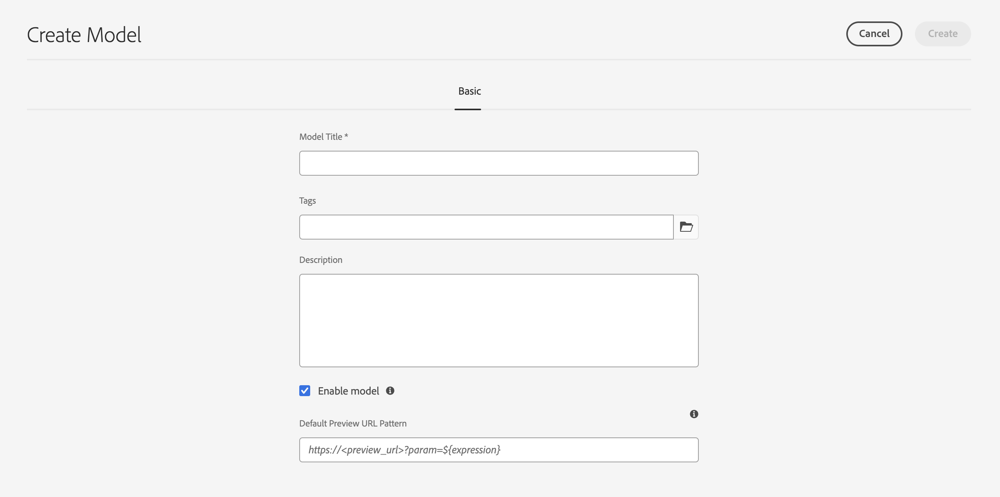

# 內容片段模型 {#content-fragment-models}

Adobe Experience Manager (AEM)中的內容片段模型as a Cloud Service定義[內容片段](/help/sites-cloud/administering/content-fragments/overview.md)的內容結構。 這些片段隨後可用於頁面製作，或用作Headless內容的基礎。

若要使用內容片段模式，您可以：

1. [為您的執行個體啟用內容片段模型功能](/help/sites-cloud/administering/content-fragments/setup.md)
1. [建立](#creating-a-content-fragment-model)，並[設定您的內容片段模型](#defining-your-content-fragment-model)
1. [啟用您的內容片段模型](#enabling-disabling-a-content-fragment-model)，以便在建立內容片段時使用
1. [藉由設定&#x200B;**原則**，在必要的Assets資料夾](#allowing-content-fragment-models-assets-folder)上允許您的內容片段模型。

## 建立內容片段模型 {#creating-a-content-fragment-model}

1. 導覽至&#x200B;**工具**、**一般**，然後開啟&#x200B;**內容片段模型**。
1. 導覽至適合您[組態或子組態](/help/sites-cloud/administering/content-fragments/setup.md)的資料夾。
1. 使用&#x200B;**建立**&#x200B;開啟精靈。

   >[!CAUTION]
   >
   >如果尚未啟用[使用內容片段模式](/help/sites-cloud/administering/content-fragments/setup.md)，將無法使用&#x200B;**建立**&#x200B;選項。

1. 指定&#x200B;**模型標題**。
您也可以定義各種屬性；例如，新增**標籤**、**描述**、選取&#x200B;**啟用模型**&#x200B;以[視需要啟用模型](#enabling-disabling-a-content-fragment-model)並定義
   **預設預覽URL模式**。

   >[!NOTE]
   >
   >如需完整詳細資訊，請參閱[內容片段模式 — 屬性](#content-fragment-model-properties)。

   

1. 使用&#x200B;**建立**&#x200B;儲存空的模型。 訊息會指出動作是否成功，您可以選取&#x200B;**開啟**&#x200B;立即編輯模型，或選取&#x200B;**完成**&#x200B;返回主控台。

>[!CAUTION]
>
>如果要查詢多個引用的片段，則建議不要讓各種片段模式具有名稱相同，但型別不同的欄位名稱。
>
>如需詳細資訊，請參閱搭配內容片段使用的[AEM GraphQL API — 限制](/help/headless/graphql-api/content-fragments.md#limitations)

### 內容片段模型 — 屬性 {#content-fragment-model-properties}

這些屬性是在您建立模型時定義，並且稍後可以使用內容片段模型的&#x200B;**屬性**&#x200B;選項進行編輯：

* **基本**
   * **模型標題**
   * **標籤**
   * **說明**
   * **啟用模型**
   * **預設預覽URL模式**
內容片段編輯器可讓作者在外部前端應用程式中**預覽**&#x200B;其內容。 設定&#x200B;**預覽服務**&#x200B;後，請新增前端應用程式的URL。

     預覽URL應遵循此模式：
    `https://<preview_url>?param=${expression}`

     可用的運算式包括：

      * `${contentFragment.path}`
      * `${contentFragment.model.path}`
      * `${contentFragment.model.name}`
      * `${contentFragment.variation}`
      * `${contentFragment.id}`

   * **上傳影像**

<!-- CHECK: currently under FT -->
<!--
* **GraphQL**
  Define names relevant for GraphQL.
  Changing the GraphQL API Name, or Query field names will impact client applications.
  * **API Name**
    Represents the GraphQL type and query field names in the GraphQL schema.
  * **Single Query Field Name**
    Represents the GraphQL single query field name in the GraphQL schema.
  * **Multiple Query Field Name**
    Represents the GraphQL multiple query field name in the GraphQL schema.
-->

## 定義內容片段模型 {#defining-your-content-fragment-model}

內容片段模式透過選擇&#x200B;**[資料型別](#data-types)**，有效地定義了結果內容片段的結構。 使用模型編輯器，您可以新增資料型別的例項，然後將其設定以建立必填欄位：

>[!CAUTION]
>
>編輯現有內容片段已使用的模型可能會影響這些相依片段。

1. 導覽至&#x200B;**工具**、**一般**，然後開啟&#x200B;**內容片段模型**。

1. 導覽至容納您的內容片段模式的資料夾。
1. 開啟&#x200B;**編輯**&#x200B;所需的模型；使用快速動作，或選取模型，然後從工具列選取動作。

   開啟模型編輯器後，會顯示：

   * 左：欄位已定義
   * 右：資 **料類型** ，可用於建立欄位( **和屬性** ，以供建立欄位後使用)

   >[!NOTE]
   >
   >當欄位定義為&#x200B;**必要**&#x200B;時，左窗格中指示的&#x200B;**標籤**&#x200B;會標示為字元(**&#42;**)。


1. **新增欄位**

   * 將欄位所需的資料型別拖曳到所需位置：

     

   * 將欄位新增至模型後，右側面板會顯示可針對該特定資料型別定義的&#x200B;**屬性**。 您可以在此處定義該欄位的必要條件。

      * 許多屬性不言自明，如需詳細資訊，請參閱[屬性](#properties)。
      * 輸入&#x200B;**欄位標籤**&#x200B;會自動完成&#x200B;**屬性名稱** （如果空白），之後可以手動更新。

        >[!CAUTION]
        >
        手動更新資料型別的屬性&#x200B;**Property Name**&#x200B;時，名稱必須僅包含&#x200B;*個* A-Z、a-z、0-9和下劃線「_」作為特殊字元。
        >
        如果在舊版AEM中建立的模型包含非法字元，請移除或更新這些字元。

     例如：

     

1. **移除欄位**

   選取必填欄位，然後選取垃圾桶圖示。 系統會要求您確認動作。

   

1. 新增所有必要欄位，並視需要定義相關屬性。 例如：

   

1. 選取&#x200B;**儲存**&#x200B;以保留定義。

## 資料類型 {#data-types}

定義模型時可選用多種資料型別：

* **單行文字**
   * 為單行文字新增欄位；可以定義最大長度
   * 欄位可設定為允許片段作者建立欄位的新執行個體

* **多行文字**
   * 可能是RTF、純文字或Markdown的文字區域
   * 欄位可設定為允許片段作者建立欄位的新執行個體

  >[!NOTE]
  >
  文字區域是否為RTF、純文字或Markdown，是由屬性&#x200B;**預設型別**&#x200B;在模型中定義。
  >
  此格式無法從[內容片段編輯器](/help/sites-cloud/administering/content-fragments/authoring.md)變更，只能從模型變更。

* **數字**
   * 新增數值欄位
   * 欄位可設定為允許片段作者建立欄位的新執行個體

* **布林值**
   * 新增布林值核取方塊

* **日期和時間**
   * 新增日期和/或時間欄位

* **分項清單**
   * 新增一組核取方塊、選項按鈕或下拉式清單欄位
      * 您可以指定片段作者可用的選項

* **標籤**
   * 允許片段作者存取及選取標籤區域

* **內容參考**
   * 參考任何型別的其他內容；可用於[建立巢狀內容](#using-references-to-form-nested-content)
   * 如果參照了影像，您可以選擇顯示縮圖
   * 欄位可設定為允許片段作者建立欄位的新執行個體

* **片段參考**
   * 參考其他內容片段；可用於[建立巢狀內容](#using-references-to-form-nested-content)
   * 欄位可設定為允許片段作者：
      * 直接編輯參照的片段
      * 根據適當的模式建立新的內容片段
      * 建立欄位的新執行個體

* **JSON物件**
   * 允許內容片段作者在片段的對應元素中輸入JSON語法。
      * 允許AEM儲存您從其他服務複製/貼上的直接JSON。
      * JSON會傳遞，並在GraphQL中輸出為JSON。
      * 在內容片段編輯器中包括JSON語法醒目提示、自動完成和錯誤醒目提示。

* **索引標籤預留位置**
   * 允許引進索引標籤，以在編輯內容片段內容時使用。
      * 這些在模型編輯器中顯示為分隔線，分隔內容資料型別清單的區段。 每個例項代表新索引標籤的開始。
      * 在片段編輯器中，每個例項都會顯示為一個索引標籤。

     >[!NOTE]
     >
     此資料型別僅用於格式設定，AEM GraphQL結構描述會忽略此資料型別。

## 屬性 {#properties}

許多屬性的含義一目瞭然，對於某些屬性，其他詳細資訊如下：

* **屬性名稱**

  手動更新資料型別的這個屬性時，名稱&#x200B;**必須**&#x200B;僅包含&#x200B;*個* A-Z、a-z、0-9和下劃線「_」作為特殊字元。

  >[!CAUTION]
  >
  如果在舊版AEM中建立的模型包含非法字元，請移除或更新這些字元。

* **呈現為**

  在片段中實現/轉譯欄位的各種選項。 這通常可讓您定義作者將看到欄位的單一例項，還是允許建立多個例項。 使用&#x200B;**多個欄位**&#x200B;時，您可以定義專案的最小和最大數量 — 如需詳細資訊，請參閱[驗證](#validation)。

* **欄位標籤**
輸入**欄位標籤**&#x200B;會自動產生&#x200B;**屬性名稱**，然後可視需要手動更新。

* **驗證**
基本驗證可由機制使用，例如**Required**&#x200B;屬性。 有些資料型別有額外的驗證欄位。 如需詳細資訊，請參閱[驗證](#validation)。

* 對於「多行」 **資料類型** ，可將「預設類型 **** 」定義為：

   * **RTF格式**
   * **Markdown**
   * **純文字**

  如果未指定，此欄位會使用預設值&#x200B;**RTF**。

  在內容片段模型中變更&#x200B;**預設型別**，只會在編輯器中開啟並儲存該片段後，對現有、相關的內容片段生效。

* **唯一**
從目前模型建立的所有內容片段內容（適用於特定欄位）必須是唯一的。

  這是為了確保內容作者無法重複已新增至相同模型其他片段中的內容。

  例如，內容片段模型中名為`Country`的&#x200B;**單行文字**&#x200B;欄位在兩個相依的內容片段中不能有值`Japan`。 嘗試第二個執行個體時會發出警告。

  >[!NOTE]
  >
  確保每個語言根的唯一性。

  >[!NOTE]
  >
  變數可以有與相同片段變數相同的&#x200B;*唯一*&#x200B;值，但與其他片段變數中使用的值不同。

* 如需特定資料型別及其屬性的詳細資訊，請參閱&#x200B;**[內容參考](#content-reference)**。

* 如需特定資料型別及其屬性的詳細資訊，請參閱&#x200B;**[片段參考（巢狀片段）](#fragment-reference-nested-fragments)**。

* **可翻譯**

  核取內容片段模型編輯器中欄位上的&#x200B;**可翻譯**&#x200B;核取方塊將：

   * 確認欄位的屬性名稱已新增至翻譯組態，內容`/content/dam/<sites-configuration>` （如果尚未存在）。
   * 對於GraphQL：將內容片段欄位上的`<translatable>`屬性設定為`yes`，以允許GraphQL查詢篩選僅包含可翻譯內容的JSON輸出。

## 驗證  {#validation}

各種資料型別現在包含定義在結果片段中輸入內容時適用的驗證需求的可能性：

* **單行文字**
   * 與預先定義的規則運算式比較。
* **數字**
   * 檢查特定值。
* **內容參考**
   * 測試特定型別的內容。
   * 只能參考指定檔案大小或更小的資產。
   * 只能參考預先定義的寬度和/或高度範圍（以畫素為單位）內的影像。
* **片段參考**
   * 測試特定內容片段模型。
* **最小專案數** / **最大專案數**

  已定義為&#x200B;**多個欄位** （以&#x200B;**Render As**&#x200B;設定）的欄位具有選項：

   * **最小專案數**
   * **最大專案數**

  已在[內容片段編輯器](/help/sites-cloud/administering/content-fragments/authoring.md)中驗證這些專案。

## 使用參照來形成巢狀內容 {#using-references-to-form-nested-content}

內容片段可使用下列任一種資料型別來形成巢狀內容：

* **[內容參考](#content-reference)**
   * 提供其他內容的簡單參照；任何型別。
   * 可以為一個或多個參考（在產生的片段中）設定。

* **[片段參考](#fragment-reference-nested-fragments)** （巢狀片段）
   * 根據指定的特定模型，參考其他片段。
   * 可讓您包含/擷取結構化資料。
     >[!NOTE]
     >
     當您透過GraphQL](/help/sites-cloud/administering/content-fragments/content-delivery-with-graphql.md)使用內容片段的[Headless內容傳遞時，此方法特別令人感興趣。
   * 可以為一個或多個參考（在產生的片段中）設定。

>[!NOTE]
>
AEM針對下列專案提供週期性保護：
>
* 內容參照
這可防止使用者新增對目前片段的引用，並可能導致空白的片段引用選取器對話方塊。
>
* GraphQL中的片段參考
如果您建立深層查詢，且該查詢傳回多個互相參照的內容片段，則它會在第一次出現時傳回null。

>[!CAUTION]
>
如果要查詢多個引用的片段，則建議不要讓各種片段模式具有名稱相同，但型別不同的欄位名稱。
>
如需詳細資訊，請參閱搭配內容片段使用的[AEM GraphQL API — 限制](/help/headless/graphql-api/content-fragments.md#limitations)

### 內容參考 {#content-reference}

內容參考可讓您轉譯來自其他來源的內容；例如，影像、頁面或體驗片段。

除了標準屬性之外，您還可以指定：

* **根路徑**，指定儲存任何參考內容的位置
  >[!NOTE]
  >
  如果您想在使用內容片段編輯器時直接在此欄位上傳和參考影像，則必須使用此選項。
  >
  如需詳細資訊，請參閱[參考影像](/help/sites-cloud/administering/content-fragments/authoring.md#reference-images)。

* 可參考的內容型別
  >[!NOTE]
  >
  如果您想要在使用內容片段編輯器時直接上傳和參考此欄位中的影像，這些必須包含&#x200B;**影像**。
  >
  如需詳細資訊，請參閱[參考影像](/help/sites-cloud/administering/content-fragments/authoring.md#reference-images)。

* 檔案大小限制
* 如果參照影像：
   * 顯示縮圖
   * 影像高度和寬度的限制


### 片段參考（巢狀片段） {#fragment-reference-nested-fragments}

片段參考會參考一或多個內容片段。 此功能可讓您擷取多個圖層的結構化資料，在擷取應用程式中使用的內容時特別感興趣。

例如：

* 定義員工詳細資訊的模型；包括：
   * 定義僱主（公司）的模型參考

```xml
type EmployeeModel {
    name: String
    firstName: String
    company: CompanyModel
}

type CompanyModel {
    name: String
    street: String
    city: String
}
```

>[!NOTE]
>
片段參考對搭配GraphQL](/help/sites-cloud/administering/content-fragments/content-delivery-with-graphql.md)使用內容片段的[Headless內容傳遞特別感興趣。

除了標準屬性之外，您還可以定義：

* **呈現為**：

   * **multifield** — 片段作者可以建立多個個別參考

   * **fragmentreference** — 允許片段作者選取片段的單一參考

* **模型型別**
可選取多個模型。 將參照新增至內容片段時，任何參照的片段都必須使用這些模型建立。

* **根路徑**
這會指定所參考之任何片段的根路徑。

* **允許建立片段**

  如此可讓片段作者根據適當的模型建立片段。

   * **fragmentreferencecomposite** — 允許片段作者藉由選取多個片段來建置複合

  

>[!NOTE]
>
已建立重複保護機制。 它禁止使用者在片段參考中選取目前的內容片段，並可能導致空白的片段參考選擇器對話方塊。
>
GraphQL中也有片段參考的週期性保護。 如果您在兩個互相參照的內容片段間建立深層查詢，則會傳回null。

## 啟用或停用內容片段模型 {#enabling-disabling-a-content-fragment-model}

您可以&#x200B;**啟用**&#x200B;或&#x200B;**停用**&#x200B;您的內容片段模型，以完全控制其使用。

### 啟用內容片段模型 {#enabling-a-content-fragment-model}

建立模型後，必須將其啟用，以便：

* 可在建立內容片段時選擇。
* 可在內容片段模型中參考。
* 可供GraphQL使用，因此會產生結構描述。

若要啟用被標示為下列其中一項的模型：

* **草稿** ：新的（從未啟用）。
* **已停用** ：已特別停用。

您可從下列任一位置使用&#x200B;**啟用**&#x200B;選項：

* 當選取所需的「模型」時，頂部工具列。
* 對應的「快速動作」(Quick Action) （將滑鼠移到所需模型上）。


### 停用內容片段模型 {#disabling-a-content-fragment-model}

也可以停用模型，以便：

* 此模型無法再用來建立&#x200B;*新的*&#x200B;內容片段。
* 但是：
   * GraphQL結構描述會持續產生，且仍可查詢（以避免影響JSON API）。
   * 您仍可以從GraphQL端點查詢及傳回任何以模型為基礎的內容片段。
* 該模型無法再參考，但現有參考將保持不變，並且仍可以從GraphQL端點查詢和返回。

若要停用標示為&#x200B;**已啟用**&#x200B;的模型，您可從下列任一選項使用&#x200B;**停用**&#x200B;選項：

* 當選取所需的「模型」時，頂部工具列。
* 對應的「快速動作」(Quick Action) （將滑鼠移到所需模型上）。


## 允許資產資料夾中的內容片段模型 {#allowing-content-fragment-models-assets-folder}

若要實作內容控管，您可以在Assets資料夾上設定&#x200B;**原則**，以控制允許在該資料夾中建立片段的內容片段模型。

>[!NOTE]
>
此機制類似於[允許在頁面的進階屬性中，為頁面及其子頁面設定頁面範本](/help/sites-cloud/authoring/page-editor/templates.md#allowing-a-template-author)。

若要為&#x200B;**允許的內容片段模型**&#x200B;設定&#x200B;**原則**：

1. 瀏覽並開啟必要的Assets資料夾的&#x200B;**屬性**。

1. 開啟&#x200B;**原則**&#x200B;標籤，您可以在其中設定：

   * **繼承自`<folder>`**

     建立新的子資料夾時，會自動繼承原則；如果子資料夾需要允許與父資料夾不同的模型，則可以重新設定原則（並中斷繼承）。

   * **允許的內容片段模型（依路徑**）

     可允許多個模型。

   * **允許的內容片段模型（依標籤）**

     可允許多個模型。

   

1. **儲存**&#x200B;任何變更。

允許用於資料夾的內容片段模型的解析如下：
* **允許的內容片段模型**&#x200B;的&#x200B;**原則**。
* 如果空白，請嘗試使用繼承規則來決定原則。
* 如果繼承鏈結未傳遞結果，請檢視該資料夾的&#x200B;**Cloud Service**&#x200B;設定（也請先直接再透過繼承）。
* 如果以上所有內容均未提供任何結果，則該資料夾不允許使用模型。

## 刪除內容片段模型 {#deleting-a-content-fragment-model}

>[!CAUTION]
>
刪除內容片段模型可能會影響相依片段。

若要刪除內容片段模型：

1. 導覽至&#x200B;**工具**、**一般**，然後開啟&#x200B;**內容片段模型**。

1. 導覽至容納您的內容片段模式的資料夾。
1. 選取您的模型，然後從工具列&#x200B;**刪除**。

   >[!NOTE]
   >
   如果參照了模型，系統會發出警告，以便您採取適當的動作。

## 發佈內容片段模型 {#publishing-a-content-fragment-model}

發佈任何相依內容片段時/之前，需要發佈內容片段模型。

若要發佈內容片段模型：

1. 導覽至&#x200B;**工具**、**一般**，然後開啟&#x200B;**內容片段模型**。

1. 導覽至容納您的內容片段模式的資料夾。
1. 選取您的模型，然後從工具列選取&#x200B;**Publish**。
發佈狀態會顯示在主控台中。

   >[!NOTE]
   >
   如果您發佈的內容片段尚未發佈模式，選擇清單會指出這一點，模式會與片段一起發佈。

## 取消發佈內容片段模型 {#unpublishing-a-content-fragment-model}

如果內容片段模型未由任何片段參考，則可取消發佈這些模型。

若要取消發佈內容片段模型：

1. 導覽至&#x200B;**工具**、**一般**，然後開啟&#x200B;**內容片段模型**。

1. 導覽至容納您的內容片段模型的資料夾。
1. 選取您的模型，然後從工具列&#x200B;**取消發佈**。
主控台會指出發佈狀態。

如果您嘗試取消發佈一個或多個片段目前使用的模型，則會顯示錯誤警告。 例如：

取消發佈使用中的模型時出現

此訊息建議您檢查[參考](/help/sites-cloud/authoring/basic-handling.md#references)面板以進一步調查：


## 鎖定的 (已發佈的) 內容片段模型 {#locked-published-content-fragment-models}

此功能為已發佈的內容片段模型提供控管。

### 挑戰 {#the-challenge}

* 內容片段模型決定AEM中GraphQL查詢的結構描述。

   * AEM GraphQL結構描述會在建立內容片段模型後立即建立，而且可存在於製作和發佈環境中。

   * 發佈上的結構描述最為關鍵，因為它們為JSON格式的內容片段內容的即時傳送奠定了基礎。

* 修改內容片段模型或編輯內容片段模型時，可能會出現問題。 這表示結構描述變更，進而可能影響現有的GraphQL查詢。

* 將新欄位新增到內容片段模式通常不應有任何有害影響。 但是，修改現有資料欄位（例如，其名稱）或刪除欄位定義時，將會在請求這些欄位時中斷現有GraphQL查詢。

### 需求 {#the-requirements}

* 讓使用者瞭解在編輯已用於即時內容傳送的模型（即已發佈的模型）時的風險。

* 此外，也可避免非預期的變更。

如果修改後的模型重新發佈，則其中任何一個條件都可能中斷查詢。

### 解決方案 {#the-solution}

為了解決這些問題，內容片段模型在發佈後立即在作者上&#x200B;*鎖定*&#x200B;為唯讀模式。 此狀態由&#x200B;**鎖定**&#x200B;表示：

鎖定內容片段模型](assets/cf-cfmodels-locked.png)的

   * 您可以&#x200B;**解鎖**&#x200B;模型以啟用編輯。

     如果您選取&#x200B;**解除鎖定**，會顯示警告，而且您必須確認&#x200B;**解除鎖定**動作：
     解鎖內容片段模型](assets/cf-cfmodels-unlock-message.png)時出現

   * 如果您選取&#x200B;**檢視唯讀**，您可以檢視模型的內容和結構：

     

   * 如果您選取&#x200B;**編輯**，您可以編輯並儲存您的更新：

     

     >[!NOTE]
     >
     頂端可能仍會顯示警告，但此時模型已由現有內容片段使用。

   * **取消**&#x200B;會帶您返回主控台。
