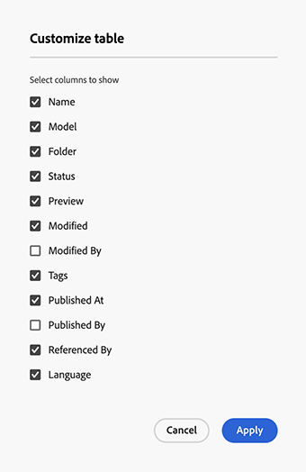

# 內容片段主控台  {#content-fragments-console}

了解內容片段主控台如何最佳化內容片段的存取權，協助您透過採取管理動作（例如發佈、取消發佈、複製）來建立、搜尋及管理這些片段。

內容片段主控台專用於管理、搜尋及建立內容片段。 此片段已針對無頭內容最佳化，但也用於建立內容片段以用於頁面編寫。

>[!NOTE]
>
>此主控台只會顯示內容片段。 它不會顯示影像和視訊等其他資產類型。

>[!NOTE]
>
>目前可透過下列方式存取您的內容片段：
>
>* 此 **內容片段** 主控台
>* the **資產** console — 請參閱 [管理內容片段](/help/assets/content-fragments/content-fragments-managing.md)

>[!NOTE]
>
>選取 [此控制台中可使用鍵盤快捷鍵](/help/sites-cloud/administering/content-fragments/content-fragments-console-keyboard-shortcuts.md).

您可以從全域導覽的頂層直接存取內容片段主控台：

## 控制台的基本結構和處理 {#basic-structure-handling-content-fragments-console}

選取 **內容片段** 會在新標籤中開啟主控台。

您可以在此看到三個主要區域：

* 頂端工具列
   * 提供標準AEM功能
   * 也會顯示您的IMS組織
* 左側面板
   * 在此，您可以隱藏或顯示資料夾樹
   * 可以選取樹的特定分支
* 主面板/右面板 — 從這裡，您可以：
   * 請參閱樹狀結構之所選分支中的所有內容片段清單：
      * 位置會以階層連結表示；這些也可用來變更位置
      * 所選資料夾中的內容片段，以及所有子資料夾都會顯示：
         * [各種資訊領域](#selectuse-available-columns) 關於內容片段提供連結；視欄位而定，這些功能可以：
            * 在編輯器中開啟適當的片段
            * 顯示有關引用的資訊
            * 顯示片段語言版本的相關資訊
         * 您可以 [選取一或多個內容片段以顯示可用動作](#actions-selected-content-fragment)
      * 您可以選取欄標題，以根據該欄來排序表格；再次選取，在遞增和遞減之間切換
   * **[建立](#creating-new-content-fragment)** 新內容片段
   * [篩選](#filtering-fragments) 內容片段會根據謂語的選取，並儲存篩選器以供日後使用
   * [搜尋](#searching-fragments) 內容片段
   * [自訂表格檢視以顯示選取的資訊欄](#selectuse-available-columns)
   * 使用 **在資產中開啟** 以直接開啟 **資產** 主控台

      >[!NOTE]
      >
      >此 **資產** console可用來存取資產，例如影像、影片等。  此主控台可供存取：
      >
      >* 使用 **在資產中開啟** 連結（在內容片段主控台中）
      >* 直接從全域導覽窗格

## （選取的）內容片段的動作 {#actions-selected-content-fragment}

選取特定片段會開啟工具列，專注於該片段可用的動作。 您也可以選取多個片段 — 動作的選取將會據此調整。

* **開啟**
* **發佈** (和 **取消發佈**)
* **複製**
* **移動**
* **重新命名**
* **刪除**

>[!NOTE]
>
>「發佈」、「取消發佈」、「刪除」、「移動」、「重新命名」、「複製」等動作會觸發非同步作業。 可透過AEM非同步作業UI監控該作業的進度。

## 提供的內容片段相關資訊 {#information-content-fragments}

主控台的主/右面板（表格檢視）提供內容片段的一系列資訊。 某些項目也提供指向進一步動作和/或資訊的直接連結：

* **名稱**
   * 提供在編輯器中開啟片段的連結。
* **模型**
   * 提供在編輯器中開啟片段的連結。
* **資料夾**
   * 提供在主控台中開啟資料夾的連結。
將滑鼠游標暫留在資料夾名稱上會顯示JCR路徑。
* **狀態**
   * 僅資訊
* **修改時間**
   * 僅資訊
* **修改者:**
   * 僅資訊
* **發佈於**
   * 僅資訊
* **發佈者**
   * 僅資訊
* **引用者**

   * 提供開啟對話方塊的連結，列出該片段的所有上層參照；包括參考內容片段、體驗片段和頁面。 要開啟特定參照，請按一下 **標題** 的下一頁。

      

* **語言**

   * 指示內容片段的地區，以及與內容片段關聯的地區/語言副本的總數。

      

      * 按一下/點選計數，以開啟一個對話方塊，顯示所有語言副本。 若要開啟特定語言副本，請按一下 **標題** 的下一頁。

         

## 選擇可用列 {#select-available-columns}

如同其他主控台，您可以設定可見且可供動作的欄：

這會顯示可隱藏或顯示的欄清單：

## 建立新內容片段 {#creating-new-content-fragment}

選取 **建立** 開啟了緊湊型 **新內容片段** 對話框：

## 篩選片段 {#filtering-fragments}

篩選面板提供：

* 可選擇和組合的謂語選擇
* 有機會 **儲存** 您的設定
* 檢索保存的搜索篩選器以重複使用的選項

## 搜尋片段 {#searching-fragments}

搜索框支援全文搜索。 在搜索框中輸入搜索詞：

將提供所選結果：

搜尋方塊也提供快速存取 **最近的內容片段** 和 **已儲存的搜尋**:

