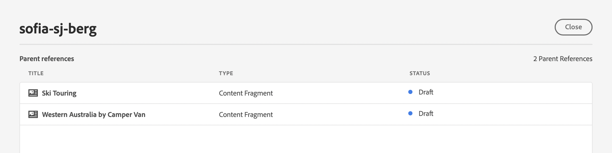

# 內容片段主控台  {#content-fragments-console}

瞭解內容片段主控台如何透過執行發佈、取消發佈、複製等管理操作，將內容片段的存取最佳化，協助您建立、搜尋和管理內容片段。

內容片段主控台專用於管理、搜尋和建立內容片段。 它已針對在Headless內容中使用進行了最佳化，但在建立用於頁面編寫的內容片段時也會使用。

>[!NOTE]
>
>此主控台僅顯示內容片段。 它不會顯示其他資產型別，例如影像和影片。

>[!NOTE]
>
>目前可以透過以下方式存取您的內容片段：
>
>* 此 **內容片段** 主控台
>* 此 **資產** 主控台 — 請參閱 [管理內容片段](/help/assets/content-fragments/content-fragments-managing.md)

>[!NOTE]
>
>一系列精選 [此主控台提供鍵盤快速鍵](/help/sites-cloud/administering/content-fragments/content-fragments-console-keyboard-shortcuts.md).

>[!NOTE]
>
>您的專案團隊可視需要自訂主控台。 另請參閱 [自訂內容片段主控台](/help/implementing/developing/extending/content-fragment-console-customizing.md) 以取得更多詳細資料。

可以從全域導覽的頂層直接存取內容片段主控台：

## 主控台的基本結構和處理 {#basic-structure-handling-content-fragments-console}

選取 **內容片段** 將在新索引標籤中開啟主控台。

您可以看到有三個主要區域：

* 頂端工具列
   * 提供標準AEM功能
   * 也會顯示您的IMS組織
* 左側面板
   * 您可以在此隱藏或顯示資料夾樹狀結構
   * 您可以選取樹狀結構的特定分支
   * 這可以調整大小以顯示巢狀資料夾
* 主要/右側面板 — 從這裡，您可以：
   * 檢視樹狀結構所選分支中的所有內容片段清單：
      * 階層連結會指出位置，也可用來變更位置
      * 所選資料夾的內容片段，以及所有子資料夾都會顯示：
         * [各種資訊欄位](#selectuse-available-columns) 關於內容片段提供連結；根據欄位，這些連結可以：
            * 在編輯器中開啟適當的片段
            * 顯示參考的相關資訊
            * 顯示片段語言版本的相關資訊
      * 在欄標題上使用滑鼠游標時，下拉式動作選擇器和寬度滑桿隨即顯示。 這些功能可讓您：
         * 排序 — 選取適當的遞增或遞減動作。這將根據該欄排序整個表格。 排序功能僅適用於適當的欄。
         * 調整欄大小 — 使用動作或寬度滑桿

## 動作 {#actions}

在主控台中，您可以直接或在選取特定片段後使用一系列動作：

* 直接執行各種動作 [可從主控台取得](#available-actions)
* 您可以 [選取一或多個內容片段以顯示適當的動作](#actions-selected-content-fragment)

### 動作（未選取） {#actions-unselected}

某些動作可從主控台取得 — 無需選取特定內容片段：

* **[建立](/help/sites-cloud/administering/content-fragments/content-fragments-managing.md#creating-a-content-fragment)** 新的內容片段
* [篩選](#filtering-fragments) 根據謂詞的選擇建立內容片段，並儲存篩選器以供日後使用
* [搜尋](#searching-fragments) 內容片段
* [自訂表格檢視以顯示選取的資訊欄](#select-available-columns)
* 使用 **在Assets中開啟** 直接開啟中的目前位置 **資產** 主控台

   >[!NOTE]
   >
   >此 **資產** 控制檯是用來存取資產，例如影像、影片等。  此主控台可以存取：
   >
   >* 使用 **在Assets中開啟** 連結（在內容片段主控台中）
   >* 直接從全域導覽窗格

### （所選）內容片段的動作 {#actions-selected-content-fragment}

選取特定片段將開啟一個工具列，其中聚焦在該片段可用的動作。 您也可以選擇多個片段 — 動作的選擇將據此調整。

* **開啟**
* **[發佈](/help/sites-cloud/administering/content-fragments/content-fragments-managing.md#publishing-and-previewing-a-fragment)** (和&#x200B;**[取消發佈](/help/sites-cloud/administering/content-fragments/content-fragments-managing.md#unpublishing-a-fragment)**)
* **複製**
* **移動**
* **重新命名**
* **[刪除](/help/sites-cloud/administering/content-fragments/content-fragments-managing.md#deleting-a-fragment)**

>[!NOTE]
>
>發佈、取消發佈、刪除、移動、重新命名、複製等動作觸發非同步作業。可以透過 AEM 非同步作業 UI 監視該作業的進度。

## 提供的有關您的內容片段的資訊 {#information-content-fragments}

主控台的主/右側面板（表格檢視）提供一系列有關您的內容片段的資訊。 有些專案也會提供進一步動作和/或資訊的直接連結：

* **名稱**
   * 提供在編輯器中開啟片段的連結。
* **模型**
   * 提供在編輯器中開啟片段的連結。
* **資料夾**
   * 提供在主控台中開啟資料夾的連結。
將游標停留在資料夾名稱上將顯示 JCR 路徑。
* **狀態**
   * 僅供參考
* **預覽**
   * 僅供參考：
      * **同步中**：內容片段在上同步 **作者** 和 **預覽** 服務。
      * **不同步**：內容片段在上的不同步 **作者** 和 **預覽** 服務。 您需要 **發佈** 至 **預覽** 以確保兩個執行個體恢復同步。
      * 空白：內容片段不存在於 **預覽** 服務。
* **修改時間**
   * 僅供參考
* **修改者:**
   * 僅供參考
* **發佈時間**
   * 僅供參考
* **發佈者**
   * 僅供參考
* **引用者**

   * 提供開啟對話方塊的連結，其中列出該片段的所有父參照，包括參照內容片段、體驗片段和頁面。 若要開啟特定參照，請按一下 **標題** 在對話方塊中。

      

* **語言**

   * 表示內容片段的地區設定，以及與內容片段相關的地區設定/語言副本總數。

      

      * 按一下/點選計數，開啟顯示所有語言副本的對話方塊。 若要開啟特定語言副本，請按一下 **標題** 在對話方塊中。

         

## 選取可用的欄 {#select-available-columns}

與其他主控台一樣，您可以設定可見且可動作的資料行：

這會顯示您可以隱藏或顯示的欄清單：

## 篩選片段 {#filtering-fragments}

「篩選器」面板提供：

* 述詞的選擇；可以選取並組合一個或多個述詞以建立篩選器
* 機會 **儲存** 您的設定
* 擷取已儲存搜尋篩選器以供重複使用的選項

### 快速篩選 {#fast-filtering}

您也可以按一下清單中的特定欄值來選取述詞。 您可以選取一或多個值來組合述詞。

例如，選取 **已發佈** 在 **狀態** 欄：

>[!NOTE]
>
>僅支援快速篩選 **模型**， **狀態**， **修改者**、和 **發佈者** 欄。

選取後，將顯示為篩選述詞，並據此篩選清單：

## 搜尋片段 {#searching-fragments}

搜尋方塊支援全文檢索搜尋。 在搜尋方塊中輸入搜尋字詞：

將提供選取的結果：

搜尋方塊也可讓您快速存取 **最近使用的內容片段** 和 **已儲存的搜尋**：

