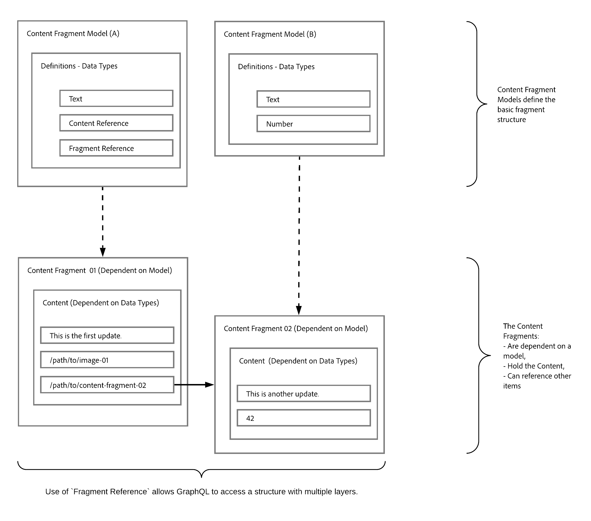

# 使用內容片段與GraphQL進行無頭內容傳遞 {#headless-content-delivery-using-content-fragments-with-graphQL}

使用內容片段和GraphQLAPI，您可以將Adobe Experience Manager(AEM)as a Cloud Service用作無頭內容管理系統(CMS)。

這是通過使用內容片段和AEMGraphQLAPI(基於標準GraphQL的定製實現)來毫無頭緒地提供結構化內容以便在您的應用程式中使用來實現的。 通過自定義單個API查詢，您可以檢索和傳遞您想要/需要呈現的特定內容（作為對單個API查詢的響應）。

>[!NOTE]
>
>另請參閱:
>
>* [什麼是無頭？](/help/headless/what-is-headless.md)了解 Headless 概念和術語。
>
>* [無頭AEM和](/help/headless/introduction.md) AEM Sitesas a Cloud Service的無頭開發簡介。

>[!NOTE]
>
>GraphQL 目前在 Adobe Experience Manager (AEM) as a Cloud Service 中用於兩個 (獨立) 情況：
>
>* [商AEM務通過GraphQL消費來自商業平台的資料](/help/commerce-cloud/integrating/magento.md)。
>* [內AEM容片段與GraphQLAPIAEM(基於標準GraphQL的自定義實現)協作，以提供結構化內容供您的應用程式使用](/help/headless/graphql-api/content-fragments.md)。

## Headless CMS {#headless-cms}

無頭內容管理系統(CMS)是僅用於後端的內容管理系統，它明確地設計和構建為內容儲存庫，使內容可通過API訪問，以便在任何設備上顯示。

就創作內容片段而言，AEM這意味著：

* 您可以使用內容片段來創作主要不打算在格式化頁面上直接發佈(1:1)的內容。

* 根據內容片段模型，內容片段的內容將以預定方式結構化。 這簡化了對應用程式的訪問，這將進一步處理您的內容。

## GraphQL — 概述 {#graphql-overview}

GraphQL 是：

* &quot;*...API的查詢語言和用現有資料完成這些查詢的運行時。*。

   請參閱 [GraphQL.org](https://graphql.org)

的 [AEMGraphQL](#aem-graphql-api) 允許您對 [內容片段](/help/sites-cloud/administering/content-fragments/content-fragments.md);每個查詢都根據特定的模型類型。 然後，您的應用程式可以使用傳回的內容。

## AEM GraphQL API {#aem-graphql-api}

對於Adobe Experience as Cloud Experience，已開發了標準GraphQLAPI的自定義實現。 請參閱 [用AEM於內容片段的GraphQLAPI](/help/headless/graphql-api/content-fragments.md) 的雙曲餘切值。

GraphQLAEM API實現基於 [GraphQLJava庫](https://graphql.org/code/#java)。

## 與 AEM GraphQL API 搭配使用的內容片段 {#content-fragments-use-with-aem-graphql-api}

[內容片段](#content-fragments) 可作為GraphQL查詢的AEM基礎：

* 它們使您能夠設計、建立、建立和發佈獨立於頁面的內容。
* 的 [內容片段模型](#content-fragments-models) 通過定義的資料類型提供所需的結構。
* 的 [片段引用](#fragment-references)定義模型時可用，可用於定義其它結構層。

### 內容片段 {#content-fragments}

內容片段:

* 包含結構化內容。

* 它們基於 [內容片段模型](#content-fragments-models)，它為生成的片段預定義結構。

### 內容片段模型 {#content-fragments-models}

這些 [內容片段模型](/help/sites-cloud/administering/content-fragments/content-fragments-models.md):

* 用於生成 [架構](https://graphql.org/learn/schema/)的 **已啟用**。

* 提供 GraphQL 所需的資料類型和欄位。它們確保您的應用程式只要求可能的內容並接收預期的內容。

* **[片段參考](#fragment-references)**&#x200B;資料類型可在您的模型中用來參考另一個內容片段，從而引入額外的結構層。

### 片段參考 {#fragment-references}

**[片段參考](/help/sites-cloud/administering/content-fragments/content-fragments-models.md#fragment-reference-nested-fragments)**：

* 與GraphQL合作特別感興趣。

* 是定義內容片段模型時可使用的特定資料類型。

* 可參考另一個片段，取決於特定的內容片段模型。

* 允許您檢索結構化資料。

   * 當定義為 **multifeed** 時，主片段可以參考 (擷取) 多個子片段。

### JSON 預覽 {#json-preview}

要幫助設計和開發內容片段模型，可以預覽 [JSON輸出](/help/sites-cloud/administering/content-fragments/content-fragments-json-preview.md)。

## 了解搭配使用 GraphQL 與 AEM - 範例內容和查詢 {#learn-graphql-with-aem-sample-content-queries}

請參閱 [學習將GraphQL與AEM樣例內容和查詢一起使用](/help/headless/graphql-api/sample-queries.md) 介紹使用AEMGraphQL

## 教學課程 - AEM Headless 和 GraphQL 快速入門

正在尋找實作教學課程？查看[AEM Headless 和 GraphQL 快速入門](https://experienceleague.adobe.com/docs/experience-manager-learn/getting-started-with-aem-headless/graphql/overview.html)端對端教學課程，說明如何在 Headless CMS 情境下使用 AEM GraphQL API 建立和公開內容並供外部應用程式取用。
