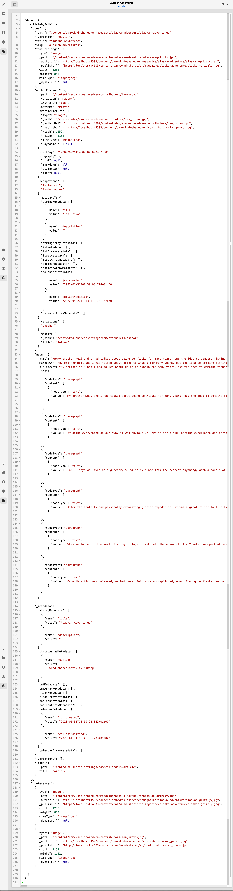

# 預覽 - JSON 代表 {#preview-json-representation}

在開發作為AEM Headless實作一部分的內容片段模型時，您可能想要根據模型檢視內容片段的範例JSON輸出。 例如，瞭解最終輸出的外觀。 在驗證模型JSON結構時，這可能很有幫助，可能包含每個資料型別的預設範例內容。

使用 **預覽** 圖示：

您可以檢視目前片段的JSON表示法。 例如：

<!--
**Copy URL** allows you to copy to clipboard the URL for either author or publish.
-->
