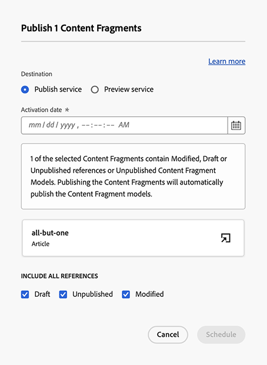
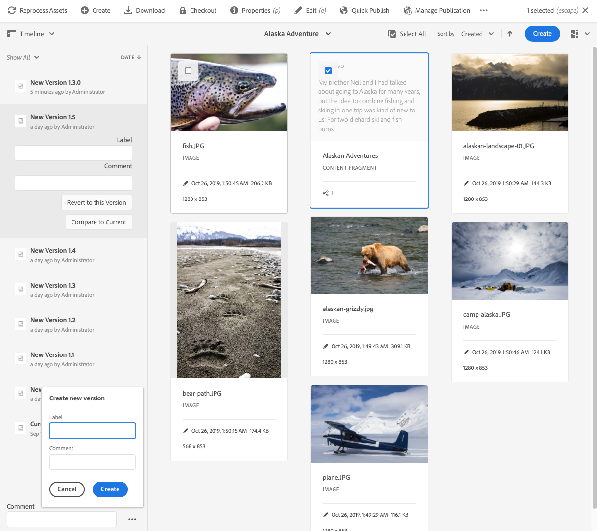

# 管理內容片段 {#managing-content-fragments}

了解如何使用 **內容片段** 管理AEM內容片段的主控台。 這些功能可用於頁面編寫，或作為無頭內容的基礎。

在定義 [內容片段模型](#creating-a-content-model) 您可以將這些用於 [建立內容片段](#creating-a-content-fragment).

此 [內容片段編輯器](#opening-the-fragment-editor) 提供各種 [模式](#modes-in-the-content-fragment-editor) 啟用：

* [編輯內容](#editing-the-content-of-your-fragment) 和 [管理變數](#creating-and-managing-variations-within-your-fragment)
* [為片段加上注釋](/help/sites-cloud/administering/content-fragments/content-fragments-variations.md#annotating-a-content-fragment)
* [將內容與您的片段關聯](#associating-content-with-your-fragment)
* [設定中繼資料](#viewing-and-editing-the-metadata-properties-of-your-fragment)
* [查看結構樹](/help/sites-cloud/administering/content-fragments/content-fragments-structure-tree.md)
* [預覽JSON表示法](/help/sites-cloud/administering/content-fragments/content-fragments-json-preview.md)

>[!NOTE]
>
>可使用內容片段：
>
>* 編寫頁面時；請參閱 [使用內容片段進行頁面編寫](/help/sites-cloud/authoring/fundamentals/content-fragments.md).
>* for [使用內容片段搭配GraphQL的無周邊內容傳送](/help/sites-cloud/administering/content-fragments/content-fragments-graphql.md).

>[!NOTE]
>
>內容片段會儲存為 **資產**. 主要透過 **內容片段** 主控台，但也可從 **資產** 控制台。

## 內容片段主控台 {#content-fragments-console}

內容片段主控台可讓您直接存取您的片段及相關工作。 如需詳細資訊，請參閱：

* [內容片段控制台的基本結構和處理](/help/sites-cloud/administering/content-fragments/content-fragments-console.md#basic-structure-handling-content-fragments-console)

* [提供的內容片段相關資訊](/help/sites-cloud/administering/content-fragments/content-fragments-console.md#information-content-fragments)

* [內容片段主控台中的內容片段動作](/help/sites-cloud/administering/content-fragments/content-fragments-console.md#actions-selected-content-fragment)

* [自訂內容片段主控台中可用的欄](/help/sites-cloud/administering/content-fragments/content-fragments-console.md#select-available-columns)

* [在內容片段主控台中搜尋和篩選](/help/sites-cloud/administering/content-fragments/content-fragments-console.md#filtering-fragments)

## 建立內容片段 {#creating-content-fragments}

>[!CONTEXTUALHELP]
>id="aemcloud_sites_trial_admin_content_fragments_create_content"
>title="建立新內容"
>abstract="您將學習如何根據您在模組1中建立的模型建立可用於頁面編寫的內容，或作為無頭內容的基礎。"

### 建立內容模型 {#creating-a-content-model}

[內容片段模型](/help/sites-cloud/administering/content-fragments/content-fragments-models.md) 可在使用結構化內容建立內容片段之前啟用和建立。

### 建立內容片段 {#creating-a-content-fragment}

若要建立內容片段：

1. 從 **內容片段** 主控台，選取 **建立** （右上）。

   >[!NOTE]
   >
   >若要預先定義新片段的位置，您可以導覽至您要建立片段的資料夾，或在建立程式期間指定位置。

1. 此 **新內容片段** 對話框將開啟，您可以在此處指定：

   * **位置**  — 這將自動完成，且目前位置，但您可視需要選取其他位置
   * **內容片段模型**  — 從下拉式清單中選取要作為片段基礎的模型
   * **標題**
   * **名稱**  — 這會根據 **標題**，但您可以視需要加以編輯
   * **說明**

   

1. 選擇 **建立**，或 **建立和開啟** 以保留定義。

## 內容片段的狀態 {#statuses-content-fragments}

內容片段存在期間可能有數種狀態，如 [內容片段主控台](/help/sites-cloud/administering/content-fragments/content-fragments-console.md):

* **新增**
已建立新的內容片段，但從未在內容片段編輯器中編輯或開啟。
* **草稿**
有人已編輯或開啟內容片段編輯器中的（新）內容片段，但尚未發佈。
* **已發佈**
內容片段已發佈。
* **已修改**
內容片段發佈後（但發佈修改前）已編輯。
* **未發佈**
內容片段已取消發佈。

## 開啟片段編輯器 {#opening-the-fragment-editor}

若要開啟片段以進行編輯：

>[!CAUTION]
>
>若要編輯您需要的內容片段 [適當的權限](/help/implementing/developing/extending/content-fragments-customizing.md#asset-permissions). 如果您遇到問題，請與系統管理員聯繫。

1. 使用 **內容片段** 主控台，導覽至內容片段的位置。
1. 選取片段，然後開啟片段以進行編輯 **開啟** 的上界。

1. 片段編輯器將會開啟。 視需要進行變更：

   

1. 進行變更後，請使用 **儲存**, **儲存並關閉** 或 **關閉** 視需要。

   >[!NOTE]
   >
   >**儲存並關閉** 可透過 **儲存** 下拉式清單。

   >[!NOTE]
   >
   >兩者 **儲存並關閉** 和 **關閉** 將退出編輯器 — 請參閱 [儲存、關閉和版本](#save-close-and-versions) 以取得內容片段各種選項運作方式的完整資訊。

## 內容片段編輯器中的模式和動作 {#modes-actions-content-fragment-editor}

內容片段編輯器提供多種模式和動作。

### 內容片段編輯器中的模式 {#modes-in-the-content-fragment-editor}

使用側面板中的圖示，導覽各種模式：

* 變數： [編輯內容](#editing-the-content-of-your-fragment) 和 [管理變數](#creating-and-managing-variations-within-your-fragment)

* [註解](/help/sites-cloud/administering/content-fragments/content-fragments-variations.md#annotating-a-content-fragment)
* [相關聯的內容](#associating-content-with-your-fragment)
* [中繼資料](#viewing-and-editing-the-metadata-properties-of-your-fragment)
* [樹狀結構](/help/sites-cloud/administering/content-fragments/content-fragments-structure-tree.md)
* [預覽](/help/sites-cloud/administering/content-fragments/content-fragments-json-preview.md)

### 內容片段編輯器中的工具列動作 {#toolbar-actions-in-the-content-fragment-editor}

頂端工具列中的部分功能提供多種模式：

* 內容頁面上已參考片段時，會顯示訊息。 您可以 **關閉** 訊息。

* 可使用 **切換側面板** 表徵圖。

* 在片段名稱下方，您可以看到 [內容片段模型](/help/sites-cloud/administering/content-fragments/content-fragments-models.md) 用於建立當前片段：

   * 名稱也是將開啟模型編輯器的連結。

* 查看片段的狀態；例如，關於建立、修改或發佈時間的資訊。 狀態也會以色彩標示：

   * **新增**:灰色
   * **草稿**:藍色
   * **已發佈**:綠色
   * **已修改**:橙色
   * **已停用**:紅色

* **儲存** 提供 **儲存並關閉** 選項。

* 三個點(**...**)下拉式清單可存取其他動作：
   * **更新頁面參考**
      * 這會更新任何頁面參考。
   * **[快速發佈](#publishing-and-referencing-a-fragment)**
   * **[管理發佈](#publishing-and-referencing-a-fragment)**

<!--
This updates any page references and ensures that the Dispatcher is flushed as required. -->

## 儲存、關閉和版本 {#save-close-and-versions}

>[!NOTE]
>
>版本也可以是 [從時間表建立、比較和還原](/help/sites-cloud/administering/content-fragments/content-fragments-managing.md#timeline-for-content-fragments).

編輯器有各種選項：

* **儲存** 和 **儲存並關閉**

   * **儲存** 會儲存最新變更並保留在編輯器中。
   * **儲存並關閉** 會儲存最新變更並退出編輯器。

   >[!CAUTION]
   >
   >若要編輯您需要的內容片段 [適當的權限](/help/implementing/developing/extending/content-fragments-customizing.md#asset-permissions). 如果您遇到問題，請與系統管理員聯繫。

   >[!NOTE]
   >
   >您可以在儲存前保留在編輯器中，進行一系列變更。

   >[!CAUTION]
   >
   >除了僅儲存您的變更外，動作也會更新任何參考，並確保Dispatcher會視需要刷新。 這些變更可能需要時間處理。 因此，對於大型/複雜/重載的系統，可能會產生效能影響。
   >
   >請在使用 **儲存並關閉** 然後快速重新輸入片段編輯器，以進行並儲存進一步的變更。

* **關閉**

   會退出編輯器，但不會儲存最新變更(亦即自上次 **儲存**)。

編輯您的內容片段AEM時會自動建立版本，以確保在您取消變更時(使用 **關閉** 未保存):

1. 開啟內容片段以編輯AEM時，會檢查是否有Cookie型代號，以指出 *編輯工作階段* 存在：

   1. 如果找到代號，則會將片段視為現有編輯工作階段的一部分。
   2. 如果代號為 *not* 可用且使用者開始編輯內容，即會建立版本，並將此新編輯工作階段的Token傳送至用戶端，供用戶端儲存在Cookie中。

2. 當有 *活動* 編輯工作階段時，所編輯的內容會每600秒自動儲存一次（預設）。

   >[!NOTE]
   >
   >可使用 `/conf` 機制。
   >
   >預設值，請參閱：
   >  `/libs/settings/dam/cfm/jcr:content/autoSaveInterval`

3. 如果使用者取消編輯，則會還原在編輯工作階段開始時建立的版本，並移除代號以結束編輯工作階段。
4. 如果使用者選取 **儲存** 編輯、更新的元素/變體會持續保存，並移除代號以結束編輯工作階段。

## 編輯片段的內容 {#editing-the-content-of-your-fragment}

開啟片段後，您可以使用 [變異](/help/sites-cloud/administering/content-fragments/content-fragments-variations.md) 標籤來製作內容。

## 在片段中建立和管理變體 {#creating-and-managing-variations-within-your-fragment}

建立主內容後，您就可以建立和管理 [變異](/help/sites-cloud/administering/content-fragments/content-fragments-variations.md) 內容。

## 將內容與您的片段關聯 {#associating-content-with-your-fragment}

您也可以 [關聯內容](/help/sites-cloud/administering/content-fragments/content-fragments-assoc-content.md) 片段。 這會提供連線，讓資產（即影像）在新增至內容頁面時，可（選擇性）與片段搭配使用。

## 檢視和編輯片段的中繼資料（屬性） {#viewing-and-editing-the-metadata-properties-of-your-fragment}

您可以使用 [中繼資料](/help/sites-cloud/administering/content-fragments/content-fragments-metadata.md) 標籤。

## 發佈和參考片段 {#publishing-and-referencing-a-fragment}

>[!CAUTION]
如果您的片段以模型為基礎，則應確定 [模型已發佈](/help/sites-cloud/administering/content-fragments/content-fragments-models.md#publishing-a-content-fragment-model).
如果您發佈的內容片段尚未發佈模型，則選取清單會指出此點，且模型將會隨片段發佈。

內容片段必須發佈以便在發佈環境中使用。 這是使用標準「資產」功能完成

* 從 **發佈** 選項 [內容片段主控台](/help/sites-cloud/administering/content-fragments/content-fragments-console.md#actions-selected-content-fragment)
   * **現在**  — 確認後，片段將立即發佈
   * **排程**  — 您可以選取片段發佈的日期和時間

   必要時，您需要指定 **啟用日期** 和要發佈的參考。 例如：
   

* 從 [內容片段編輯器](#toolbar-actions-in-the-content-fragment-editor)
   * [**快速發佈**](/help/assets/manage-publication.md#quick-publish)
   * [**管理發佈**](/help/assets/manage-publication.md#manage-publication)

此外，當您 [發佈使用片段的頁面](/help/sites-cloud/authoring/fundamentals/content-fragments.md#publishing);片段會列在頁面參考中。

>[!CAUTION]
發佈和/或參考片段後，製作者開啟片段並再次編輯時AEM會顯示警告。 這將警告對片段的變更也會影響參考的頁面。

## 取消發佈片段 {#unpublishing-a-fragment}

若要取消發佈內容片段，請選取一或多個片段，然後 **取消發佈**.

>[!NOTE]
此 **取消發佈** 可使用已發佈片段時，動作將會顯示。

>[!CAUTION]
如果片段已從其他片段或頁面參照，您將會看到警告訊息，且需要確認您要繼續。

## 刪除片段 {#deleting-a-fragment}

刪除片段：

1. 在 **內容片段** 主控台導覽至內容片段的位置。
2. 選取片段。

   >[!NOTE]
   此 **刪除** 動作無法作為快速動作使用。

3. 選擇 **刪除** 的上界。
4. 確認 **刪除** 動作。

   >[!CAUTION]
   如果片段已從其他片段或頁面參考，您會看到警告訊息，且需要確認您要繼續執行 **強制刪除**. 片段及其內容片段元件將會從任何內容頁面中刪除。

## 尋找片段的上層參考 {#parent-references-fragment}

上層參考的詳細資訊可從 **參考** 欄 [內容片段主控台](/help/sites-cloud/administering/content-fragments/content-fragments-console.md#information-content-fragments).

## 尋找片段的語言副本 {#language-copies-fragment}

您可以透過 **語言** 欄 [內容片段主控台](/help/sites-cloud/administering/content-fragments/content-fragments-console.md#information-content-fragments).

## 內容片段時間軸 {#timeline-for-content-fragments}

>[!NOTE]
此功能僅適用於 **資產** 主控台

除了標準選項外， [時間表](/help/assets/manage-digital-assets.md#timeline) 提供內容片段專用的資訊和動作：

* 查看有關版本、注釋和注釋的資訊
* 版本動作

   * **[回復到此版本](#reverting-to-a-version)** （選取現有片段，然後選取特定版本）

   * **[與目前比較](#comparing-fragment-versions)** （選取現有片段，然後選取特定版本）

   * 新增 **標籤** 和/或 **註解** （選取現有片段，然後選取特定版本）

   * **另存為版本** （選取現有片段，然後是時間軸底部的向上箭頭）

* 註解動作

   * **刪除**

>[!NOTE]
評論包括：
* 所有資產的標準功能
* 在時間軸中製作
* 與片段資產相關
>
註解（適用於內容片段）包括：
* 在片段編輯器中輸入
* 特定於片段內選取的文字區段
>

例如：

## 比較片段版本 {#comparing-fragment-versions}

>[!NOTE]
此功能僅適用於 **資產** 主控台

此 **與目前比較** 動作可從 [時間表](/help/sites-cloud/administering/content-fragments/content-fragments-managing.md#timeline-for-content-fragments) 在您選取特定版本後。

此選項將開啟：

* the **目前** （最新）版本（左）

* 所選版本 **v&lt;*x.y*>** （右）

它們會並排顯示，其中：

* 會強調顯示任何差異

   * 已刪除的文本 — 紅色
   * 插入的文本 — 綠色
   * 已更換文字 — 藍色

* 全螢幕圖示可讓您自行開啟任一版本；然後切換回平行檢視
* 您可以 **還原** 至特定版本
* **完成** 會將您傳回主控台

>[!NOTE]
比較片段時無法編輯片段內容。

## 回復為版本  {#reverting-to-a-version}

>[!NOTE]
此功能僅適用於 **資產** 主控台

您可以還原為片段的特定版本：

* 直接從 [時間表](/help/sites-cloud/administering/content-fragments/content-fragments-managing.md#timeline-for-content-fragments).

   選取所需的版本，然後 **回復到此版本** 動作。

* 同時 [將版本與目前版本比較](/help/sites-cloud/administering/content-fragments/content-fragments-managing.md#comparing-fragment-versions) 您可以 **還原** 至所選版本。
