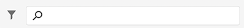

# 管理內容片段 {#managing-content-fragments}

瞭解如何使用 **內容片段** 控制台以管AEM理內容片段。 這些內容可用於頁面創作或作為無頭內容的基礎。

在定義 [內容片段模型](#creating-a-content-model) 你可以用這些 [建立內容片段](#creating-a-content-fragment)。

的 [內容片段編輯器](#opening-the-fragment-editor) 提供 [模式](#modes-in-the-content-fragment-editor) 要啟用，請執行以下操作：

* [編輯內容](#editing-the-content-of-your-fragment) 和 [管理變體](#creating-and-managing-variations-within-your-fragment)
* [為片段添加批注](/help/sites-cloud/administering/content-fragments/content-fragments-variations.md#annotating-a-content-fragment)
* [將內容與片段關聯](#associating-content-with-your-fragment)
* [配置元資料](#viewing-and-editing-the-metadata-properties-of-your-fragment)
* [查看結構樹](/help/sites-cloud/administering/content-fragments/content-fragments-structure-tree.md)
* [預覽JSON表示法](/help/sites-cloud/administering/content-fragments/content-fragments-json-preview.md)

>[!NOTE]
>
>可以使用內容片段：
>
>* 創作頁面時；見 [帶內容片段的頁面創作](/help/sites-cloud/authoring/fundamentals/content-fragments.md)。
>* 為 [使用GraphQL的內容片段進行無頭內容傳遞](/help/sites-cloud/administering/content-fragments/content-fragments-graphql.md)。

>[!NOTE]
>
>內容片段儲存為 **資產**。 主要由 **內容片段** 控制台，但也可以從 **資產** 控制台。

## 建立內容片段 {#creating-content-fragments}

### 建立內容模型 {#creating-a-content-model}

[內容片段模型](/help/sites-cloud/administering/content-fragments/content-fragments-models.md) 在建立具有結構化內容的內容片段之前，可以啟用和建立。

### 建立內容片段 {#creating-a-content-fragment}

要建立內容片段：

1. 從 **內容片段** 控制台，選擇 **建立** （右上）。

   >[!NOTE]
   >
   >要預定義新片段的位置，您可以導航到要建立片段的資料夾，也可以在建立過程中指定位置。

1. 的 **新內容片段** 對話框將開啟，您可以在此指定：

   * **位置**  — 此操作將使用當前位置自動完成，但您可以根據需要選擇其他位置
   * **內容片段模型**  — 從下拉清單中選擇要用作片段基礎的模型
   * **標題**
   * **名稱**  — 將根據 **標題**，但可以根據需要編輯
   * **說明**

   

1. 選擇 **建立**&#x200B;或 **建立並開啟** 來堅持你的定義。

## 內容片段的狀態 {#statuses-content-fragments}

在存在期間，內容片段可以具有幾種狀態，如 [內容片段控制台](/help/sites-cloud/administering/content-fragments/content-fragments-console.md):

* **新建**
已建立新的內容片段，但從未在內容片段編輯器中編輯或開啟。
* **草稿**
在內容片段編輯器中編輯或開啟內容片段之前，已有人對其進行編輯或開啟。
* **已發佈**
內容片段已發佈。
* **已修改**
內容片段在發佈後（但在再次發佈之前）已編輯。
* **未發佈**
內容片段已未發佈。

## 內容片段控制台中內容片段的操作 {#actions-content-fragment-console}

在 **內容片段** 控制台工具欄中的內容片段提供了一系列操作：

* **在資產中開啟**
* **建立**
* 的 **引用者** 列還提供了顯示該片段的所有父引用的直接連結；包括引用內容片段、體驗片段和頁面。
* 懸停在資料夾名稱上將顯示JCR路徑。

選擇片段後，所有相應操作都可用：

* **開啟**
* **發佈** (和 **取消發佈**)
* **複製**
* **移動**
* **重新命名**
* **刪除**

>[!NOTE]
>
>諸如「發佈」、「取消發佈」、「刪除」、「移動」、「更名」、「複製」等操作會觸發非同步作業。 可以通過非同步作業UI監AEM視該作業的進度。

## 在內容片段控制台中自定義視圖 {#viewing-content-fragment-console}

控制台顯示有關當前資料夾和所有子資料夾中內容片段的資訊。

可以使用 **自定義表** 表徵圖：

這將開啟 **自定義表** 對話框，您可以在其中選擇/取消選擇可用列：

## 在內容片段控制台中搜索和篩選 {#search-filter-content-fragment-console}

您可以搜索和/或篩選要在控制台中顯示的內容片段。

您可以：

* 選擇所需的資料夾
* 選擇 **顯示篩選器** 表徵圖並並行使用搜索框：

可以選擇以下篩選器：

過濾器和搜索組合也可保存，以供以後參考。

## 開啟片段編輯器 {#opening-the-fragment-editor}

要開啟片段進行編輯，請執行以下操作：

>[!CAUTION]
>
>要編輯內容片段，您需要 [適當的權限](/help/implementing/developing/extending/content-fragments-customizing.md#asset-permissions)。 如果遇到問題，請與系統管理員聯繫。

1. 使用 **內容片段** 控制台，導航到內容片段的位置。
1. 通過選擇片段，然後開啟片段進行編輯 **開啟** 的子菜單。

1. 將開啟片段編輯器。 根據需要進行更改：

   

1. 進行更改後，使用 **保存**。 **保存並關閉** 或 **關閉** 按需要。

   >[!NOTE]
   >
   >**保存並關閉** 可通過 **保存** 下拉清單。

   >[!NOTE]
   >
   >兩者 **保存並關閉** 和 **關閉** 將退出編輯器 — 請參閱 [保存、關閉和版本](#save-close-and-versions) 獲取有關內容片段的各種選項操作方式的完整資訊。

## 內容片段編輯器中的模式和操作 {#modes-actions-content-fragment-editor}

「內容片段編輯器」提供了多種模式和操作。

### 內容片段編輯器中的模式 {#modes-in-the-content-fragment-editor}

使用側面板中的表徵圖瀏覽各種模式：

* 變體： [編輯內容](#editing-the-content-of-your-fragment) 和 [管理變體](#creating-and-managing-variations-within-your-fragment)

* [註解](/help/sites-cloud/administering/content-fragments/content-fragments-variations.md#annotating-a-content-fragment)
* [相關聯的內容](#associating-content-with-your-fragment)
* [中繼資料](#viewing-and-editing-the-metadata-properties-of-your-fragment)
* [樹狀結構](/help/sites-cloud/administering/content-fragments/content-fragments-structure-tree.md)
* [預覽](/help/sites-cloud/administering/content-fragments/content-fragments-json-preview.md)

### 內容片段編輯器中的工具欄操作 {#toolbar-actions-in-the-content-fragment-editor}

頂部工具欄中的某些功能可從多種模式獲得：

* 當內容頁面上已引用該片段時，將顯示一條消息。 你可以 **關閉** 消息。

* 使用 **切換側面板** 表徵圖

* 在片段名稱下，您可以看到 [內容片段模型](/help/sites-cloud/administering/content-fragments/content-fragments-models.md) 用於建立當前片段：

   * 名稱也是開啟模型編輯器的連結。

* 查看片段的狀態；例如，有關建立、修改或發佈時間的資訊。 狀態也用顏色編碼：

   * **新建**:灰
   * **草稿**:藍
   * **已發佈**:綠
   * **已修改**:橙
   * **已停用**:紅

* **保存** 提供對 **保存並關閉** 的雙曲餘切值。

* 三點(**...**)下拉清單提供了對其他操作的訪問：
   * **更新頁面參考**
      * 這將更新任何頁面引用。
   * **[快速發佈](#publishing-and-referencing-a-fragment)**
   * **[管理發佈](#publishing-and-referencing-a-fragment)**

<!--
This updates any page references and ensures that the Dispatcher is flushed as required. -->

## 保存、關閉和版本 {#save-close-and-versions}

>[!NOTE]
>
>版本也可以 [建立、比較和還原時間軸](/help/sites-cloud/administering/content-fragments/content-fragments-managing.md#timeline-for-content-fragments)。

編輯器有多種選項：

* **保存** 和 **保存並關閉**

   * **保存** 將保存最新更改並保留在編輯器中。
   * **保存並關閉** 將保存最新更改並退出編輯器。

   >[!CAUTION]
   >
   >要編輯內容片段，您需要 [適當的權限](/help/implementing/developing/extending/content-fragments-customizing.md#asset-permissions)。 如果遇到問題，請與系統管理員聯繫。

   >[!NOTE]
   >
   >在保存之前，可以保留在編輯器中，進行一系列更改。

   >[!CAUTION]
   >
   >除了僅保存更改外，這些操作還會更新任何引用並確保根據需要刷新Dispatcher。 這些更改可能需要一些時間才能處理。 因此，對大型/複雜/重載系統可能會產生效能影響。
   >
   >在使用 **保存並關閉** 然後快速重新進入片段編輯器，以做出並保存更改。

* **關閉**

   將退出編輯器，而不保存最新更改(即自上次更改 **保存**)。

編輯內容片段時，會自AEM動建立版本，以確保在取消更改時(使用 **關閉** 不保存):

1. 當開啟內容片段進行編輯時，AEM檢查是否存在基於cookie的標籤，該標籤指示 *編輯會話* 存在：

   1. 如果找到令牌，則片段被視為現有編輯會話的一部分。
   2. 如果令牌是 *不* 用戶開始編輯內容，建立一個版本，並將此新編輯會話的令牌發送到客戶端，在客戶端將其保存在cookie中。

2. 當有 *活動* 編輯會話時，每600秒（預設值）自動保存要編輯的內容。

   >[!NOTE]
   >
   >自動保存間隔可使用 `/conf` 機制。
   >
   >預設值，請參閱：
   >  `/libs/settings/dam/cfm/jcr:content/autoSaveInterval`

3. 如果用戶取消編輯，則恢復在編輯會話開始時建立的版本，並刪除令牌以結束編輯會話。
4. 如果用戶選擇 **保存** 編輯、更新的元素/變體被保留，並且令牌被移除以結束編輯會話。

## 編輯片段的內容 {#editing-the-content-of-your-fragment}

一旦開啟了碎片，就可以使用 [變體](/help/sites-cloud/administering/content-fragments/content-fragments-variations.md) 的子菜單。

## 在片段內建立和管理變體 {#creating-and-managing-variations-within-your-fragment}

建立主內容後，您可以建立和管理 [變體](/help/sites-cloud/administering/content-fragments/content-fragments-variations.md) 內容。

## 將內容與片段關聯 {#associating-content-with-your-fragment}

您也可以 [關聯內容](/help/sites-cloud/administering/content-fragments/content-fragments-assoc-content.md) 碎片。 這提供了連接，使得當將片段添加到內容頁面時，可以（可選地）將資產（即影像）與片段一起使用。

## 查看和編輯片段的元資料（屬性） {#viewing-and-editing-the-metadata-properties-of-your-fragment}

可以使用 [元資料](/help/sites-cloud/administering/content-fragments/content-fragments-metadata.md) 頁籤。

## 發佈和引用片段 {#publishing-and-referencing-a-fragment}

>[!CAUTION]
如果片段基於模型，則應確保 [模型已發佈](/help/sites-cloud/administering/content-fragments/content-fragments-models.md#publishing-a-content-fragment-model)。
如果發佈模型尚未發佈的內容片段，則選擇清單將指示此情況，並且模型將隨片段一起發佈。

必須發佈內容片段以在發佈環境中使用。 這是使用標準資產功能完成的

* 從 **發佈** 的子菜單。 [內容片段控制台](#actions-content-fragment-console)
   * **現在**  — 經確認後，將立即發佈碎片
   * **計畫**  — 您可以選擇片段的發佈日期和時間

   必要時，需要您指定 **激活日期** 以及引用的發佈。 例如：
   

* 從 [內容片段編輯器](#toolbar-actions-in-the-content-fragment-editor)
   * [**快速發佈**](/help/assets/manage-publication.md#quick-publish)
   * [**管理發佈**](/help/assets/manage-publication.md#manage-publication)

另外，當你 [發佈使用該片段的頁面](/help/sites-cloud/authoring/fundamentals/content-fragments.md#publishing);片段將列在頁面引用中。

>[!CAUTION]
發佈和/或引用片段後，當作AEM者開啟片段以重新進行編輯時，將顯示警告。 這是警告對片段的更改也會影響引用的頁面。

## 正在取消發佈片段 {#unpublishing-a-fragment}

要取消發佈內容片段，請選擇一個或多個片段，然後 **取消發佈**。

>[!NOTE]
的 **取消發佈** 當發佈的片段可用時，操作將可見。

>[!CAUTION]
如果已從另一個片段或從頁面引用該片段，則您將看到一條警告消息，並需要確認是否要繼續。

## 刪除片段 {#deleting-a-fragment}

要刪除片段：

1. 在 **內容片段** 控制台導航到內容片段的位置。
2. 選擇片段。

   >[!NOTE]
   的 **刪除** 操作不能作為快速操作。

3. 選擇 **刪除** 的子菜單。
4. 確認 **刪除** 操作。

   >[!CAUTION]
   如果已從另一個片段或從頁面引用該片段，則您將看到一條警告消息，並需要確認您要繼續執行 **強制刪除**。 片段及其內容片段元件將會從任何內容頁面中刪除。

## 內容片段的時間軸 {#timeline-for-content-fragments}

>[!NOTE]
此功能僅在 **資產** 控制台

除了標準選項， [時間軸](/help/assets/manage-digital-assets.md#timeline) 提供特定於內容片段的資訊和操作：

* 查看有關版本、注釋和注釋的資訊
* 版本操作

   * **[還原到此版本](#reverting-to-a-version)** （先選擇現有片段，然後選擇特定版本）

   * **[與當前比較](#comparing-fragment-versions)** （先選擇現有片段，然後選擇特定版本）

   * 添加 **標籤** 和/或 **注釋** （先選擇現有片段，然後選擇特定版本）

   * **另存為版本** （選擇現有片段，然後選擇時間軸底部的上箭頭）

* 注釋操作

   * **刪除**

>[!NOTE]
注釋為：
* 所有資產的標準功能
* 在時間軸中製造
* 與碎片資產相關
>
注釋（用於內容片段）包括：
* 在片段編輯器中輸入
* 特定於片段內的選定文本段
>

例如：

## 比較片段版本 {#comparing-fragment-versions}

>[!NOTE]
此功能僅在 **資產** 控制台

的 **與當前比較** 操作可從 [時間軸](/help/sites-cloud/administering/content-fragments/content-fragments-managing.md#timeline-for-content-fragments) 選擇特定版本後。

將開啟：

* 這樣 **當前** （最新版本）（左）

* 所選版本 **v&lt;*x.y*>** （右）

它們將並排顯示，其中：

* 任何差異都會突出顯示

   * 已刪除文本 — 紅色
   * 插入的文本 — 綠色
   * 已替代文字 — 藍色

* 全屏表徵圖允許您單獨開啟任一版本；然後切換回並行視圖
* 你可以 **還原** 到特定版本
* **完成** 將返回控制台

>[!NOTE]
比較片段時無法編輯片段內容。

## 還原為版本  {#reverting-to-a-version}

>[!NOTE]
此功能僅在 **資產** 控制台

您可以還原到特定版本的片段：

* 直接從 [時間軸](/help/sites-cloud/administering/content-fragments/content-fragments-managing.md#timeline-for-content-fragments)。

   選擇所需版本，然後 **還原到此版本** 操作。

* 同時 [將版本與當前版本進行比較](/help/sites-cloud/administering/content-fragments/content-fragments-managing.md#comparing-fragment-versions) 你 **還原** 到選定版本。

