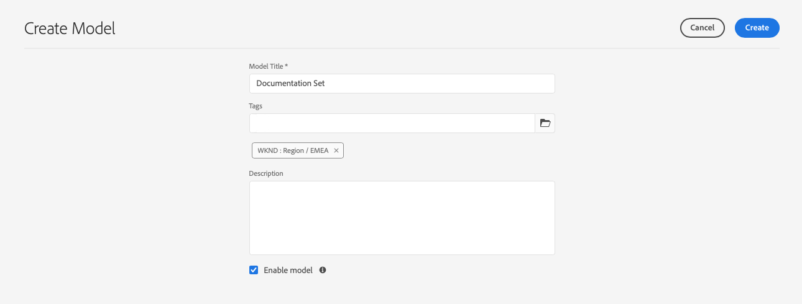
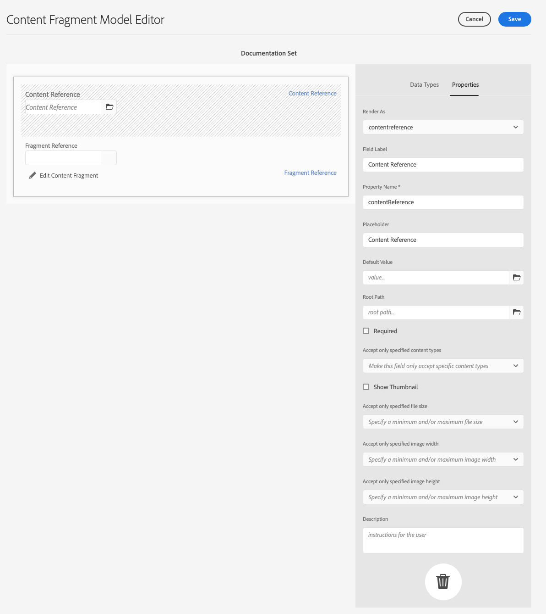

# 內容片段模型 {#content-fragment-models}

AEM中的內容片段模型會定義 [內容片段](/help/sites-cloud/administering/content-fragments/content-fragments.md). 這些功能可用於頁面編寫，或作為無頭內容的基礎。

若要使用內容片段模型，請執行下列動作：

1. [為您的執行個體啟用內容片段模型功能](/help/sites-cloud/administering/content-fragments/content-fragments-configuration-browser.md)
1. [建立](#creating-a-content-fragment-model)，和 [設定](#defining-your-content-fragment-model)，您的內容片段模型
1. [啟用內容片段模型](#enabling-disabling-a-content-fragment-model) 用於建立內容片段時
1. [在必要的資產資料夾上允許您的內容片段模型](#allowing-content-fragment-models-assets-folder) 配置 **原則**.

## 建立內容片段模型 {#creating-a-content-fragment-model}

1. 導覽至 **工具**, **一般**，然後開啟 **內容片段模型**.
1. 導覽至適合您 [配置，或子配置](/help/sites-cloud/administering/content-fragments/content-fragments-configuration-browser.md).
1. 使用 **建立** 來開啟嚮導。

   >[!CAUTION]
   >
   >若 [尚未啟用內容片段模型的使用](/help/sites-cloud/administering/content-fragments/content-fragments-configuration-browser.md), **建立** 選項將無法使用。

1. 指定「模 **型標題」**。您也可以新增 **標籤**, **說明**，然後選取 **啟用模型** to [啟用模型](#enabling-disabling-a-content-fragment-model) （如果需要）。

   

1. 使用 **建立** 以保存空模型。 訊息會指出動作的成功，您可以選取 **開啟** 要立即編輯模型，或 **完成** 返回控制台。

## 定義內容片段模型 {#defining-your-content-fragment-model}

所述內容片段模型使用選擇有效地定義所得內容片段的結構 **[資料類型](#data-types)**. 使用模型編輯器，可以新增資料類型的例項，然後設定它們以建立必要欄位：

>[!CAUTION]
>
>編輯現有內容片段模型可能會影響相依片段。

1. 導覽至 **工具**, **一般**，然後開啟 **內容片段模型**.

1. 導覽至內容片段模型的資料夾。
1. 開啟所需的模型 **編輯**;使用快速操作，或從工具欄中選取模型，然後選取操作。

   開啟模型編輯器後，會顯示：

   * 左：欄位已定義
   * 右：資 **料類型** ，可用於建立欄位( **和屬性** ，以供建立欄位後使用)

   >[!NOTE]
   >
   >欄位為 **必填**, **標籤** 在左窗格中所示，會以字元(**&#42;**)。


1. **新增欄位的方式**

   * 將必要的資料類型拖曳至欄位的必要位置：

      

   * 將欄位新增至模型後，右側面板會顯示 **屬性** 可針對該特定資料類型定義。 您可以在此定義該欄位的必要項目。

      * 許多屬性不言自明，如需其他詳細資訊，請參閱 [屬性](#properties).
      * 輸入 **欄位標籤** 會自動完成 **屬性名稱**   — 如果空白，之後可手動更新。

         >[!CAUTION]
         >
         >手動更新屬性時 **屬性名稱** 對於資料類型，請注意，名稱只能包含A-Z、a-z、0-9和底線「_」作為特殊字元。
         >
         >如果在舊版AEM中建立的模型包含非法字元，請移除或更新這些字元。
      例如：

      


1. **刪除欄位**

   選取必要欄位，然後按一下/點選垃圾桶圖示。 系統會要求您確認動作。

   

1. 新增所有必要欄位，並視需要定義相關屬性。 例如：

   

1. 選擇 **儲存** 以保留定義。

## 資料類型 {#data-types}

定義模型時可選擇資料類型：

* **單行文字**
   * 添加一行文本的一個或多個欄位；可定義的最大長度
* **多行文字**
   * 可為RTF、純文字或Markdown的文字區域
* **數量**
   * 添加一個或多個數字欄位
* **布林值**
   * 新增布林值核取方塊
* **日期時間**
   * 新增日期和/或時間
* **列舉**
   * 新增一組核取方塊、選項按鈕或下拉式欄位
* **標記**
   * 允許片段作者存取和選取標籤區域
* **內容參考資料**
   * 參考任何類型的其他內容；可用於 [建立巢狀內容](#using-references-to-form-nested-content)
   * 如果參照影像，您可以選擇顯示縮圖
* **片段引用**
   * 參考其他內容片段；可用於 [建立巢狀內容](#using-references-to-form-nested-content)
   * 資料類型可設定為允許片段作者：
      * 直接編輯參考的片段。
      * 根據適當的模型建立新內容片段
* **JSON 物件**
   * 允許內容片段作者在片段的對應元素中輸入JSON語法。
      * 允許AEM儲存您從其他服務複製/貼上的直接JSON。
      * JSON會傳遞，並在GraphQL中輸出為JSON。
      * 在內容片段編輯器中包含JSON語法醒目提示、自動完成和錯誤醒目提示。
* **標籤預留位置**
   * 允許導入頁簽，以便在編輯內容片段內容時使用。
這將在模型編輯器中顯示為分隔線，用於分隔內容資料類型清單的各節。 每個例項代表新索引標籤的開頭。
在片段編輯器中，每個例項都會顯示為索引標籤。

      >[!NOTE]
      >
      >此資料類型僅用於格式設定，AEM GraphQL結構會忽略它。

## 屬性 {#properties}

許多屬性不言自明，對於某些屬性，其他詳細資訊如下：

* **屬性名稱**

   手動更新資料類型的此屬性時，請注意名稱 **必須** cont *僅限* A-Z、a-z、0-9和底線「_」作為特殊字元。

   >[!CAUTION]
   >
   >如果在舊版AEM中建立的模型包含非法字元，請移除或更新這些字元。

* **呈現為**
用於在片段中實現/呈現欄位的各種選項。 這通常可讓您定義作者會看到欄位的單一例項，或是允許建立多個例項。

* **欄位標籤**
輸入 
**欄位標籤** 會自動產生 **屬性名稱**，如有需要，可手動更新。

* **驗證**
基本驗證可由下列機制提供： **必填** 屬性。 有些資料類型有新增驗證欄位。 請參閱 [驗證](#validation) 以取得詳細資訊。

* 對於「多行」 **資料類型** ，可將「預設類型 **** 」定義為：

   * **RTF**
   * **Markdown**
   * **純文字**

   若未指定，則預設值 **RTF** 用於此欄位。

   在內容 **片段模型中變更「預設類型** 」，只會在編輯器中開啟並儲存該片段後，對現有、相關的內容片段生效。

* **不重複**
內容（針對特定欄位）在從目前模型建立的所有內容片段中必須是唯一的。

   這可確保內容作者無法重複已新增至相同模型另一個片段中的內容。

   例如， **單行文字** 欄位 `Country` 內容片段模型中的「 」不能有值 `Japan` 在兩個相依內容片段中。 嘗試第二個執行個體時會發出警告。

   >[!NOTE]
   >
   >確保每個語言根的唯一性。

   >[!NOTE]
   >
   >變數可以有相同 *唯一* 值作為相同片段的變數，但與其他片段的任何變數所用的值不同。

* 請參閱 **[內容參考](#content-reference)** 以取得有關該特定資料類型及其屬性的詳細資訊。

* 請參閱 **[片段參考（巢狀片段）](#fragment-reference-nested-fragments)** 以取得有關該特定資料類型及其屬性的詳細資訊。

* **可翻譯**

   檢查 **可翻譯** 內容片段模型編輯器中欄位上的核取方塊將：

   * 確認欄位的屬性名稱已新增至翻譯設定、內容 `/content/dam/<sites-configuration>`，如果尚未出現。
   * 若為GraphQL:設定 `<translatable>` 「內容片段」欄位上的屬性 `yes`，允許GraphQL查詢篩選器只能輸出可翻譯的內容。

## 驗證  {#validation}

各種資料類型現在都包含為內容輸入到產生片段時定義驗證需求的可能性：

* **單行文字**
   * 比較預先定義的規則運算式。
* **數量**
   * 檢查特定值。
* **內容參考資料**
   * 測試特定內容類型。
   * 只能參考指定檔案大小或較小的資產。
   * 只能參考預先定義的寬度和/或高度範圍內（以像素為單位）的影像。
* **片段引用**
   * 測試特定內容片段模型。

## 使用參考來形成巢狀內容 {#using-references-to-form-nested-content}

內容片段可使用下列其中一種資料類型，以形成巢狀內容：

* **[內容參考資料](#content-reference)**
   * 提供對其他內容的簡單參考；任何類型。
   * 可針對一或多個參照（在產生的片段中）進行設定。

* **[片段參考](#fragment-reference-nested-fragments)** （巢狀片段）
   * 參照其他片段，取決於指定的特定模型。
   * 可讓您包含/擷取結構化資料。

      >[!NOTE]
      >
      >該方法與 [透過GraphQL使用內容片段進行無頭式內容傳送](/help/sites-cloud/administering/content-fragments/content-fragments-graphql.md).
   * 可針對一或多個參照（在產生的片段中）進行設定。

>[!NOTE]
>
>AEM對以下項目提供重複防護：
>
>* 內容參考資料
   >  這會防止使用者新增參考至目前的片段。 這可能會導致空白的片段參考選擇器對話方塊。
>
>* GraphQL中的片段參考
   >  如果您建立深層查詢，並傳回彼此參照的多個內容片段，則第一次出現時會傳回null。


### 內容參考資料 {#content-reference}

「內容參考」可讓您從其他來源轉譯內容；例如影像或內容片段。

除了標準屬性之外，您還可以指定：

* 此 **根路徑** 任何參考內容
* 可參考的內容類型
* 檔案大小限制
* 如果已參考影像：
   * 顯示縮圖
   * 高度和寬度的影像限制



### 片段參考（巢狀片段） {#fragment-reference-nested-fragments}

片段參考會參考一或多個內容片段。 擷取要在您應用程式中使用的內容時，這項功能特別受關注，因為它可讓您擷取含有多個圖層的結構化資料。

例如：

* 定義員工詳細資訊的模型；包括：
   * 對定義雇主（公司）的模型的引用

```xml
type EmployeeModel {
    name: String
    firstName: String
    company: CompanyModel
}

type CompanyModel {
    name: String
    street: String
    city: String
}
```

>[!NOTE]
>
>這與 [透過GraphQL使用內容片段進行無頭式內容傳送](/help/sites-cloud/administering/content-fragments/content-fragments-graphql.md).

除了標準屬性之外，您還可以定義：

* **呈現為**:

   * **多場**  — 片段作者可建立多個個別的參考

   * **碎片**  — 允許片段作者選取片段的單一參考

* **模型類型**
可以選取多個模型。 編寫內容片段時，必須已使用這些模型建立任何參考的片段。

* **根路徑**
這會指定所參考任何片段的根路徑。

* **允許建立片段**

   這可讓片段作者根據適當的模型建立新片段。

   * **碎裂組合**  — 可讓片段作者選取多個片段，以建立複合

   

>[!NOTE]
>
>已建立重複保護機制。 它禁止使用者在片段參考中選取目前的內容片段。 這可能會導致空白的片段參考選擇器對話方塊。
>
>GraphQL中的片段參考也提供週期性保護。 如果您在互相參照的兩個內容片段間建立深層查詢，則會傳回null。

## 內容片段模型 — 屬性 {#content-fragment-model-properties}

您可以編輯 **屬性** 內容片段模型：

* **基本**
   * **模型標題**
   * **標記**
   * **說明**
   * **上傳影像**

## 啟用或停用內容片段模型 {#enabling-disabling-a-content-fragment-model}

若要完全控制內容片段模型的使用，他們的狀態可供您設定。

### 啟用內容片段模型 {#enabling-a-content-fragment-model}

建立模型後，必須啟用該模型，以便：

* 建立新內容片段時可供選取。
* 可從內容片段模型內參考。
* 適用於GraphQL;以便產生架構。

啟用標籤為以下任一項的模型：

* **草稿** :mew（從未啟用）。
* **已停用** :已明確停用。

您使用 **啟用** 選項，可從以下任一項取得：

* 選取所需的「模型」時，頂端工具列。
* 相應的快速操作（將滑鼠移到所需的模型上）。


### 停用內容片段模型 {#disabling-a-content-fragment-model}

也可以停用模型，以便：

* 不再提供模型作為建立 *new* 內容片段。
* 不過：
   * GraphQL結構會持續產生且仍可查詢（以避免影響JSON API）。
   * 您仍可以查詢任何以模型為基礎的內容片段，並從GraphQL端點傳回。
* 無法再參照模型，但現有參照保持不變，仍可查詢並從GraphQL端點傳回。

禁用標籤為的模型 **已啟用** 您使用 **停用** 選項，可從以下任一項取得：

* 選取所需的「模型」時，頂端工具列。
* 相應的快速操作（將滑鼠移到所需的模型上）。


## 允許資產資料夾上的內容片段模型 {#allowing-content-fragment-models-assets-folder}

若要實作內容控管，您可以設定 **原則** 在「資產」資料夾中，控制可在該資料夾中建立片段的內容片段模型。

>[!NOTE]
>
>此機制類似於 [允許頁面範本](/help/sites-cloud/authoring/features/templates.md#allowing-a-template-author) （適用於頁面的進階屬性）中的頁面及其子項。

若要設定 **原則** for **允許的內容片段模型**:

1. 導覽並開啟 **屬性** （針對必要的「資產」資料夾）。

1. 開啟 **原則** 標籤中，您可以在其中設定：

   * **繼承自`<folder>`**

      建立新子資料夾時，策略會自動繼承；如果子資料夾需要允許與父資料夾不同的模型，則可重新配置策略（並中斷繼承）。

   * **允許的內容片段模型 (依路徑)**

      可允許多個模型。

   * **允許的內容片段模型（依標籤）**

      可允許多個模型。
   

1. **儲存** 任何變更。

資料夾允許的內容片段模型解析如下：
* 此 **原則** for **允許的內容片段模型**.
* 如果為空，則嘗試使用繼承規則確定策略。
* 如果繼承鏈未傳送結果，請查看 **Cloud Services** 資料夾的設定（也先直接進行，然後透過繼承）。
* 如果上述任何項均未傳送任何結果，則該資料夾將不允許使用模型。

## 刪除內容片段模型 {#deleting-a-content-fragment-model}

>[!CAUTION]
>
>刪除內容片段模型可能會影響相依片段。

若要刪除內容片段模型：

1. 導覽至 **工具**, **一般**，然後開啟 **內容片段模型**.

1. 導覽至內容片段模型的資料夾。
1. 選取模型，隨後 **刪除** 的上界。

   >[!NOTE]
   >
   >如果參考模型，則會發出警告。 採取適當行動。

## 發佈內容片段模型 {#publishing-a-content-fragment-model}

發佈任何相依內容片段時/之前，必須發佈內容片段模型。

若要發佈內容片段模型：

1. 導覽至 **工具**, **一般**，然後開啟 **內容片段模型**.

1. 導覽至內容片段模型的資料夾。
1. 選取模型，隨後 **發佈** 的上界。
已發佈狀態會在主控台中指出。

   >[!NOTE]
   >
   >如果您發佈的內容片段尚未發佈模型，則選取清單會指出此點，且模型將會隨片段發佈。

## 取消發佈內容片段模型 {#unpublishing-a-content-fragment-model}

如果任何片段未參考內容片段模型，則可以取消發佈這些模型。

若要取消發佈內容片段模型：

1. 導覽至 **工具**, **一般**，然後開啟 **內容片段模型**.

1. 導覽至內容片段模型的資料夾。
1. 選取模型，隨後 **取消發佈** 的上界。
已發佈狀態會在主控台中指出。

如果您嘗試取消發佈一或多個片段目前使用的模型，則會出現錯誤警告，通知您這點：


訊息建議您檢查 [參考](/help/sites-cloud/authoring/getting-started/basic-handling.md#references) 進一步調查小組：


## 鎖定（已發佈）內容片段模型 {#locked-published-content-fragment-models}

此功能可控管已發佈的內容片段模型。

### 挑戰 {#the-challenge}

* 內容片段模型決定AEM中GraphQL查詢的結構。

   * AEM GraphQL結構會在建立內容片段模型時立即建立，且可存在於製作和發佈環境中。

   * 發佈的結構描述是最重要的，因為它們為JSON格式的內容片段內容的即時傳送奠定了基礎。

* 修改內容片段模型或編輯內容片段模型時，可能會發生問題。 這表示結構會變更，進而可能影響現有的GraphQL查詢。

* 將新欄位新增至內容片段模型（通常）不應有任何有害影響。 不過，修改現有資料欄位（例如其名稱）或刪除欄位定義，會在現有GraphQL查詢要求這些欄位時中斷這些查詢。

### 要求 {#the-requirements}

* 讓使用者了解編輯已用於即時內容傳送的模型（亦即已發佈的模型）時的風險。

* 此外，也可避免非預期的變更。

如果已修改的模型重新發佈，其中任何一個可能會中斷查詢。

### 解決方案 {#the-solution}

為了解決這些問題，內容片段模型包括 *鎖定* 一經發佈，即會進入作者的唯讀模式。 這由表示 **已鎖定**:


當模型為 **已鎖定** （在「只讀」模式中），您可以看到模型的內容和結構，但無法編輯它們。

您可以管理 **已鎖定** 從控制台或模型編輯器中選擇模型：

* 主控台

   從主控台，您可以使用 **解鎖** 和 **鎖定** 工具列中的動作：

   

   * 您可以 **解鎖** 啟用編輯的模型。

      如果您選取 **解鎖** 將會顯示警告，您必須確認 **解鎖** 動作：
      

      然後，可以開啟模型進行編輯。

   * 您也可以 **鎖定** 模型之後。
   * 重新發佈模型會立即將其放回 **已鎖定** （唯讀）模式。

* 模型編輯器

   * 開啟已鎖定的模型時，系統會發出警告，並顯示三個動作： **取消**, **查看只讀**, **編輯**:

      

   * 如果您選取 **查看只讀** 您可以查看模型的內容和結構：

      

   * 如果您選取 **編輯** 您可以編輯並儲存更新：

      

      >[!NOTE]
      >
      >頂端可能仍會出現警告，但此時模型已由現有內容片段使用。

   * **取消** 會將您傳回主控台。
