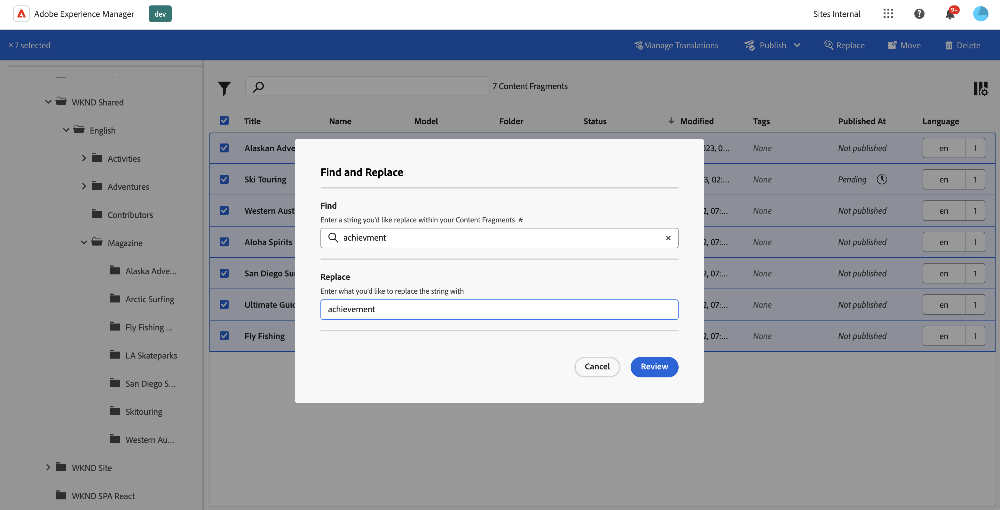
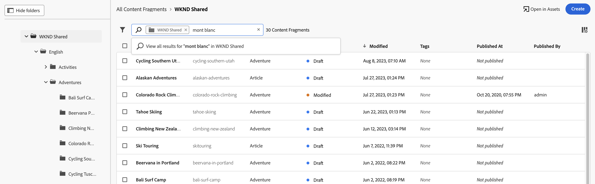

# 管理內容片段 {#managing-content-fragments}

瞭解如何從專用的&#x200B;**內容片段主控台**&#x200B;和[內容片段編輯器](#content-fragments-console)，在Adobe Experience Manager (AEM) as a Cloud Service中管理您的[內容片段](/help/sites-cloud/administering/content-fragments/authoring.md#content-fragment-editor)。 這些內容片段可用作Headless內容的基礎，或用於編寫頁面。

>[!NOTE]
>
>此頁面涵蓋（僅）顯示內容片段的主控台區段。 如需其他面板，請參閱：
>
>* [管理內容片段模型](/help/sites-cloud/administering/content-fragments/managing-content-fragment-models.md)
>* [在內容片段主控台中檢視和管理Assets](/help/sites-cloud/administering/content-fragments/assets-content-fragments-console.md)

在定義您的[內容片段模式](#creating-a-content-model)後，您可以使用這些模式：

* [建立您的內容片段](#creating-a-content-fragment)。
* 然後開啟[內容片段編輯器](#opening-the-fragment-editor)以[編寫您的內容並管理您的變數](#editing-the-content-of-your-fragment)。
* [管理標記](#manage-tags)
* [檢視和編輯屬性（中繼資料）](#viewing-and-editing-properties)
* [檢視結構樹](/help/sites-cloud/administering/content-fragments/authoring.md#structure-tree)

>[!NOTE]
>
>可以使用內容片段：
>
>* 使用內容片段搭配GraphQL[的](/help/sites-cloud/administering/content-fragments/content-delivery-with-graphql.md)Headless內容傳遞，
>* 編寫頁面時；請參閱[使用內容片段編寫頁面](/help/sites-cloud/authoring/fragments/content-fragments.md)。

>[!NOTE]
>
>內容片段儲存為&#x200B;**Assets**。 它們主要從&#x200B;**內容片段**&#x200B;主控台管理，但也可以從[Assets](/help/assets/content-fragments/content-fragments-managing.md)主控台管理。

## 主控台中內容片段的基本結構和處理 {#basic-structure-handling-content-fragments-console}

您可以使用[內容片段主控台](/help/sites-cloud/administering/content-fragments/overview.md#content-fragments-console)最左側的面板，選取&#x200B;**內容片段**&#x200B;做為檢視、瀏覽及管理的資源型別：


選取&#x200B;**內容片段**&#x200B;會在新索引標籤中開啟主控台。


您可以看到有三個主要區域：

* 頂端工具列
   * 提供標準AEM功能
   * 也會顯示您的IMS組織
   * 提供各種[動作](#actions-unselected)
* 左側面板
   * 您可以在此壓縮或展開面板的連結
   * 您可以在此隱藏或顯示資料夾樹狀結構
   * 您可以選取樹的特定分支
   * 這可以調整大小以顯示巢狀資料夾
   * 除了內容片段之外，您也可以檢視[內容片段模型](/help/sites-cloud/administering/content-fragments/managing-content-fragment-models.md)或[Assets](/help/sites-cloud/administering/content-fragments/assets-content-fragments-console.md)；您也可以壓縮或展開面板的連結
* 主要/右側面板 — 從這裡，您可以：
   * 檢視樹狀結構所選分支中的所有內容片段清單：
      * 所選資料夾的內容片段，以及所有子資料夾都會顯示：
         * 階層連結會指出位置，也可用來變更位置：
      * [顯示有關每個片段的資訊](#information-content-fragments)
         * [您可以選取要顯示哪些欄](#select-columns-console)
      * [有關內容片段的各種資訊欄位](#information-content-fragments)會提供連結；視欄位而定，這些連結可以：
         * 在編輯器中開啟適當的片段
         * 顯示參考的相關資訊
         * 顯示片段語言版本的相關資訊
      * [某些其他資訊欄位](#information-content-fragments)關於內容片段可用於[快速篩選](#fast-filtering)：
         * 在欄中選取值，該值會立即套用為篩選器
         * **模型**、**狀態**、**修改者**、**標籤**&#x200B;和&#x200B;**發佈者**&#x200B;資料行支援快速篩選。
      * 在欄標題上使用滑鼠游標時，下拉式動作選擇器和寬度滑桿隨即顯示。 這些功能可讓您：
         * 排序 — 以遞增或遞減方式選取適當的動作
這會根據該欄排序整個表格。 排序功能只適用於適當的欄。
         * 調整欄大小 — 使用動作或寬度滑桿
      * 選取一個或多個片段以進一步執行[動作](#actions-selected-content-fragment)
   * 使用[搜尋](#searching-fragments)方塊
   * 開啟[篩選器面板](#filtering-fragments)
   * 您可以在此主控台中使用一組[鍵盤快速鍵](/help/sites-cloud/administering/content-fragments/keyboard-shortcuts.md)

## 提供的有關您的內容片段的資訊 {#information-content-fragments}

主控台的主/右側面板（表格檢視）提供一系列有關您的內容片段的資訊。 有些專案也會提供進一步動作和/或資訊的直接連結：

* **名稱**
   * 提供在編輯器中開啟片段的連結。
* **模型**
   * 僅供參考。
   * 可用於[快速篩選](#fast-filtering)
* **資料夾**
   * 提供可在主控台中開啟資料夾的連結。
將游標停留在資料夾名稱上將顯示 JCR 路徑。
* **狀態**
   * 僅供參考。
   * 可用於[快速篩選](#fast-filtering)
* **預覽**
   * 僅供參考：
      * **同步**： **作者**&#x200B;和&#x200B;**預覽**&#x200B;服務上的內容片段同步。
      * **不同步**： **作者**&#x200B;和&#x200B;**預覽**&#x200B;服務上的內容片段不同步。 您需要&#x200B;**發佈**&#x200B;到&#x200B;**預覽**，以確保兩個執行個體恢復同步。
      * 空白： **預覽**&#x200B;服務上不存在內容片段。
* **已修改**
   * 僅供參考。
* **修改者**
   * 僅供參考。
   * 可用於[快速篩選](#fast-filtering)。
* **標籤**
   * 僅供參考。
   * 顯示與內容片段相關的所有標籤；主要變數和任何變數。
   * 可用於[快速篩選](#fast-filtering)。
* **發佈於**
   * 僅供參考。
* **發佈者**
   * 僅供參考。
   * 可用於[快速篩選](#fast-filtering)。
* **參考者**：
   * 提供開啟對話方塊的連結，其中列出該片段的所有[父參考](#parent-references-fragment)；包括參考內容片段、體驗片段和頁面。 若要開啟特定參考，請按一下對話方塊中的&#x200B;**標題**。

     

* **語言**：表示任何[語言](#language-copies-fragment)復本

   * 表示內容片段的地區設定，以及與內容片段相關的本機/[語言](#language-copies-fragment)復本總數。

     

   * 選取計數以開啟顯示所有語言副本的對話方塊。 若要開啟特定語言副本，請按一下對話方塊中的&#x200B;**標題**。

     

## 動作 {#actions}

在主控台中，您可以直接或在選取特定片段後使用一系列動作：

* 可以從主控台[直接使用各種動作](#actions-unselected)
* 您可以[選取一或多個內容片段以顯示適當的動作](#actions-selected-content-fragment)

### 動作（未選取） {#actions-unselected}

某些動作可從控制檯使用 — 無需選取特定內容片段：

* **[建立](#creating-a-content-fragment)**&#x200B;新內容片段
* [篩選](#filtering-fragments)內容片段，並儲存篩選供日後使用
* [搜尋](#searching-fragments)內容片段
* [自訂表格檢視以顯示選取的資訊欄](#select-columns-console)
* 使用&#x200B;**在Assets中開啟**&#x200B;直接在&#x200B;**Assets**&#x200B;主控台中開啟目前位置

  >[!NOTE]
  >
  >**Assets**&#x200B;主控台是用來存取資產，例如影像、影片等。  此主控台可以存取：
  >
  >* 使用&#x200B;**在Assets中開啟**&#x200B;連結（在內容片段主控台中）
  >* 直接從全域&#x200B;**導覽**&#x200B;窗格

### （所選）內容片段的動作 {#actions-selected-content-fragment}

選取特定片段會開啟工具列，其焦點為該片段可用的動作。 您也可以選取多個片段 — 動作的選擇將據此調整。


* **[在新編輯器中開啟](#editing-the-content-of-your-fragment)**
* **[發佈](#publishing-and-previewing-a-fragment)** (和&#x200B;**[取消發佈](#unpublishing-a-fragment)**)
* **[管理標籤](#manage-tags)**
* **[複製](#copy-a-content-fragment)**
* **[取代](#find-and-replace)**
* **移動**
* **重新命名**
* **[刪除](#deleting-a-fragment)** （僅適用於未發佈的片段）


>[!NOTE]
>
>使用&#x200B;**開啟**&#x200B;在&#x200B;*原始*&#x200B;編輯器中開啟選取的片段。

>[!NOTE]
>
>「發佈」、「取消發佈」、「刪除」、「移動」、「重新命名」和「複製」等動作會分別觸發非同步作業。 可以透過 AEM 非同步作業 UI 監視該作業的進度。

## 建立內容片段 {#creating-content-fragments}

在建立內容片段之前，必須先建立基礎內容片段模式。

### 建立內容模型 {#creating-a-content-model}

在建立具有結構化內容的內容片段之前，必須啟用並建立[內容片段模型](/help/sites-cloud/administering/content-fragments/managing-content-fragment-models.md)。

### 建立內容片段 {#creating-a-content-fragment}

若要建立內容片段：

1. 從&#x200B;**內容片段**&#x200B;主控台，選取&#x200B;**建立** （右上方）。

   >[!NOTE]
   >
   >要預先定義新片段的位置，您可以導航到要建立片段的資料夾，也可以在建立過程中指定位置。

1. **新內容片段**&#x200B;對話方塊開啟，您可以從這裡指定：

   * **位置** — 使用目前位置自動完成，但您可以視需要選取其他位置。
   * **內容片段模式** — 從下拉式清單中選取要作為片段基礎的模式。
   * **自動標籤** — 選取此選項時，新內容片段會繼承並新增指派給內容片段模式的所有標籤。
   * **標題**
   * **名稱** — 根據&#x200B;**標題**&#x200B;自動完成，但您可以視需要加以編輯。
   * **說明**

   

1. 選取「**建立**」或「**建立並開啟**」以保留您的定義。

## 內容片段的狀態 {#statuses-content-fragments}

內容片段在其存在期間可以有數個狀態，如[內容片段主控台](/help/sites-cloud/administering/content-fragments/overview.md#content-fragments-console)和[內容片段編輯器](/help/sites-cloud/administering/content-fragments/authoring.md)中所示：

* **新** （灰色）
已建立新的內容片段，但沒有內容，因為它從未在內容片段編輯器中編輯或開啟。
* **草稿** （藍色）
有人在內容片段編輯器中編輯或開啟（新）內容片段 — 但尚未發佈。
* **已發佈** （綠色）
內容片段已發佈。
* **已修改** （橘色）
內容片段在發佈後（但在發佈修改之前）已進行編輯。
* **已取消發佈** （紅色）
已取消發佈內容片段。

## 編輯片段的內容（和變數） {#editing-the-content-of-your-fragment}

>[!IMPORTANT]
>
>如需完整詳細資訊，[請參閱編寫內容片段](/help/sites-cloud/administering/content-fragments/authoring.md)

若要開啟片段進行編輯：

1. 使用&#x200B;**內容片段**&#x200B;主控台導覽至您的內容片段位置。
1. 開啟片段進行編輯，方法是選取片段，然後從工具列選取&#x200B;**在新的編輯器中開啟**。

1. 片段編輯器隨即開啟。 選取您所需的&#x200B;**變數**，並視需要進行變更（會自動儲存）：

   

## 複製內容片段 {#copy-a-content-fragment}

<!--
**Copy** creates a copy of the selected fragment at its location.

* In the **Copy** action you can select whether to **Copy with children** (referenced fragments). This allows you to copy both the selected Content Fragment and all referenced fragments. AEM:

  * Creates a copy of the selected Content Fragment at its location.
  * Creates copies of all fragments that are referenced by the selected fragment; these are copied to the same location as the original referenced fragment.

* The copy of the selected fragment will reference the copies of the referenced fragments.

* A deep copy is made; so if a referenced Content Fragment also references fragments, these are copied as well.

* The **Copy** action does not affect other referenced content, such as assets or images. The reference (Content Reference) is copied as part of the new fragment, but not the asset/image content itself.

So, if we start with:

```xml
FolderA 
    FragmentA (inside FolderA)
    | 
    |___FolderB/FragmentB (referenced by FragmentA)

FolderB
   FragmentB
```

Copying FragmentA to FolderC, would result in:

```xml
FolderA 
    FragmentA (inside FolderA)
    | 
    |___FolderB/FragmentB (referenced by FragmentA)

FolderB
    FragmentB
    Copy_of_FragmentB

FolderC
    Copy_of_FragmentA
    | 
    |___FolderB/Copy_of_FragmentB (referenced by Copy_of_FragmentA)
```
-->

<!-- CQDOC-22785 - will replace above text -->

**副本**&#x200B;會在其位置建立所選片段的副本。

* 在&#x200B;**複製**&#x200B;動作中，您可以選取是否&#x200B;**複製也參考的內容片段**。 這可讓您複製所選的內容片段和所有參考的片段。 AEM：

   * 在其位置建立所選內容片段的副本。
   * 建立所選片段參考的所有片段復本。

     參考片段複製到[的](#locations-that-the-referenced-fragments-are-copied-to)位置取決於您選取的選項：

      * **複製到選取的資料夾**
選取後，參照的片段會複製到與原始選取片段相同的位置。

      * **複製到其原始位置**
參考的片段會複製到與原始參考片段相同的位置。 這是預設值，未選取任何選項時將使用。

* 所選片段的副本將引用所引用片段的副本。

* 會製作深層副本；因此，如果參考的內容片段也參考片段，也會復製片段。

* **複製**&#x200B;動作不會影響其他參照的內容，例如資產或影像。 參考（內容參考）會作為新片段的一部分複製，而不是資產/影像內容本身。

### 參考片段複製到的位置 {#locations-that-the-referenced-fragments-are-copied-to}

複製內容片段時，您可以使用&#x200B;**複製參考的內容片段**&#x200B;以及相關的選項來指定應該將參考的片段複製到何處：


#### 複製到其原始位置 {#copy-to-their-original-locations}

當您選取「**複製到其原始位置**」時，參考的片段會複製到與原始參考片段相同的位置。 如果未選取任何專案，此為預設動作。

因此，如果我們從開始：

```xml
FolderA 
    FragmentA (inside FolderA)
    | 
    |___FolderB/FragmentB (referenced by FragmentA)

FolderB
   FragmentB
```

將FragmentA複製到FolderC會導致：

```xml
FolderA 
    FragmentA (inside FolderA)
    | 
    |___FolderB/FragmentB (referenced by FragmentA)

FolderB
    FragmentB
    Copy_of_FragmentB

FolderC
    Copy_of_FragmentA
    | 
    |___FolderB/Copy_of_FragmentB (referenced by Copy_of_FragmentA)
```

#### 複製到選定資料夾 {#copy-to-the-selected-folder}

選取後，參照的片段會複製到與原始選取片段相同的位置。

因此，如果我們從開始：

```xml
FolderA 
    FragmentA (inside FolderA)
    | 
    |___FolderB/FragmentB (referenced by FragmentA)


FolderB
   FragmentB
```

將FragmentA複製到FolderC會導致：

```xml
FolderA 
    FragmentA (inside FolderA) 
    | 
    |___FolderB/FragmentB (referenced by FragmentA) 

FolderB 
    FragmentB


FolderC
   Copy_of_FragmentA
   | 
   |___./Copy_of_FragmentB (referenced by FragmentA)
   Copy_of_FragmentB
```

## 檢視和管理標籤 {#manage-tags}

從內容片段主控台，您可以檢視&#x200B;**標籤**&#x200B;欄中任何套用的標籤；在確定[該欄顯示](#select-columns-console)之後。

### 管理標籤（主控台） {#manage-tags-console}

若要管理標籤：

1. 導覽至內容片段主控台。
1. 選取內容片段。
1. 在工具列中選取&#x200B;**管理標籤**。
1. 使用標籤選取器來選取要套用的標籤，或移除標籤：

   

1. **儲存**&#x200B;更新。 這會將您帶回主控台。

### 檢視和編輯標籤（編輯器） {#viewing-and-editing-tags}

您也可以使用編輯器的[屬性](/help/sites-cloud/administering/content-fragments/authoring.md)索引標籤，檢視及編輯套用至片段的標籤。 顯示的資訊在&#x200B;**主要**&#x200B;和任何&#x200B;**變數**&#x200B;之間有所不同。

## 檢視和編輯屬性（編輯器） {#viewing-and-editing-properties}

您可以使用編輯器的[屬性](/help/sites-cloud/administering/content-fragments/authoring.md)索引標籤，檢視及編輯片段的屬性（中繼資料）。 顯示的資訊在&#x200B;**主要**&#x200B;和任何&#x200B;**變數**&#x200B;之間有所不同。

## 發佈和預覽片段 {#publishing-and-previewing-a-fragment}

您可以將內容片段發佈至：

* **[發佈服務](/help/headless/deployment/architecture.md)** — 完整公開存取權

* **[預覽服務](/help/headless/deployment/architecture.md)** — 在完整可用性之前預覽內容

  >[!CAUTION]
  >
  >只能從「內容片段」主控台使用&#x200B;**發佈**&#x200B;動作，將內容片段發佈至&#x200B;**預覽服務**。

  >[!NOTE]
  >
  >如需預覽環境的詳細資訊，請參閱[管理環境](/help/implementing/cloud-manager/manage-environments.md#access-preview-service)。

>[!CAUTION]
>
>如果您的片段是以模型為基礎，則您應該確定[模型已發佈](/help/sites-cloud/administering/content-fragments/managing-content-fragment-models.md#publishing-a-content-fragment-model)。
>
>如果您發佈的內容片段尚未發佈模式，選擇清單會指出這一點，模式會與片段一起發佈。

### 發佈 {#publishing}

您可從以下任一位置使用&#x200B;**發佈**&#x200B;選項發佈您的內容片段：

* [內容片段主控台](#actions-selected-content-fragment)的工具列

   * 從清單中選取一或多個片段。

* [內容片段編輯器](/help/sites-cloud/administering/content-fragments/authoring.md#content-fragment-editor)的工具列

選取&#x200B;**發佈**&#x200B;動作後：

1. 選取下列任一選項以開啟適當的對話方塊：

   * **現在** — 選取&#x200B;**發佈服務**&#x200B;或&#x200B;**預覽服務**；確認後，將會立即發佈片段
   * **排程** — 除了必要的服務之外，您也可以選取要發佈片段的日期和時間

1. 在對話方塊中提供所有詳細資料。 例如，對於已排程的發佈請求：

   

   >[!NOTE]
   >
   >必要時，您需要指定要發佈的參照。 依預設，參考資料也會發佈到預覽服務，以確保內容中沒有中斷。

1. 確認發佈動作。

發佈後，片段狀態將更新並顯示在編輯器和控制檯中。 如果您已指定排程發佈，則會顯示資訊。

>[!NOTE]
>
>此外，當您[發佈使用片段](/help/sites-cloud/authoring/fragments/content-fragments.md#publishing)的頁面時；片段將列在頁面參考中。

## 取消發佈片段 {#unpublishing-a-fragment}

您可以取消發佈內容片段：

* [內容片段主控台](#actions-selected-content-fragment)的工具列

   * 從清單中選取一或多個片段。

* [內容片段編輯器](/help/sites-cloud/administering/content-fragments/authoring.md#content-fragment-editor)的工具列

在這兩種情況下，請從工具列選取&#x200B;**取消發佈**，然後選取&#x200B;**現在**&#x200B;或&#x200B;**已排程**。

當相關對話方塊開啟時，您可以選取適當的服務：


>[!NOTE]
>
>**取消發佈**&#x200B;動作只有在發佈的片段可用時才會顯示。

>[!CAUTION]
>
>如果片段已從其他片段或頁面引用，您將看到警告訊息，並需要確認您要繼續。

## 尋找並取代 {#find-and-replace}

**取代**&#x200B;動作可用（在頂端工具列中）在您的選取的內容片段中尋找及取代指定的文字。



取代之前，會檢查驗證條件並通知您任何衝突，可讓您變更取代字串或僅取代已驗證的執行個體。

>[!NOTE]
>
>一次最多只能對20個選定的內容片段執行尋找和取代動作。
>
>如果您選取20個以上的內容片段，您會看到訊息&#x200B;**找不到及取代**。


## 刪除片段 {#deleting-a-fragment}

若要刪除片段：

1. 在&#x200B;**內容片段**&#x200B;主控台導覽至內容片段的位置。
1. 選取片段。
1. 從工具列選取&#x200B;**刪除**。
1. 確認&#x200B;**刪除**&#x200B;動作。

>[!NOTE]
>
>**Delete**&#x200B;不適用於目前發佈的片段，必須先取消發佈。

## 尋找片段的父參照 {#parent-references-fragment}

上層參考的詳細資訊可從以下網址存取：

* 內容片段主控台的&#x200B;**參考**&#x200B;欄
* 內容片段編輯器頂端工具列中的[父參考連結](/help/sites-cloud/administering/content-fragments/authoring.md#view-parent-references)

兩者都提供開啟對話方塊的連結，其中列出該片段的所有父參照，包括參照內容片段、體驗片段和頁面。 若要開啟特定參考，請按一下對話方塊中的&#x200B;**標題**&#x200B;或連結圖示。

例如：


## 尋找片段的語言副本 {#language-copies-fragment}

可以從以下位置存取語言副本的詳細資料：

* **內容片段主控台**&#x200B;的[語言](#information-content-fragments)資料行
* 內容片段編輯器[的](/help/sites-cloud/administering/content-fragments/authoring.md#view-language-copies)語言副本索引標籤

圖示會指出內容片段的地區設定，以及與內容片段相關的地區設定/語言副本總數。 例如，從主控台：


選取計數以開啟顯示所有語言副本的對話方塊。 若要開啟特定語言副本，請按一下對話方塊中的&#x200B;**標題**。


## 選取主控台中顯示的欄 {#select-columns-console}

與其他主控台一樣，您可以設定可見且可動作的欄：


這會顯示您可以隱藏或顯示的欄清單：


## 篩選片段 {#filtering-fragments}

「篩選器」面板提供：

* 述詞選擇；
   * 包括內容片段模式、本地化、標籤、狀態列位等
   * 可以選取並組合一個或多個述詞來建立篩選器
* **排除子資料夾專案**，讓您可選擇排除儲存在子資料夾中的內容片段
* **儲存**&#x200B;您的設定的機會
* 擷取已儲存搜尋篩選器以供重複使用的選項

選取後，會顯示&#x200B;**篩選依據**&#x200B;選項（在「搜尋」方塊下）。 可以從那裡取消選取它們。 例如：


### 快速篩選 {#fast-filtering}

您也可以按一下清單中的特定欄值來選取述詞。 您可以選取一或多個值來組合述詞。

例如，在&#x200B;**狀態**&#x200B;欄中選取&#x200B;**已發佈**：

>[!NOTE]
>
>僅支援&#x200B;**模型**、**狀態**、**修改者**、**標籤**&#x200B;和&#x200B;**發佈者**&#x200B;資料行的快速篩選。


選取後，將顯示為篩選述詞，清單將據此篩選：


## 搜尋片段 {#searching-fragments}

搜尋方塊支援全文檢索搜尋。 在搜尋方塊中輸入搜尋字詞：



將提供選取的結果：


搜尋方塊也提供快速存取&#x200B;**最近使用的內容片段**&#x200B;和&#x200B;**已儲存的搜尋**：


